# 软件工程理论与实践体系

## 主题子目录结构

1. 01-Golang工程与自动化创新/
2. 02-Rust工程与自动化创新/
3. 03-协议_DSL_自动化生成/
4. 04-分布式系统与微服务架构/
5. 05-工作流与自动化平台/
6. 06-可观测性与OpenTelemetry/
7. 07-AI自动生成与工程创新/
8. 08-行业应用与最佳实践/

## 分类说明与内容规划

- **Golang工程与自动化创新**：Golang后端、微服务、协议、自动化、可观测性、AI代码生成等
- **Rust工程与自动化创新**：Rust后端、微服务、协议、自动化、可观测性、AI代码生成等
- **协议_DSL_自动化生成**：OpenAPI、Swagger、Protobuf、DSL、自动化工具链、AI辅助生成等
- **分布式系统与微服务架构**：分布式原理、微服务框架、服务治理、自动化部署、可观测性、AI创新等
- **工作流与自动化平台**：工作流引擎、自动化流程、平台集成、AI驱动自动化等
- **可观测性与OpenTelemetry**：日志、指标、分布式追踪、OpenTelemetry、Prometheus、AI辅助观测等
- **AI自动生成与工程创新**：代码生成、架构生成、协议/DSL自动化、AI辅助工程实践等
- **行业应用与最佳实践**：金融、电商、云原生、物联网等行业场景的工程落地与创新

## 执行计划

1. 创建各主题子目录
2. 递归梳理Matter目录相关内容，按主题归类、编号、目录、定义、论证、代码、图表、AI与自动化实践
3. 每个主题下建立README与内容索引，支持断点续写与持续扩展
4. 持续补充新技术、新工具、新行业案例，突出自动化、协议、AI与工程创新

```mermaid
graph TB
    A["软件工程理论与实践体系"] --> B1["01-Golang工程与自动化创新"]
    A --> B2["02-Rust工程与自动化创新"]
    A --> B3["03-协议_DSL_自动化生成"]
    A --> B4["04-分布式系统与微服务架构"]
    A --> B5["05-工作流与自动化平台"]
    A --> B6["06-可观测性与OpenTelemetry"]
    A --> B7["07-AI自动生成与工程创新"]
    A --> B8["08-行业应用与最佳实践"]

    B1 --> C1["微服务与框架"]
    B1 --> C2["可观测性"]
    B1 --> C3["网络与P2P"]

    B2 --> D1["语言基础与语法"]
    B2 --> D2["构建与自动化"]
    B2 --> D3["网络与异步编程"]
    B2 --> D4["图形与底层开发"]
    B2 --> D5["外部函数接口FFI"]

    B3 --> E1["协议设计模式"]
    B3 --> E2["协议实现与抽象"]
    B3 --> E3["API规范与DSL"]
    B3 --> E4["自动化代码生成"]

    B4 --> F1["理论基础"]
    B4 --> F2["核心算法"]
    B4 --> F3["架构模式"]
    B4 --> F4["关键组件与实践"]

    B5 --> G1["核心概念与模式"]
    B5 --> G2["主流开源平台"]
    B5 --> G3["实践与应用"]

    B6 --> H1["核心概念"]
    B6 --> H2["OpenTelemetry实践"]
    B6 --> H3["AI辅助与创新"]

    B7 --> I1["AI生成与抽象"]
    B7 --> I2["AI辅助工程"]

    B8 --> J1["物联网(IoT)"]
    B8 --> J2["金融科技(FinTech)"]
```

---

> 本体系聚焦Golang/Rust后端、协议/DSL/自动化生成、分布式与微服务、工作流、可观测性、AI自动生成、行业应用等，突出自动化、协议标准、工程创新与AI驱动的工程实践。
