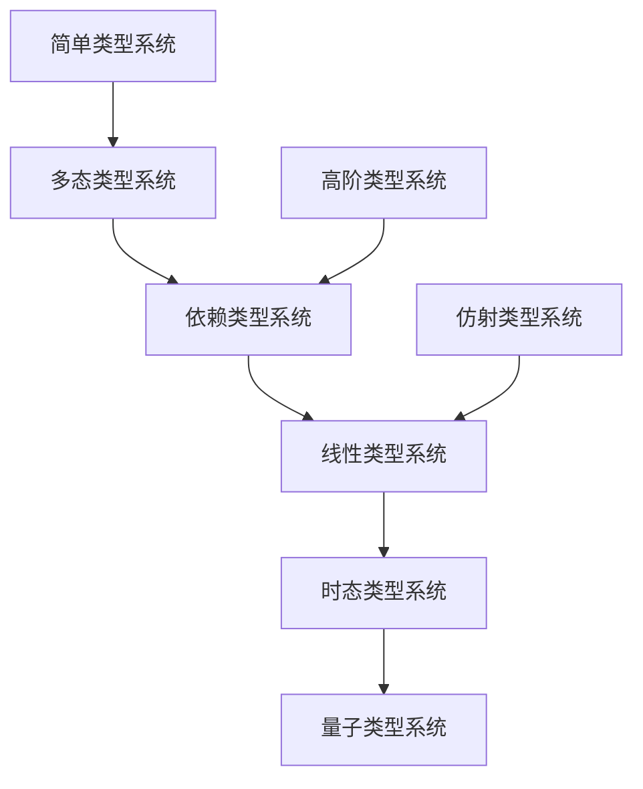

# 08-类型理论深化 (Type Theory Deepening)

## 目录结构

```
08-类型理论深化/
├── README.md                           # 本文件
├── 01-线性类型理论.md                   # 线性类型理论综合深化
├── 02-仿射类型理论.md                   # 仿射类型理论综合深化
├── 03-时态类型理论.md                   # 时态类型理论综合深化
├── 04-类型系统形式化验证.md             # 类型系统形式化验证
├── 05-高阶类型理论.md                   # 高阶类型理论综合深化
├── 06-依赖类型理论.md                   # 依赖类型理论综合深化
├── 07-量子类型理论.md                   # 量子类型理论综合深化
├── 08-类型系统语义理论.md               # 类型系统语义理论
├── 09-类型系统实现技术.md               # 类型系统实现技术
└── 10-类型系统应用实践.md               # 类型系统应用实践
```

## 内容概述

本目录包含类型理论各个分支的深度分析和综合研究，从基础理论到高级应用，从形式化定义到工程实践，构建完整的类型理论知识体系。

### 1. [线性类型理论](01-线性类型理论.md)

**核心内容：**

- 线性逻辑基础理论
- 线性类型系统形式化定义
- 资源管理理论与应用
- Rust所有权系统实践
- 内存安全与并发正确性

**关键概念：**

- 线性性约束：每个变量恰好使用一次
- 张量积类型：$\tau_1 \otimes \tau_2$
- 线性函数类型：$\tau_1 \multimap \tau_2$
- 指数类型：$!\tau$

**应用领域：**

- 内存管理
- 资源安全
- 并发编程
- 系统编程

### 2. [仿射类型理论](02-仿射类型理论.md)

**核心内容：**

- 仿射类型系统基础
- 弱化规则与资源管理
- 加法合取与析取类型
- 可选资源管理

**关键概念：**

- 仿射性约束：每个变量最多使用一次
- 加法合取：$\tau_1 \& \tau_2$
- 加法析取：$\tau_1 \oplus \tau_2$
- 弱化规则：允许忽略变量

### 3. [时态类型理论](03-时态类型理论.md)

**核心内容：**

- 时态类型系统基础
- 时间标签与一致性
- 时态依赖类型
- 时序约束表达

**关键概念：**

- 时态类型：$\tau^t$
- 时态上下文：$\Gamma^t$
- 时态函数：$\tau_1^t \rightarrow \tau_2^{t+1}$
- 时间一致性

### 4. [类型系统形式化验证](04-类型系统形式化验证.md)

**核心内容：**

- 类型安全性证明
- 资源安全验证
- 并发正确性检查
- 形式化验证工具

**验证方法：**

- 类型保持性证明
- 进展性证明
- 资源安全证明
- 并发正确性证明

### 5. [高阶类型理论](05-高阶类型理论.md)

**核心内容：**

- 高阶类型系统
- 类型构造子
- 高阶抽象
- 类型级编程

### 6. [依赖类型理论](06-依赖类型理论.md)

**核心内容：**

- 依赖类型系统
- 类型与值的统一
- 证明即程序
- 形式化数学

### 7. [量子类型理论](07-量子类型理论.md)

**核心内容：**

- 量子计算类型系统
- 量子态类型
- 量子门类型
- 量子算法类型安全

### 8. [类型系统语义理论](08-类型系统语义理论.md)

**核心内容：**

- 指称语义
- 操作语义
- 范畴语义
- 语义等价性

### 9. [类型系统实现技术](09-类型系统实现技术.md)

**核心内容：**

- 类型检查算法
- 类型推导技术
- 类型系统编译器
- 运行时类型支持

### 10. [类型系统应用实践](10-类型系统应用实践.md)

**核心内容：**

- 编程语言设计
- 软件工程应用
- 系统架构设计
- 安全系统构建

## 理论基础

### 类型系统层次结构



### 类型系统表达能力

| 类型系统 | 表达能力 | 复杂度 | 应用领域 |
|---------|---------|--------|----------|
| 简单类型 | 基础类型安全 | 低 | 教学、简单应用 |
| 多态类型 | 代码复用 | 中 | 通用编程 |
| 依赖类型 | 精确类型 | 高 | 形式化验证 |
| 线性类型 | 资源管理 | 中高 | 系统编程 |
| 时态类型 | 时序约束 | 高 | 实时系统 |
| 量子类型 | 量子计算 | 极高 | 量子编程 |

## 形式化基础

### 类型系统定义

**定义 (类型系统)**
类型系统是一个四元组 $\mathcal{T} = (\mathcal{L}, \mathcal{R}, \mathcal{S}, \mathcal{E})$，其中：

- $\mathcal{L}$ 是类型语言
- $\mathcal{R}$ 是类型规则
- $\mathcal{S}$ 是语义解释
- $\mathcal{E}$ 是执行模型

### 类型安全性

**定理 (类型保持性)**
如果 $\Gamma \vdash e : \tau$ 且 $e \rightarrow e'$，则 $\Gamma \vdash e' : \tau$。

**定理 (进展性)**
如果 $\Gamma \vdash e : \tau$，则 $e$ 要么是值，要么可以归约。

## 工程实践

### 编程语言应用

1. **Rust**：线性类型系统（所有权）
2. **Haskell**：高阶类型系统
3. **Idris**：依赖类型系统
4. **Coq**：证明辅助系统
5. **Agda**：依赖类型编程

### 系统架构应用

1. **内存管理**：线性类型确保内存安全
2. **资源管理**：仿射类型处理可选资源
3. **并发安全**：线性类型防止数据竞争
4. **实时系统**：时态类型表达时序约束

## 研究方向

### 理论方向

1. **类型系统融合**：将不同类型系统结合
2. **语义理论**：深化类型系统语义
3. **表达能力**：扩展类型系统表达能力
4. **形式化验证**：加强类型系统验证

### 实践方向

1. **编译器技术**：优化类型检查算法
2. **工具链开发**：完善开发工具
3. **语言设计**：设计新的类型系统
4. **应用推广**：推广类型系统应用

## 相关链接

- [返回分析目录](../README.md)
- [03-形式化理论基础](../03-形式化理论基础/README.md)
- [07-控制与并发理论](../07-控制与并发理论/README.md)
- [10-形式化验证](../10-形式化验证/README.md)

## 进度跟踪

- [x] 01-线性类型理论.md - 已完成
- [ ] 02-仿射类型理论.md - 待完成
- [ ] 03-时态类型理论.md - 待完成
- [ ] 04-类型系统形式化验证.md - 待完成
- [ ] 05-高阶类型理论.md - 待完成
- [ ] 06-依赖类型理论.md - 待完成
- [ ] 07-量子类型理论.md - 待完成
- [ ] 08-类型系统语义理论.md - 待完成
- [ ] 09-类型系统实现技术.md - 待完成
- [ ] 10-类型系统应用实践.md - 待完成

## 更新日志

- **2024-12-19**：创建目录结构，完成线性类型理论文档
- **2024-12-19**：建立严格树形目录和本地跳转系统
