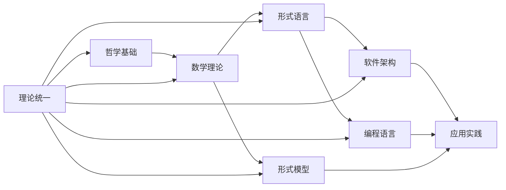

# 08-索引与导航：形式化理论体系导航

## 目录

1. [8.1 总体导航](#81-总体导航)
2. [8.2 理论索引](#82-理论索引)
3. [8.3 概念索引](#83-概念索引)
4. [8.4 方法索引](#84-方法索引)
5. [8.5 应用索引](#85-应用索引)
6. [8.6 交叉引用](#86-交叉引用)
7. [8.7 快速导航](#87-快速导航)
8. [8.8 使用指南](#88-使用指南)

## 8.1 总体导航

### 8.1.1 理论体系结构

```mermaid
graph TB
    A[统一形式化理论体系] --> B[哲学基础理论]
    A --> C[数学理论体系]
    A --> D[形式语言理论]
    A --> E[软件架构理论]
    A --> F[编程语言理论]
    A --> G[形式模型理论]
    A --> H[理论统一与整合]
    
    B --> B1[本体论]
    B --> B2[认识论]
    B --> B3[逻辑学]
    B --> B4[伦理学]
    B --> B5[形而上学]
    
    C --> C1[范畴论]
    C --> C2[代数理论]
    C --> C3[几何理论]
    C --> C4[分析理论]
    C --> C5[数论]
    
    D --> D1[自动机理论]
    D --> D2[形式语法]
    D --> D3[语义理论]
    D --> D4[编译理论]
    
    E --> E1[组件化架构]
    E --> E2[微服务架构]
    E --> E3[分布式架构]
    E --> E4[云原生架构]
    E --> E5[工作流架构]
    
    F --> F1[Rust理论]
    F --> F2[Go理论]
    F --> F3[类型系统]
    F --> F4[并发理论]
    F --> F5[编程范式]
    
    G --> G1[Petri网]
    G --> G2[控制理论]
    G --> G3[时态逻辑]
    G --> G4[分布式系统]
    G --> G5[AI设计]
    
    H --> H1[理论映射]
    H --> H2[跨领域整合]
    H --> H3[统一框架]
    H --> H4[形式化统一]
```

### 8.1.2 文档层次结构

| 层次 | 文档 | 描述 |
|------|------|------|
| **0** | [00-总体分析框架-v32.md](../00-总体分析框架-v32.md) | 统一理论体系概述 |
| **1** | [01-哲学基础理论/01-哲学基础理论.md](../01-哲学基础理论/01-哲学基础理论.md) | 哲学理论基础 |
| **2** | [02-数学理论体系/02-数学理论体系.md](../02-数学理论体系/02-数学理论体系.md) | 数学理论基础 |
| **3** | [03-形式语言理论/03-形式语言理论.md](../03-形式语言理论/03-形式语言理论.md) | 形式语言理论 |
| **4** | [04-软件架构理论/04-软件架构理论.md](../04-软件架构理论/04-软件架构理论.md) | 软件架构理论 |
| **5** | [05-编程语言理论/05-编程语言理论.md](../05-编程语言理论/05-编程语言理论.md) | 编程语言理论 |
| **6** | [06-形式模型理论/06-形式模型理论.md](../06-形式模型理论/06-形式模型理论.md) | 形式模型理论 |
| **7** | [07-理论统一与整合/07-理论统一与整合.md](../07-理论统一与整合/07-理论统一与整合.md) | 理论统一与整合 |

### 8.1.3 理论关系图

## 8.2 理论索引

### 8.2.1 哲学理论索引

| 理论 | 文档位置 | 主要概念 | 应用领域 |
|------|----------|----------|----------|
| **本体论** | [01-哲学基础理论#31-本体论基础](../01-哲学基础理论/01-哲学基础理论.md#31-本体论基础) | 实体、属性、关系、存在性 | 软件建模、数据建模 |
| **认识论** | [01-哲学基础理论#32-认识论基础](../01-哲学基础理论/01-哲学基础理论.md#32-认识论基础) | 知识、信念、确证、真理 | 知识表示、推理系统 |
| **逻辑学** | [01-哲学基础理论#33-逻辑学基础](../01-哲学基础理论/01-哲学基础理论.md#33-逻辑学基础) | 推理、证明、有效性 | 形式化验证、定理证明 |
| **伦理学** | [01-哲学基础理论#34-伦理学基础](../01-哲学基础理论/01-哲学基础理论.md#34-伦理学基础) | 价值、规范、责任 | AI伦理、软件伦理 |
| **形而上学** | [01-哲学基础理论#35-形而上学基础](../01-哲学基础理论/01-哲学基础理论.md#35-形而上学基础) | 存在、模态、因果 | 系统哲学、存在性分析 |

### 8.2.2 数学理论索引

| 理论 | 文档位置 | 主要概念 | 应用领域 |
|------|----------|----------|----------|
| **范畴论** | [02-数学理论体系#41-范畴论基础](../02-数学理论体系/02-数学理论体系.md#41-范畴论基础) | 对象、态射、函子、自然变换 | 软件架构、抽象代数 |
| **代数理论** | [02-数学理论体系#42-代数理论](../02-数学理论体系/02-数学理论体系.md#42-代数理论) | 群、环、域、模 | 数据结构、算法设计 |
| **几何理论** | [02-数学理论体系#43-几何理论](../02-数学理论体系/02-数学理论体系.md#43-几何理论) | 拓扑空间、流形、纤维丛 | 空间建模、几何计算 |
| **分析理论** | [02-数学理论体系#44-分析理论](../02-数学理论体系/02-数学理论体系.md#44-分析理论) | 函数、极限、微分、积分 | 数值计算、优化算法 |
| **数论** | [02-数学理论体系#45-数论基础](../02-数学理论体系/02-数学理论体系.md#45-数论基础) | 素数、代数数、模形式 | 密码学、随机数生成 |

### 8.2.3 形式语言理论索引

| 理论 | 文档位置 | 主要概念 | 应用领域 |
|------|----------|----------|----------|
| **自动机理论** | [03-形式语言理论#51-自动机理论](../03-形式语言理论/03-形式语言理论.md#51-自动机理论) | DFA、NFA、PDA、TM | 编译器、模式匹配 |
| **形式语法** | [03-形式语言理论#52-形式语法理论](../03-形式语言理论/03-形式语言理论.md#52-形式语法理论) | 正则语法、CFG、CSG | 语言设计、语法分析 |
| **语义理论** | [03-形式语言理论#53-语义理论](../03-形式语言理论/03-形式语言理论.md#53-语义理论) | 操作语义、指称语义、公理语义 | 语言实现、程序验证 |
| **编译理论** | [03-形式语言理论#54-编译理论](../03-形式语言理论/03-形式语言理论.md#54-编译理论) | 词法分析、语法分析、代码生成 | 编译器、解释器 |

### 8.2.4 软件架构理论索引

| 理论 | 文档位置 | 主要概念 | 应用领域 |
|------|----------|----------|----------|
| **组件化架构** | [04-软件架构理论#61-组件化架构](../04-软件架构理论/04-软件架构理论.md#61-组件化架构) | 组件、接口、组合 | 模块化设计、组件复用 |
| **微服务架构** | [04-软件架构理论#62-微服务架构](../04-软件架构理论/04-软件架构理论.md#62-微服务架构) | 服务、API、网关 | 分布式系统、服务治理 |
| **分布式架构** | [04-软件架构理论#63-分布式架构](../04-软件架构理论/04-软件架构理论.md#63-分布式架构) | 一致性、可用性、分区容错 | 高可用系统、容错设计 |
| **云原生架构** | [04-软件架构理论#64-云原生架构](../04-软件架构理论/04-软件架构理论.md#64-云原生架构) | 容器、编排、服务网格 | 云计算、容器化部署 |
| **工作流架构** | [04-软件架构理论#65-工作流架构](../04-软件架构理论/04-软件架构理论.md#65-工作流架构) | 流程、状态、转换 | 业务流程、工作流引擎 |

### 8.2.5 编程语言理论索引

| 理论 | 文档位置 | 主要概念 | 应用领域 |
|------|----------|----------|----------|
| **Rust理论** | [05-编程语言理论#52-rust语言形式化理论](../05-编程语言理论/05-编程语言理论.md#52-rust语言形式化理论) | 所有权、借用、生命周期 | 系统编程、内存安全 |
| **Go理论** | [05-编程语言理论#53-go语言形式化理论](../05-编程语言理论/05-编程语言理论.md#53-go语言形式化理论) | Goroutine、Channel、接口 | 并发编程、网络服务 |
| **类型系统** | [05-编程语言理论#54-类型系统理论](../05-编程语言理论/05-编程语言理论.md#54-类型系统理论) | 类型推导、多态、依赖类型 | 语言设计、程序验证 |
| **并发理论** | [05-编程语言理论#55-并发理论](../05-编程语言理论/05-编程语言理论.md#55-并发理论) | 进程、线程、同步、通信 | 并发编程、分布式系统 |
| **编程范式** | [05-编程语言理论#56-编程范式理论](../05-编程语言理论/05-编程语言理论.md#56-编程范式理论) | 命令式、函数式、逻辑、面向对象 | 语言设计、编程方法 |

### 8.2.6 形式模型理论索引

| 理论 | 文档位置 | 主要概念 | 应用领域 |
|------|----------|----------|----------|
| **Petri网** | [06-形式模型理论#61-petri网理论](../06-形式模型理论/06-形式模型理论.md#61-petri网理论) | 库所、变迁、标识、可达性 | 并发建模、系统分析 |
| **控制理论** | [06-形式模型理论#62-控制理论](../06-形式模型理论/06-形式模型理论.md#62-控制理论) | 状态空间、策略、价值函数 | 系统控制、优化控制 |
| **时态逻辑** | [06-形式模型理论#63-时态逻辑理论](../06-形式模型理论/06-形式模型理论.md#63-时态逻辑理论) | LTL、CTL、实时逻辑 | 模型检查、规范验证 |
| **分布式系统** | [06-形式模型理论#64-分布式系统理论](../06-形式模型理论/06-形式模型理论.md#64-分布式系统理论) | 共识算法、一致性模型 | 分布式算法、容错系统 |
| **AI设计** | [06-形式模型理论#65-ai设计理论](../06-形式模型理论/06-形式模型理论.md#65-ai设计理论) | 神经网络、强化学习、形式化验证 | 人工智能、机器学习 |

## 8.3 概念索引

### 8.3.1 核心概念索引

| 概念 | 定义位置 | 相关理论 | 应用示例 |
|------|----------|----------|----------|
| **结构** | [07-理论统一与整合#732-核心概念统一](../07-理论统一与整合/07-理论统一与整合.md#732-核心概念统一) | 数学结构、软件结构、认知结构 | 系统设计、数据建模 |
| **关系** | [07-理论统一与整合#732-核心概念统一](../07-理论统一与整合/07-理论统一与整合.md#732-核心概念统一) | 数学关系、软件关系、逻辑关系 | 数据库设计、API设计 |
| **变换** | [07-理论统一与整合#732-核心概念统一](../07-理论统一与整合/07-理论统一与整合.md#732-核心概念统一) | 数学变换、软件变换、状态变换 | 数据转换、状态机 |
| **约束** | [07-理论统一与整合#732-核心概念统一](../07-理论统一与整合/07-理论统一与整合.md#732-核心概念统一) | 数学约束、软件约束、逻辑约束 | 业务规则、验证条件 |
| **一致性** | [07-理论统一与整合#77-验证与一致性](../07-理论统一与整合/07-理论统一与整合.md#77-验证与一致性) | 理论一致性、系统一致性 | 数据一致性、事务处理 |
| **完备性** | [00-总体分析框架#12-理论体系特色](../00-总体分析框架-v32.md#12-理论体系特色) | 理论完备性、系统完备性 | 功能完备性、覆盖测试 |
| **形式化** | [00-总体分析框架#12-理论体系特色](../00-总体分析框架-v32.md#12-理论体系特色) | 数学形式化、软件形式化 | 规范描述、形式验证 |

### 8.3.2 数学概念索引

| 概念 | 定义位置 | 相关理论 | 应用示例 |
|------|----------|----------|----------|
| **集合** | [02-数学理论体系#42-代数理论](../02-数学理论体系/02-数学理论体系.md#42-代数理论) | 集合论、代数结构 | 数据结构、集合操作 |
| **函数** | [02-数学理论体系#44-分析理论](../02-数学理论体系/02-数学理论体系.md#44-分析理论) | 函数论、泛函分析 | 程序函数、数学函数 |
| **映射** | [02-数学理论体系#41-范畴论基础](../02-数学理论体系/02-数学理论体系.md#41-范畴论基础) | 范畴论、同态映射 | 数据映射、API映射 |
| **群** | [02-数学理论体系#42-代数理论](../02-数学理论体系/02-数学理论体系.md#42-代数理论) | 群论、对称群 | 对称操作、密码学 |
| **环** | [02-数学理论体系#42-代数理论](../02-数学理论体系/02-数学理论体系.md#42-代数理论) | 环论、代数环 | 数值运算、多项式 |
| **域** | [02-数学理论体系#42-代数理论](../02-数学理论体系/02-数学理论体系.md#42-代数理论) | 域论、有限域 | 数值计算、密码学 |
| **拓扑** | [02-数学理论体系#43-几何理论](../02-数学理论体系/02-数学理论体系.md#43-几何理论) | 拓扑学、代数拓扑 | 网络拓扑、空间关系 |

### 8.3.3 软件概念索引

| 概念 | 定义位置 | 相关理论 | 应用示例 |
|------|----------|----------|----------|
| **组件** | [04-软件架构理论#61-组件化架构](../04-软件架构理论/04-软件架构理论.md#61-组件化架构) | 组件化架构、组件设计 | 模块化开发、组件复用 |
| **接口** | [04-软件架构理论#61-组件化架构](../04-软件架构理论/04-软件架构理论.md#61-组件化架构) | 接口设计、API设计 | 服务接口、组件接口 |
| **服务** | [04-软件架构理论#62-微服务架构](../04-软件架构理论/04-软件架构理论.md#62-微服务架构) | 微服务、服务治理 | 分布式服务、服务网格 |
| **状态** | [06-形式模型理论#61-petri网理论](../06-形式模型理论/06-形式模型理论.md#61-petri网理论) | 状态机、状态转换 | 状态管理、状态机 |
| **事件** | [04-软件架构理论#65-工作流架构](../04-软件架构理论/04-软件架构理论.md#65-工作流架构) | 事件驱动、事件流 | 消息队列、事件处理 |
| **并发** | [05-编程语言理论#55-并发理论](../05-编程语言理论/05-编程语言理论.md#55-并发理论) | 并发编程、并发控制 | 多线程、异步编程 |
| **分布式** | [06-形式模型理论#64-分布式系统理论](../06-形式模型理论/06-形式模型理论.md#64-分布式系统理论) | 分布式算法、一致性 | 分布式数据库、集群 |

## 8.4 方法索引

### 8.4.1 形式化方法索引

| 方法 | 文档位置 | 适用领域 | 工具支持 |
|------|----------|----------|----------|
| **模型检查** | [06-形式模型理论#66-形式化验证](../06-形式模型理论/06-形式模型理论.md#66-形式化验证) | 系统验证、协议验证 | SPIN、NuSMV、UPPAAL |
| **定理证明** | [06-形式模型理论#66-形式化验证](../06-形式模型理论/06-形式模型理论.md#66-形式化验证) | 程序验证、数学证明 | Coq、Isabelle、Z3 |
| **抽象解释** | [06-形式模型理论#66-形式化验证](../06-形式模型理论/06-形式模型理论.md#66-形式化验证) | 程序分析、静态分析 | Astrée、Polyspace |
| **霍尔逻辑** | [05-编程语言理论#58-形式化验证](../05-编程语言理论/05-编程语言理论.md#58-形式化验证) | 程序正确性验证 | Frama-C、Why3 |
| **类型检查** | [05-编程语言理论#54-类型系统理论](../05-编程语言理论/05-编程语言理论.md#54-类型系统理论) | 类型安全、程序验证 | Rust编译器、Go编译器 |

### 8.4.2 设计方法索引

| 方法 | 文档位置 | 适用领域 | 应用示例 |
|------|----------|----------|----------|
| **组件化设计** | [04-软件架构理论#61-组件化架构](../04-软件架构理论/04-软件架构理论.md#61-组件化架构) | 软件架构、系统设计 | 模块化系统、插件架构 |
| **微服务设计** | [04-软件架构理论#62-微服务架构](../04-软件架构理论/04-软件架构理论.md#62-微服务架构) | 分布式系统、服务设计 | 云原生应用、服务网格 |
| **分层设计** | [04-软件架构理论#61-组件化架构](../04-软件架构理论/04-软件架构理论.md#61-组件化架构) | 系统架构、软件架构 | OSI模型、TCP/IP协议栈 |
| **事件驱动设计** | [04-软件架构理论#65-工作流架构](../04-软件架构理论/04-软件架构理论.md#65-工作流架构) | 异步系统、消息系统 | 消息队列、事件流处理 |
| **领域驱动设计** | [07-理论统一与整合#76-应用整合](../07-理论统一与整合/07-理论统一与整合.md#76-应用整合) | 业务建模、软件设计 | 企业应用、业务系统 |

### 8.4.3 分析方法索引

| 方法 | 文档位置 | 适用领域 | 应用示例 |
|------|----------|----------|----------|
| **静态分析** | [06-形式模型理论#66-形式化验证](../06-形式模型理论/06-形式模型理论.md#66-形式化验证) | 代码分析、程序验证 | 代码审查、缺陷检测 |
| **动态分析** | [06-形式模型理论#66-形式化验证](../06-形式模型理论/06-形式模型理论.md#66-形式化验证) | 运行时分析、性能分析 | 性能监控、调试工具 |
| **模型分析** | [06-形式模型理论#61-petri网理论](../06-形式模型理论/06-形式模型理论.md#61-petri网理论) | 系统建模、行为分析 | 工作流分析、并发分析 |
| **架构分析** | [04-软件架构理论#61-组件化架构](../04-软件架构理论/04-软件架构理论.md#61-组件化架构) | 架构评估、质量分析 | 架构评审、质量评估 |
| **依赖分析** | [04-软件架构理论#61-组件化架构](../04-软件架构理论/04-软件架构理论.md#61-组件化架构) | 依赖关系、影响分析 | 变更影响分析、依赖管理 |

## 8.5 应用索引

### 8.5.1 软件工程应用

| 应用 | 相关理论 | 文档位置 | 实践案例 |
|------|----------|----------|----------|
| **软件架构设计** | 软件架构理论、形式模型理论 | [04-软件架构理论](../04-软件架构理论/04-软件架构理论.md) | 微服务架构、云原生架构 |
| **编程语言设计** | 形式语言理论、编程语言理论 | [03-形式语言理论](../03-形式语言理论/03-形式语言理论.md) | Rust语言、Go语言 |
| **系统建模** | 形式模型理论、数学理论 | [06-形式模型理论](../06-形式模型理论/06-形式模型理论.md) | Petri网建模、状态机建模 |
| **程序验证** | 形式化验证、类型系统 | [06-形式模型理论#66-形式化验证](../06-形式模型理论/06-形式模型理论.md#66-形式化验证) | 模型检查、定理证明 |
| **代码生成** | 编译理论、形式语言理论 | [03-形式语言理论#54-编译理论](../03-形式语言理论/03-形式语言理论.md#54-编译理论) | 编译器、代码生成器 |

### 8.5.2 人工智能应用

| 应用 | 相关理论 | 文档位置 | 实践案例 |
|------|----------|----------|----------|
| **神经网络设计** | AI设计理论、数学理论 | [06-形式模型理论#65-ai设计理论](../06-形式模型理论/06-形式模型理论.md#65-ai设计理论) | 深度学习、神经网络 |
| **强化学习** | 控制理论、AI设计理论 | [06-形式模型理论#65-ai设计理论](../06-形式模型理论/06-形式模型理论.md#65-ai设计理论) | 游戏AI、机器人控制 |
| **知识表示** | 认识论、逻辑学 | [01-哲学基础理论#32-认识论基础](../01-哲学基础理论/01-哲学基础理论.md#32-认识论基础) | 知识图谱、语义网络 |
| **推理系统** | 逻辑学、形式语言理论 | [01-哲学基础理论#33-逻辑学基础](../01-哲学基础理论/01-哲学基础理论.md#33-逻辑学基础) | 专家系统、推理引擎 |
| **形式化验证** | 形式化验证、AI设计理论 | [06-形式模型理论#66-形式化验证](../06-形式模型理论/06-形式模型理论.md#66-形式化验证) | AI系统验证、安全验证 |

### 8.5.3 系统科学应用

| 应用 | 相关理论 | 文档位置 | 实践案例 |
|------|----------|----------|----------|
| **复杂系统建模** | 形式模型理论、数学理论 | [06-形式模型理论](../06-形式模型理论/06-形式模型理论.md) | 生态系统建模、社会系统建模 |
| **分布式系统** | 分布式系统理论、控制理论 | [06-形式模型理论#64-分布式系统理论](../06-形式模型理论/06-形式模型理论.md#64-分布式系统理论) | 区块链、分布式数据库 |
| **控制系统** | 控制理论、时态逻辑 | [06-形式模型理论#62-控制理论](../06-形式模型理论/06-形式模型理论.md#62-控制理论) | 工业控制、自动驾驶 |
| **网络系统** | 图论、网络理论 | [02-数学理论体系#43-几何理论](../02-数学理论体系/02-数学理论体系.md#43-几何理论) | 计算机网络、社交网络 |
| **优化系统** | 数学优化、控制理论 | [02-数学理论体系#44-分析理论](../02-数学理论体系/02-数学理论体系.md#44-分析理论) | 资源优化、调度优化 |

## 8.6 交叉引用

### 8.6.1 理论间交叉引用

| 理论A | 理论B | 交叉点 | 引用位置 |
|-------|-------|--------|----------|
| **哲学基础** | **数学理论** | 本体论映射、认识论映射 | [07-理论统一与整合#712-哲学与数学映射](../07-理论统一与整合/07-理论统一与整合.md#712-哲学与数学映射) |
| **数学理论** | **形式语言** | 代数结构、形式语法 | [07-理论统一与整合#713-数学与计算机科学映射](../07-理论统一与整合/07-理论统一与整合.md#713-数学与计算机科学映射) |
| **形式语言** | **编程语言** | 语法映射、语义映射 | [07-理论统一与整合#714-形式语言与编程语言映射](../07-理论统一与整合/07-理论统一与整合.md#714-形式语言与编程语言映射) |
| **软件架构** | **形式模型** | 架构建模、系统验证 | [06-形式模型理论#67-模型驱动工程](../06-形式模型理论/06-形式模型理论.md#67-模型驱动工程) |
| **编程语言** | **形式模型** | 程序验证、模型检查 | [05-编程语言理论#58-形式化验证](../05-编程语言理论/05-编程语言理论.md#58-形式化验证) |

### 8.6.2 概念间交叉引用

| 概念A | 概念B | 关系类型 | 引用位置 |
|-------|-------|----------|----------|
| **结构** | **关系** | 包含关系 | [07-理论统一与整合#732-核心概念统一](../07-理论统一与整合/07-理论统一与整合.md#732-核心概念统一) |
| **变换** | **约束** | 约束关系 | [07-理论统一与整合#732-核心概念统一](../07-理论统一与整合/07-理论统一与整合.md#732-核心概念统一) |
| **一致性** | **完备性** | 性质关系 | [07-理论统一与整合#77-验证与一致性](../07-理论统一与整合/07-理论统一与整合.md#77-验证与一致性) |
| **形式化** | **验证** | 方法关系 | [06-形式模型理论#66-形式化验证](../06-形式模型理论/06-形式模型理论.md#66-形式化验证) |
| **设计** | **实现** | 过程关系 | [07-理论统一与整合#76-应用整合](../07-理论统一与整合/07-理论统一与整合.md#76-应用整合) |

### 8.6.3 方法间交叉引用

| 方法A | 方法B | 组合方式 | 引用位置 |
|-------|-------|----------|----------|
| **模型检查** | **定理证明** | 互补验证 | [06-形式模型理论#66-形式化验证](../06-形式模型理论/06-形式模型理论.md#66-形式化验证) |
| **静态分析** | **动态分析** | 综合分析 | [06-形式模型理论#66-形式化验证](../06-形式模型理论/06-形式模型理论.md#66-形式化验证) |
| **组件化设计** | **微服务设计** | 层次设计 | [04-软件架构理论#61-组件化架构](../04-软件架构理论/04-软件架构理论.md#61-组件化架构) |
| **形式化验证** | **测试验证** | 多重验证 | [07-理论统一与整合#762-系统验证](../07-理论统一与整合/07-理论统一与整合.md#762-系统验证) |
| **数学建模** | **软件建模** | 统一建模 | [07-理论统一与整合#761-软件系统设计](../07-理论统一与整合/07-理论统一与整合.md#761-软件系统设计) |

## 8.7 快速导航

### 8.7.1 按主题快速导航

| 主题 | 快速入口 | 核心内容 | 相关文档 |
|------|----------|----------|----------|
| **哲学基础** | [01-哲学基础理论](../01-哲学基础理论/01-哲学基础理论.md) | 本体论、认识论、逻辑学 | 哲学基础理论 |
| **数学理论** | [02-数学理论体系](../02-数学理论体系/02-数学理论体系.md) | 范畴论、代数、几何、分析 | 数学理论体系 |
| **形式语言** | [03-形式语言理论](../03-形式语言理论/03-形式语言理论.md) | 自动机、语法、语义、编译 | 形式语言理论 |
| **软件架构** | [04-软件架构理论](../04-软件架构理论/04-软件架构理论.md) | 组件化、微服务、分布式 | 软件架构理论 |
| **编程语言** | [05-编程语言理论](../05-编程语言理论/05-编程语言理论.md) | Rust、Go、类型系统、并发 | 编程语言理论 |
| **形式模型** | [06-形式模型理论](../06-形式模型理论/06-形式模型理论.md) | Petri网、控制理论、时态逻辑 | 形式模型理论 |
| **理论统一** | [07-理论统一与整合](../07-理论统一与整合/07-理论统一与整合.md) | 理论映射、跨领域整合 | 理论统一与整合 |

### 8.7.2 按问题快速导航

| 问题类型 | 解决方案 | 相关理论 | 快速入口 |
|----------|----------|----------|----------|
| **系统设计** | 架构设计方法 | 软件架构理论、形式模型理论 | [04-软件架构理论](../04-软件架构理论/04-软件架构理论.md) |
| **程序验证** | 形式化验证方法 | 形式化验证、类型系统 | [06-形式模型理论#66-形式化验证](../06-形式模型理论/06-形式模型理论.md#66-形式化验证) |
| **并发编程** | 并发理论和方法 | 并发理论、编程语言理论 | [05-编程语言理论#55-并发理论](../05-编程语言理论/05-编程语言理论.md#55-并发理论) |
| **系统建模** | 形式化建模方法 | 形式模型理论、数学理论 | [06-形式模型理论](../06-形式模型理论/06-形式模型理论.md) |
| **理论整合** | 跨领域理论融合 | 理论统一与整合 | [07-理论统一与整合](../07-理论统一与整合/07-理论统一与整合.md) |

### 8.7.3 按应用快速导航

| 应用领域 | 相关理论 | 实践方法 | 快速入口 |
|----------|----------|----------|----------|
| **软件工程** | 软件架构、编程语言 | 设计模式、开发方法 | [04-软件架构理论](../04-软件架构理论/04-软件架构理论.md) |
| **人工智能** | AI设计理论、数学理论 | 机器学习、深度学习 | [06-形式模型理论#65-ai设计理论](../06-形式模型理论/06-形式模型理论.md#65-ai设计理论) |
| **分布式系统** | 分布式理论、控制理论 | 共识算法、一致性 | [06-形式模型理论#64-分布式系统理论](../06-形式模型理论/06-形式模型理论.md#64-分布式系统理论) |
| **形式化验证** | 形式化验证、逻辑学 | 模型检查、定理证明 | [06-形式模型理论#66-形式化验证](../06-形式模型理论/06-形式模型理论.md#66-形式化验证) |
| **系统科学** | 形式模型、数学理论 | 复杂系统、系统分析 | [06-形式模型理论](../06-形式模型理论/06-形式模型理论.md) |

## 8.8 使用指南

### 8.8.1 文档使用建议

1. **初学者**：建议从[总体分析框架](../00-总体分析框架-v32.md)开始，了解整体结构
2. **理论研究者**：可以深入各个理论模块，研究具体理论
3. **实践者**：重点关注应用相关的章节和案例
4. **教师**：可以按照层次结构组织教学内容

### 8.8.2 学习路径建议

#### 基础学习路径
1. [总体分析框架](../00-总体分析框架-v32.md) - 了解整体结构
2. [哲学基础理论](../01-哲学基础理论/01-哲学基础理论.md) - 建立哲学基础
3. [数学理论体系](../02-数学理论体系/02-数学理论体系.md) - 掌握数学工具
4. [形式语言理论](../03-形式语言理论/03-形式语言理论.md) - 理解形式化方法

#### 应用学习路径
1. [软件架构理论](../04-软件架构理论/04-软件架构理论.md) - 学习架构设计
2. [编程语言理论](../05-编程语言理论/05-编程语言理论.md) - 掌握编程方法
3. [形式模型理论](../06-形式模型理论/06-形式模型理论.md) - 学习建模验证
4. [理论统一与整合](../07-理论统一与整合/07-理论统一与整合.md) - 理解理论整合

#### 研究学习路径
1. 选择感兴趣的理论领域深入研究
2. 关注理论间的交叉引用和关系
3. 结合实际应用进行理论验证
4. 参与理论发展和创新

### 8.8.3 实践应用建议

1. **项目实践**：在实际项目中应用相关理论
2. **工具使用**：使用相关的形式化工具和验证工具
3. **案例学习**：学习相关的应用案例和最佳实践
4. **社区参与**：参与相关的研究社区和讨论

### 8.8.4 持续学习建议

1. **跟踪发展**：关注理论和技术的最新发展
2. **实践验证**：通过实践验证理论的有效性
3. **反馈改进**：根据实践反馈改进理论应用
4. **知识分享**：分享学习心得和实践经验

---

## 总结

本索引与导航文档提供了整个形式化理论体系的完整导航，包括：

1. **总体导航**：理论体系结构和文档层次
2. **理论索引**：各理论领域的详细索引
3. **概念索引**：核心概念和术语索引
4. **方法索引**：各种方法和技术的索引
5. **应用索引**：理论在实际应用中的索引
6. **交叉引用**：理论、概念、方法间的交叉引用
7. **快速导航**：按主题、问题、应用的快速导航
8. **使用指南**：文档使用和学习建议

该导航系统为用户提供了便捷的访问路径，支持不同层次和需求的学习和研究。 