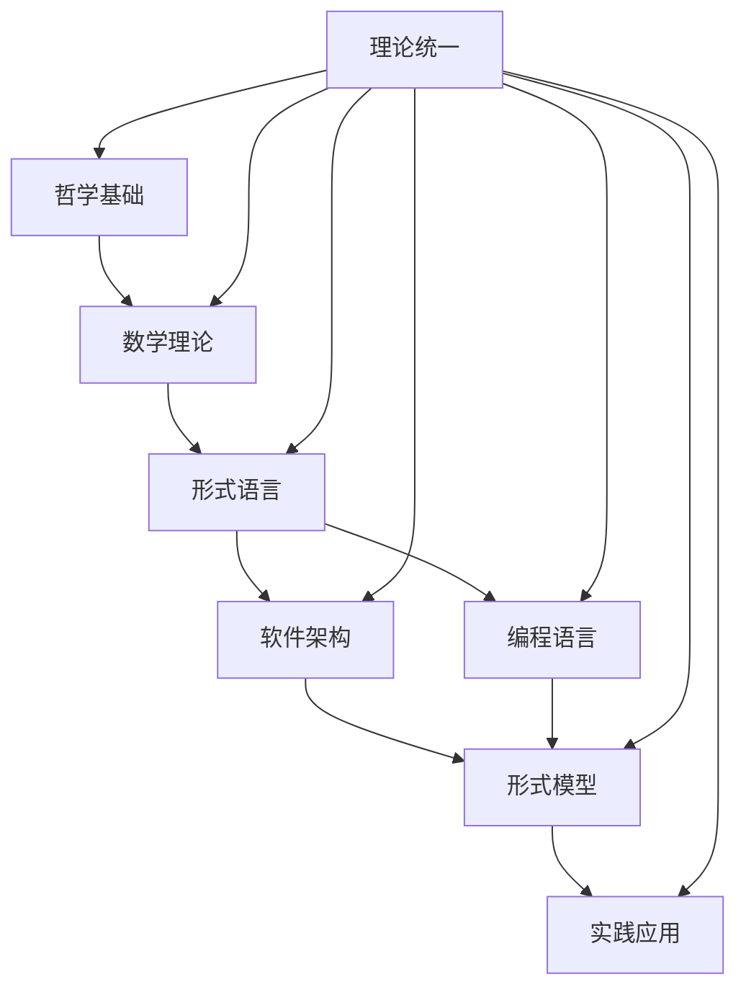

# 形式化架构理论体系 - 总体索引

## 目录结构

### 1. 哲学基础理论 (01-哲学基础理论/)

- [01-本体论基础](./01-哲学基础理论/01-本体论基础.md)
- [02-认识论基础](./01-哲学基础理论/02-认识论基础.md)
- [03-方法论基础](./01-哲学基础理论/03-方法论基础.md)
- [04-价值论基础](./01-哲学基础理论/04-价值论基础.md)

### 2. 数学理论体系 (02-数学理论体系/)

- [01-集合论基础](./02-数学理论体系/01-集合论基础.md)
- [02-逻辑学基础](./02-数学理论体系/02-逻辑学基础.md)
- [03-代数结构](./02-数学理论体系/03-代数结构.md)
- [04-拓扑学基础](./02-数学理论体系/04-拓扑学基础.md)
- [05-范畴论基础](./02-数学理论体系/05-范畴论基础.md)

### 3. 形式语言理论 (03-形式语言理论/)

- [01-形式语法理论](./03-形式语言理论/01-形式语法理论.md)
- [02-语义学理论](./03-形式语言理论/02-语义学理论.md)
- [03-类型论基础](./03-形式语言理论/03-类型论基础.md)
- [04-证明论基础](./03-形式语言理论/04-证明论基础.md)

### 4. 软件架构理论 (04-软件架构理论/)

- [01-架构设计原理](./04-软件架构理论/01-架构设计原理.md)
- [02-组件化理论](./04-软件架构理论/02-组件化理论.md)
- [03-接口设计理论](./04-软件架构理论/03-接口设计理论.md)
- [04-架构模式理论](./04-软件架构理论/04-架构模式理论.md)

### 5. 编程语言理论 (05-编程语言理论/)

- [01-语言设计原理](./05-编程语言理论/01-语言设计原理.md)
- [02-类型系统理论](./05-编程语言理论/02-类型系统理论.md)
- [03-语义模型理论](./05-编程语言理论/03-语义模型理论.md)
- [04-编译器理论](./05-编程语言理论/04-编译器理论.md)

### 6. 形式模型理论 (06-形式模型理论/)

- [01-状态机理论](./06-形式模型理论/01-状态机理论.md)
- [02-进程代数](./06-形式模型理论/02-进程代数.md)
- [03-时序逻辑](./06-形式模型理论/03-时序逻辑.md)
- [04-模型检测](./06-形式模型理论/04-模型检测.md)

### 7. 理论统一与整合 (07-理论统一与整合/)

- [01-理论统一框架](./07-理论统一与整合/01-理论统一框架.md)
- [02-跨领域整合](./07-理论统一与整合/02-跨领域整合.md)
- [03-形式化验证](./07-理论统一与整合/03-形式化验证.md)
- [04-实践应用](./07-理论统一与整合/04-实践应用.md)

### 8. 实践应用开发 (08-实践应用开发/)

- [01-Rust实践](./08-实践应用开发/01-Rust实践.md)
- [02-Go实践](./08-实践应用开发/02-Go实践.md)
- [03-架构实现](./08-实践应用开发/03-架构实现.md)
- [04-案例分析](./08-实践应用开发/04-案例分析.md)

## 快速导航

### 按主题分类

- **哲学基础**: [本体论](./01-哲学基础理论/01-本体论基础.md) | [认识论](./01-哲学基础理论/02-认识论基础.md) | [方法论](./01-哲学基础理论/03-方法论基础.md)
- **数学理论**: [集合论](./02-数学理论体系/01-集合论基础.md) | [逻辑学](./02-数学理论体系/02-逻辑学基础.md) | [范畴论](./02-数学理论体系/05-范畴论基础.md)
- **形式语言**: [语法理论](./03-形式语言理论/01-形式语法理论.md) | [语义学](./03-形式语言理论/02-语义学理论.md) | [类型论](./03-形式语言理论/03-类型论基础.md)
- **软件架构**: [设计原理](./04-软件架构理论/01-架构设计原理.md) | [组件化](./04-软件架构理论/02-组件化理论.md) | [架构模式](./04-软件架构理论/04-架构模式理论.md)
- **编程语言**: [语言设计](./05-编程语言理论/01-语言设计原理.md) | [类型系统](./05-编程语言理论/02-类型系统理论.md) | [编译器](./05-编程语言理论/04-编译器理论.md)
- **形式模型**: [状态机](./06-形式模型理论/01-状态机理论.md) | [进程代数](./06-形式模型理论/02-进程代数.md) | [模型检测](./06-形式模型理论/04-模型检测.md)

### 按层次分类

- **理念层**: [哲学基础理论](./01-哲学基础理论/)
- **形式科学层**: [数学理论体系](./02-数学理论体系/) | [形式语言理论](./03-形式语言理论/)
- **理论层**: [软件架构理论](./04-软件架构理论/) | [编程语言理论](./05-编程语言理论/) | [形式模型理论](./06-形式模型理论/)
- **应用层**: [实践应用开发](./08-实践应用开发/)

## 核心概念索引

### A. 哲学概念

- **本体论**: 存在、实体、属性、关系
- **认识论**: 知识、真理、证明、验证
- **方法论**: 形式化、抽象化、系统化
- **价值论**: 正确性、可靠性、效率性

### B. 数学概念

- **集合论**: 集合、关系、函数、基数
- **逻辑学**: 命题、谓词、推理、证明
- **代数**: 群、环、域、模
- **拓扑**: 空间、连续性、连通性
- **范畴论**: 对象、态射、函子、自然变换

### C. 形式语言概念

- **语法**: 产生式、推导、语法树
- **语义**: 指称语义、操作语义、公理语义
- **类型**: 类型系统、类型检查、类型推导
- **证明**: 证明系统、证明搜索、证明检查

### D. 软件架构概念

- **组件**: 模块、接口、依赖
- **模式**: 设计模式、架构模式、反模式
- **质量**: 可维护性、可扩展性、可测试性
- **约束**: 性能、安全、可靠性

## 理论关联图

## 学习路径建议

### 1. 基础路径

1. 哲学基础理论 → 数学理论体系 → 形式语言理论
2. 软件架构理论 → 编程语言理论 → 形式模型理论
3. 理论统一与整合 → 实践应用开发

### 2. 应用路径

1. 软件架构理论 → 实践应用开发
2. 编程语言理论 → 形式模型理论 → 实践应用开发

### 3. 研究路径

1. 哲学基础理论 → 数学理论体系 → 理论统一与整合
2. 形式语言理论 → 形式模型理论 → 理论统一与整合

## 更新日志

- **v1.0**: 初始版本，建立基础索引结构
- **v1.1**: 添加快速导航和概念索引
- **v1.2**: 完善理论关联图和学习路径
- **v1.3**: 整合所有索引内容，建立统一导航系统

## 维护说明

本索引系统需要定期更新以反映理论体系的发展。更新内容包括：

1. 新增理论文档的索引
2. 修正文档链接
3. 更新概念索引
4. 完善理论关联图
5. 优化学习路径建议
