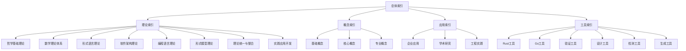

# 索引与导航总论

## 索引体系概述

索引与导航系统是形式化架构理论项目的核心组织框架，通过多层次、多维度的索引结构实现理论内容的系统性组织和高效检索。

### 核心功能

- **多维度索引**: 按主题、概念、理论、应用等维度建立索引
- **智能导航**: 提供基于上下文的智能导航建议
- **交叉引用**: 建立理论间的关联关系和引用链
- **搜索优化**: 支持语义搜索和精确匹配

## 索引结构

### 1. 层次化索引体系



### 2. 索引分类标准

#### 理论索引分类

- **基础理论**: 哲学、数学、逻辑等基础学科理论
- **应用理论**: 软件架构、编程语言、形式模型等应用理论
- **整合理论**: 理论统一、跨领域整合等综合理论

#### 概念索引分类

- **基础概念**: 基本定义、公理、定理等
- **核心概念**: 关键理论概念、重要定义等
- **专业概念**: 特定领域的专业术语和概念

#### 应用索引分类

- **企业应用**: 企业级软件开发、架构设计等
- **学术研究**: 理论研究、学术探索等
- **工程实践**: 工程实现、工具开发等

## 导航系统

### 1. 导航层次结构

```rust
// 导航节点
#[derive(Debug, Clone)]
pub struct NavigationNode {
    pub id: String,
    pub title: String,
    pub description: String,
    pub node_type: NodeType,
    pub children: Vec<NavigationNode>,
    pub parent: Option<String>,
    pub metadata: NavigationMetadata,
}

// 导航元数据
#[derive(Debug, Clone)]
pub struct NavigationMetadata {
    pub tags: Vec<String>,
    pub difficulty: Difficulty,
    pub prerequisites: Vec<String>,
    pub estimated_time: Duration,
    pub last_updated: DateTime<Utc>,
}

// 导航系统
pub struct NavigationSystem {
    root_nodes: Vec<NavigationNode>,
    node_index: HashMap<String, NavigationNode>,
    path_cache: HashMap<String, Vec<String>>,
}

impl NavigationSystem {
    pub fn new() -> Self {
        Self {
            root_nodes: Vec::new(),
            node_index: HashMap::new(),
            path_cache: HashMap::new(),
        }
    }
    
    pub fn add_node(&mut self, node: NavigationNode) {
        let node_id = node.id.clone();
        self.node_index.insert(node_id, node.clone());
        
        if node.parent.is_none() {
            self.root_nodes.push(node);
        } else {
            // 添加到父节点
            if let Some(parent_id) = &node.parent {
                if let Some(parent) = self.node_index.get_mut(parent_id) {
                    parent.children.push(node);
                }
            }
        }
    }
    
    pub fn find_path(&self, from: &str, to: &str) -> Option<Vec<String>> {
        let cache_key = format!("{}->{}", from, to);
        
        if let Some(cached_path) = self.path_cache.get(&cache_key) {
            return Some(cached_path.clone());
        }
        
        let path = self.calculate_path(from, to);
        
        if let Some(ref path) = path {
            self.path_cache.insert(cache_key, path.clone());
        }
        
        path
    }
    
    pub fn suggest_next(&self, current_node: &str, user_profile: &UserProfile) -> Vec<NavigationSuggestion> {
        let mut suggestions = Vec::new();
        
        if let Some(current) = self.node_index.get(current_node) {
            // 基于用户偏好推荐
            for child in &current.children {
                let score = self.calculate_relevance_score(child, user_profile);
                suggestions.push(NavigationSuggestion {
                    node_id: child.id.clone(),
                    title: child.title.clone(),
                    score,
                    reason: self.generate_recommendation_reason(child, user_profile),
                });
            }
        }
        
        suggestions.sort_by(|a, b| b.score.partial_cmp(&a.score).unwrap());
        suggestions
    }
}
```

### 2. 智能导航算法

```rust
// 智能导航器
pub struct IntelligentNavigator {
    user_profiler: UserProfiler,
    content_analyzer: ContentAnalyzer,
    recommendation_engine: RecommendationEngine,
}

impl IntelligentNavigator {
    pub fn new() -> Self {
        Self {
            user_profiler: UserProfiler::new(),
            content_analyzer: ContentAnalyzer::new(),
            recommendation_engine: RecommendationEngine::new(),
        }
    }
    
    pub fn generate_navigation_plan(&self, user: &User, goal: &LearningGoal) -> NavigationPlan {
        // 分析用户特征
        let user_profile = self.user_profiler.analyze_user(user);
        
        // 分析学习目标
        let goal_analysis = self.content_analyzer.analyze_goal(goal);
        
        // 生成学习路径
        let learning_path = self.generate_learning_path(&user_profile, &goal_analysis);
        
        // 生成推荐
        let recommendations = self.recommendation_engine.generate_recommendations(
            &user_profile,
            &goal_analysis,
            &learning_path,
        );
        
        NavigationPlan {
            user_profile,
            goal_analysis,
            learning_path,
            recommendations,
            estimated_duration: self.estimate_duration(&learning_path, &user_profile),
        }
    }
    
    fn generate_learning_path(&self, profile: &UserProfile, goal: &GoalAnalysis) -> Vec<LearningStep> {
        let mut path = Vec::new();
        
        // 确定前置条件
        let prerequisites = self.identify_prerequisites(goal);
        
        // 检查用户当前水平
        let current_level = self.assess_current_level(profile, &prerequisites);
        
        // 生成学习步骤
        for (i, prerequisite) in prerequisites.iter().enumerate() {
            if i >= current_level {
                path.push(LearningStep {
                    concept: prerequisite.clone(),
                    difficulty: self.calculate_difficulty(prerequisite, profile),
                    estimated_time: self.estimate_concept_time(prerequisite, profile),
                    resources: self.recommend_resources(prerequisite, profile),
                });
            }
        }
        
        path
    }
}

// 用户画像分析器
pub struct UserProfiler {
    skill_analyzer: SkillAnalyzer,
    preference_analyzer: PreferenceAnalyzer,
}

impl UserProfiler {
    pub fn new() -> Self {
        Self {
            skill_analyzer: SkillAnalyzer::new(),
            preference_analyzer: PreferenceAnalyzer::new(),
        }
    }
    
    pub fn analyze_user(&self, user: &User) -> UserProfile {
        let skills = self.skill_analyzer.analyze_skills(&user.learning_history);
        let preferences = self.preference_analyzer.analyze_preferences(&user.interaction_data);
        
        UserProfile {
            skill_levels: skills,
            learning_preferences: preferences,
            learning_style: self.determine_learning_style(&user.learning_history),
            expertise_areas: self.identify_expertise_areas(&user.learning_history),
        }
    }
    
    fn determine_learning_style(&self, history: &[LearningEvent]) -> LearningStyle {
        let mut visual_count = 0;
        let mut auditory_count = 0;
        let mut kinesthetic_count = 0;
        
        for event in history {
            match event.content_type {
                ContentType::Diagram | ContentType::Video => visual_count += 1,
                ContentType::Audio | ContentType::Lecture => auditory_count += 1,
                ContentType::Interactive | ContentType::Exercise => kinesthetic_count += 1,
                _ => {}
            }
        }
        
        if visual_count > auditory_count && visual_count > kinesthetic_count {
            LearningStyle::Visual
        } else if auditory_count > kinesthetic_count {
            LearningStyle::Auditory
        } else {
            LearningStyle::Kinesthetic
        }
    }
}
```

## 搜索系统

### 1. 多模式搜索

```rust
// 搜索系统
pub struct SearchSystem {
    index_engine: IndexEngine,
    semantic_search: SemanticSearch,
    fuzzy_search: FuzzySearch,
    filter_engine: FilterEngine,
}

impl SearchSystem {
    pub fn new() -> Self {
        Self {
            index_engine: IndexEngine::new(),
            semantic_search: SemanticSearch::new(),
            fuzzy_search: FuzzySearch::new(),
            filter_engine: FilterEngine::new(),
        }
    }
    
    pub fn search(&self, query: &SearchQuery) -> SearchResult {
        let mut results = Vec::new();
        
        // 精确搜索
        if let Some(exact_results) = self.index_engine.exact_search(&query.terms) {
            results.extend(exact_results);
        }
        
        // 语义搜索
        if query.use_semantic_search {
            let semantic_results = self.semantic_search.search(&query.terms);
            results.extend(semantic_results);
        }
        
        // 模糊搜索
        if query.use_fuzzy_search {
            let fuzzy_results = self.fuzzy_search.search(&query.terms);
            results.extend(fuzzy_results);
        }
        
        // 去重和排序
        results = self.deduplicate_results(results);
        results.sort_by(|a, b| b.relevance_score.partial_cmp(&a.relevance_score).unwrap());
        
        // 应用过滤器
        if let Some(filters) = &query.filters {
            results = self.filter_engine.apply_filters(results, filters);
        }
        
        SearchResult {
            results,
            total_count: results.len(),
            search_time: std::time::Instant::now(),
        }
    }
}

// 语义搜索
pub struct SemanticSearch {
    embedding_model: EmbeddingModel,
    vector_index: VectorIndex,
}

impl SemanticSearch {
    pub fn new() -> Self {
        Self {
            embedding_model: EmbeddingModel::load(),
            vector_index: VectorIndex::new(),
        }
    }
    
    pub fn search(&self, query: &str) -> Vec<SearchResult> {
        // 生成查询向量
        let query_embedding = self.embedding_model.embed(query);
        
        // 在向量索引中搜索相似内容
        let similar_vectors = self.vector_index.search(&query_embedding, 10);
        
        // 转换为搜索结果
        similar_vectors.into_iter()
            .map(|vector| SearchResult {
                document_id: vector.document_id,
                relevance_score: vector.similarity,
                snippet: self.generate_snippet(&vector.document_id, query),
                metadata: self.get_document_metadata(&vector.document_id),
            })
            .collect()
    }
    
    fn generate_snippet(&self, document_id: &str, query: &str) -> String {
        // 生成包含查询词的文档片段
        let document = self.get_document(document_id);
        let query_terms: Vec<&str> = query.split_whitespace().collect();
        
        // 找到包含查询词的句子
        let sentences: Vec<&str> = document.split('.').collect();
        for sentence in sentences {
            if query_terms.iter().all(|term| sentence.contains(term)) {
                return format!("{}...", sentence.trim());
            }
        }
        
        // 如果没有找到完全匹配的句子，返回文档开头
        document.chars().take(200).collect()
    }
}
```

### 2. 搜索结果排序

```rust
// 搜索结果排序器
pub struct ResultRanker {
    relevance_calculator: RelevanceCalculator,
    freshness_calculator: FreshnessCalculator,
    authority_calculator: AuthorityCalculator,
}

impl ResultRanker {
    pub fn new() -> Self {
        Self {
            relevance_calculator: RelevanceCalculator::new(),
            freshness_calculator: FreshnessCalculator::new(),
            authority_calculator: AuthorityCalculator::new(),
        }
    }
    
    pub fn rank_results(&self, results: Vec<SearchResult>, query: &SearchQuery) -> Vec<RankedResult> {
        let mut ranked_results: Vec<RankedResult> = results.into_iter()
            .map(|result| {
                let relevance_score = self.relevance_calculator.calculate(&result, query);
                let freshness_score = self.freshness_calculator.calculate(&result);
                let authority_score = self.authority_calculator.calculate(&result);
                
                let final_score = self.combine_scores(relevance_score, freshness_score, authority_score);
                
                RankedResult {
                    result,
                    final_score,
                    relevance_score,
                    freshness_score,
                    authority_score,
                }
            })
            .collect();
        
        ranked_results.sort_by(|a, b| b.final_score.partial_cmp(&a.final_score).unwrap());
        ranked_results
    }
    
    fn combine_scores(&self, relevance: f64, freshness: f64, authority: f64) -> f64 {
        // 加权组合分数
        0.6 * relevance + 0.2 * freshness + 0.2 * authority
    }
}

// 相关性计算器
pub struct RelevanceCalculator {
    tf_idf_calculator: TFIDFCalculator,
    semantic_similarity: SemanticSimilarity,
}

impl RelevanceCalculator {
    pub fn new() -> Self {
        Self {
            tf_idf_calculator: TFIDFCalculator::new(),
            semantic_similarity: SemanticSimilarity::new(),
        }
    }
    
    pub fn calculate(&self, result: &SearchResult, query: &SearchQuery) -> f64 {
        let tf_idf_score = self.tf_idf_calculator.calculate(&result.document, &query.terms);
        let semantic_score = self.semantic_similarity.calculate(&result.document, &query.terms);
        
        // 组合TF-IDF和语义相似度
        0.7 * tf_idf_score + 0.3 * semantic_score
    }
}
```

## 交叉引用系统

### 1. 引用关系管理

```rust
// 交叉引用管理器
pub struct CrossReferenceManager {
    reference_graph: ReferenceGraph,
    citation_tracker: CitationTracker,
    dependency_analyzer: DependencyAnalyzer,
}

impl CrossReferenceManager {
    pub fn new() -> Self {
        Self {
            reference_graph: ReferenceGraph::new(),
            citation_tracker: CitationTracker::new(),
            dependency_analyzer: DependencyAnalyzer::new(),
        }
    }
    
    pub fn add_reference(&mut self, from: &str, to: &str, reference_type: ReferenceType) {
        self.reference_graph.add_edge(from, to, reference_type);
        self.citation_tracker.track_citation(to, from);
    }
    
    pub fn find_related_documents(&self, document_id: &str) -> Vec<RelatedDocument> {
        let mut related = Vec::new();
        
        // 查找引用的文档
        let references = self.reference_graph.get_references(document_id);
        for reference in references {
            related.push(RelatedDocument {
                document_id: reference.target.clone(),
                relationship: Relationship::Referenced,
                strength: reference.strength,
            });
        }
        
        // 查找引用此文档的文档
        let citations = self.reference_graph.get_citations(document_id);
        for citation in citations {
            related.push(RelatedDocument {
                document_id: citation.source.clone(),
                relationship: Relationship::Citing,
                strength: citation.strength,
            });
        }
        
        // 查找相关文档
        let similar = self.find_similar_documents(document_id);
        for similar_doc in similar {
            related.push(RelatedDocument {
                document_id: similar_doc.document_id,
                relationship: Relationship::Similar,
                strength: similar_doc.similarity,
            });
        }
        
        related.sort_by(|a, b| b.strength.partial_cmp(&a.strength).unwrap());
        related
    }
    
    pub fn generate_citation_report(&self, document_id: &str) -> CitationReport {
        let citations = self.citation_tracker.get_citations(document_id);
        let impact_factor = self.calculate_impact_factor(document_id);
        
        CitationReport {
            document_id: document_id.to_string(),
            citation_count: citations.len(),
            citations,
            impact_factor,
            citation_network: self.build_citation_network(document_id),
        }
    }
}

// 引用图
pub struct ReferenceGraph {
    nodes: HashMap<String, DocumentNode>,
    edges: HashMap<String, Vec<ReferenceEdge>>,
}

impl ReferenceGraph {
    pub fn new() -> Self {
        Self {
            nodes: HashMap::new(),
            edges: HashMap::new(),
        }
    }
    
    pub fn add_edge(&mut self, from: &str, to: &str, reference_type: ReferenceType) {
        let edge = ReferenceEdge {
            source: from.to_string(),
            target: to.to_string(),
            reference_type,
            strength: self.calculate_edge_strength(from, to, &reference_type),
        };
        
        self.edges.entry(from.to_string())
            .or_insert_with(Vec::new)
            .push(edge);
    }
    
    pub fn get_references(&self, document_id: &str) -> Vec<&ReferenceEdge> {
        self.edges.get(document_id)
            .map(|edges| edges.iter().collect())
            .unwrap_or_default()
    }
    
    pub fn get_citations(&self, document_id: &str) -> Vec<ReferenceEdge> {
        let mut citations = Vec::new();
        
        for (source, edges) in &self.edges {
            for edge in edges {
                if edge.target == document_id {
                    citations.push(ReferenceEdge {
                        source: source.clone(),
                        target: edge.target.clone(),
                        reference_type: edge.reference_type.clone(),
                        strength: edge.strength,
                    });
                }
            }
        }
        
        citations
    }
}
```

### 2. 依赖关系分析

```rust
// 依赖关系分析器
pub struct DependencyAnalyzer {
    dependency_graph: DependencyGraph,
    cycle_detector: CycleDetector,
}

impl DependencyAnalyzer {
    pub fn new() -> Self {
        Self {
            dependency_graph: DependencyGraph::new(),
            cycle_detector: CycleDetector::new(),
        }
    }
    
    pub fn analyze_dependencies(&self, document_id: &str) -> DependencyAnalysis {
        let dependencies = self.dependency_graph.get_dependencies(document_id);
        let dependents = self.dependency_graph.get_dependents(document_id);
        let cycles = self.cycle_detector.detect_cycles(&self.dependency_graph);
        
        DependencyAnalysis {
            document_id: document_id.to_string(),
            dependencies,
            dependents,
            cycles,
            dependency_depth: self.calculate_dependency_depth(document_id),
            critical_path: self.find_critical_path(document_id),
        }
    }
    
    pub fn find_circular_dependencies(&self) -> Vec<CircularDependency> {
        self.cycle_detector.find_all_cycles(&self.dependency_graph)
    }
    
    pub fn suggest_dependency_optimization(&self, document_id: &str) -> Vec<OptimizationSuggestion> {
        let mut suggestions = Vec::new();
        
        // 检查过度依赖
        let dependencies = self.dependency_graph.get_dependencies(document_id);
        if dependencies.len() > 10 {
            suggestions.push(OptimizationSuggestion {
                suggestion_type: SuggestionType::ReduceDependencies,
                description: "文档依赖过多，建议减少依赖关系".to_string(),
                impact: Impact::High,
            });
        }
        
        // 检查循环依赖
        let cycles = self.cycle_detector.detect_cycles(&self.dependency_graph);
        if !cycles.is_empty() {
            suggestions.push(OptimizationSuggestion {
                suggestion_type: SuggestionType::BreakCircularDependencies,
                description: "检测到循环依赖，建议重构依赖关系".to_string(),
                impact: Impact::Critical,
            });
        }
        
        suggestions
    }
}
```

## 交叉引用

- [[01-哲学基础理论/00-哲学基础理论总论|哲学基础理论]]
- [[02-数学理论体系/00-数学理论体系总论|数学理论体系]]
- [[03-形式语言理论/00-形式语言理论总论|形式语言理论]]
- [[04-软件架构理论/00-软件架构理论总论|软件架构理论]]
- [[05-编程语言理论/00-编程语言理论总论|编程语言理论]]
- [[06-形式模型理论/00-形式模型理论总论|形式模型理论]]
- [[07-理论统一与整合/00-理论统一与整合总论|理论统一与整合]]
- [[08-实践应用开发/00-实践应用开发总论|实践应用开发]]

## 导航

- [返回总目录](../README.md)
- [01-快速导航指南](01-快速导航指南.md)
- [02-概念索引](02-概念索引.md)
- [03-主题索引](03-主题索引.md)
- [04-交叉引用索引](04-交叉引用索引.md)
- [05-搜索索引](05-搜索索引.md)
- [06-统计索引](06-统计索引.md)
- [07-维护索引](07-维护索引.md)
