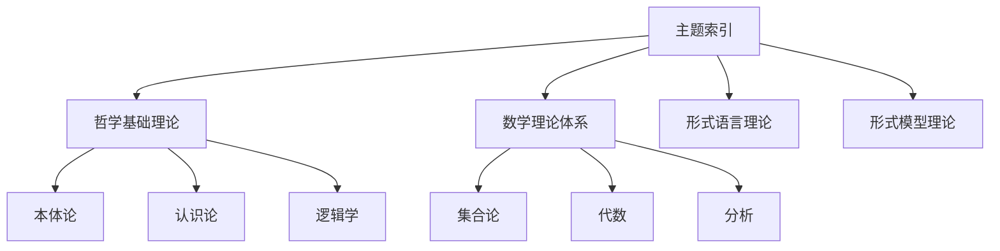

# 09-索引与导航-主题索引

[返回主题树](../00-主题树与内容索引.md) | [主计划文档](../00-形式化架构理论统一计划.md) | [相关计划](../13-项目报告与总结/递归合并计划.md) | [返回上级](../README.md)

> 本文档为索引与导航分支主题索引，所有最新进展与结论以主计划文档为准，历史细节归档于archive/。

## 目录

- [09-索引与导航-主题索引](#09-索引与导航-主题索引)
  - [目录](#目录)
  - [1. 概述](#1-概述)
    - [1.1 主题索引概述](#11-主题索引概述)
    - [1.2 核心目标](#12-核心目标)
    - [1.3 索引层次结构](#13-索引层次结构)
  - [2. 主要文件与内容索引](#2-主要文件与内容索引)
    - [2.1 核心文件](#21-核心文件)
    - [2.2 相关文件](#22-相关文件)
  - [3. 主题索引的基本定义与解释](#3-主题索引的基本定义与解释)
    - [3.1 主题索引的定义](#31-主题索引的定义)
      - [3.1.1 主题分类](#311-主题分类)
      - [3.1.2 索引结构](#312-索引结构)
      - [3.1.3 检索方法](#313-检索方法)
  - [4. 主题索引的基础概念](#4-主题索引的基础概念)
    - [4.1 哲学基础理论索引](#41-哲学基础理论索引)
      - [4.1.1 本体论索引](#411-本体论索引)
      - [4.1.2 认识论索引](#412-认识论索引)
      - [4.1.3 逻辑学索引](#413-逻辑学索引)
  - [5. 主题索引的主要类型](#5-主题索引的主要类型)
    - [5.1 数学理论体系索引](#51-数学理论体系索引)
    - [5.2 形式语言理论索引](#52-形式语言理论索引)
    - [5.3 形式模型理论索引](#53-形式模型理论索引)
    - [5.4 编程语言理论索引](#54-编程语言理论索引)
  - [6. 主题索引的行业应用](#6-主题索引的行业应用)
    - [6.1 知识管理](#61-知识管理)
    - [6.2 信息检索](#62-信息检索)
    - [6.3 学术研究](#63-学术研究)
  - [7. 发展历史](#7-发展历史)
  - [8. 应用领域](#8-应用领域)
  - [9. 总结](#9-总结)
  - [10. 相关性跳转与引用](#10-相关性跳转与引用)

## 1. 概述

### 1.1 主题索引概述

主题索引是知识库组织和管理的重要工具，为形式化架构理论体系提供系统化的主题分类和检索机制。主题索引支持知识的快速定位和关联发现。

### 1.2 核心目标

- 建立系统化的主题分类体系
- 提供高效的检索机制
- 支持知识的关联发现

### 1.3 索引层次结构

## 2. 主要文件与内容索引

### 2.1 核心文件

- [主题索引.md](../Matter/Index/主题索引.md)
- [索引与导航总论.md](00-索引与导航总论.md)

### 2.2 相关文件

- [02-导航系统.md](02-导航系统.md)
- [03-使用指南.md](03-使用指南.md)
- [04-交叉引用系统.md](04-交叉引用系统.md)
- [release-资料索引.md](../13-项目报告与总结/release-资料索引.md)
- [FormalUnified-项目文档索引.md](../13-项目报告与总结/FormalUnified-项目文档索引.md)
- [01-交互式建模引擎/README](../10-AI交互建模理论体系/01-交互式建模引擎/README.md)

## 3. 主题索引的基本定义与解释

### 3.1 主题索引的定义

**定义 3.1.1** 主题索引（Subject Index）
主题索引是按主题内容组织的知识检索系统，提供系统化的分类和导航。

#### 3.1.1 主题分类

**定义 3.1.2** 主题分类
主题分类是根据内容特征对知识进行系统化组织的方法。

**原则**：

- 层次性原则
- 互斥性原则
- 完整性原则

#### 3.1.2 索引结构

**定义 3.1.3** 索引结构
索引结构是主题索引的组织框架，包括分类体系和关联关系。

**要素**：

- 主题层次
- 关联关系
- 检索路径

#### 3.1.3 检索方法

**定义 3.1.4** 检索方法
检索方法是根据用户需求查找相关主题的技术手段。

**方法**：

- 关键词检索
- 分类浏览
- 关联检索

## 4. 主题索引的基础概念

### 4.1 哲学基础理论索引

#### 4.1.1 本体论索引

**索引 4.1.1** 本体论主题索引

- 存在论
- 实体理论
- 属性理论
- 关系理论

#### 4.1.2 认识论索引

**索引 4.1.2** 认识论主题索引

- 知识论
- 真理理论
- 确证理论
- 怀疑论

#### 4.1.3 逻辑学索引

**索引 4.1.3** 逻辑学主题索引

- 形式逻辑
- 哲学逻辑
- 计算逻辑
- 模态逻辑

## 5. 主题索引的主要类型

### 5.1 数学理论体系索引

**索引 5.1.1** 数学理论主题索引

- 集合论基础
- 代数基础
- 几何基础
- 分析基础
- 拓扑基础
- 概率统计基础

### 5.2 形式语言理论索引

**索引 5.2.1** 形式语言主题索引

- 自动机理论
- 语法理论
- 语义理论
- 类型理论
- 计算理论

### 5.3 形式模型理论索引

**索引 5.3.1** 形式模型主题索引

- 状态机理论
- Petri网理论
- 时序逻辑理论
- 模型验证理论
- 模型转换理论

### 5.4 编程语言理论索引

**索引 5.4.1** 编程语言主题索引

- 语法理论
- 语义理论
- 类型理论
- 编译理论
- 运行时理论

## 6. 主题索引的行业应用

### 6.1 知识管理

- 知识组织
- 知识检索
- 知识发现

### 6.2 信息检索

- 搜索引擎
- 推荐系统
- 智能问答

### 6.3 学术研究

- 文献检索
- 研究导航
- 学术交流

## 7. 发展历史

主题索引的发展经历了从传统卡片索引到现代数字索引的演进过程。杜威十进分类法、国际十进分类法等为现代索引理论奠定了基础。

## 8. 应用领域

主题索引在图书馆学、信息科学、知识管理、数字图书馆等领域有广泛应用，是知识组织的重要工具。

## 9. 总结

主题索引为形式化架构理论体系提供了系统化的知识组织框架，是知识管理和检索的重要基础设施。

## 10. 相关性跳转与引用

- [00-索引与导航总论.md](00-索引与导航总论.md)
- [02-导航系统.md](02-导航系统.md)
- [03-使用指南.md](03-使用指南.md)
- [04-交叉引用系统.md](04-交叉引用系统.md)
- [05-版本控制系统.md](05-版本控制系统.md)
- [06-搜索系统.md](06-搜索系统.md)
- [07-知识图谱系统.md](07-知识图谱系统.md)
- [08-自动化工具链.md](08-自动化工具链.md)
- [09-文档生成系统.md](09-文档生成系统.md)
- [10-协作系统.md](10-协作系统.md)
- [11-质量保证系统.md](11-质量保证系统.md)
- [12-性能监控系统.md](12-性能监控系统.md)
- [14-配置管理系统.md](14-配置管理系统.md)
- [15-数据管理系统.md](15-数据管理系统.md)
- [16-工作流管理系统.md](16-工作流管理系统.md)
- [17-集成开发环境.md](17-集成开发环境.md)
- [18-自动化测试系统.md](18-自动化测试系统.md)
- [19-持续集成系统.md](19-持续集成系统.md)
- [20-持续部署系统.md](20-持续部署系统.md)
- [release-资料索引.md](../13-项目报告与总结/release-资料索引.md)
- [FormalUnified-项目文档索引.md](../13-项目报告与总结/FormalUnified-项目文档索引.md)
- [01-交互式建模引擎/README](../10-AI交互建模理论体系/01-交互式建模引擎/README.md)
- [00-主题树与内容索引.md](../00-主题树与内容索引.md)
- 进度追踪与上下文：
  - [软件工程体系版本](../软件工程理论与实践体系/进度追踪与上下文.md)
  - [项目报告与总结版本](../13-项目报告与总结/进度追踪与上下文.md)
  - [实践应用开发子目录版本](../08-实践应用开发/软件工程理论与实践体系/进度追踪与上下文.md)

---

> 本文件为自动归纳生成，后续将递归细化相关内容，持续补全图表、公式、代码等多表征内容。
