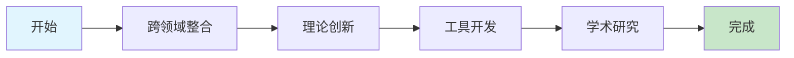

# 快速导航指南

## 导航概述

快速导航指南为用户提供高效的内容访问路径，通过预设的学习路线和智能推荐系统，帮助用户快速定位和访问所需的理论内容。

### 核心功能

- **学习路径**: 预设的理论学习路径和进阶路线
- **快速查找**: 基于关键词和标签的快速内容定位
- **智能推荐**: 基于用户行为和偏好的内容推荐
- **进度跟踪**: 学习进度记录和继续学习建议

## 学习路径

### 1. 初学者路径


**推荐学习顺序**:

1. **哲学基础理论** (2-3周)
   - 本体论基础
   - 认识论基础
   - 逻辑学基础

2. **数学理论体系** (3-4周)
   - 集合论基础
   - 代数理论
   - 分析理论

3. **形式语言理论** (2-3周)
   - 形式语言基础
   - 自动机理论
   - 语法分析理论

4. **软件架构理论** (3-4周)
   - 设计模式理论
   - 微服务架构理论
   - 分布式架构理论

5. **实践应用开发** (2-3周)
   - Rust形式化工具
   - 架构设计工具
   - 代码生成工具

### 2. 进阶者路径


**推荐学习顺序**:

1. **形式模型理论** (3-4周)
   - Petri网理论
   - 控制理论
   - 状态机理论

2. **编程语言理论** (2-3周)
   - 语言设计理论
   - 编译器理论

3. **理论统一与整合** (2-3周)
   - 理论映射关系
   - 统一符号体系

4. **高级应用开发** (3-4周)
   - 模型检测工具
   - 理论验证工具

### 3. 专家路径



**推荐学习顺序**:

1. **跨领域整合** (4-6周)
   - 理论映射关系
   - 跨领域证明
   - 应用框架

2. **理论创新** (6-8周)
   - 新理论构建
   - 形式化验证
   - 理论扩展

3. **工具开发** (4-6周)
   - 工具链集成
   - 性能优化
   - 用户界面

4. **学术研究** (持续)
   - 论文写作
   - 学术交流
   - 理论推广

## 快速查找

### 1. 按主题查找

```rust
// 主题索引器
pub struct TopicIndexer {
    topic_map: HashMap<String, Vec<String>>,
    keyword_index: HashMap<String, Vec<String>>,
}

impl TopicIndexer {
    pub fn new() -> Self {
        let mut topic_map = HashMap::new();
        
        // 架构设计主题
        topic_map.insert("架构设计".to_string(), vec![
            "04-软件架构理论/00-软件架构理论总论".to_string(),
            "04-软件架构理论/01-设计模式理论".to_string(),
            "04-软件架构理论/02-微服务架构理论".to_string(),
            "08-实践应用开发/04-架构设计工具".to_string(),
        ]);
        
        // 形式化验证主题
        topic_map.insert("形式化验证".to_string(), vec![
            "06-形式模型理论/00-形式模型理论总论".to_string(),
            "08-实践应用开发/03-理论验证工具".to_string(),
            "08-实践应用开发/05-模型检测工具".to_string(),
        ]);
        
        // 代码生成主题
        topic_map.insert("代码生成".to_string(), vec![
            "08-实践应用开发/06-代码生成工具".to_string(),
            "05-编程语言理论/02-编译器理论".to_string(),
        ]);
        
        Self {
            topic_map,
            keyword_index: Self::build_keyword_index(),
        }
    }
    
    pub fn find_by_topic(&self, topic: &str) -> Vec<String> {
        self.topic_map.get(topic)
            .cloned()
            .unwrap_or_default()
    }
    
    pub fn find_by_keyword(&self, keyword: &str) -> Vec<String> {
        self.keyword_index.get(keyword)
            .cloned()
            .unwrap_or_default()
    }
}
```

### 2. 按难度查找

```rust
// 难度分类器
pub struct DifficultyClassifier {
    difficulty_map: HashMap<String, Difficulty>,
    skill_requirements: HashMap<String, Vec<String>>,
}

impl DifficultyClassifier {
    pub fn new() -> Self {
        let mut difficulty_map = HashMap::new();
        
        // 初级内容
        difficulty_map.insert("01-哲学基础理论/00-哲学基础理论总论".to_string(), Difficulty::Beginner);
        difficulty_map.insert("02-数学理论体系/00-数学理论体系总论".to_string(), Difficulty::Beginner);
        
        // 中级内容
        difficulty_map.insert("04-软件架构理论/00-软件架构理论总论".to_string(), Difficulty::Intermediate);
        difficulty_map.insert("08-实践应用开发/00-实践应用开发总论".to_string(), Difficulty::Intermediate);
        
        // 高级内容
        difficulty_map.insert("06-形式模型理论/00-形式模型理论总论".to_string(), Difficulty::Advanced);
        difficulty_map.insert("07-理论统一与整合/00-理论统一与整合总论".to_string(), Difficulty::Advanced);
        
        Self {
            difficulty_map,
            skill_requirements: Self::build_skill_requirements(),
        }
    }
    
    pub fn find_by_difficulty(&self, difficulty: Difficulty) -> Vec<String> {
        self.difficulty_map.iter()
            .filter(|(_, &d)| d == difficulty)
            .map(|(path, _)| path.clone())
            .collect()
    }
    
    pub fn check_prerequisites(&self, document_path: &str, user_skills: &[String]) -> PrerequisiteCheck {
        let required_skills = self.skill_requirements.get(document_path)
            .cloned()
            .unwrap_or_default();
        
        let missing_skills: Vec<String> = required_skills.iter()
            .filter(|skill| !user_skills.contains(skill))
            .cloned()
            .collect();
        
        PrerequisiteCheck {
            document_path: document_path.to_string(),
            required_skills,
            user_skills: user_skills.to_vec(),
            missing_skills,
            can_access: missing_skills.is_empty(),
        }
    }
}
```

### 3. 按时间查找

```rust
// 时间估算器
pub struct TimeEstimator {
    reading_speeds: HashMap<String, f64>, // 页/分钟
    complexity_factors: HashMap<String, f64>,
}

impl TimeEstimator {
    pub fn new() -> Self {
        let mut reading_speeds = HashMap::new();
        reading_speeds.insert("beginner".to_string(), 2.0); // 初学者
        reading_speeds.insert("intermediate".to_string(), 3.0); // 中级
        reading_speeds.insert("advanced".to_string(), 4.0); // 高级
        
        let mut complexity_factors = HashMap::new();
        complexity_factors.insert("theory".to_string(), 1.5); // 理论内容
        complexity_factors.insert("practice".to_string(), 1.0); // 实践内容
        complexity_factors.insert("code".to_string(), 0.8); // 代码内容
        
        Self {
            reading_speeds,
            complexity_factors,
        }
    }
    
    pub fn estimate_reading_time(&self, document_path: &str, user_level: &str) -> Duration {
        let page_count = self.get_page_count(document_path);
        let reading_speed = self.reading_speeds.get(user_level).unwrap_or(&2.0);
        let complexity_factor = self.get_complexity_factor(document_path);
        
        let minutes = (page_count as f64) / reading_speed * complexity_factor;
        Duration::from_secs((minutes * 60.0) as u64)
    }
    
    pub fn find_by_time_constraint(&self, available_time: Duration, user_level: &str) -> Vec<TimeConstrainedDocument> {
        let mut suitable_documents = Vec::new();
        
        for document_path in self.get_all_documents() {
            let estimated_time = self.estimate_reading_time(&document_path, user_level);
            
            if estimated_time <= available_time {
                suitable_documents.push(TimeConstrainedDocument {
                    document_path,
                    estimated_time,
                    time_efficiency: available_time.as_secs() as f64 / estimated_time.as_secs() as f64,
                });
            }
        }
        
        suitable_documents.sort_by(|a, b| b.time_efficiency.partial_cmp(&a.time_efficiency).unwrap());
        suitable_documents
    }
}
```

## 智能推荐

### 1. 基于用户行为的推荐

```rust
// 用户行为分析器
pub struct UserBehaviorAnalyzer {
    reading_history: HashMap<String, Vec<ReadingEvent>>,
    interaction_patterns: HashMap<String, InteractionPattern>,
}

impl UserBehaviorAnalyzer {
    pub fn new() -> Self {
        Self {
            reading_history: HashMap::new(),
            interaction_patterns: HashMap::new(),
        }
    }
    
    pub fn analyze_user_preferences(&self, user_id: &str) -> UserPreferences {
        let reading_events = self.reading_history.get(user_id)
            .cloned()
            .unwrap_or_default();
        
        let mut preferences = UserPreferences::new();
        
        // 分析阅读偏好
        for event in &reading_events {
            match event.event_type {
                ReadingEventType::StartReading => {
                    preferences.favorite_topics.insert(event.topic.clone());
                }
                ReadingEventType::CompleteReading => {
                    preferences.completed_topics.insert(event.topic.clone());
                }
                ReadingEventType::SkipReading => {
                    preferences.disliked_topics.insert(event.topic.clone());
                }
            }
        }
        
        // 分析学习模式
        preferences.learning_pattern = self.analyze_learning_pattern(&reading_events);
        preferences.preferred_difficulty = self.analyze_preferred_difficulty(&reading_events);
        
        preferences
    }
    
    pub fn generate_recommendations(&self, user_id: &str) -> Vec<Recommendation> {
        let preferences = self.analyze_user_preferences(user_id);
        let mut recommendations = Vec::new();
        
        // 基于兴趣推荐
        for topic in &preferences.favorite_topics {
            let related_documents = self.find_related_documents(topic);
            for document in related_documents {
                recommendations.push(Recommendation {
                    document_path: document,
                    reason: format!("基于您对{}的兴趣", topic),
                    confidence: 0.8,
                });
            }
        }
        
        // 基于学习进度推荐
        let next_topics = self.suggest_next_topics(&preferences);
        for topic in next_topics {
            recommendations.push(Recommendation {
                document_path: topic,
                reason: "基于您的学习进度".to_string(),
                confidence: 0.7,
            });
        }
        
        recommendations.sort_by(|a, b| b.confidence.partial_cmp(&a.confidence).unwrap());
        recommendations
    }
}
```

### 2. 基于内容的推荐

```rust
// 内容相似度分析器
pub struct ContentSimilarityAnalyzer {
    document_embeddings: HashMap<String, Vec<f64>>,
    topic_model: TopicModel,
}

impl ContentSimilarityAnalyzer {
    pub fn new() -> Self {
        Self {
            document_embeddings: Self::load_document_embeddings(),
            topic_model: TopicModel::load(),
        }
    }
    
    pub fn find_similar_documents(&self, document_path: &str, limit: usize) -> Vec<SimilarDocument> {
        let query_embedding = self.document_embeddings.get(document_path)
            .cloned()
            .unwrap_or_default();
        
        if query_embedding.is_empty() {
            return Vec::new();
        }
        
        let mut similarities = Vec::new();
        
        for (path, embedding) in &self.document_embeddings {
            if path != document_path {
                let similarity = self.calculate_cosine_similarity(&query_embedding, embedding);
                similarities.push(SimilarDocument {
                    document_path: path.clone(),
                    similarity,
                    shared_topics: self.find_shared_topics(document_path, path),
                });
            }
        }
        
        similarities.sort_by(|a, b| b.similarity.partial_cmp(&a.similarity).unwrap());
        similarities.into_iter().take(limit).collect()
    }
    
    pub fn recommend_by_content(&self, current_document: &str) -> Vec<ContentRecommendation> {
        let similar_docs = self.find_similar_documents(current_document, 5);
        let mut recommendations = Vec::new();
        
        for similar_doc in similar_docs {
            recommendations.push(ContentRecommendation {
                document_path: similar_doc.document_path,
                similarity_score: similar_doc.similarity,
                shared_topics: similar_doc.shared_topics,
                recommendation_reason: self.generate_recommendation_reason(&similar_doc),
            });
        }
        
        recommendations
    }
    
    fn calculate_cosine_similarity(&self, vec1: &[f64], vec2: &[f64]) -> f64 {
        if vec1.len() != vec2.len() {
            return 0.0;
        }
        
        let dot_product: f64 = vec1.iter().zip(vec2.iter()).map(|(a, b)| a * b).sum();
        let norm1: f64 = vec1.iter().map(|x| x * x).sum::<f64>().sqrt();
        let norm2: f64 = vec2.iter().map(|x| x * x).sum::<f64>().sqrt();
        
        if norm1 == 0.0 || norm2 == 0.0 {
            return 0.0;
        }
        
        dot_product / (norm1 * norm2)
    }
}
```

## 进度跟踪

### 1. 学习进度管理器

```rust
// 学习进度管理器
pub struct LearningProgressManager {
    user_progress: HashMap<String, UserProgress>,
    milestone_tracker: MilestoneTracker,
}

impl LearningProgressManager {
    pub fn new() -> Self {
        Self {
            user_progress: HashMap::new(),
            milestone_tracker: MilestoneTracker::new(),
        }
    }
    
    pub fn update_progress(&mut self, user_id: &str, document_path: &str, progress: ProgressUpdate) {
        let user_progress = self.user_progress.entry(user_id.to_string()).or_insert_with(UserProgress::new);
        user_progress.update_document_progress(document_path, progress);
        
        // 检查里程碑
        self.milestone_tracker.check_milestones(user_id, user_progress);
    }
    
    pub fn get_learning_summary(&self, user_id: &str) -> LearningSummary {
        let progress = self.user_progress.get(user_id)
            .cloned()
            .unwrap_or_default();
        
        LearningSummary {
            total_documents: progress.total_documents(),
            completed_documents: progress.completed_documents(),
            completion_rate: progress.completion_rate(),
            current_streak: progress.current_streak(),
            total_study_time: progress.total_study_time(),
            achievements: self.milestone_tracker.get_achievements(user_id),
            next_milestones: self.milestone_tracker.get_next_milestones(user_id),
        }
    }
    
    pub fn suggest_continue_learning(&self, user_id: &str) -> Vec<ContinueLearningSuggestion> {
        let progress = self.user_progress.get(user_id)
            .cloned()
            .unwrap_or_default();
        
        let mut suggestions = Vec::new();
        
        // 继续未完成的内容
        for (document_path, doc_progress) in &progress.document_progress {
            if doc_progress.completion_rate < 1.0 {
                suggestions.push(ContinueLearningSuggestion {
                    document_path: document_path.clone(),
                    reason: "继续未完成的学习".to_string(),
                    priority: Priority::High,
                    estimated_time: doc_progress.estimated_remaining_time(),
                });
            }
        }
        
        // 推荐下一个主题
        let next_topics = self.suggest_next_topics(&progress);
        for topic in next_topics {
            suggestions.push(ContinueLearningSuggestion {
                document_path: topic,
                reason: "推荐的下一个学习主题".to_string(),
                priority: Priority::Medium,
                estimated_time: Duration::from_secs(3600), // 1小时
            });
        }
        
        suggestions.sort_by(|a, b| a.priority.cmp(&b.priority));
        suggestions
    }
}
```

### 2. 学习路径优化器

```rust
// 学习路径优化器
pub struct LearningPathOptimizer {
    path_analyzer: PathAnalyzer,
    efficiency_calculator: EfficiencyCalculator,
}

impl LearningPathOptimizer {
    pub fn new() -> Self {
        Self {
            path_analyzer: PathAnalyzer::new(),
            efficiency_calculator: EfficiencyCalculator::new(),
        }
    }
    
    pub fn optimize_learning_path(&self, current_path: &[String], user_profile: &UserProfile) -> OptimizedPath {
        let path_efficiency = self.efficiency_calculator.calculate_efficiency(current_path, user_profile);
        let alternative_paths = self.generate_alternative_paths(current_path);
        
        let mut optimized_paths = Vec::new();
        
        for path in alternative_paths {
            let efficiency = self.efficiency_calculator.calculate_efficiency(&path, user_profile);
            if efficiency > path_efficiency {
                optimized_paths.push(OptimizedPath {
                    path,
                    efficiency,
                    improvements: self.identify_improvements(current_path, &path),
                });
            }
        }
        
        optimized_paths.sort_by(|a, b| b.efficiency.partial_cmp(&a.efficiency).unwrap());
        
        optimized_paths.first().cloned().unwrap_or_else(|| OptimizedPath {
            path: current_path.to_vec(),
            efficiency: path_efficiency,
            improvements: Vec::new(),
        })
    }
    
    pub fn suggest_shortcuts(&self, current_path: &[String], user_profile: &UserProfile) -> Vec<ShortcutSuggestion> {
        let mut shortcuts = Vec::new();
        
        // 基于用户技能水平建议跳过某些内容
        for (i, document) in current_path.iter().enumerate() {
            if self.can_skip_document(document, user_profile) {
                shortcuts.push(ShortcutSuggestion {
                    document_to_skip: document.clone(),
                    position: i,
                    reason: "基于您的技能水平可以跳过".to_string(),
                    time_saved: self.estimate_time_saved(document),
                });
            }
        }
        
        // 建议并行学习的内容
        let parallel_content = self.find_parallel_content(current_path);
        for content in parallel_content {
            shortcuts.push(ShortcutSuggestion {
                document_to_skip: content.document.clone(),
                position: content.position,
                reason: "可以与其他内容并行学习".to_string(),
                time_saved: Duration::from_secs(0), // 并行学习不节省时间
            });
        }
        
        shortcuts
    }
}
```

## 交叉引用

- [[00-索引与导航总论|索引与导航总论]]
- [[02-概念索引|概念索引]]
- [[03-主题索引|主题索引]]
- [[04-工具索引|工具索引]]

## 导航

- [返回总目录](../README.md)
- [返回索引与导航总论](00-索引与导航总论.md)
- [02-概念索引](02-概念索引.md)
- [03-主题索引](03-主题索引.md)
- [04-工具索引](04-工具索引.md)
