# 01-理论体系索引

## 目录

1. [1.0 理论体系概览](#10-理论体系概览)
2. [2.0 理论领域索引](#20-理论领域索引)
3. [3.0 概念索引](#30-概念索引)
4. [4.0 方法索引](#40-方法索引)
5. [5.0 应用索引](#50-应用索引)
6. [6.0 交叉引用](#60-交叉引用)

## 1.0 理论体系概览

### 1.1 总体架构

统一形式化理论体系 $\mathcal{FTS} = (\mathcal{P}, \mathcal{M}, \mathcal{L}, \mathcal{S}, \mathcal{PL}, \mathcal{FM}, \mathcal{T})$：

- $\mathcal{P}$：哲学基础理论
- $\mathcal{M}$：数学理论体系
- $\mathcal{L}$：形式语言理论
- $\mathcal{S}$：软件架构理论
- $\mathcal{PL}$：编程语言理论
- $\mathcal{FM}$：形式模型理论
- $\mathcal{T}$：理论统一框架

### 1.2 理论层次

```mermaid
graph TB
    A[统一形式化理论体系] --> B[哲学基础理论]
    A --> C[数学理论体系]
    A --> D[形式语言理论]
    A --> E[软件架构理论]
    A --> F[编程语言理论]
    A --> G[形式模型理论]
    A --> H[理论统一框架]
    
    B --> B1[本体论]
    B --> B2[认识论]
    B --> B3[逻辑学]
    B --> B4[伦理学]
    B --> B5[形而上学]
    
    C --> C1[集合论]
    C --> C2[范畴论]
    C --> C3[代数理论]
    C --> C4[几何理论]
    C --> C5[分析理论]
    C --> C6[概率统计]
    
    D --> D1[形式语言]
    D --> D2[自动机]
    D --> D3[计算理论]
    
    E --> E1[架构基础]
    E --> E2[分布式架构]
    E --> E3[云原生架构]
    E --> E4[微服务架构]
    
    F --> F1[类型系统]
    F --> F2[语义理论]
    F --> F3[并发理论]
    
    G --> G1[Petri网]
    G --> G2[状态机]
    G --> G3[时序逻辑]
    
    H --> H1[理论映射]
    H --> H2[统一符号]
    H --> H3[等价性]
```

## 2.0 理论领域索引

### 2.1 哲学基础理论

| 文档 | 主题 | 核心概念 | 主要定理 |
|------|------|----------|----------|
| [01-本体论形式化理论](../01-哲学基础理论/01-本体论形式化理论.md) | 本体论基础 | 实体、属性、关系 | 存在性公理 |
| [02-认识论形式化理论](../01-哲学基础理论/02-认识论形式化理论.md) | 认识论基础 | 知识、信念、确证 | 知识定义公理 |
| [03-逻辑学形式化理论](../01-哲学基础理论/03-逻辑学形式化理论.md) | 逻辑学基础 | 形式逻辑、推理 | 逻辑一致性 |
| [04-伦理学形式化理论](../01-哲学基础理论/04-伦理学形式化理论.md) | 伦理学基础 | 价值、原则、决策 | 价值对齐公理 |
| [05-形而上学形式化理论](../01-哲学基础理论/05-形而上学形式化理论.md) | 形而上学基础 | 存在、本质、因果 | 因果律公理 |

### 2.2 数学理论体系

| 文档 | 主题 | 核心概念 | 主要定理 |
|------|------|----------|----------|
| [01-集合论基础](../02-数学理论体系/01-集合论基础.md) | 集合论 | 集合、关系、函数 | 选择公理 |
| [02-范畴论基础](../02-数学理论体系/02-范畴论基础.md) | 范畴论 | 对象、态射、函子 | Yoneda引理 |
| [03-代数理论](../02-数学理论体系/03-代数理论.md) | 代数理论 | 群、环、域 | 同构定理 |
| [04-几何理论](../02-数学理论体系/04-几何理论.md) | 几何理论 | 拓扑、度量、流形 | 同伦论 |
| [05-分析理论](../02-数学理论体系/05-分析理论.md) | 分析理论 | 极限、连续、微分 | 中值定理 |
| [06-概率统计理论](../02-数学理论体系/06-概率统计理论.md) | 概率统计 | 概率、随机变量、分布 | 大数定律 |

### 2.3 形式语言理论

| 文档 | 主题 | 核心概念 | 主要定理 |
|------|------|----------|----------|
| [01-形式语言基础](../03-形式语言理论/01-形式语言基础.md) | 形式语言 | 语言、文法、自动机 | 泵引理 |

### 2.4 软件架构理论

| 文档 | 主题 | 核心概念 | 主要定理 |
|------|------|----------|----------|
| [01-软件架构基础](../04-软件架构理论/01-软件架构基础.md) | 架构基础 | 组件、接口、模式 | 架构原则 |
| [02-分布式架构](../04-软件架构理论/02-分布式架构.md) | 分布式系统 | 一致性、共识、容错 | CAP定理 |
| [03-云原生架构](../04-软件架构理论/03-云原生架构.md) | 云原生 | 容器、编排、网格 | 12-Factor原则 |
| [04-微服务架构](../04-软件架构理论/04-微服务架构.md) | 微服务 | 服务发现、网关、通信 | 服务自治原则 |

### 2.5 编程语言理论

| 文档 | 主题 | 核心概念 | 主要定理 |
|------|------|----------|----------|
| [01-类型系统理论](../05-编程语言理论/01-类型系统理论.md) | 类型系统 | 类型、检查、推断 | 类型安全定理 |

### 2.6 形式模型理论

| 文档 | 主题 | 核心概念 | 主要定理 |
|------|------|----------|----------|
| [01-Petri网理论](../06-形式模型理论/01-Petri网理论.md) | Petri网 | 库所、变迁、标识 | 可达性定理 |

### 2.7 理论统一与整合

| 文档 | 主题 | 核心概念 | 主要定理 |
|------|------|----------|----------|
| [01-理论映射关系](../07-理论统一与整合/01-理论映射关系.md) | 理论映射 | 映射、等价、统一 | 映射一致性 |

## 3.0 概念索引

### 3.1 基础概念

| 概念 | 定义 | 所属理论 | 相关概念 |
|------|------|----------|----------|
| 实体 | 存在的对象 | 本体论 | 属性、关系 |
| 集合 | 元素的聚集 | 集合论 | 关系、函数 |
| 函数 | 输入到输出的映射 | 数学 | 关系、映射 |
| 组件 | 软件的基本单元 | 软件架构 | 接口、服务 |
| 类型 | 值的集合 | 类型系统 | 检查、推断 |
| 状态 | 系统的当前配置 | 形式模型 | 转换、标识 |

### 3.2 关系概念

| 概念 | 定义 | 所属理论 | 相关概念 |
|------|------|----------|----------|
| 等价关系 | 自反、对称、传递的关系 | 数学 | 同构、同态 |
| 依赖关系 | 一个概念依赖另一个 | 软件架构 | 耦合、内聚 |
| 映射关系 | 概念间的对应关系 | 理论统一 | 转换、等价 |
| 因果关系 | 原因导致结果 | 形而上学 | 时间、空间 |

### 3.3 操作概念

| 概念 | 定义 | 所属理论 | 相关概念 |
|------|------|----------|----------|
| 复合 | 操作的组合 | 范畴论 | 结合律、单位元 |
| 发射 | Petri网的执行 | Petri网 | 使能、可达 |
| 类型检查 | 验证类型正确性 | 类型系统 | 推断、安全 |
| 服务发现 | 查找可用服务 | 微服务 | 注册、健康检查 |

## 4.0 方法索引

### 4.1 分析方法

| 方法 | 描述 | 适用领域 | 工具 |
|------|------|----------|------|
| 形式化证明 | 严格的数学证明 | 所有理论 | LaTeX、Coq |
| 模型检查 | 自动验证模型性质 | 形式模型 | SPIN、NuSMV |
| 类型检查 | 静态类型验证 | 编程语言 | 编译器 |
| 可达性分析 | 分析系统可达状态 | Petri网 | 可达性图 |

### 4.2 设计方法

| 方法 | 描述 | 适用领域 | 工具 |
|------|------|----------|------|
| 领域驱动设计 | 基于业务领域设计 | 软件架构 | DDD |
| 分层架构 | 按层次组织系统 | 软件架构 | 架构模式 |
| 微服务设计 | 服务化系统设计 | 微服务 | 服务网格 |
| 类型驱动设计 | 基于类型系统设计 | 编程语言 | 类型理论 |

### 4.3 验证方法

| 方法 | 描述 | 适用领域 | 工具 |
|------|------|----------|------|
| 定理证明 | 数学定理证明 | 数学理论 | Isabelle、HOL |
| 模型验证 | 模型性质验证 | 形式模型 | 模型检查器 |
| 代码验证 | 程序正确性验证 | 编程语言 | 静态分析 |
| 架构验证 | 架构设计验证 | 软件架构 | 架构分析 |

## 5.0 应用索引

### 5.1 软件工程应用

| 应用 | 理论基础 | 实践工具 | 案例 |
|------|----------|----------|------|
| 系统设计 | 软件架构理论 | 架构设计工具 | 微服务系统 |
| 代码生成 | 形式语言理论 | 代码生成器 | 模型驱动开发 |
| 类型安全 | 类型系统理论 | 类型检查器 | Rust语言 |
| 并发控制 | Petri网理论 | 模型检查器 | 工作流系统 |

### 5.2 人工智能应用

| 应用 | 理论基础 | 实践工具 | 案例 |
|------|----------|----------|------|
| 知识表示 | 本体论理论 | 知识图谱 | 语义网 |
| 逻辑推理 | 逻辑学理论 | 推理引擎 | 专家系统 |
| 概率建模 | 概率统计理论 | 概率模型 | 机器学习 |
| 形式验证 | 形式模型理论 | 验证工具 | 安全系统 |

### 5.3 科学研究应用

| 应用 | 理论基础 | 实践工具 | 案例 |
|------|----------|----------|------|
| 数学建模 | 数学理论体系 | 数学软件 | 物理建模 |
| 形式化方法 | 形式语言理论 | 形式化工具 | 协议验证 |
| 系统分析 | 形式模型理论 | 分析工具 | 复杂系统 |
| 理论整合 | 理论统一框架 | 映射工具 | 跨学科研究 |

## 6.0 交叉引用

### 6.1 理论间关系

| 源理论 | 目标理论 | 关系类型 | 映射方法 |
|--------|----------|----------|----------|
| 本体论 | 集合论 | 概念映射 | 实体→集合 |
| 范畴论 | 软件架构 | 结构映射 | 对象→组件 |
| 自动机 | 微服务 | 行为映射 | 状态→服务状态 |
| 类型系统 | 形式验证 | 逻辑映射 | 类型→命题 |

### 6.2 概念间关系

| 概念A | 概念B | 关系 | 理论领域 |
|-------|-------|------|----------|
| 实体 | 集合 | 实例化 | 哲学→数学 |
| 函数 | 组件 | 抽象 | 数学→软件 |
| 状态 | 标识 | 对应 | 自动机→Petri网 |
| 类型 | 命题 | Curry-Howard | 编程→逻辑 |

### 6.3 方法间关系

| 方法A | 方法B | 关系 | 应用场景 |
|-------|-------|------|----------|
| 形式证明 | 模型检查 | 互补 | 系统验证 |
| 类型检查 | 静态分析 | 包含 | 代码质量 |
| 可达性分析 | 死锁检测 | 特化 | 并发系统 |
| 服务发现 | 负载均衡 | 协作 | 分布式系统 |

### 6.4 工具间关系

| 工具A | 工具B | 关系 | 集成方式 |
|-------|-------|------|----------|
| LaTeX | 代码生成器 | 输入输出 | 文档→代码 |
| 模型检查器 | 仿真器 | 验证执行 | 形式→实际 |
| 类型检查器 | 编译器 | 前端后端 | 分析→生成 |
| 架构分析器 | 监控系统 | 设计运行 | 静态→动态 |

---

**索引版本**：v1.0  
**创建时间**：2024-12-19  
**最后更新**：2024-12-19  
**状态**：进行中

**索引覆盖**：
- ✅ 哲学基础理论（5个文档）
- ✅ 数学理论体系（6个文档）
- 🔄 软件架构理论（4个文档）
- 🔄 形式语言理论（1个文档）
- 🔄 编程语言理论（1个文档）
- 🔄 形式模型理论（1个文档）
- 🔄 理论统一与整合（1个文档）

**下一步工作**：
1. 完善剩余理论文档
2. 增加更多交叉引用
3. 建立自动索引系统
4. 开发导航工具 