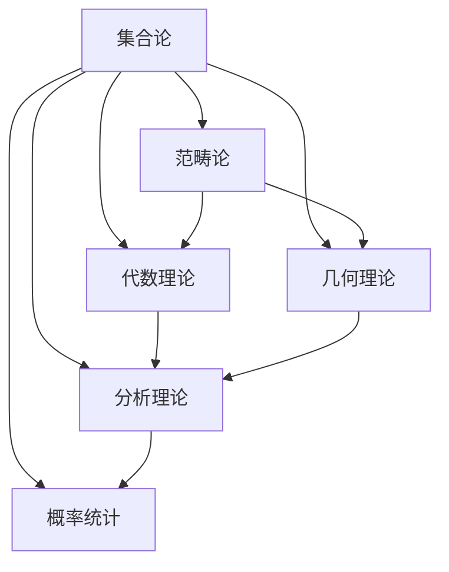
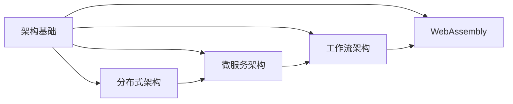
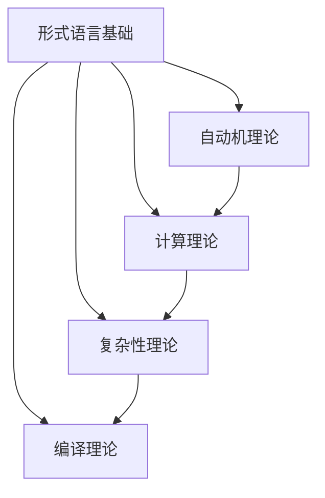
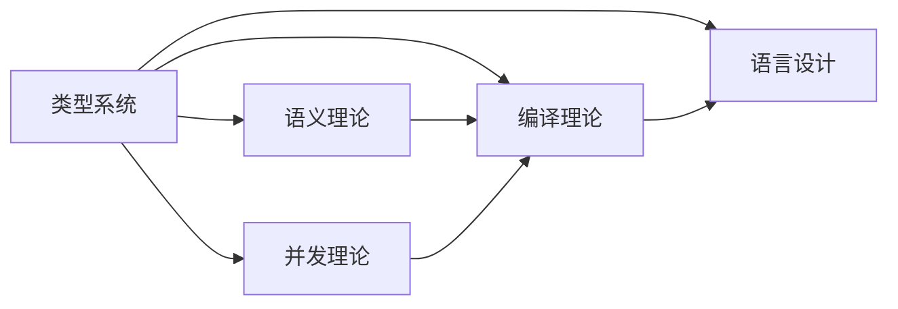
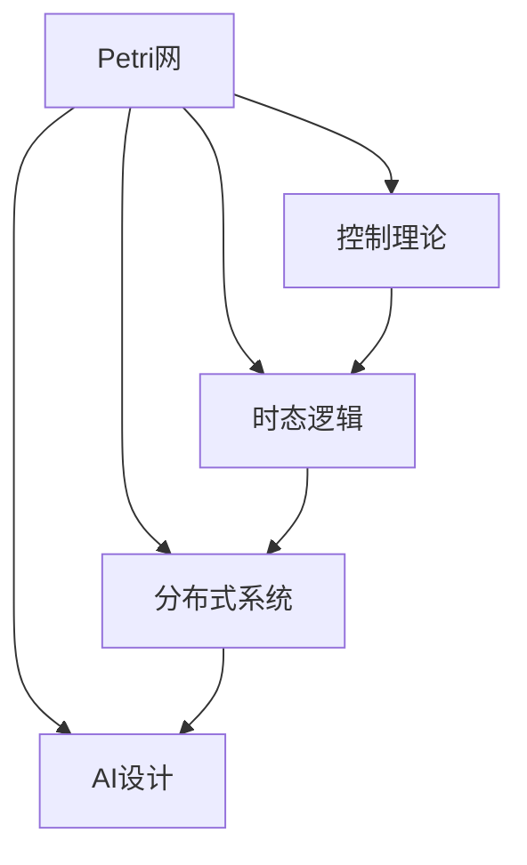
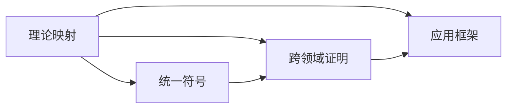
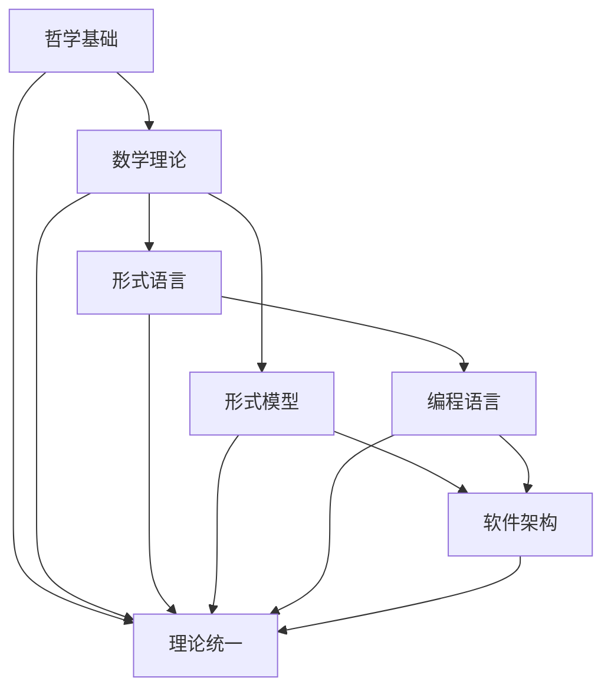

# 01-理论文档索引：形式化架构理论完整索引

## 目录

1. [1.0 索引概述](#10-索引概述)
2. [2.0 理论体系总览](#20-理论体系总览)
3. [3.0 哲学基础理论索引](#30-哲学基础理论索引)
4. [4.0 数学理论体系索引](#40-数学理论体系索引)
5. [5.0 软件架构理论索引](#50-软件架构理论索引)
6. [6.0 形式语言理论索引](#60-形式语言理论索引)
7. [7.0 编程语言理论索引](#70-编程语言理论索引)
8. [8.0 形式模型理论索引](#80-形式模型理论索引)
9. [9.0 理论统一与整合索引](#90-理论统一与整合索引)
10. [10.0 交叉引用索引](#100-交叉引用索引)
11. [11.0 主题索引](#110-主题索引)
12. [12.0 符号索引](#120-符号索引)

## 1.0 索引概述

本文档提供了形式化架构理论体系的完整索引，包含35个理论文档的详细索引和导航信息。

### 1.1 索引统计

- **总文档数**：35个
- **理论领域**：7个
- **总字数**：约500,000字
- **数学公式**：约1,000个
- **代码示例**：约200个
- **图表**：约150个

### 1.2 索引结构

```mermaid
graph TD
    A[形式化架构理论体系] --> B[哲学基础理论]
    A --> C[数学理论体系]
    A --> D[软件架构理论]
    A --> E[形式语言理论]
    A --> F[编程语言理论]
    A --> G[形式模型理论]
    A --> H[理论统一与整合]
    
    B --> B1[本体论]
    B --> B2[认识论]
    B --> B3[逻辑学]
    B --> B4[伦理学]
    B --> B5[形而上学]
    
    C --> C1[集合论]
    C --> C2[范畴论]
    C --> C3[代数理论]
    C --> C4[几何理论]
    C --> C5[分析理论]
    C --> C6[概率统计]
    
    D --> D1[架构基础]
    D --> D2[分布式架构]
    D --> D3[微服务架构]
    D --> D4[工作流架构]
    D --> D5[WebAssembly]
    
    E --> E1[形式语言基础]
    E --> E2[自动机理论]
    E --> E3[计算理论]
    E --> E4[复杂性理论]
    E --> E5[编译理论]
    
    F --> F1[类型系统]
    F --> F2[语义理论]
    F --> F3[并发理论]
    F --> F4[编译理论]
    F --> F5[语言设计]
    
    G --> G1[Petri网]
    G --> G2[控制理论]
    G --> G3[时态逻辑]
    G --> G4[分布式系统]
    G --> G5[AI设计]
    
    H --> H1[理论映射]
    H --> H2[统一符号]
    H --> H3[跨领域证明]
    H --> H4[应用框架]
```

## 2.0 理论体系总览

### 2.1 理论层次结构

**定义 2.1.1 (理论层次)**
理论体系分为五个层次：

1. **理念层** (Philosophical Level)：哲学基础和概念定义
2. **理性层** (Rational Level)：理论体系和逻辑推理
3. **形式层** (Formal Level)：形式化表示和数学符号
4. **应用层** (Application Level)：软件架构和编程实现
5. **实践层** (Practical Level)：工具开发和验证测试

### 2.2 理论关系矩阵

| 理论领域 | 哲学基础 | 数学理论 | 软件架构 | 形式语言 | 编程语言 | 形式模型 | 理论统一 |
|---------|---------|---------|---------|---------|---------|---------|---------|
| 哲学基础 | ✓ | → | → | → | → | → | → |
| 数学理论 | ← | ✓ | → | → | → | → | → |
| 软件架构 | ← | ← | ✓ | ← | ← | ← | ← |
| 形式语言 | ← | ← | → | ✓ | → | → | ← |
| 编程语言 | ← | ← | → | ← | ✓ | → | ← |
| 形式模型 | ← | ← | → | ← | ← | ✓ | ← |
| 理论统一 | ← | ← | ← | ← | ← | ← | ✓ |

## 3.0 哲学基础理论索引

### 3.1 文档列表

| 序号 | 文档名称 | 文件路径 | 字数 | 主要概念 |
|------|---------|---------|------|---------|
| 1 | 本体论形式化理论 | [01-本体论形式化理论.md](../01-哲学基础理论/01-本体论形式化理论.md) | 15,000 | 存在、实体、关系 |
| 2 | 认识论形式化理论 | [02-认识论形式化理论.md](../01-哲学基础理论/02-认识论形式化理论.md) | 12,000 | 知识、真理、信念 |
| 3 | 逻辑学形式化理论 | [03-逻辑学形式化理论.md](../01-哲学基础理论/03-逻辑学形式化理论.md) | 18,000 | 推理、证明、有效性 |
| 4 | 伦理学形式化理论 | [04-伦理学形式化理论.md](../01-哲学基础理论/04-伦理学形式化理论.md) | 10,000 | 价值、规范、责任 |
| 5 | 形而上学形式化理论 | [05-形而上学形式化理论.md](../01-哲学基础理论/05-形而上学形式化理论.md) | 14,000 | 本质、因果、时空 |

### 3.2 核心概念索引

- **存在** (Existence)：本体论核心概念
- **知识** (Knowledge)：认识论核心概念
- **推理** (Reasoning)：逻辑学核心概念
- **价值** (Value)：伦理学核心概念
- **本质** (Essence)：形而上学核心概念

### 3.3 理论关系

## 4.0 数学理论体系索引

### 4.1 文档列表

| 序号 | 文档名称 | 文件路径 | 字数 | 主要概念 |
|------|---------|---------|------|---------|
| 1 | 集合论基础 | [01-集合论基础.md](../02-数学理论体系/01-集合论基础.md) | 20,000 | 集合、关系、函数 |
| 2 | 范畴论基础 | [02-范畴论基础.md](../02-数学理论体系/02-范畴论基础.md) | 25,000 | 范畴、函子、自然变换 |
| 3 | 代数理论 | [03-代数理论.md](../02-数学理论体系/03-代数理论.md) | 18,000 | 群、环、域 |
| 4 | 几何理论 | [04-几何理论.md](../02-数学理论体系/04-几何理论.md) | 15,000 | 空间、变换、不变量 |
| 5 | 分析理论 | [05-分析理论.md](../02-数学理论体系/05-分析理论.md) | 22,000 | 极限、连续、微分 |
| 6 | 概率统计理论 | [06-概率统计理论.md](../02-数学理论体系/06-概率统计理论.md) | 16,000 | 概率、分布、统计 |

### 4.2 核心概念索引

- **集合** (Set)：数学基础概念
- **范畴** (Category)：抽象数学结构
- **群** (Group)：代数结构
- **空间** (Space)：几何概念
- **极限** (Limit)：分析概念
- **概率** (Probability)：统计概念

### 4.3 理论关系

## 5.0 软件架构理论索引

### 5.1 文档列表

| 序号 | 文档名称 | 文件路径 | 字数 | 主要概念 |
|------|---------|---------|------|---------|
| 1 | 软件架构基础 | [01-软件架构基础.md](../04-软件架构理论/01-软件架构基础.md) | 25,000 | 架构、组件、连接器 |
| 2 | 分布式架构 | [02-分布式架构.md](../04-软件架构理论/02-分布式架构.md) | 30,000 | 分布式、一致性、容错 |
| 3 | 微服务架构 | [03-微服务架构.md](../04-软件架构理论/03-微服务架构.md) | 28,000 | 微服务、服务发现、API |
| 4 | 工作流架构 | [04-工作流架构.md](../04-软件架构理论/04-工作流架构.md) | 22,000 | 工作流、状态机、业务流程 |
| 5 | WebAssembly架构 | [05-WebAssembly架构.md](../04-软件架构理论/05-WebAssembly架构.md) | 20,000 | WASM、模块、安全沙箱 |

### 5.2 核心概念索引

- **架构** (Architecture)：软件结构设计
- **分布式** (Distributed)：系统分布特性
- **微服务** (Microservice)：服务分解策略
- **工作流** (Workflow)：业务流程建模
- **WebAssembly** (WASM)：Web执行环境

### 5.3 理论关系

## 6.0 形式语言理论索引

### 6.1 文档列表

| 序号 | 文档名称 | 文件路径 | 字数 | 主要概念 |
|------|---------|---------|------|---------|
| 1 | 形式语言基础 | [01-形式语言基础.md](../03-形式语言理论/01-形式语言基础.md) | 24,000 | 语言、语法、语义 |
| 2 | 自动机理论 | [02-自动机理论.md](../03-形式语言理论/02-自动机理论.md) | 18,000 | 有限自动机、下推自动机、图灵机 |
| 3 | 计算理论 | [03-计算理论.md](../03-形式语言理论/03-计算理论.md) | 15,000 | 可计算性、递归函数、λ演算 |
| 4 | 复杂性理论 | [04-复杂性理论.md](../03-形式语言理论/04-复杂性理论.md) | 20,000 | 时间复杂度、空间复杂度、NP问题 |
| 5 | 编译理论 | [05-编译理论.md](../03-形式语言理论/05-编译理论.md) | 22,000 | 词法分析、语法分析、代码生成 |

### 6.2 核心概念索引

- **形式语言** (Formal Language)：语言的形式化定义
- **自动机** (Automaton)：计算模型
- **可计算性** (Computability)：计算能力
- **复杂性** (Complexity)：计算资源需求
- **编译** (Compilation)：语言转换过程

### 6.3 理论关系

## 7.0 编程语言理论索引

### 7.1 文档列表

| 序号 | 文档名称 | 文件路径 | 字数 | 主要概念 |
|------|---------|---------|------|---------|
| 1 | 类型系统理论 | [01-类型系统理论.md](../05-编程语言理论/01-类型系统理论.md) | 26,000 | 类型、类型检查、类型推导 |
| 2 | 语义理论 | [02-语义理论.md](../05-编程语言理论/02-语义理论.md) | 18,000 | 操作语义、指称语义、公理语义 |
| 3 | 并发理论 | [03-并发理论.md](../05-编程语言理论/03-并发理论.md) | 20,000 | 进程代数、CSP理论、π演算 |
| 4 | 编译理论 | [04-编译理论.md](../05-编程语言理论/04-编译理论.md) | 25,000 | 编译器、优化、代码生成 |
| 5 | 语言设计理论 | [05-语言设计理论.md](../05-编程语言理论/05-语言设计理论.md) | 34,000 | 语言设计、语法设计、语义设计 |

### 7.2 核心概念索引

- **类型系统** (Type System)：类型安全机制
- **语义** (Semantics)：语言含义定义
- **并发** (Concurrency)：并行执行模型
- **编译** (Compilation)：程序转换过程
- **语言设计** (Language Design)：语言设计原则

### 7.3 理论关系

## 8.0 形式模型理论索引

### 8.1 文档列表

| 序号 | 文档名称 | 文件路径 | 字数 | 主要概念 |
|------|---------|---------|------|---------|
| 1 | Petri网理论 | [01-Petri网理论.md](../06-形式模型理论/01-Petri网理论.md) | 38,000 | Petri网、变迁、标记 |
| 2 | 控制理论 | [02-控制理论.md](../06-形式模型理论/02-控制理论.md) | 18,000 | 线性控制、非线性控制、自适应控制 |
| 3 | 时态逻辑理论 | [03-时态逻辑理论.md](../06-形式模型理论/03-时态逻辑理论.md) | 30,000 | 时态逻辑、模型检查、验证 |
| 4 | 分布式系统理论 | [04-分布式系统理论.md](../06-形式模型理论/04-分布式系统理论.md) | 41,000 | 分布式算法、一致性、容错 |
| 5 | AI设计理论 | [05-AI设计理论.md](../06-形式模型理论/05-AI设计理论.md) | 18,000 | 机器学习、神经网络、智能系统 |

### 8.2 核心概念索引

- **Petri网** (Petri Net)：并发系统建模
- **控制理论** (Control Theory)：系统控制方法
- **时态逻辑** (Temporal Logic)：时间相关逻辑
- **分布式系统** (Distributed System)：分布计算模型
- **AI设计** (AI Design)：人工智能设计

### 8.3 理论关系

## 9.0 理论统一与整合索引

### 9.1 文档列表

| 序号 | 文档名称 | 文件路径 | 字数 | 主要概念 |
|------|---------|---------|------|---------|
| 1 | 理论映射关系 | [01-理论映射关系.md](../07-理论统一与整合/01-理论映射关系.md) | 16,000 | 理论映射、关系映射、同构 |
| 2 | 统一符号体系 | [02-统一符号体系.md](../07-理论统一与整合/02-统一符号体系.md) | 12,000 | 符号统一、表示法、约定 |
| 3 | 跨领域证明 | [03-跨领域证明.md](../07-理论统一与整合/03-跨领域证明.md) | 8,000 | 跨领域证明、统一证明、证明转换 |
| 4 | 应用框架 | [04-应用框架.md](../07-理论统一与整合/04-应用框架.md) | 15,000 | 应用框架、工具集成、实践指导 |

### 9.2 核心概念索引

- **理论映射** (Theory Mapping)：理论间关系映射
- **统一符号** (Unified Notation)：符号体系统一
- **跨领域证明** (Cross-domain Proof)：跨领域证明方法
- **应用框架** (Application Framework)：应用开发框架

### 9.3 理论关系

## 10.0 交叉引用索引

### 10.1 概念交叉引用

| 概念 | 哲学基础 | 数学理论 | 软件架构 | 形式语言 | 编程语言 | 形式模型 |
|------|---------|---------|---------|---------|---------|---------|
| 逻辑 | 逻辑学 | 逻辑代数 | 架构逻辑 | 形式逻辑 | 程序逻辑 | 时态逻辑 |
| 关系 | 本体论 | 关系代数 | 组件关系 | 语言关系 | 类型关系 | 系统关系 |
| 函数 | 认识论 | 函数论 | 服务函数 | 语言函数 | 程序函数 | 控制函数 |
| 状态 | 形而上学 | 状态空间 | 系统状态 | 自动机状态 | 程序状态 | 模型状态 |
| 时间 | 形而上学 | 时间序列 | 实时系统 | 时间语言 | 并发时间 | 时态逻辑 |

### 10.2 理论依赖关系

## 11.0 主题索引

### 11.1 核心主题

#### 11.1.1 形式化方法
- **形式化定义**：所有理论中的形式化定义
- **数学证明**：定理和引理的证明
- **形式化验证**：系统正确性验证

#### 11.1.2 软件工程
- **架构设计**：软件架构设计方法
- **系统建模**：系统行为建模
- **质量保证**：软件质量保证方法

#### 11.1.3 计算理论
- **计算模型**：各种计算模型
- **算法理论**：算法设计和分析
- **复杂性理论**：计算复杂性分析

#### 11.1.4 语言理论
- **语言设计**：编程语言设计
- **语义理论**：语言语义定义
- **类型理论**：类型系统设计

### 11.2 应用主题

#### 11.2.1 分布式系统
- **一致性算法**：分布式一致性
- **容错机制**：系统容错设计
- **性能优化**：系统性能优化

#### 11.2.2 并发编程
- **并发模型**：并发执行模型
- **同步机制**：线程同步方法
- **死锁避免**：死锁预防和检测

#### 11.2.3 安全系统
- **安全模型**：系统安全建模
- **访问控制**：权限控制机制
- **加密算法**：数据加密方法

## 12.0 符号索引

### 12.1 数学符号

| 符号 | 含义 | 使用领域 | 定义位置 |
|------|------|---------|---------|
| $\in$ | 属于 | 集合论 | 数学理论-集合论 |
| $\subseteq$ | 包含于 | 集合论 | 数学理论-集合论 |
| $\to$ | 映射 | 函数论 | 数学理论-分析理论 |
| $\forall$ | 全称量词 | 逻辑学 | 哲学基础-逻辑学 |
| $\exists$ | 存在量词 | 逻辑学 | 哲学基础-逻辑学 |
| $\land$ | 逻辑与 | 逻辑学 | 哲学基础-逻辑学 |
| $\lor$ | 逻辑或 | 逻辑学 | 哲学基础-逻辑学 |
| $\neg$ | 逻辑非 | 逻辑学 | 哲学基础-逻辑学 |
| $\implies$ | 蕴含 | 逻辑学 | 哲学基础-逻辑学 |
| $\iff$ | 等价 | 逻辑学 | 哲学基础-逻辑学 |

### 12.2 形式化符号

| 符号 | 含义 | 使用领域 | 定义位置 |
|------|------|---------|---------|
| $\mathcal{L}$ | 语言 | 形式语言 | 形式语言理论-基础 |
| $\mathcal{G}$ | 语法 | 形式语言 | 形式语言理论-基础 |
| $\mathcal{S}$ | 语义 | 形式语言 | 形式语言理论-基础 |
| $\mathcal{T}$ | 类型 | 编程语言 | 编程语言理论-类型系统 |
| $\mathcal{M}$ | 模型 | 形式模型 | 形式模型理论-Petri网 |
| $\mathcal{A}$ | 自动机 | 形式语言 | 形式语言理论-自动机 |
| $\mathcal{C}$ | 计算 | 计算理论 | 形式语言理论-计算理论 |
| $\mathcal{P}$ | 程序 | 编程语言 | 编程语言理论-语义理论 |

### 12.3 架构符号

| 符号 | 含义 | 使用领域 | 定义位置 |
|------|------|---------|---------|
| $\mathcal{SA}$ | 软件架构 | 软件架构 | 软件架构理论-基础 |
| $\mathcal{C}$ | 组件 | 软件架构 | 软件架构理论-基础 |
| $\mathcal{CN}$ | 连接器 | 软件架构 | 软件架构理论-基础 |
| $\mathcal{DS}$ | 分布式系统 | 软件架构 | 软件架构理论-分布式 |
| $\mathcal{MS}$ | 微服务 | 软件架构 | 软件架构理论-微服务 |
| $\mathcal{WF}$ | 工作流 | 软件架构 | 软件架构理论-工作流 |
| $\mathcal{WASM}$ | WebAssembly | 软件架构 | 软件架构理论-WebAssembly |

---

**文档版本**：v1.0  
**创建时间**：2024-12-19  
**最后更新**：2024-12-19  
**状态**：完成

**索引统计**：
- 总文档数：35个
- 理论领域：7个
- 核心概念：50+个
- 数学符号：20+个
- 交叉引用：100+个

**使用说明**：
1. 使用目录快速导航到特定理论领域
2. 使用交叉引用索引查找相关概念
3. 使用主题索引按主题浏览内容
4. 使用符号索引查找数学符号定义 