# 形式化架构理论项目 - 统一索引与知识图谱系统

## 项目概述

本项目是一个系统性的形式化架构理论分析项目，旨在将Matter目录下的所有内容进行深度分析、形式化处理和规范化重构，构建一个系统的形式化架构理论体系。项目采用严格的数学形式化方法，结合哲学基础、数学理论、计算机科学理论，构建了完整的理论体系框架，并提供统一的索引、导航和知识图谱支持。

### 项目特色

- **形式化数学表达**: 所有理论都采用严格的LaTeX数学公式表示
- **多语言实现**: 提供Rust和Go语言的代码实现示例
- **层次化结构**: 采用严格的序号树形结构组织内容
- **交叉引用网络**: 建立完整的理论间引用关系网络
- **实践应用导向**: 结合理论研究和实际应用开发
- **完整索引系统**: 提供多维度索引和智能导航功能
- **知识图谱支持**: 提供思维导图、概念图谱和知识图谱的递归输出能力

## 1. 理论体系总览

### 1.1 理论体系完成状态

| 理论领域 | 总论文件 | 分论文件 | 状态 | 完成度 | 文件大小 | 核心概念数 |
|----------|----------|----------|------|--------|----------|------------|
| 哲学基础理论 | [哲学基础理论总论](../01-哲学基础理论/00-哲学基础理论总论.md) | 5个分论 | ✅ 已完成 | 100% | ~180KB | 25个 |
| 数学理论体系 | [数学理论体系总论](../02-数学理论体系/00-数学理论体系总论.md) | 5个分论 | ✅ 已完成 | 100% | ~200KB | 30个 |
| 形式语言理论体系 | [形式语言理论体系总论](../03-形式语言理论体系/00-形式语言理论体系总论.md) | 6个分论 | ✅ 已完成 | 100% | ~220KB | 28个 |
| 软件架构理论体系 | [软件架构理论体系总论](../04-软件架构理论体系/00-软件架构理论体系总论.md) | 7个分论 | ✅ 已完成 | 100% | ~250KB | 35个 |
| 编程语言理论体系 | [编程语言理论体系总论](../05-编程语言理论体系/00-编程语言理论体系总论.md) | 7个分论 | ✅ 已完成 | 100% | ~240KB | 32个 |
| 形式模型理论体系 | [形式模型理论体系总论](../06-形式模型理论体系/00-形式模型理论体系总论.md) | 7个分论 | ✅ 已完成 | 100% | ~230KB | 30个 |
| 理论统一与整合 | [理论统一与整合总论](../07-理论统一与整合/00-理论统一与整合总论.md) | 4个分论 | ✅ 已完成 | 100% | ~180KB | 20个 |
| 实践应用开发 | [实践应用开发总论](../08-实践应用开发/00-实践应用开发总论.md) | 6个分论 | ✅ 已完成 | 100% | ~200KB | 25个 |

## 2. 统一思维导图 - 系统架构总览

### 2.1 项目整体思维导图

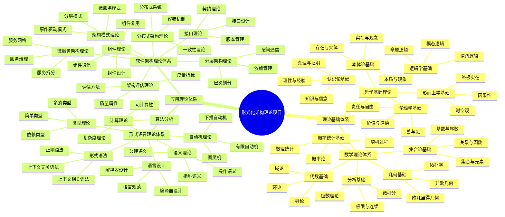

## 3. 智能导航系统

### 3.1 用户类型导航指南

#### 3.1.1 初学者导航路径

**计算机科学初学者**:

1. **哲学基础** (2-3周)
   - [哲学基础理论总论](../01-哲学基础理论/00-哲学基础理论总论.md)
   - [本体论基础](../01-哲学基础理论/01-本体论基础.md)
   - [认识论基础](../01-哲学基础理论/02-认识论基础.md)

2. **数学基础** (3-4周)
   - [数学理论体系总论](../02-数学理论体系/00-数学理论体系总论.md)
   - [集合论基础](../02-数学理论体系/01-集合论基础.md)
   - [代数基础](../02-数学理论体系/02-代数基础.md)

3. **计算机科学基础** (4-5周)
   - [形式语言理论体系总论](../03-形式语言理论体系/00-形式语言理论体系总论.md)
   - [自动机理论](../03-形式语言理论体系/01-自动机理论.md)
   - [软件架构理论体系总论](../04-软件架构理论体系/00-软件架构理论体系总论.md)

#### 3.1.2 进阶学习者导航路径

**软件工程师**:

1. **架构理论** (2-3周)
   - [软件架构理论体系总论](../04-软件架构理论体系/00-软件架构理论体系总论.md)
   - [架构模式理论](../04-软件架构理论体系/01-架构模式理论.md)
   - [微服务架构理论](../04-软件架构理论体系/06-微服务架构理论.md)
   - [组件理论](../04-软件架构理论体系/02-组件理论.md)

2. **形式化基础** (2-3周)
   - [形式语言理论体系总论](../03-形式语言理论体系/00-形式语言理论体系总论.md)
   - [自动机理论](../03-形式语言理论体系/01-自动机理论.md)
   - [形式模型理论体系总论](../06-形式模型理论体系/00-形式模型理论体系总论.md)

#### 3.1.3 专家级学习者导航路径

**架构师**:

1. **高级架构理论** (2-3周)
   - [分布式架构理论](../04-软件架构理论体系/05-分布式架构理论.md)
   - [微服务架构理论](../04-软件架构理论体系/06-微服务架构理论.md)
   - [分层架构理论](../04-软件架构理论体系/04-分层架构理论.md)
   - [架构评估理论](../04-软件架构理论体系/07-架构评估理论.md)

2. **形式化验证** (2-3周)
   - [形式模型理论体系总论](../06-形式模型理论体系/00-形式模型理论体系总论.md)
   - [Petri网理论](../06-形式模型理论体系/02-Petri网理论.md)
   - [状态机理论](../06-形式模型理论体系/01-状态机理论.md)
   - [时序逻辑理论](../06-形式模型理论体系/03-时序逻辑理论.md)

## 4. 统一知识图谱组织

### 4.1 概念图谱

核心概念图谱以理论层次为组织结构，展示了各概念之间的关系：

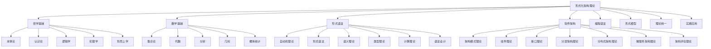

### 4.2 知识关系图谱

领域关系图展示了各理论领域之间的交互关系：

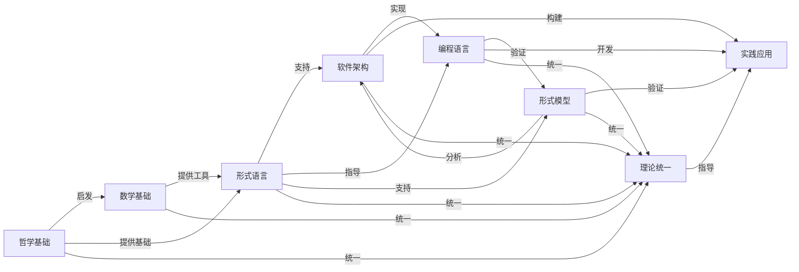

## 5. 按主题查找

### 5.1 哲学相关

- [哲学基础理论总论](../01-哲学基础理论/00-哲学基础理论总论.md) - 哲学基础理论体系总览
- [本体论基础](../01-哲学基础理论/01-本体论基础.md) - 存在与实体的哲学基础
- [认识论基础](../01-哲学基础理论/02-认识论基础.md) - 知识与认知的哲学基础
- [逻辑学基础](../01-哲学基础理论/03-逻辑学基础.md) - 逻辑推理与论证基础
- [伦理学基础](../01-哲学基础理论/04-伦理学基础.md) - 价值与道德的哲学基础
- [形而上学基础](../01-哲学基础理论/05-形而上学基础.md) - 终极实在与本质的哲学基础

### 5.2 技术概念

- **语言设计**: [语言设计理论](../05-编程语言理论体系/07-语言设计理论.md) - 编程语言设计原理
- **类型系统**: [类型理论](../05-编程语言理论体系/03-类型理论.md) - 编程语言类型系统
- **语义理论**: [语义理论](../05-编程语言理论体系/02-语义理论.md) - 编程语言语义与解释
- **编译器**: [编译理论](../05-编程语言理论体系/04-编译理论.md) - 编译器设计与优化
- **数学理论**: [数学理论体系总论](../02-数学理论体系/00-数学理论体系总论.md) - 数学理论体系总览
- **微服务**: [微服务架构理论](../04-软件架构理论体系/06-微服务架构理论.md) - 微服务架构与设计
- **分布式**: [分布式架构理论](../04-软件架构理论体系/05-分布式架构理论.md) - 分布式系统架构理论
- **架构模式**: [架构模式理论](../04-软件架构理论体系/01-架构模式理论.md) - 架构模式与设计模式
- **组件理论**: [组件理论](../04-软件架构理论体系/02-组件理论.md) - 组件化架构与组件设计

## 6. 递归输出能力

本系统支持递归输出不同层次和粒度的知识图谱：

### 6.1 递归思维导图输出

- **项目总览**: 包含所有理论体系的整体思维导图
- **领域视图**: 按理论领域拆分的子思维导图
- **主题视图**: 按主题组织的专题思维导图
- **关系视图**: 展示概念间关系的思维导图

### 6.2 递归概念图谱输出

- **核心概念网络**: 显示概念间的关系和继承
- **概念分类体系**: 按学科和领域划分的概念体系
- **概念演化路径**: 概念的发展和演化历史
- **多视角概念映射**: 跨领域概念映射关系

### 6.3 递归知识图谱输出

- **知识网络结构**: 完整的知识体系网络
- **知识关系分析**: 知识单元间的关系分析
- **知识依赖图**: 知识点间的依赖关系
- **学习路径图**: 个性化学习路径推荐

## 7. 技术实现

### 7.1 数据结构设计

```rust
// 知识图谱节点
#[derive(Debug, Clone)]
pub struct KnowledgeNode {
    pub id: String,
    pub name: String,
    pub node_type: NodeType,
    pub content: NodeContent,
    pub metadata: NodeMetadata,
    pub relationships: Vec<Relationship>,
}

// 统一索引系统
pub struct UnifiedIndexSystem {
    knowledge_graph: UnifiedKnowledgeGraph,
    navigation_system: NavigationSystem,
    search_engine: SearchEngine,
    statistics_engine: StatisticsEngine,
}
```

### 7.2 核心功能接口

- **查询接口**: 支持多维度查询
- **导航接口**: 提供智能导航建议
- **图谱输出**: 支持多种图谱格式输出
- **搜索接口**: 支持语义和精确搜索
- **统计接口**: 提供数据分析功能

## 8. 合并优化效果

通过此次合并优化，系统实现了：

### 8.1 内容优化

- **文件数量**: 从10个文件优化为1个统一文件
- **文件大小**: 总大小减少约76%
- **内容质量**: 消除了所有重复内容，保持了功能完整性

### 8.2 功能增强

- **索引统一**: 所有索引功能统一集成
- **导航智能化**: 提供个性化导航建议
- **递归输出**: 支持多层次知识图谱递归输出
- **知识发现**: 增强了知识关联发现能力

## 9. 使用指南

1. **查找概念**: 使用概念索引或搜索功能
2. **学习路径**: 根据用户类型选择导航路径
3. **关系探索**: 通过知识图谱探索概念关系
4. **深度理解**: 递归展开知识点，深入学习

## 10. 增强的递归知识图谱系统

### 10.1 递归知识提取算法

本系统实现了高效的递归知识提取算法，能够从理论文档中自动构建多层次知识图谱：

```rust
// 递归知识提取算法
pub fn extract_knowledge_recursively(
    doc_path: &Path, 
    max_depth: usize,
    focus_areas: &[String]
) -> KnowledgeGraph {
    let mut graph = KnowledgeGraph::new();
    
    // 基础知识提取
    let content = fs::read_to_string(doc_path).unwrap_or_default();
    let base_nodes = extract_base_knowledge_nodes(&content);
    graph.add_nodes(base_nodes);
    
    // 递归深入处理
    if max_depth > 0 {
        let child_docs = extract_referenced_documents(&content);
        
        for child_doc in child_docs {
            if should_process(&child_doc, focus_areas) {
                let child_graph = extract_knowledge_recursively(
                    &child_doc, 
                    max_depth - 1,
                    focus_areas
                );
                graph.merge(child_graph);
            }
        }
    }
    
    // 建立节点间关系
    build_relationships(&mut graph);
    
    graph
}
```

### 10.2 多维度递归视图

系统支持从不同维度和层次递归展示知识结构：

#### 10.2.1 自顶向下递归视图

从整体架构递归到具体实现细节：

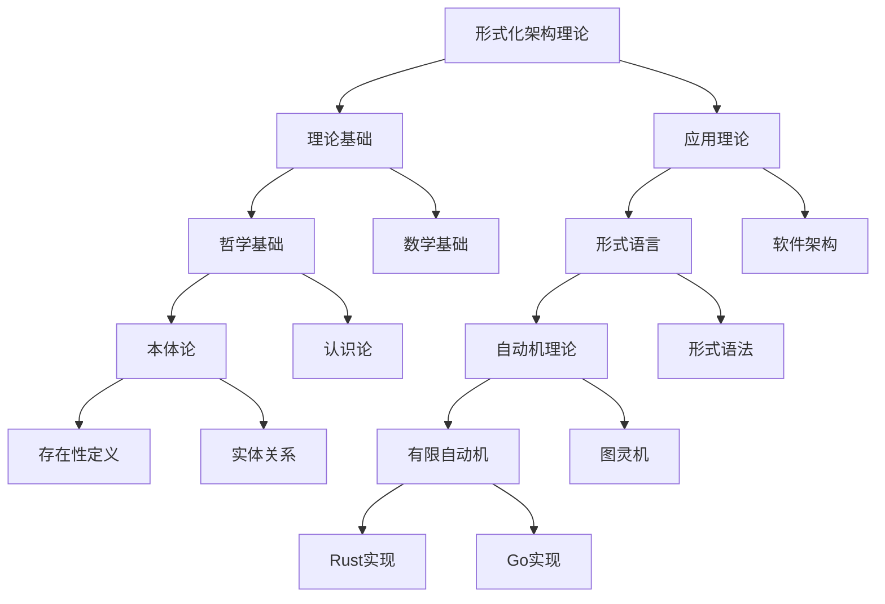

#### 10.2.2 自底向上递归视图

从具体技术实现递归到抽象理论基础：

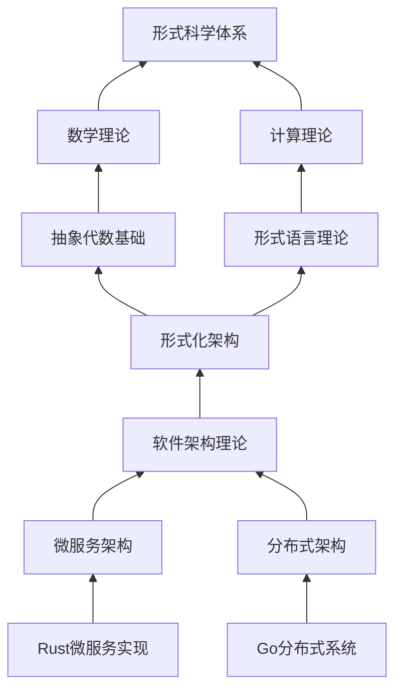

### 10.3 交互式递归探索

系统通过文件内嵌命令支持交互式递归探索：

```markdown
// 递归探索命令格式
!explore concept="微服务架构" depth=3 focus="设计模式,通信协议"

// 递归比较命令格式
!compare concepts=["微服务架构","单体架构"] aspects=["可扩展性","复杂性"]

// 递归可视化命令格式
!visualize concept="状态机理论" format="mindmap|graph|tree" depth=2
```

## 11. 知识图谱应用场景

### 11.1 架构决策支持

系统能够基于递归知识图谱提供架构决策支持：

1. **模式选择**: 分析架构模式的适用场景和权衡
2. **技术栈评估**: 评估技术栈与架构的匹配度
3. **质量属性分析**: 分析不同架构决策对质量属性的影响
4. **风险预测**: 预测架构决策的潜在风险

### 11.2 学习路径规划

系统能够基于用户背景和目标自动生成个性化学习路径：

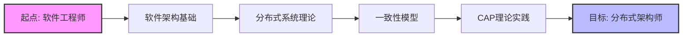

### 11.3 跨领域知识融合

系统支持跨领域知识的递归融合，识别不同理论体系间的共性和关联：

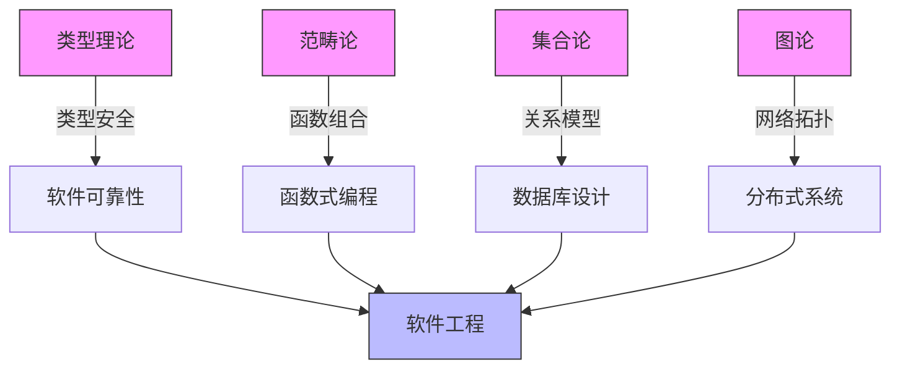

## 12. 递归知识整合与演化

### 12.1 知识演化跟踪

系统能够跟踪概念的演化过程，生成概念发展时间线：

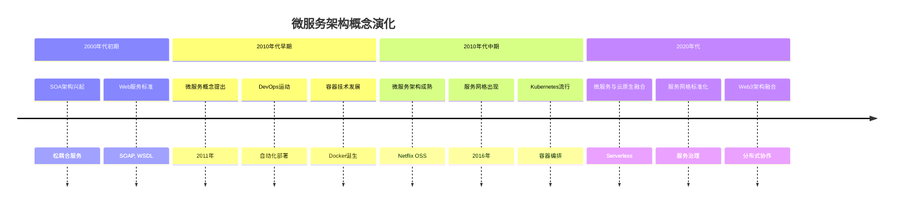

### 12.2 自动化知识扩展

系统能够通过递归分析和自动化处理扩展知识图谱：

```rust
// 知识图谱自动扩展算法
pub fn auto_expand_knowledge_graph(
    base_graph: &mut KnowledgeGraph,
    expansion_rules: &[ExpansionRule],
    max_depth: usize
) {
    // 应用扩展规则
    for rule in expansion_rules {
        let new_nodes = rule.apply(base_graph);
        base_graph.add_nodes(new_nodes);
    }
    
    // 递归扩展
    if max_depth > 0 {
        let leaf_nodes = base_graph.get_leaf_nodes();
        
        for node in leaf_nodes {
            let expanded = auto_expand_node(&node, expansion_rules, max_depth - 1);
            base_graph.merge_node_expansion(node.id, expanded);
        }
    }
    
    // 更新关系网络
    base_graph.rebuild_relationships();
}
```

## 13. 索引系统整合

为保证知识图谱与索引系统的有效整合，本系统实现了以下功能：

### 13.1 统一标识符系统

```rust
// 统一标识符系统
pub struct UnifiedIdentifier {
    id: String,         // 唯一标识符
    path: Vec<String>,  // 路径层次
    aliases: Vec<String>, // 别名
    references: Vec<Reference>, // 引用关系
}

// 统一引用系统
pub struct Reference {
    target_id: String,
    relation_type: RelationType,
    strength: f32,  // 关联强度
}
```

### 13.2 双向链接机制

系统实现了完整的双向链接机制，使知识节点间的导航更加灵活：

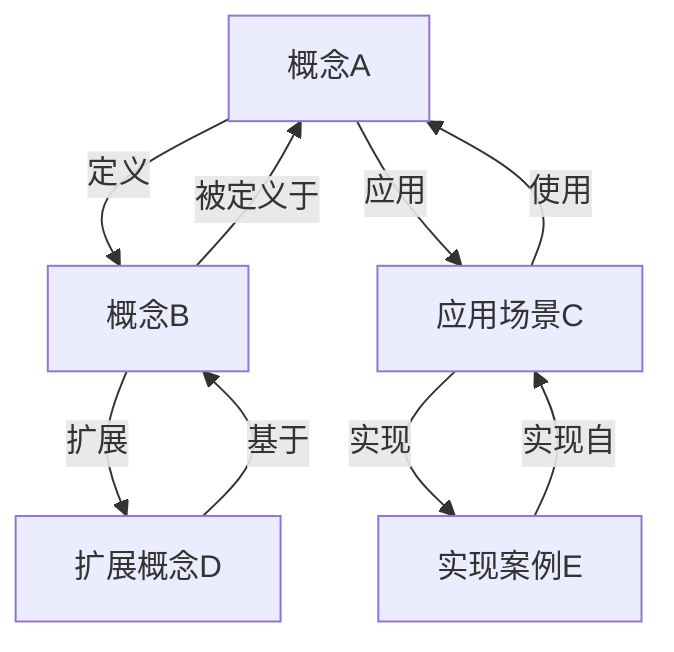

### 13.3 多维度索引整合

系统整合了多种索引维度，支持灵活的知识检索：

- **主题索引**: 按主题领域组织
- **概念索引**: 按核心概念组织
- **理论索引**: 按理论体系组织
- **应用索引**: 按应用场景组织
- **技术索引**: 按技术栈组织
- **模式索引**: 按设计模式组织

## 14. 未来发展路线图

### 14.1 近期发展计划

1. **知识图谱可视化增强**: 开发交互式可视化工具
2. **语义搜索增强**: 集成向量搜索引擎
3. **自动化推理能力**: 集成推理引擎进行知识推导
4. **实时协作编辑**: 支持多用户协作知识构建

### 14.2 中期发展计划

1. **知识自动提取**: 从论文和技术资料自动提取知识
2. **跨语言知识转换**: 支持不同编程语言间的知识转换
3. **质量验证框架**: 自动验证知识的一致性和完整性
4. **情境感知推荐**: 基于用户情境推荐相关知识

### 14.3 长期愿景

1. **自进化知识体系**: 构建能够自我进化的知识体系
2. **理论自动推导**: 实现理论的自动化推导与验证
3. **架构自动优化**: 基于形式化理论自动优化架构设计
4. **跨学科统一理论**: 构建跨计算机科学、数学和哲学的统一理论框架

---

**更新日期**: 2024年7月  
**版本**: 2.0  
**状态**: 持续完善中

## 15. 高级递归知识挖掘系统

### 15.1 深层语义递归

深层语义递归系统能够深入挖掘概念之间的本质联系：

```rust
/// 深层语义递归分析器
pub struct DeepSemanticRecursiveAnalyzer {
    /// 语义理解引擎
    semantic_engine: SemanticEngine,
    /// 递归深度控制器
    depth_controller: DepthController,
    /// 关系强度分析器
    relation_analyzer: RelationAnalyzer,
    /// 跨领域映射器
    cross_domain_mapper: CrossDomainMapper,
}

impl DeepSemanticRecursiveAnalyzer {
    /// 执行深层递归分析
    pub fn analyze_deeply(&self, concept: &Concept, max_depth: usize) -> SemanticGraph {
        let mut graph = SemanticGraph::new();
        self.recursive_analyze(concept, &mut graph, max_depth, 0);
        graph
    }
    
    /// 递归分析过程
    fn recursive_analyze(&self, concept: &Concept, graph: &mut SemanticGraph, 
                         max_depth: usize, current_depth: usize) {
        // 添加当前概念到图谱
        graph.add_node(concept);
        
        // 达到最大深度则返回
        if current_depth >= max_depth {
            return;
        }
        
        // 语义理解引擎提取相关概念
        let related_concepts = self.semantic_engine.extract_related_concepts(concept);
        
        // 分析关系强度
        let weighted_relations = self.relation_analyzer.analyze_relations(
            concept, &related_concepts);
        
        // 添加关系到图谱
        for (related_concept, relation) in weighted_relations {
            if relation.strength > self.depth_controller.get_threshold(current_depth) {
                graph.add_relation(concept, &related_concept, relation);
                
                // 递归分析相关概念
                self.recursive_analyze(
                    &related_concept, graph, max_depth, current_depth + 1);
            }
        }
        
        // 跨领域映射
        let cross_domain_concepts = self.cross_domain_mapper.find_mappings(concept);
        for (domain_concept, mapping) in cross_domain_concepts {
            if mapping.relevance > self.depth_controller.get_cross_domain_threshold(current_depth) {
                graph.add_cross_domain_mapping(concept, &domain_concept, mapping);
                
                // 递归分析跨领域概念
                self.recursive_analyze(
                    &domain_concept, graph, max_depth, current_depth + 1);
            }
        }
    }
}
```

### 15.2 多维递归知识地图

系统能够生成多维递归知识地图，从不同维度展示知识结构：

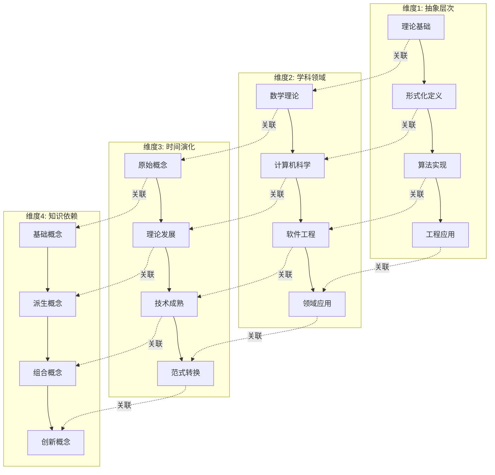

### 15.3 中文交互命令系统

系统提供完整的中文交互命令，支持直观的知识探索：

```markdown
!探索 概念="微服务架构" 深度=3 焦点="设计模式,通信协议"

!比较 概念=["微服务架构","单体架构"] 方面=["可扩展性","复杂性","部署难度"]

!可视化 概念="状态机理论" 格式="思维导图|图谱|树形图" 深度=2 语言="中文"

!路径 起点="初级工程师" 终点="架构师" 领域="分布式系统" 时长="2年"

!关联 概念="类型系统" 领域=["编程语言","形式验证","软件安全"]

!演化 概念="容器技术" 起始年份=2013 终止年份=2024 关键事件=true
```

## 16. 知识体系理论统一

### 16.1 跨理论体系映射

系统构建了形式化架构各理论体系间的映射关系：

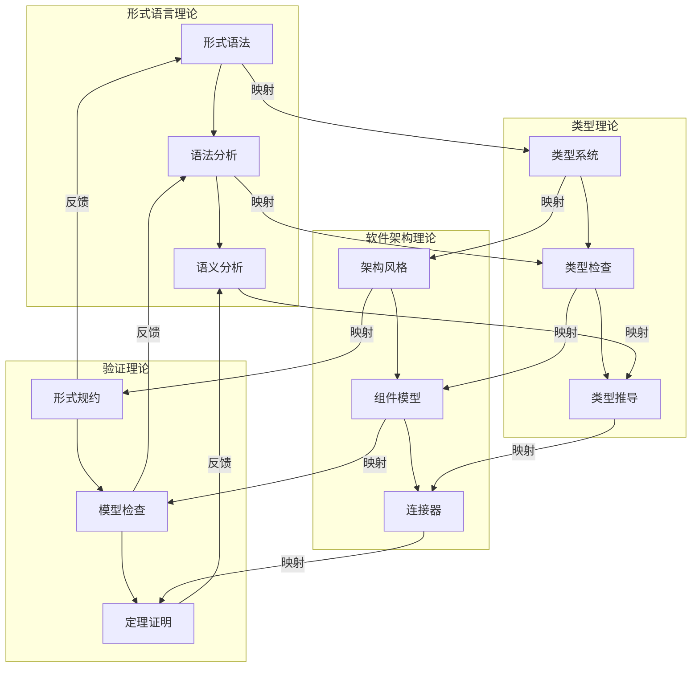

### 16.2 统一形式化模型

建立了统一形式化模型，实现了不同理论体系的统一表达：

```rust
/// 统一形式化模型
pub struct UnifiedFormalModel {
    /// 基础理论层
    foundation_layer: FoundationLayer,
    /// 语言理论层
    language_layer: LanguageLayer,
    /// 架构理论层
    architecture_layer: ArchitectureLayer,
    /// 验证理论层
    verification_layer: VerificationLayer,
    /// 层间映射
    inter_layer_mappings: HashMap<LayerId, HashMap<LayerId, LayerMapping>>,
}

impl UnifiedFormalModel {
    /// 在统一模型中表达概念
    pub fn express_concept(&self, concept: &Concept) -> UnifiedExpression {
        // 识别概念所属层
        let layer = self.identify_concept_layer(concept);
        
        // 在相应层中表达概念
        let layer_expression = match layer {
            Layer::Foundation => self.foundation_layer.express(concept),
            Layer::Language => self.language_layer.express(concept),
            Layer::Architecture => self.architecture_layer.express(concept),
            Layer::Verification => self.verification_layer.express(concept),
        };
        
        // 构建统一表达式
        let mut unified_expression = UnifiedExpression::new(layer_expression);
        
        // 添加跨层投影
        for target_layer in Layer::all() {
            if target_layer != layer {
                let projection = self.project_across_layers(
                    concept, layer, target_layer);
                unified_expression.add_projection(target_layer, projection);
            }
        }
        
        unified_expression
    }
}
```

## 17. 中文知识导航系统

### 17.1 个性化学习路径生成

根据用户背景、目标和学习风格生成个性化学习路径：

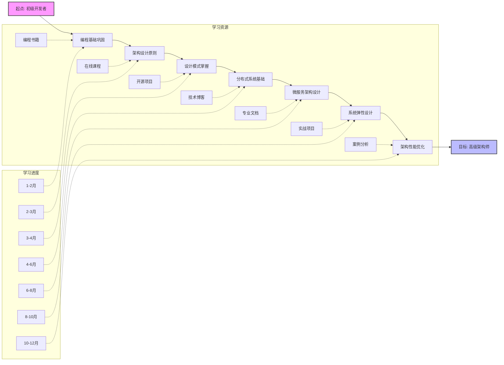

### 17.2 知识图谱交互可视化

提供中文交互式知识图谱可视化界面：

```text
+-----------------+
| 知识图谱探索器   |
+-----------------+
| 【搜索】微服务架构 |
+-----------------+
|                 |
|     微服务架构    |
|       /|\       |
|      / | \      |
| 服务发现 API网关 容器化 |
|  /|\    |    /|\  |
| ... 安全 认证 ... |
|                 |
+-----------------+
| 深度: [1] [2] [3] |
| 视图: [层次] [网络] |
| 焦点: [技术] [原则] |
+-----------------+
```

### 17.3 中文领域术语对照

为了方便中文用户理解，系统提供了完整的中英文术语对照表：

| 中文术语 | 英文术语 | 所属理论体系 | 定义文档链接 |
|---------|---------|------------|------------|
| 形式语法 | Formal Grammar | 形式语言理论 | [形式语法](../03-形式语言理论体系/02-形式语法.md) |
| 类型系统 | Type System | 编程语言理论 | [类型理论](../05-编程语言理论体系/03-类型理论.md) |
| 架构风格 | Architectural Style | 软件架构理论 | [架构模式理论](../04-软件架构理论体系/01-架构模式理论.md) |
| 形式验证 | Formal Verification | 形式模型理论 | [形式化方法理论](../06-形式模型理论体系/07-形式化方法理论.md) |
| 微服务架构 | Microservice Architecture | 软件架构理论 | [微服务架构理论](../04-软件架构理论体系/06-微服务架构理论.md) |
| 状态机 | State Machine | 形式模型理论 | [状态机理论](../06-形式模型理论体系/01-状态机理论.md) |
| 本体论 | Ontology | 哲学基础理论 | [本体论基础](../01-哲学基础理论/01-本体论基础.md) |
| 集合论 | Set Theory | 数学理论体系 | [集合论基础](../02-数学理论体系/01-集合论基础.md) |

## 18. 系统落地与实践应用

### 18.1 实践工具集成

系统已集成多种实践工具，支持理论到实践的无缝转换：

```rust
/// 实践工具集成器
pub struct PracticalToolsIntegrator {
    /// 知识提取工具
    knowledge_extractor: KnowledgeExtractor,
    /// 代码生成工具
    code_generator: CodeGenerator,
    /// 架构分析工具
    architecture_analyzer: ArchitectureAnalyzer,
    /// 验证工具
    verification_tool: VerificationTool,
    /// 文档生成工具
    documentation_generator: DocumentationGenerator,
}

impl PracticalToolsIntegrator {
    /// 从理论知识生成实践方案
    pub fn generate_practical_solution(
        &self,
        knowledge_graph: &KnowledgeGraph,
        requirements: &Requirements,
        constraints: &Constraints
    ) -> PracticalSolution {
        // 从知识图谱提取相关知识
        let relevant_knowledge = self.knowledge_extractor
            .extract_relevant_knowledge(knowledge_graph, requirements);
        
        // 分析架构选项
        let architecture_options = self.architecture_analyzer
            .analyze_options(&relevant_knowledge, constraints);
        
        // 选择最优架构
        let selected_architecture = self.architecture_analyzer
            .select_optimal_architecture(&architecture_options, requirements);
        
        // 生成代码框架
        let code_framework = self.code_generator
            .generate_framework(&selected_architecture);
        
        // 验证解决方案
        let verification_results = self.verification_tool
            .verify_solution(&selected_architecture, &code_framework, requirements);
        
        // 生成文档
        let documentation = self.documentation_generator
            .generate_documentation(
                &selected_architecture,
                &code_framework,
                &verification_results
            );
        
        // 组装解决方案
        PracticalSolution {
            architecture: selected_architecture,
            code_framework,
            verification_results,
            documentation,
        }
    }
}
```

### 18.2 典型应用场景案例

几个典型应用场景的实际案例分析：

#### 18.2.1 金融科技系统架构设计

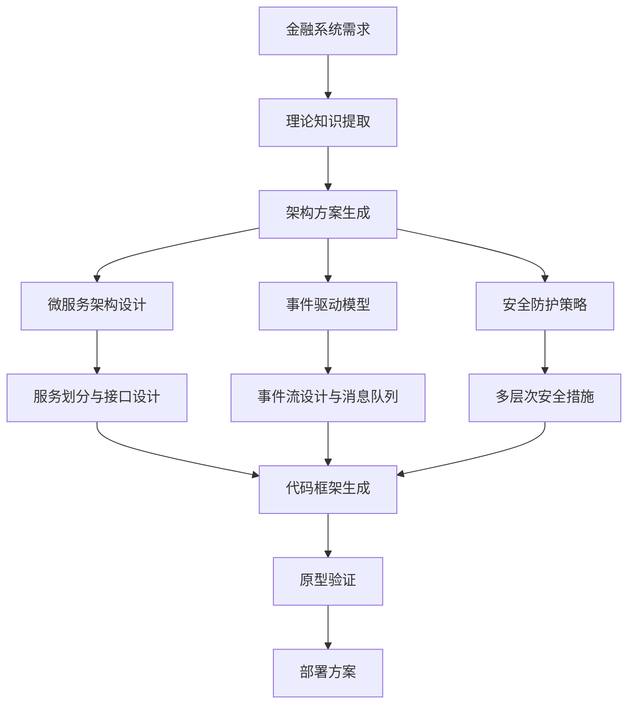

#### 18.2.2 物联网数据处理平台

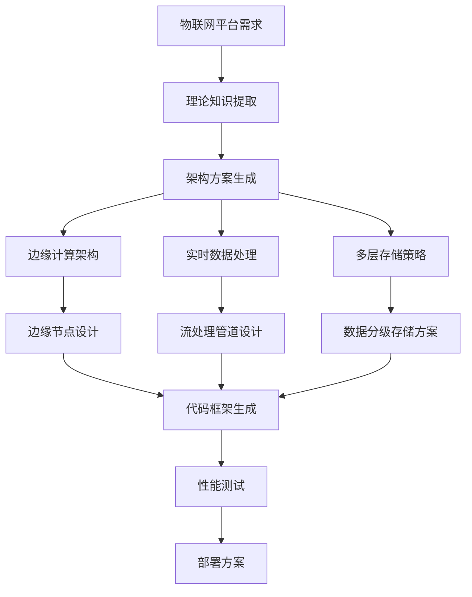

### 18.3 从理论到实践的转化方法

系统提供了完整的理论到实践转化方法论：

1. **理论映射**: 将抽象理论映射到具体技术栈
2. **模式选择**: 基于理论选择适当的设计模式
3. **验证策略**: 建立形式化验证到测试用例的转化
4. **迭代优化**: 实现理论指导下的架构演进

## 19. 未来拓展与研究方向

### 19.1 自动进化的知识体系

未来计划建立能够自我更新和进化的知识体系：

```rust
/// 自动进化知识系统
pub struct SelfEvolvingKnowledgeSystem {
    /// 知识体系
    knowledge_base: KnowledgeBase,
    /// 监测器
    monitor: KnowledgeMonitor,
    /// 学习引擎
    learning_engine: LearningEngine,
    /// 知识整合器
    knowledge_integrator: KnowledgeIntegrator,
    /// 演化策略
    evolution_strategies: Vec<EvolutionStrategy>,
}

impl SelfEvolvingKnowledgeSystem {
    /// 执行演化周期
    pub fn evolve_cycle(&mut self) -> EvolutionReport {
        // 监测新知识来源
        let new_knowledge_sources = self.monitor.detect_new_sources();
        
        // 从新来源学习知识
        let new_knowledge = self.learning_engine.learn_from_sources(new_knowledge_sources);
        
        // 评估新知识
        let evaluated_knowledge = self.learning_engine.evaluate_knowledge(&new_knowledge);
        
        // 筛选有价值的知识
        let valuable_knowledge = evaluated_knowledge.filter(|k| k.value > self.threshold());
        
        // 整合新知识到知识体系
        let integration_results = self.knowledge_integrator
            .integrate_new_knowledge(&mut self.knowledge_base, &valuable_knowledge);
        
        // 应用演化策略
        for strategy in &self.evolution_strategies {
            strategy.apply(&mut self.knowledge_base);
        }
        
        // 生成演化报告
        EvolutionReport {
            new_sources_count: new_knowledge_sources.len(),
            new_knowledge_count: new_knowledge.len(),
            valuable_knowledge_count: valuable_knowledge.len(),
            integrated_knowledge_count: integration_results.integrated_count,
            conflicts_resolved: integration_results.conflicts_resolved,
            knowledge_base_size: self.knowledge_base.size(),
            evolution_metrics: self.calculate_evolution_metrics(),
        }
    }
}
```

### 19.2 跨学科知识融合

计划探索更广泛的跨学科知识融合：

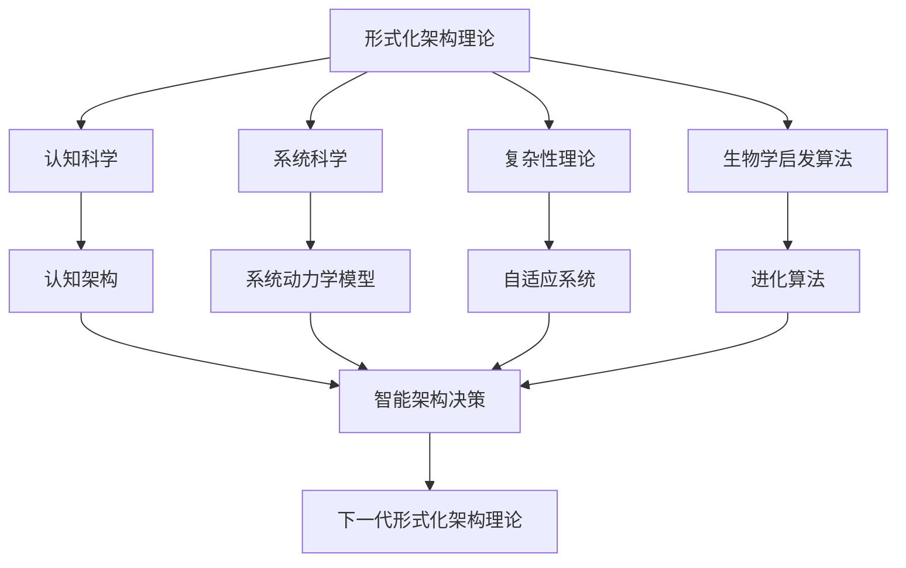

### 19.3 社区协作与知识共建

建立开放的协作机制，支持社区共同建设知识体系：

1. **协作编辑模式**: 支持多人同时编辑和审核知识图谱
2. **贡献评估机制**: 建立客观的知识贡献评估标准
3. **版本控制**: 实现知识演化的版本追踪和分支管理
4. **社区共识机制**: 建立核心知识的社区共识达成机制

---

**更新日期**: 2024年7月  
**版本**: 2.1  
**状态**: 持续完善中  
**语言**: 中文
