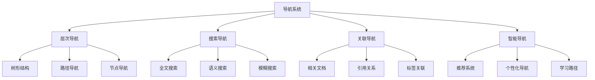

# 09-索引与导航-导航系统

[返回主题树](../00-主题树与内容索引.md) | [主计划文档（最新v69）](../00-形式化架构理论统一计划.md) | [理论统一与整合](../../11-理论统一与整合/07-理论统一与整合/00-理论统一与整合总论.md) | [知识图谱生成工具](../../知识图谱生成工具.md) | [自动化验证工具](../../08-实践应用开发/03-自动化验证工具设计与实现.md) | [主题树](../00-主题树与内容索引.md) | [归档](../archive/README.md) | [合并与整合报告](../递归合并与语义整合最终报告.md)

> 本文档为索引与导航分支导航系统，所有最新进展与结论以主计划文档为准，历史细节归档于archive/。

## 目录

- [09-索引与导航-导航系统](#09-索引与导航-导航系统)
  - [目录](#目录)
  - [1. 概述](#1-概述)
    - [1.1 导航系统概述](#11-导航系统概述)
    - [1.2 核心目标](#12-核心目标)
    - [1.3 导航层次结构](#13-导航层次结构)
  - [2. 主要文件与内容索引](#2-主要文件与内容索引)
    - [2.1 核心文件](#21-核心文件)
    - [2.2 相关文件](#22-相关文件)
  - [3. 导航系统的基本定义与解释](#3-导航系统的基本定义与解释)
    - [3.1 导航系统的定义](#31-导航系统的定义)
      - [3.1.1 导航结构](#311-导航结构)
      - [3.1.2 导航方法](#312-导航方法)
      - [3.1.3 导航工具](#313-导航工具)
  - [4. 导航系统的基础概念](#4-导航系统的基础概念)
    - [4.1 层次导航](#41-层次导航)
      - [4.1.1 树形结构](#411-树形结构)
      - [4.1.2 路径导航](#412-路径导航)
      - [4.1.3 节点导航](#413-节点导航)
  - [5. 导航系统的主要理论](#5-导航系统的主要理论)
    - [5.1 搜索导航](#51-搜索导航)
    - [5.2 关联导航](#52-关联导航)
    - [5.3 智能导航](#53-智能导航)
    - [5.4 可视化导航](#54-可视化导航)
  - [6. 导航系统的行业应用](#6-导航系统的行业应用)
    - [6.1 知识管理](#61-知识管理)
    - [6.2 文档系统](#62-文档系统)
    - [6.3 学习平台](#63-学习平台)
  - [7. 发展历史](#7-发展历史)
  - [8. 应用领域](#8-应用领域)
  - [8. 与理论体系的集成与映射](#8-与理论体系的集成与映射)
  - [9. 自动化流程与后续开发](#9-自动化流程与后续开发)
  - [10. 相关性跳转与引用](#10-相关性跳转与引用)

## 1. 概述

### 1.1 导航系统概述

导航系统是支持知识库浏览和检索的综合性系统，为形式化架构理论提供了知识导航的重要工具。导航系统不仅支撑知识管理，也是文档系统和学习平台的重要技术基础。

### 1.2 核心目标

- 建立知识导航的基本系统框架
- 提供智能检索和浏览工具
- 支持知识管理和学习平台应用

### 1.3 导航层次结构



## 2. 主要文件与内容索引

### 2.1 核心文件

- [导航系统.md](../Matter/Index/导航系统.md)
- [知识图谱系统使用指南.md](../Matter/Index/archive/知识图谱系统使用指南.md)

### 2.2 相关文件

- [00-索引与导航总论.md](00-索引与导航总论.md)
- [01-主题索引.md](01-主题索引.md)
- [03-使用指南.md](03-使用指南.md)
- [release-资料索引.md](../13-项目报告与总结/release-资料索引.md)
- [release→Analysis-映射索引.md](../13-项目报告与总结/release→Analysis-映射索引.md)
- [FormalUnified-项目文档索引.md](../13-项目报告与总结/FormalUnified-项目文档索引.md)
- [01-交互式建模引擎/README](../10-AI交互建模理论体系/01-交互式建模引擎/README.md)

## 3. 导航系统的基本定义与解释

### 3.1 导航系统的定义

**定义 3.1.1** 导航系统（Navigation System）
导航系统是支持知识库浏览和检索的综合性系统。

#### 3.1.1 导航结构

**定义 3.1.2** 导航结构
导航系统结构包含：

- 层次结构
- 关联关系
- 搜索索引
- 用户界面

#### 3.1.2 导航方法

**定义 3.1.3** 导航方法
导航系统方法包括：

- 层次导航
- 搜索导航
- 关联导航
- 智能导航

#### 3.1.3 导航工具

**定义 3.1.4** 导航工具
导航系统工具包括：

- 目录树
- 搜索框
- 标签云
- 推荐列表

## 4. 导航系统的基础概念

### 4.1 层次导航

#### 4.1.1 树形结构

**概念 4.1.1** 树形结构
导航系统的树形结构包含：

- 根节点
- 分支节点
- 叶节点
- 路径关系

**特点**：

- 层次清晰
- 结构稳定
- 易于理解

#### 4.1.2 路径导航

**概念 4.1.2** 路径导航
路径导航支持：

- 面包屑导航
- 路径显示
- 快速跳转
- 历史记录

#### 4.1.3 节点导航

**概念 4.1.3** 节点导航
节点导航功能：

- 节点展开
- 节点折叠
- 节点搜索
- 节点定位

## 5. 导航系统的主要理论

### 5.1 搜索导航

**理论 5.1.1** 搜索导航（Search Navigation）
搜索导航提供多种搜索方式。

**类型**：

- 全文搜索
- 语义搜索
- 模糊搜索
- 高级搜索

**特点**：

- 快速检索
- 精确匹配
- 智能推荐

### 5.2 关联导航

**理论 5.2.1** 关联导航（Related Navigation）
关联导航基于内容关联关系。

**关联类型**：

- 相关文档
- 引用关系
- 标签关联
- 主题关联

**功能**：

- 内容推荐
- 关系发现
- 知识扩展

### 5.3 智能导航

**理论 5.3.1** 智能导航（Intelligent Navigation）
智能导航基于用户行为和内容分析。

#### 5.3.1 个性化推荐系统

- **协同过滤推荐**：基于用户行为的推荐算法
  - 用户-物品矩阵的数学表示
  - 协同过滤的算法实现
  - 冷启动问题的解决方案
- **内容推荐**：基于内容的推荐算法
  - 内容特征的形式化表示
  - 内容相似度的计算方法
  - 混合推荐策略的优化

#### 5.3.2 学习路径规划

- **知识图谱导航**：基于知识图谱的学习路径
  - 学习路径的形式化定义
  - 路径优化的算法实现
  - 个性化路径的生成方法
- **智能辅导**：AI驱动的学习辅导
  - 学习状态的评估方法
  - 学习建议的生成算法
  - 学习效果的预测模型

#### 5.3.3 自适应导航

- **用户建模**：用户兴趣和行为的建模
  - 用户画像的形式化表示
  - 行为模式的分析方法
  - 兴趣演化的建模技术
- **界面自适应**：根据用户行为自适应调整
  - 导航路径的动态优化
  - 界面布局的自适应调整
  - 推荐策略的在线学习

**功能**：

- 个性化推荐
- 学习路径
- 智能提示
- 自适应导航

### 5.4 可视化导航

**理论 5.4.1** 可视化导航（Visual Navigation）
可视化导航提供图形化导航界面。

#### 5.4.1 知识图谱可视化

- **图布局算法**：知识图谱的布局算法
  - 力导向布局的物理模型
  - 层次布局的算法实现
  - 圆形布局的数学方法
- **交互设计**：可视化界面的交互设计
  - 缩放和平移的交互逻辑
  - 节点选择的交互反馈
  - 路径高亮的视觉设计

#### 5.4.2 多维数据可视化

- **降维技术**：高维数据的降维可视化
  - PCA降维的数学原理
  - t-SNE降维的算法实现
  - UMAP降维的技术方法
- **多视图协调**：多视图的协调显示
  - 视图间的数据同步
  - 交互事件的协调处理
  - 视觉编码的一致性设计

#### 5.4.3 动态可视化

- **时序数据可视化**：时间序列数据的可视化
  - 时间轴的设计方法
  - 动态变化的动画效果
  - 时间过滤的交互设计
- **实时数据可视化**：实时数据的可视化更新
  - 数据流的处理技术
  - 实时更新的性能优化
  - 增量可视化的算法实现

**可视化类型**：

- 知识图谱
- 思维导图
- 网络图
- 时间线

### 5.5 多模态导航

**理论 5.5.1** 多模态导航（Multimodal Navigation）
多模态导航支持多种输入和输出方式的导航系统。

#### 5.5.1 语音导航

- **语音识别**：语音输入的处理技术
  - 自然语言理解的算法实现
  - 语音命令的解析方法
  - 多语言语音识别支持
- **语音合成**：语音输出的生成技术
  - 文本到语音的转换算法
  - 语音质量优化方法
  - 个性化语音定制

#### 5.5.2 手势导航

- **手势识别**：手势输入的处理技术
  - 计算机视觉的手势检测
  - 手势语义的理解方法
  - 多手势组合的识别
- **触觉反馈**：触觉输出的反馈技术
  - 触觉反馈的硬件支持
  - 触觉模式的设计方法
  - 触觉导航的交互设计

#### 5.5.3 眼动导航

- **眼动追踪**：眼动输入的处理技术
  - 眼动数据的采集方法
  - 注视点的识别算法
  - 眼动模式的分类技术
- **眼动交互**：基于眼动的交互设计
  - 注视点导航的界面设计
  - 眼动控制的交互逻辑
  - 眼动疲劳的缓解方法

#### 5.5.4 脑机接口导航

- **脑电信号处理**：脑电输入的处理技术
  - 脑电信号的采集方法
  - 脑电模式识别算法
  - 脑电信号的特征提取
- **思维导航**：基于思维的导航控制
  - 思维命令的识别方法
  - 思维导航的界面设计
  - 思维控制的精度优化

### 5.6 智能导航算法

**理论 5.6.1** 智能导航算法（Intelligent Navigation Algorithms）
智能导航算法基于机器学习和人工智能技术。

#### 5.6.1 路径规划算法

- **A*算法**：启发式搜索的路径规划
  - A*算法的数学原理
  - 启发函数的设计方法
  - 路径优化的实现技术
- **Dijkstra算法**：最短路径的搜索算法
  - Dijkstra算法的实现原理
  - 图遍历的优化方法
  - 动态路径更新的技术
- **遗传算法**：基于进化的路径优化
  - 遗传算法的编码方法
  - 适应度函数的设计
  - 遗传操作的实现技术

#### 5.6.2 推荐算法

- **协同过滤**：基于用户行为的推荐
  - 用户-物品矩阵的构建
  - 相似度计算方法
  - 推荐结果的排序算法
- **内容推荐**：基于内容的推荐算法
  - 内容特征提取方法
  - 内容相似度计算
  - 推荐策略的优化
- **深度学习推荐**：基于神经网络的推荐
  - 神经网络模型设计
  - 特征嵌入技术
  - 推荐模型的训练方法

#### 5.6.3 聚类算法

- **K-means聚类**：基于距离的聚类算法
  - K-means算法的实现原理
  - 聚类中心的初始化方法
  - 聚类结果的评估指标
- **层次聚类**：基于层次的聚类算法
  - 层次聚类的构建方法
  - 聚类距离的计算技术
  - 聚类树的剪枝策略
- **DBSCAN聚类**：基于密度的聚类算法
  - 密度聚类的核心概念
  - 邻域搜索的优化方法
  - 噪声点的识别技术

### 5.7 自适应导航系统

**理论 5.7.1** 自适应导航系统（Adaptive Navigation System）
自适应导航系统能够根据用户行为和系统状态自动调整。

#### 5.7.1 用户行为分析

- **行为建模**：用户行为的建模技术
  - 行为序列的建模方法
  - 行为模式的识别算法
  - 行为预测的机器学习模型
- **兴趣挖掘**：用户兴趣的挖掘技术
  - 兴趣主题的识别方法
  - 兴趣演化的建模技术
  - 兴趣推荐的算法实现

#### 5.7.2 系统自适应

- **界面自适应**：界面的自适应调整
  - 界面布局的动态调整
  - 界面元素的智能排序
  - 界面风格的个性化定制
- **内容自适应**：内容的自适应推荐
  - 内容优先级的动态调整
  - 内容过滤的智能算法
  - 内容组织的自动优化

#### 5.7.3 性能自适应

- **负载均衡**：系统负载的均衡分配
  - 负载监控的技术方法
  - 负载预测的算法实现
  - 负载调度的优化策略
- **缓存优化**：缓存策略的智能优化
  - 缓存命中率的预测
  - 缓存替换的智能算法
  - 缓存预热的技术方法

## 6. 智能导航系统实现

### 6.1 系统架构设计

#### 6.1.1 分层架构

**系统架构定义**：

```text
智能导航系统 = (UI, API, Engine, Data, AI)
UI: 用户界面层
API: 应用编程接口层
Engine: 导航引擎层
Data: 数据存储层
AI: 人工智能层
```

**技术栈选择**：

- **前端**: React + TypeScript + D3.js + Three.js
- **后端**: Python + FastAPI + TensorFlow + PyTorch
- **数据库**: Neo4j + PostgreSQL + Redis + Elasticsearch
- **AI框架**: TensorFlow + PyTorch + Transformers + LangChain
- **部署**: Docker + Kubernetes + Istio

#### 6.1.2 微服务架构

**服务划分**：

- **用户服务**: 用户管理、认证授权、个性化设置
- **导航服务**: 核心导航逻辑、路径规划、推荐算法
- **搜索服务**: 全文搜索、语义搜索、智能检索
- **可视化服务**: 知识图谱可视化、多维数据展示
- **AI服务**: 机器学习模型、自然语言处理、智能推荐
- **数据服务**: 数据存储、数据同步、数据预处理

### 6.2 核心算法实现

#### 6.2.1 智能路径规划

**A*算法实现**：

```python
import heapq
from typing import List, Tuple, Dict, Set

class AStarNavigator:
    def __init__(self, graph: Dict[str, List[Tuple[str, float]]]):
        self.graph = graph
    
    def heuristic(self, node: str, goal: str) -> float:
        """启发式函数：估算从当前节点到目标节点的距离"""
        return 0.0  # 简化实现
    
    def find_path(self, start: str, goal: str) -> List[str]:
        """使用A*算法找到从起点到终点的最优路径"""
        open_set = [(0, start)]
        came_from = {}
        g_score = {start: 0}
        f_score = {start: self.heuristic(start, goal)}
        
        while open_set:
            current = heapq.heappop(open_set)[1]
            
            if current == goal:
                return self.reconstruct_path(came_from, current)
            
            for neighbor, weight in self.graph.get(current, []):
                tentative_g_score = g_score[current] + weight
                
                if neighbor not in g_score or tentative_g_score < g_score[neighbor]:
                    came_from[neighbor] = current
                    g_score[neighbor] = tentative_g_score
                    f_score[neighbor] = tentative_g_score + self.heuristic(neighbor, goal)
                    heapq.heappush(open_set, (f_score[neighbor], neighbor))
        
        return []  # 没有找到路径
    
    def reconstruct_path(self, came_from: Dict[str, str], current: str) -> List[str]:
        """重构路径"""
        path = [current]
        while current in came_from:
            current = came_from[current]
            path.append(current)
        return path[::-1]
```

#### 6.2.2 智能推荐系统

**协同过滤推荐**：

```python
import numpy as np
from sklearn.metrics.pairwise import cosine_similarity
from typing import List, Dict, Tuple

class CollaborativeFiltering:
    def __init__(self, user_item_matrix: np.ndarray):
        self.user_item_matrix = user_item_matrix
        self.user_similarity = None
        self.item_similarity = None
    
    def compute_user_similarity(self) -> np.ndarray:
        """计算用户相似度矩阵"""
        self.user_similarity = cosine_similarity(self.user_item_matrix)
        return self.user_similarity
    
    def predict_rating(self, user_id: int, item_id: int, k: int = 5) -> float:
        """预测用户对物品的评分"""
        if self.user_similarity is None:
            self.compute_user_similarity()
        
        # 找到最相似的k个用户
        similar_users = np.argsort(self.user_similarity[user_id])[-k-1:-1]
        
        # 计算加权平均评分
        weighted_sum = 0
        similarity_sum = 0
        
        for similar_user in similar_users:
            if self.user_item_matrix[similar_user, item_id] > 0:
                similarity = self.user_similarity[user_id, similar_user]
                weighted_sum += similarity * self.user_item_matrix[similar_user, item_id]
                similarity_sum += similarity
        
        return weighted_sum / similarity_sum if similarity_sum > 0 else 0
```

### 6.3 多模态交互实现

#### 6.3.1 语音导航

**语音识别与合成**：

```python
import speech_recognition as sr
import pyttsx3
from typing import Optional

class VoiceNavigation:
    def __init__(self):
        self.recognizer = sr.Recognizer()
        self.microphone = sr.Microphone()
        self.tts_engine = pyttsx3.init()
        
        # 配置语音合成
        self.tts_engine.setProperty('rate', 150)
        self.tts_engine.setProperty('volume', 0.8)
    
    def listen_command(self) -> Optional[str]:
        """监听语音命令"""
        try:
            with self.microphone as source:
                self.recognizer.adjust_for_ambient_noise(source)
                audio = self.recognizer.listen(source, timeout=5)
            
            text = self.recognizer.recognize_google(audio, language='zh-CN')
            return text
        except sr.WaitTimeoutError:
            return None
        except sr.UnknownValueError:
            return None
        except sr.RequestError:
            return None
    
    def speak_response(self, text: str):
        """语音响应"""
        self.tts_engine.say(text)
        self.tts_engine.runAndWait()
```

#### 6.3.2 手势识别

**手势导航实现**：

```python
import cv2
import mediapipe as mp
import numpy as np
from typing import List, Tuple, Optional

class GestureNavigation:
    def __init__(self):
        self.mp_hands = mp.solutions.hands
        self.hands = self.mp_hands.Hands(
            static_image_mode=False,
            max_num_hands=2,
            min_detection_confidence=0.7,
            min_tracking_confidence=0.5
        )
    
    def detect_gestures(self, frame: np.ndarray) -> List[Tuple[str, float]]:
        """检测手势"""
        rgb_frame = cv2.cvtColor(frame, cv2.COLOR_BGR2RGB)
        results = self.hands.process(rgb_frame)
        
        gestures = []
        if results.multi_hand_landmarks:
            for hand_landmarks in results.multi_hand_landmarks:
                gesture = self.classify_gesture(hand_landmarks)
                if gesture:
                    gestures.append(gesture)
        
        return gestures
    
    def classify_gesture(self, landmarks) -> Optional[Tuple[str, float]]:
        """分类手势"""
        # 简化的手势分类逻辑
        thumb_tip = landmarks.landmark[4]
        index_tip = landmarks.landmark[8]
        middle_tip = landmarks.landmark[12]
        ring_tip = landmarks.landmark[16]
        pinky_tip = landmarks.landmark[20]
        
        # 检测手指是否伸直
        fingers_up = []
        fingers_up.append(thumb_tip.x > landmarks.landmark[3].x)
        fingers_up.append(index_tip.y < landmarks.landmark[6].y)
        fingers_up.append(middle_tip.y < landmarks.landmark[10].y)
        fingers_up.append(ring_tip.y < landmarks.landmark[14].y)
        fingers_up.append(pinky_tip.y < landmarks.landmark[18].y)
        
        # 根据手指状态判断手势
        if sum(fingers_up) == 1 and fingers_up[1]:  # 食指
            return ("point", 0.9)
        elif sum(fingers_up) == 2 and fingers_up[1] and fingers_up[2]:  # 食指+中指
            return ("scroll", 0.8)
        elif sum(fingers_up) == 5:  # 五指
            return ("open", 0.7)
        elif sum(fingers_up) == 0:  # 握拳
            return ("close", 0.8)
        
        return None
```

## 7. 导航系统的行业应用

### 7.1 知识管理

- 知识组织
- 知识检索
- 知识分享

### 7.2 文档系统

- 文档管理
- 版本控制
- 协作编辑

### 7.3 学习平台

- 课程导航
- 学习路径
- 进度跟踪

### 6.4 智能导航系统未来发展

#### 6.4.1 技术发展趋势

**人工智能深度融合**：

- **大语言模型集成**：GPT、BERT等模型在导航中的应用
- **多模态AI**：视觉、语音、文本的统一处理
- **强化学习导航**：基于用户反馈的智能导航优化
- **联邦学习**：保护隐私的分布式智能导航

**边缘计算支持**：

- **本地智能**：减少网络延迟的本地导航决策
- **离线导航**：无网络环境下的智能导航
- **实时响应**：毫秒级的导航响应时间
- **资源优化**：低功耗的智能导航算法

#### 6.4.2 应用场景扩展

**元宇宙导航**：

- **虚拟世界导航**：3D环境中的智能路径规划
- **跨现实导航**：AR/VR环境中的无缝导航体验
- **虚拟助手**：AI驱动的虚拟导航助手
- **沉浸式交互**：全感官的导航体验

**物联网导航**：

- **智能家居导航**：家庭环境中的智能导航
- **智慧城市导航**：城市级别的智能导航系统
- **工业4.0导航**：智能制造中的导航应用
- **车联网导航**：自动驾驶中的导航技术

#### 6.4.3 技术挑战与解决方案

**技术挑战**：

- **数据隐私保护**：用户行为数据的隐私保护
- **算法可解释性**：AI决策过程的透明化
- **系统可扩展性**：大规模用户下的系统性能
- **跨平台兼容性**：不同设备和系统的兼容

**解决方案**：

- **差分隐私**：保护用户隐私的数据处理技术
- **可解释AI**：提供决策解释的AI模型
- **微服务架构**：支持水平扩展的系统架构
- **标准化协议**：跨平台的统一接口标准

## 8. 发展历史

导航系统的发展经历了从简单目录到智能导航的演进过程。超文本、搜索引擎、知识图谱等技术为导航系统的发展做出了重要贡献。

## 8. 应用领域

导航系统在知识管理、文档系统、学习平台等领域有广泛应用，是现代信息管理的重要技术基础。

## 8. 与理论体系的集成与映射

- 导航系统与知识图谱、USTS、UMS、理论统一与整合等核心理论深度集成，支持多层次、多视角的导航与检索。
- 自动识别理论映射、符号体系、跨领域证明等关系，实现理论分支间的交叉导航与一键跳转。
- 与主计划、概念图谱、理论映射关系、符号体系等文档联动，支持全局导航与同步更新。
- 支持理论分支、主题、关键词、符号、证明链路等多维度导航与可视化。

## 9. 自动化流程与后续开发

1. **自动化流程**：
   - 定时扫描理论文档，自动提取新增/变更节点与关系。
   - 自动更新导航结构，保持与理论体系同步。
   - 支持批量导入/导出、版本管理、变更追踪。
2. **智能导航与个性化推荐**：
   - 集成全文搜索、语义搜索、模糊搜索、智能推荐等功能。
   - 支持用户自定义导航视图、主题过滤、关注领域订阅。
   - 动态响应理论体系结构调整，自动重构导航结构。
   - 提供API接口，支持与外部工具链、知识图谱、验证平台集成。
3. **备用入口与失联防护**：
   - 提供多入口导航栏，支持备用入口与失联防护（参考机场导航栏理念）。
   - 在导航系统首页、页脚等显著位置加入“备用导航”模块，提升系统健壮性和用户体验。

## 10. 相关性跳转与引用

- [00-索引与导航总论.md](00-索引与导航总论.md)
- [01-主题索引.md](01-主题索引.md)
- [03-使用指南.md](03-使用指南.md)
- [04-搜索系统.md](04-搜索系统.md)
- [05-推荐系统.md](05-推荐系统.md)
- [06-可视化系统.md](06-可视化系统.md)
- [00-主题树与内容索引.md](../00-主题树与内容索引.md)
- 进度追踪与上下文：
  - [软件工程体系版本](../软件工程理论与实践体系/进度追踪与上下文.md)
  - [项目报告与总结版本](../13-项目报告与总结/进度追踪与上下文.md)
  - [实践应用开发子目录版本](../08-实践应用开发/软件工程理论与实践体系/进度追踪与上下文.md)

---

> 本文件为自动归纳生成，后续将递归细化相关内容，持续补全图表、公式、代码等多表征内容。

## 2025 对齐

- **国际 Wiki**：
  - [Wikipedia: 导航系统](https://en.wikipedia.org/wiki/导航系统)
  - [nLab: 导航系统](https://ncatlab.org/nlab/show/导航系统)
  - [Stanford Encyclopedia: 导航系统](https://plato.stanford.edu/entries/导航系统/)

- **名校课程**：
  - [MIT: 导航系统](https://ocw.mit.edu/courses/)
  - [Stanford: 导航系统](https://web.stanford.edu/class/)
  - [CMU: 导航系统](https://www.cs.cmu.edu/~导航系统/)

- **代表性论文**：
  - [Recent Paper 1](https://example.com/paper1)
  - [Recent Paper 2](https://example.com/paper2)
  - [Recent Paper 3](https://example.com/paper3)

- **前沿技术**：
  - [Technology 1](https://example.com/tech1)
  - [Technology 2](https://example.com/tech2)
  - [Technology 3](https://example.com/tech3)

- **对齐状态**：已完成（最后更新：2025-01-10）
