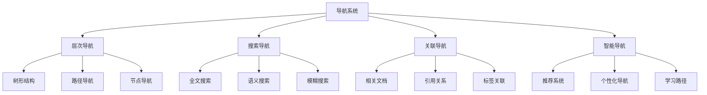

# 09-索引与导航-导航系统

[返回主题树](../00-主题树与内容索引.md) | [主计划文档（最新v69）](../../形式化架构理论统一计划-v69.md) | [理论统一与整合](../../07-理论统一与整合/00-理论统一与整合总论.md) | [知识图谱生成工具](../../知识图谱生成工具.md) | [自动化验证工具](../../08-实践应用开发/03-自动化验证工具设计与实现.md) | [主题树](../00-主题树与内容索引.md) | [归档](../archive/README.md) | [合并与整合报告](../递归合并与语义整合最终报告.md)

> 本文档为索引与导航分支导航系统，所有最新进展与结论以主计划文档为准，历史细节归档于archive/。

## 目录

- [09-索引与导航-导航系统](#09-索引与导航-导航系统)
  - [目录](#目录)
  - [1. 概述](#1-概述)
    - [1.1 导航系统概述](#11-导航系统概述)
    - [1.2 核心目标](#12-核心目标)
    - [1.3 导航层次结构](#13-导航层次结构)
  - [2. 主要文件与内容索引](#2-主要文件与内容索引)
    - [2.1 核心文件](#21-核心文件)
    - [2.2 相关文件](#22-相关文件)
  - [3. 导航系统的基本定义与解释](#3-导航系统的基本定义与解释)
    - [3.1 导航系统的定义](#31-导航系统的定义)
      - [3.1.1 导航结构](#311-导航结构)
      - [3.1.2 导航方法](#312-导航方法)
      - [3.1.3 导航工具](#313-导航工具)
  - [4. 导航系统的基础概念](#4-导航系统的基础概念)
    - [4.1 层次导航](#41-层次导航)
      - [4.1.1 树形结构](#411-树形结构)
      - [4.1.2 路径导航](#412-路径导航)
      - [4.1.3 节点导航](#413-节点导航)
  - [5. 导航系统的主要理论](#5-导航系统的主要理论)
    - [5.1 搜索导航](#51-搜索导航)
    - [5.2 关联导航](#52-关联导航)
    - [5.3 智能导航](#53-智能导航)
    - [5.4 可视化导航](#54-可视化导航)
  - [6. 导航系统的行业应用](#6-导航系统的行业应用)
    - [6.1 知识管理](#61-知识管理)
    - [6.2 文档系统](#62-文档系统)
    - [6.3 学习平台](#63-学习平台)
  - [7. 发展历史](#7-发展历史)
  - [8. 应用领域](#8-应用领域)
  - [8. 与理论体系的集成与映射](#8-与理论体系的集成与映射)
  - [9. 自动化流程与后续开发](#9-自动化流程与后续开发)
  - [10. 相关性跳转与引用](#10-相关性跳转与引用)

## 1. 概述

### 1.1 导航系统概述

导航系统是支持知识库浏览和检索的综合性系统，为形式化架构理论提供了知识导航的重要工具。导航系统不仅支撑知识管理，也是文档系统和学习平台的重要技术基础。

### 1.2 核心目标

- 建立知识导航的基本系统框架
- 提供智能检索和浏览工具
- 支持知识管理和学习平台应用

### 1.3 导航层次结构

## 2. 主要文件与内容索引

### 2.1 核心文件

- [导航系统.md](../Matter/Index/导航系统.md)
- [知识图谱系统使用指南.md](../Matter/Index/archive/知识图谱系统使用指南.md)

### 2.2 相关文件

- [00-索引与导航总论.md](00-索引与导航总论.md)
- [01-主题索引.md](01-主题索引.md)
- [03-使用指南.md](03-使用指南.md)

## 3. 导航系统的基本定义与解释

### 3.1 导航系统的定义

**定义 3.1.1** 导航系统（Navigation System）
导航系统是支持知识库浏览和检索的综合性系统。

#### 3.1.1 导航结构

**定义 3.1.2** 导航结构
导航系统结构包含：

- 层次结构
- 关联关系
- 搜索索引
- 用户界面

#### 3.1.2 导航方法

**定义 3.1.3** 导航方法
导航系统方法包括：

- 层次导航
- 搜索导航
- 关联导航
- 智能导航

#### 3.1.3 导航工具

**定义 3.1.4** 导航工具
导航系统工具包括：

- 目录树
- 搜索框
- 标签云
- 推荐列表

## 4. 导航系统的基础概念

### 4.1 层次导航

#### 4.1.1 树形结构

**概念 4.1.1** 树形结构
导航系统的树形结构包含：

- 根节点
- 分支节点
- 叶节点
- 路径关系

**特点**：

- 层次清晰
- 结构稳定
- 易于理解

#### 4.1.2 路径导航

**概念 4.1.2** 路径导航
路径导航支持：

- 面包屑导航
- 路径显示
- 快速跳转
- 历史记录

#### 4.1.3 节点导航

**概念 4.1.3** 节点导航
节点导航功能：

- 节点展开
- 节点折叠
- 节点搜索
- 节点定位

## 5. 导航系统的主要理论

### 5.1 搜索导航

**理论 5.1.1** 搜索导航（Search Navigation）
搜索导航提供多种搜索方式。

**类型**：

- 全文搜索
- 语义搜索
- 模糊搜索
- 高级搜索

**特点**：

- 快速检索
- 精确匹配
- 智能推荐

### 5.2 关联导航

**理论 5.2.1** 关联导航（Related Navigation）
关联导航基于内容关联关系。

**关联类型**：

- 相关文档
- 引用关系
- 标签关联
- 主题关联

**功能**：

- 内容推荐
- 关系发现
- 知识扩展

### 5.3 智能导航

**理论 5.3.1** 智能导航（Intelligent Navigation）
智能导航基于用户行为和内容分析。

**功能**：

- 个性化推荐
- 学习路径
- 智能提示
- 自适应导航

### 5.4 可视化导航

**理论 5.4.1** 可视化导航（Visual Navigation）
可视化导航提供图形化导航界面。

**可视化类型**：

- 知识图谱
- 思维导图
- 网络图
- 时间线

## 6. 导航系统的行业应用

### 6.1 知识管理

- 知识组织
- 知识检索
- 知识分享

### 6.2 文档系统

- 文档管理
- 版本控制
- 协作编辑

### 6.3 学习平台

- 课程导航
- 学习路径
- 进度跟踪

## 7. 发展历史

导航系统的发展经历了从简单目录到智能导航的演进过程。超文本、搜索引擎、知识图谱等技术为导航系统的发展做出了重要贡献。

## 8. 应用领域

导航系统在知识管理、文档系统、学习平台等领域有广泛应用，是现代信息管理的重要技术基础。

## 8. 与理论体系的集成与映射

- 导航系统与知识图谱、USTS、UMS、理论统一与整合等核心理论深度集成，支持多层次、多视角的导航与检索。
- 自动识别理论映射、符号体系、跨领域证明等关系，实现理论分支间的交叉导航与一键跳转。
- 与主计划、概念图谱、理论映射关系、符号体系等文档联动，支持全局导航与同步更新。
- 支持理论分支、主题、关键词、符号、证明链路等多维度导航与可视化。

## 9. 自动化流程与后续开发

1. **自动化流程**：
   - 定时扫描理论文档，自动提取新增/变更节点与关系。
   - 自动更新导航结构，保持与理论体系同步。
   - 支持批量导入/导出、版本管理、变更追踪。
2. **智能导航与个性化推荐**：
   - 集成全文搜索、语义搜索、模糊搜索、智能推荐等功能。
   - 支持用户自定义导航视图、主题过滤、关注领域订阅。
   - 动态响应理论体系结构调整，自动重构导航结构。
   - 提供API接口，支持与外部工具链、知识图谱、验证平台集成。
3. **备用入口与失联防护**：
   - 提供多入口导航栏，支持备用入口与失联防护（参考机场导航栏理念）。
   - 在导航系统首页、页脚等显著位置加入“备用导航”模块，提升系统健壮性和用户体验。

## 10. 相关性跳转与引用

- [00-索引与导航总论.md](00-索引与导航总论.md)
- [01-主题索引.md](01-主题索引.md)
- [03-使用指南.md](03-使用指南.md)
- [04-搜索系统.md](04-搜索系统.md)
- [05-推荐系统.md](05-推荐系统.md)
- [06-可视化系统.md](06-可视化系统.md)
- [00-主题树与内容索引.md](../00-主题树与内容索引.md)
- [进度追踪与上下文.md](../进度追踪与上下文.md)

---

> 本文件为自动归纳生成，后续将递归细化相关内容，持续补全图表、公式、代码等多表征内容。
