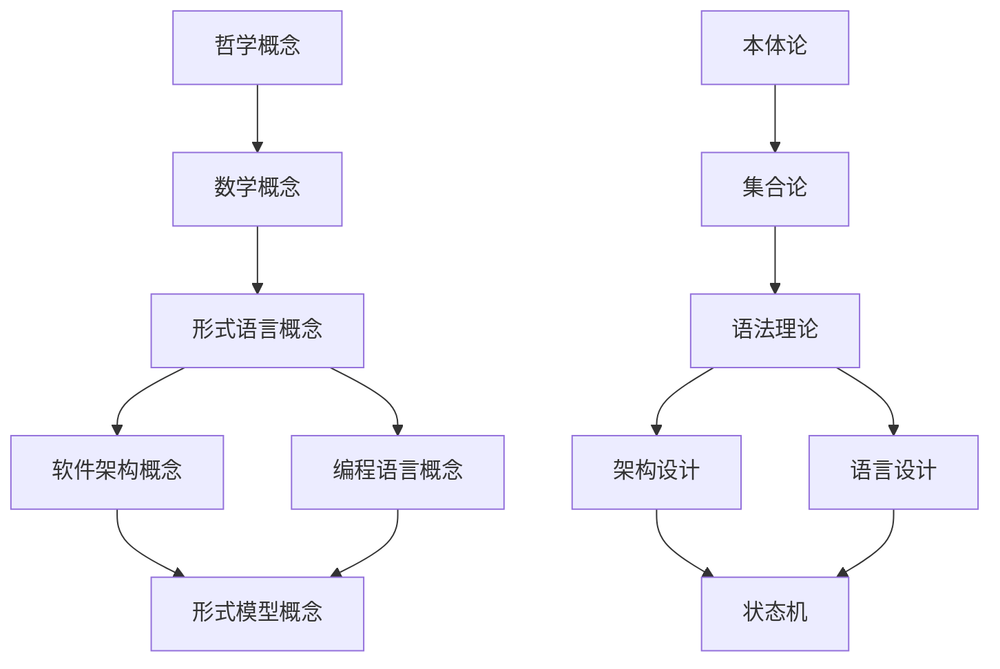

# 概念索引

## A. 哲学概念

### A1. 本体论概念

- **存在** - [本体论基础](./01-哲学基础理论/01-本体论基础.md)
- **实体** - [本体论基础](./01-哲学基础理论/01-本体论基础.md)
- **属性** - [本体论基础](./01-哲学基础理论/01-本体论基础.md)
- **关系** - [本体论基础](./01-哲学基础理论/01-本体论基础.md)
- **本质** - [本体论基础](./01-哲学基础理论/01-本体论基础.md)
- **现象** - [本体论基础](./01-哲学基础理论/01-本体论基础.md)

### A2. 认识论概念

- **知识** - [认识论基础](./01-哲学基础理论/02-认识论基础.md)
- **真理** - [认识论基础](./01-哲学基础理论/02-认识论基础.md)
- **证明** - [认识论基础](./01-哲学基础理论/02-认识论基础.md)
- **验证** - [认识论基础](./01-哲学基础理论/02-认识论基础.md)
- **信念** - [认识论基础](./01-哲学基础理论/02-认识论基础.md)
- **确定性** - [认识论基础](./01-哲学基础理论/02-认识论基础.md)

### A3. 方法论概念

- **形式化** - [方法论基础](./01-哲学基础理论/03-方法论基础.md)
- **抽象化** - [方法论基础](./01-哲学基础理论/03-方法论基础.md)
- **系统化** - [方法论基础](./01-哲学基础理论/03-方法论基础.md)
- **分析** - [方法论基础](./01-哲学基础理论/03-方法论基础.md)
- **综合** - [方法论基础](./01-哲学基础理论/03-方法论基础.md)
- **归纳** - [方法论基础](./01-哲学基础理论/03-方法论基础.md)

### A4. 价值论概念

- **正确性** - [价值论基础](./01-哲学基础理论/04-价值论基础.md)
- **可靠性** - [价值论基础](./01-哲学基础理论/04-价值论基础.md)
- **效率性** - [价值论基础](./01-哲学基础理论/04-价值论基础.md)
- **一致性** - [价值论基础](./01-哲学基础理论/04-价值论基础.md)
- **完整性** - [价值论基础](./01-哲学基础理论/04-价值论基础.md)

## B. 数学概念

### B1. 集合论概念

- **集合** - [集合论基础](./02-数学理论体系/01-集合论基础.md)
- **元素** - [集合论基础](./02-数学理论体系/01-集合论基础.md)
- **子集** - [集合论基础](./02-数学理论体系/01-集合论基础.md)
- **并集** - [集合论基础](./02-数学理论体系/01-集合论基础.md)
- **交集** - [集合论基础](./02-数学理论体系/01-集合论基础.md)
- **补集** - [集合论基础](./02-数学理论体系/01-集合论基础.md)
- **关系** - [集合论基础](./02-数学理论体系/01-集合论基础.md)
- **函数** - [集合论基础](./02-数学理论体系/01-集合论基础.md)
- **基数** - [集合论基础](./02-数学理论体系/01-集合论基础.md)

### B2. 逻辑学概念

- **命题** - [逻辑学基础](./02-数学理论体系/02-逻辑学基础.md)
- **谓词** - [逻辑学基础](./02-数学理论体系/02-逻辑学基础.md)
- **推理** - [逻辑学基础](./02-数学理论体系/02-逻辑学基础.md)
- **证明** - [逻辑学基础](./02-数学理论体系/02-逻辑学基础.md)
- **蕴涵** - [逻辑学基础](./02-数学理论体系/02-逻辑学基础.md)
- **等价** - [逻辑学基础](./02-数学理论体系/02-逻辑学基础.md)
- **否定** - [逻辑学基础](./02-数学理论体系/02-逻辑学基础.md)
- **合取** - [逻辑学基础](./02-数学理论体系/02-逻辑学基础.md)
- **析取** - [逻辑学基础](./02-数学理论体系/02-逻辑学基础.md)

### B3. 代数概念

- **群** - [代数结构](./02-数学理论体系/03-代数结构.md)
- **环** - [代数结构](./02-数学理论体系/03-代数结构.md)
- **域** - [代数结构](./02-数学理论体系/03-代数结构.md)
- **模** - [代数结构](./02-数学理论体系/03-代数结构.md)
- **同态** - [代数结构](./02-数学理论体系/03-代数结构.md)
- **同构** - [代数结构](./02-数学理论体系/03-代数结构.md)
- **子群** - [代数结构](./02-数学理论体系/03-代数结构.md)
- **理想** - [代数结构](./02-数学理论体系/03-代数结构.md)

### B4. 拓扑学概念

- **空间** - [拓扑学基础](./02-数学理论体系/04-拓扑学基础.md)
- **开集** - [拓扑学基础](./02-数学理论体系/04-拓扑学基础.md)
- **闭集** - [拓扑学基础](./02-数学理论体系/04-拓扑学基础.md)
- **连续性** - [拓扑学基础](./02-数学理论体系/04-拓扑学基础.md)
- **连通性** - [拓扑学基础](./02-数学理论体系/04-拓扑学基础.md)
- **紧致性** - [拓扑学基础](./02-数学理论体系/04-拓扑学基础.md)
- **同胚** - [拓扑学基础](./02-数学理论体系/04-拓扑学基础.md)

### B5. 范畴论概念

- **对象** - [范畴论基础](./02-数学理论体系/05-范畴论基础.md)
- **态射** - [范畴论基础](./02-数学理论体系/05-范畴论基础.md)
- **函子** - [范畴论基础](./02-数学理论体系/05-范畴论基础.md)
- **自然变换** - [范畴论基础](./02-数学理论体系/05-范畴论基础.md)
- **极限** - [范畴论基础](./02-数学理论体系/05-范畴论基础.md)
- **余极限** - [范畴论基础](./02-数学理论体系/05-范畴论基础.md)
- **伴随** - [范畴论基础](./02-数学理论体系/05-范畴论基础.md)

## C. 形式语言概念

### C1. 语法概念

- **产生式** - [形式语法理论](./03-形式语言理论/01-形式语法理论.md)
- **推导** - [形式语法理论](./03-形式语言理论/01-形式语法理论.md)
- **语法树** - [形式语法理论](./03-形式语言理论/01-形式语法理论.md)
- **终结符** - [形式语法理论](./03-形式语言理论/01-形式语法理论.md)
- **非终结符** - [形式语法理论](./03-形式语言理论/01-形式语法理论.md)
- **上下文无关** - [形式语法理论](./03-形式语言理论/01-形式语法理论.md)
- **正则表达式** - [形式语法理论](./03-形式语言理论/01-形式语法理论.md)

### C2. 语义概念

- **指称语义** - [语义学理论](./03-形式语言理论/02-语义学理论.md)
- **操作语义** - [语义学理论](./03-形式语言理论/02-语义学理论.md)
- **公理语义** - [语义学理论](./03-形式语言理论/02-语义学理论.md)
- **环境** - [语义学理论](./03-形式语言理论/02-语义学理论.md)
- **求值** - [语义学理论](./03-形式语言理论/02-语义学理论.md)
- **规约** - [语义学理论](./03-形式语言理论/02-语义学理论.md)

### C3. 类型概念

- **类型系统** - [类型论基础](./03-形式语言理论/03-类型论基础.md)
- **类型检查** - [类型论基础](./03-形式语言理论/03-类型论基础.md)
- **类型推导** - [类型论基础](./03-形式语言理论/03-类型论基础.md)
- **多态** - [类型论基础](./03-形式语言理论/03-类型论基础.md)
- **高阶类型** - [类型论基础](./03-形式语言理论/03-类型论基础.md)
- **依赖类型** - [类型论基础](./03-形式语言理论/03-类型论基础.md)

### C4. 证明概念

- **证明系统** - [证明论基础](./03-形式语言理论/04-证明论基础.md)
- **证明搜索** - [证明论基础](./03-形式语言理论/04-证明论基础.md)
- **证明检查** - [证明论基础](./03-形式语言理论/04-证明论基础.md)
- **自然演绎** - [证明论基础](./03-形式语言理论/04-证明论基础.md)
- **序列演算** - [证明论基础](./03-形式语言理论/04-证明论基础.md)

## D. 软件架构概念

### D1. 架构概念

- **组件** - [架构设计原理](./04-软件架构理论/01-架构设计原理.md)
- **模块** - [架构设计原理](./04-软件架构理论/01-架构设计原理.md)
- **接口** - [架构设计原理](./04-软件架构理论/01-架构设计原理.md)
- **依赖** - [架构设计原理](./04-软件架构理论/01-架构设计原理.md)
- **耦合** - [架构设计原理](./04-软件架构理论/01-架构设计原理.md)
- **内聚** - [架构设计原理](./04-软件架构理论/01-架构设计原理.md)

### D2. 模式概念

- **设计模式** - [架构模式理论](./04-软件架构理论/04-架构模式理论.md)
- **架构模式** - [架构模式理论](./04-软件架构理论/04-架构模式理论.md)
- **反模式** - [架构模式理论](./04-软件架构理论/04-架构模式理论.md)
- **模板方法** - [架构模式理论](./04-软件架构理论/04-架构模式理论.md)
- **策略模式** - [架构模式理论](./04-软件架构理论/04-架构模式理论.md)
- **观察者模式** - [架构模式理论](./04-软件架构理论/04-架构模式理论.md)

### D3. 质量概念

- **可维护性** - [组件化理论](./04-软件架构理论/02-组件化理论.md)
- **可扩展性** - [组件化理论](./04-软件架构理论/02-组件化理论.md)
- **可测试性** - [组件化理论](./04-软件架构理论/02-组件化理论.md)
- **可重用性** - [组件化理论](./04-软件架构理论/02-组件化理论.md)
- **性能** - [接口设计理论](./04-软件架构理论/03-接口设计理论.md)
- **安全** - [接口设计理论](./04-软件架构理论/03-接口设计理论.md)

## E. 编程语言概念

### E1. 语言概念

- **语法** - [语言设计原理](./05-编程语言理论/01-语言设计原理.md)
- **语义** - [语言设计原理](./05-编程语言理论/01-语言设计原理.md)
- **语用** - [语言设计原理](./05-编程语言理论/01-语言设计原理.md)
- **抽象** - [语言设计原理](./05-编程语言理论/01-语言设计原理.md)
- **表达力** - [语言设计原理](./05-编程语言理论/01-语言设计原理.md)

### E2. 类型概念

- **静态类型** - [类型系统理论](./05-编程语言理论/02-类型系统理论.md)
- **动态类型** - [类型系统理论](./05-编程语言理论/02-类型系统理论.md)
- **强类型** - [类型系统理论](./05-编程语言理论/02-类型系统理论.md)
- **弱类型** - [类型系统理论](./05-编程语言理论/02-类型系统理论.md)
- **类型安全** - [类型系统理论](./05-编程语言理论/02-类型系统理论.md)

### E3. 编译概念

- **词法分析** - [编译器理论](./05-编程语言理论/04-编译器理论.md)
- **语法分析** - [编译器理论](./05-编程语言理论/04-编译器理论.md)
- **语义分析** - [编译器理论](./05-编程语言理论/04-编译器理论.md)
- **代码生成** - [编译器理论](./05-编程语言理论/04-编译器理论.md)
- **优化** - [编译器理论](./05-编程语言理论/04-编译器理论.md)

## F. 形式模型概念

### F1. 状态机概念

- **状态** - [状态机理论](./06-形式模型理论/01-状态机理论.md)
- **转换** - [状态机理论](./06-形式模型理论/01-状态机理论.md)
- **事件** - [状态机理论](./06-形式模型理论/01-状态机理论.md)
- **动作** - [状态机理论](./06-形式模型理论/01-状态机理论.md)
- **确定性** - [状态机理论](./06-形式模型理论/01-状态机理论.md)
- **非确定性** - [状态机理论](./06-形式模型理论/01-状态机理论.md)

### F2. 进程概念

- **进程** - [进程代数](./06-形式模型理论/02-进程代数.md)
- **动作** - [进程代数](./06-形式模型理论/02-进程代数.md)
- **选择** - [进程代数](./06-形式模型理论/02-进程代数.md)
- **组合** - [进程代数](./06-形式模型理论/02-进程代数.md)
- **递归** - [进程代数](./06-形式模型理论/02-进程代数.md)
- **同步** - [进程代数](./06-形式模型理论/02-进程代数.md)

### F3. 时序概念

- **时间** - [时序逻辑](./06-形式模型理论/03-时序逻辑.md)
- **未来** - [时序逻辑](./06-形式模型理论/03-时序逻辑.md)
- **过去** - [时序逻辑](./06-形式模型理论/03-时序逻辑.md)
- **总是** - [时序逻辑](./06-形式模型理论/03-时序逻辑.md)
- **最终** - [时序逻辑](./06-形式模型理论/03-时序逻辑.md)
- **直到** - [时序逻辑](./06-形式模型理论/03-时序逻辑.md)

### F4. 验证概念

- **模型检测** - [模型检测](./06-形式模型理论/04-模型检测.md)
- **状态空间** - [模型检测](./06-形式模型理论/04-模型检测.md)
- **可达性** - [模型检测](./06-形式模型理论/04-模型检测.md)
- **反例** - [模型检测](./06-形式模型理论/04-模型检测.md)
- **抽象** - [模型检测](./06-形式模型理论/04-模型检测.md)

## 概念关联图

## 使用说明

1. **按字母顺序查找**: 使用Ctrl+F搜索概念名称
2. **按分类查找**: 根据概念所属领域查找
3. **按关联查找**: 通过概念关联图找到相关概念
4. **按文档查找**: 点击链接查看概念在具体文档中的详细说明
