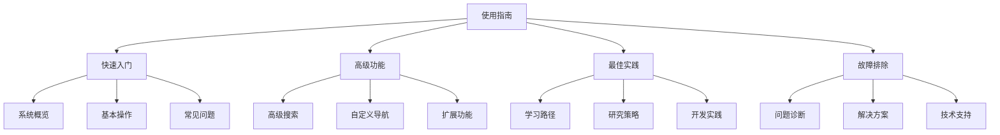

# 09-索引与导航-使用指南

[返回主题树](../00-主题树与内容索引.md) | [主计划文档](../00-形式化架构理论统一计划.md) | [相关计划](../13-项目报告与总结/递归合并计划.md) | [返回上级](../README.md)

> 本文档为索引与导航分支使用指南，所有最新进展与结论以主计划文档为准，历史细节归档于archive/。

## 目录

- [09-索引与导航-使用指南](#09-索引与导航-使用指南)
  - [目录](#目录)
  - [1. 概述](#1-概述)
    - [1.1 使用指南概述](#11-使用指南概述)
    - [1.2 核心目标](#12-核心目标)
    - [1.3 指南层次结构](#13-指南层次结构)
  - [2. 主要文件与内容索引](#2-主要文件与内容索引)
    - [2.1 核心文件](#21-核心文件)
    - [2.2 相关文件](#22-相关文件)
  - [3. 使用指南的基本定义与解释](#3-使用指南的基本定义与解释)
    - [3.1 使用指南的定义](#31-使用指南的定义)
      - [3.1.1 指南结构](#311-指南结构)
      - [3.1.2 指南内容](#312-指南内容)
      - [3.1.3 指南格式](#313-指南格式)
  - [4. 使用指南的基础概念](#4-使用指南的基础概念)
    - [4.1 快速入门](#41-快速入门)
      - [4.1.1 系统概览](#411-系统概览)
      - [4.1.2 基本操作](#412-基本操作)
      - [4.1.3 常见问题](#413-常见问题)
  - [5. 使用指南的主要理论](#5-使用指南的主要理论)
    - [5.1 高级功能](#51-高级功能)
    - [5.2 最佳实践](#52-最佳实践)
    - [5.3 故障排除](#53-故障排除)
    - [5.4 扩展开发](#54-扩展开发)
  - [6. 使用指南的行业应用](#6-使用指南的行业应用)
    - [6.1 学习研究](#61-学习研究)
    - [6.2 开发实践](#62-开发实践)
    - [6.3 知识管理](#63-知识管理)
  - [7. 发展历史](#7-发展历史)
  - [8. 应用领域](#8-应用领域)
  - [9. 总结](#9-总结)
  - [10. 相关性跳转与引用](#10-相关性跳转与引用)

## 1. 概述

### 1.1 使用指南概述

使用指南是帮助用户理解和使用知识库系统的综合性文档，为形式化架构理论提供了用户指导的重要工具。使用指南不仅支撑用户学习，也是知识管理和系统使用的重要技术基础。

### 1.2 核心目标

- 建立用户指导的基本框架
- 提供系统使用的操作指南
- 支持学习研究和开发实践应用

### 1.3 指南层次结构

## 2. 主要文件与内容索引

### 2.1 核心文件

- [使用指南.md](../Matter/Index/使用指南.md)
- [知识图谱系统使用指南.md](../Matter/Index/archive/知识图谱系统使用指南.md)

### 2.2 相关文件

- [00-索引与导航总论.md](00-索引与导航总论.md)
- [01-主题索引.md](01-主题索引.md)
- [02-导航系统.md](02-导航系统.md)

## 3. 使用指南的基本定义与解释

### 3.1 使用指南的定义

**定义 3.1.1** 使用指南（User Guide）
使用指南是帮助用户理解和使用系统的综合性文档。

#### 3.1.1 指南结构

**定义 3.1.2** 指南结构
使用指南的结构包含：

- 概述介绍
- 操作指南
- 功能说明
- 故障排除

#### 3.1.2 指南内容

**定义 3.1.3** 指南内容
使用指南的内容包括：

- 系统介绍
- 操作步骤
- 功能说明
- 最佳实践

#### 3.1.3 指南格式

**定义 3.1.4** 指南格式
使用指南的格式特点：

- 结构化组织
- 图文并茂
- 易于查找
- 便于理解

## 4. 使用指南的基础概念

### 4.1 快速入门

#### 4.1.1 系统概览

**概念 4.1.1** 系统概览
系统概览介绍知识库的整体结构。

**内容**：

- 系统架构
- 主要功能
- 核心特性
- 使用场景

#### 4.1.2 基本操作

**概念 4.1.2** 基本操作
基本操作介绍系统的核心功能。

**操作**：

- 内容浏览
- 搜索检索
- 导航跳转
- 内容编辑

#### 4.1.3 常见问题

**概念 4.1.3** 常见问题
常见问题解答用户的基本疑问。

**问题类型**：

- 功能使用
- 系统配置
- 内容管理
- 技术支持

## 5. 使用指南的主要理论

### 5.1 高级功能

**理论 5.1.1** 高级功能（Advanced Features）
高级功能介绍系统的进阶特性。

**功能**：

- 高级搜索
- 自定义导航
- 内容过滤
- 导出功能

### 5.2 最佳实践

**理论 5.2.1** 最佳实践（Best Practices）
最佳实践提供系统使用的最佳方法。

**实践**：

- 学习路径
- 研究策略
- 开发实践
- 内容组织

### 5.3 故障排除

**理论 5.3.1** 故障排除（Troubleshooting）
故障排除帮助解决使用中的问题。

**方法**：

- 问题诊断
- 解决方案
- 技术支持
- 常见错误

### 5.4 扩展开发

**理论 5.4.1** 扩展开发（Extension Development）
扩展开发介绍系统的扩展功能。

**开发**：

- 插件开发
- 自定义功能
- 集成接口
- API使用

## 6. 使用指南的行业应用

### 6.1 学习研究

- 知识学习
- 理论研究
- 学术研究
- 技术探索

### 6.2 开发实践

- 软件开发
- 系统设计
- 架构设计
- 技术实现

### 6.3 知识管理

- 知识组织
- 内容管理
- 信息检索
- 知识分享

## 7. 发展历史

使用指南的发展经历了从简单说明到现代用户指导的演进过程。用户体验设计、技术文档、在线帮助等技术为使用指南的发展做出了重要贡献。

## 8. 应用领域

使用指南在学习研究、开发实践、知识管理等领域有广泛应用，是现代信息系统的重要技术基础。

## 9. 总结

使用指南作为索引与导航的重要分支，为形式化架构理论提供了重要的用户指导工具，是理解系统使用的基础技术。

## 10. 相关性跳转与引用

- [00-索引与导航总论.md](00-索引与导航总论.md)
- [01-主题索引.md](01-主题索引.md)
- [02-导航系统.md](02-导航系统.md)
- [04-搜索系统.md](04-搜索系统.md)
- [05-推荐系统.md](05-推荐系统.md)
- [06-可视化系统.md](06-可视化系统.md)
- [00-主题树与内容索引.md](../00-主题树与内容索引.md)
- 进度追踪与上下文：
  - [软件工程体系版本](../软件工程理论与实践体系/进度追踪与上下文.md)
  - [项目报告与总结版本](../13-项目报告与总结/进度追踪与上下文.md)
  - [实践应用开发子目录版本](../08-实践应用开发/软件工程理论与实践体系/进度追踪与上下文.md)

---

> 本文件为自动归纳生成，后续将递归细化相关内容，持续补全图表、公式、代码等多表征内容。
