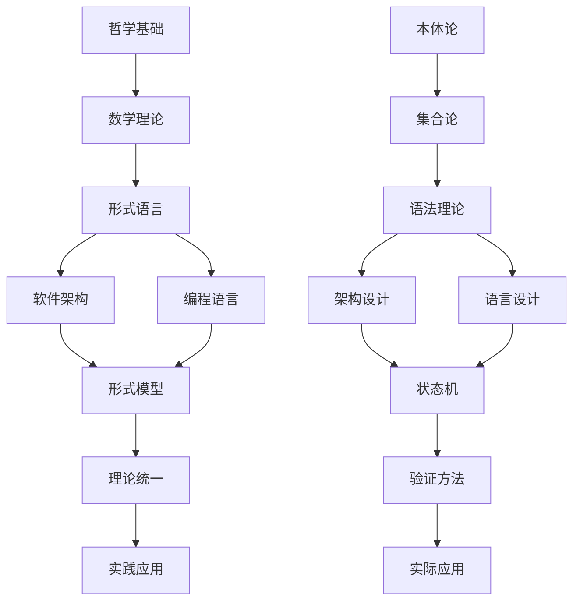

# 主题索引

## 1. 哲学与基础理论

### 1.1 本体论
- **存在与实体**: [本体论基础](./01-哲学基础理论/01-本体论基础.md)
- **属性与关系**: [本体论基础](./01-哲学基础理论/01-本体论基础.md)
- **本质与现象**: [本体论基础](./01-哲学基础理论/01-本体论基础.md)

### 1.2 认识论
- **知识与真理**: [认识论基础](./01-哲学基础理论/02-认识论基础.md)
- **证明与验证**: [认识论基础](./01-哲学基础理论/02-认识论基础.md)
- **信念与确定性**: [认识论基础](./01-哲学基础理论/02-认识论基础.md)

### 1.3 方法论
- **形式化方法**: [方法论基础](./01-哲学基础理论/03-方法论基础.md)
- **抽象化方法**: [方法论基础](./01-哲学基础理论/03-方法论基础.md)
- **系统化方法**: [方法论基础](./01-哲学基础理论/03-方法论基础.md)

### 1.4 价值论
- **正确性与可靠性**: [价值论基础](./01-哲学基础理论/04-价值论基础.md)
- **效率性与一致性**: [价值论基础](./01-哲学基础理论/04-价值论基础.md)
- **完整性与规范性**: [价值论基础](./01-哲学基础理论/04-价值论基础.md)

## 2. 数学与形式科学

### 2.1 集合论
- **基础集合概念**: [集合论基础](./02-数学理论体系/01-集合论基础.md)
- **集合运算**: [集合论基础](./02-数学理论体系/01-集合论基础.md)
- **关系与函数**: [集合论基础](./02-数学理论体系/01-集合论基础.md)

### 2.2 逻辑学
- **命题逻辑**: [逻辑学基础](./02-数学理论体系/02-逻辑学基础.md)
- **谓词逻辑**: [逻辑学基础](./02-数学理论体系/02-逻辑学基础.md)
- **推理与证明**: [逻辑学基础](./02-数学理论体系/02-逻辑学基础.md)

### 2.3 代数结构
- **群论**: [代数结构](./02-数学理论体系/03-代数结构.md)
- **环论**: [代数结构](./02-数学理论体系/03-代数结构.md)
- **域论**: [代数结构](./02-数学理论体系/03-代数结构.md)

### 2.4 拓扑学
- **拓扑空间**: [拓扑学基础](./02-数学理论体系/04-拓扑学基础.md)
- **连续性**: [拓扑学基础](./02-数学理论体系/04-拓扑学基础.md)
- **连通性**: [拓扑学基础](./02-数学理论体系/04-拓扑学基础.md)

### 2.5 范畴论
- **范畴基础**: [范畴论基础](./02-数学理论体系/05-范畴论基础.md)
- **函子与自然变换**: [范畴论基础](./02-数学理论体系/05-范畴论基础.md)
- **极限与余极限**: [范畴论基础](./02-数学理论体系/05-范畴论基础.md)

## 3. 形式语言与计算

### 3.1 形式语法
- **语法理论**: [形式语法理论](./03-形式语言理论/01-形式语法理论.md)
- **语法分析**: [形式语法理论](./03-形式语言理论/01-形式语法理论.md)
- **语法树**: [形式语法理论](./03-形式语言理论/01-形式语法理论.md)

### 3.2 语义学
- **指称语义**: [语义学理论](./03-形式语言理论/02-语义学理论.md)
- **操作语义**: [语义学理论](./03-形式语言理论/02-语义学理论.md)
- **公理语义**: [语义学理论](./03-形式语言理论/02-语义学理论.md)

### 3.3 类型论
- **类型系统**: [类型论基础](./03-形式语言理论/03-类型论基础.md)
- **类型检查**: [类型论基础](./03-形式语言理论/03-类型论基础.md)
- **类型推导**: [类型论基础](./03-形式语言理论/03-类型论基础.md)

### 3.4 证明论
- **证明系统**: [证明论基础](./03-形式语言理论/04-证明论基础.md)
- **证明搜索**: [证明论基础](./03-形式语言理论/04-证明论基础.md)
- **证明检查**: [证明论基础](./03-形式语言理论/04-证明论基础.md)

## 4. 软件架构与设计

### 4.1 架构设计
- **设计原则**: [架构设计原理](./04-软件架构理论/01-架构设计原理.md)
- **架构模式**: [架构模式理论](./04-软件架构理论/04-架构模式理论.md)
- **架构评估**: [架构设计原理](./04-软件架构理论/01-架构设计原理.md)

### 4.2 组件化
- **组件设计**: [组件化理论](./04-软件架构理论/02-组件化理论.md)
- **模块化**: [组件化理论](./04-软件架构理论/02-组件化理论.md)
- **依赖管理**: [组件化理论](./04-软件架构理论/02-组件化理论.md)

### 4.3 接口设计
- **接口规范**: [接口设计理论](./04-软件架构理论/03-接口设计理论.md)
- **API设计**: [接口设计理论](./04-软件架构理论/03-接口设计理论.md)
- **契约设计**: [接口设计理论](./04-软件架构理论/03-接口设计理论.md)

### 4.4 设计模式
- **创建型模式**: [架构模式理论](./04-软件架构理论/04-架构模式理论.md)
- **结构型模式**: [架构模式理论](./04-软件架构理论/04-架构模式理论.md)
- **行为型模式**: [架构模式理论](./04-软件架构理论/04-架构模式理论.md)

## 5. 编程语言与实现

### 5.1 语言设计
- **语言原理**: [语言设计原理](./05-编程语言理论/01-语言设计原理.md)
- **语法设计**: [语言设计原理](./05-编程语言理论/01-语言设计原理.md)
- **语义设计**: [语言设计原理](./05-编程语言理论/01-语言设计原理.md)

### 5.2 类型系统
- **类型理论**: [类型系统理论](./05-编程语言理论/02-类型系统理论.md)
- **类型安全**: [类型系统理论](./05-编程语言理论/02-类型系统理论.md)
- **类型推导**: [类型系统理论](./05-编程语言理论/02-类型系统理论.md)

### 5.3 语义模型
- **语义定义**: [语义模型理论](./05-编程语言理论/03-语义模型理论.md)
- **执行模型**: [语义模型理论](./05-编程语言理论/03-语义模型理论.md)
- **内存模型**: [语义模型理论](./05-编程语言理论/03-语义模型理论.md)

### 5.4 编译器
- **编译原理**: [编译器理论](./05-编程语言理论/04-编译器理论.md)
- **代码生成**: [编译器理论](./05-编程语言理论/04-编译器理论.md)
- **优化技术**: [编译器理论](./05-编程语言理论/04-编译器理论.md)

## 6. 形式模型与验证

### 6.1 状态机
- **有限状态机**: [状态机理论](./06-形式模型理论/01-状态机理论.md)
- **自动机理论**: [状态机理论](./06-形式模型理论/01-状态机理论.md)
- **状态转换**: [状态机理论](./06-形式模型理论/01-状态机理论.md)

### 6.2 进程代数
- **进程理论**: [进程代数](./06-形式模型理论/02-进程代数.md)
- **并发模型**: [进程代数](./06-形式模型理论/02-进程代数.md)
- **通信协议**: [进程代数](./06-形式模型理论/02-进程代数.md)

### 6.3 时序逻辑
- **线性时序逻辑**: [时序逻辑](./06-形式模型理论/03-时序逻辑.md)
- **分支时序逻辑**: [时序逻辑](./06-形式模型理论/03-时序逻辑.md)
- **时间建模**: [时序逻辑](./06-形式模型理论/03-时序逻辑.md)

### 6.4 模型检测
- **检测算法**: [模型检测](./06-形式模型理论/04-模型检测.md)
- **状态空间**: [模型检测](./06-形式模型理论/04-模型检测.md)
- **反例生成**: [模型检测](./06-形式模型理论/04-模型检测.md)

## 7. 理论统一与整合

### 7.1 统一框架
- **理论整合**: [理论统一框架](./07-理论统一与整合/01-理论统一框架.md)
- **跨领域关联**: [理论统一框架](./07-理论统一与整合/01-理论统一框架.md)
- **形式化统一**: [理论统一框架](./07-理论统一与整合/01-理论统一框架.md)

### 7.2 跨领域整合
- **领域融合**: [跨领域整合](./07-理论统一与整合/02-跨领域整合.md)
- **理论映射**: [跨领域整合](./07-理论统一与整合/02-跨领域整合.md)
- **知识整合**: [跨领域整合](./07-理论统一与整合/02-跨领域整合.md)

### 7.3 形式化验证
- **验证方法**: [形式化验证](./07-理论统一与整合/03-形式化验证.md)
- **证明技术**: [形式化验证](./07-理论统一与整合/03-形式化验证.md)
- **工具支持**: [形式化验证](./07-理论统一与整合/03-形式化验证.md)

### 7.4 实践应用
- **应用框架**: [实践应用](./07-理论统一与整合/04-实践应用.md)
- **实施指南**: [实践应用](./07-理论统一与整合/04-实践应用.md)
- **最佳实践**: [实践应用](./07-理论统一与整合/04-实践应用.md)

## 8. 实践应用开发

### 8.1 Rust实践
- **系统编程**: [Rust实践](./08-实践应用开发/01-Rust实践.md)
- **内存安全**: [Rust实践](./08-实践应用开发/01-Rust实践.md)
- **并发编程**: [Rust实践](./08-实践应用开发/01-Rust实践.md)

### 8.2 Go实践
- **并发模型**: [Go实践](./08-实践应用开发/02-Go实践.md)
- **网络编程**: [Go实践](./08-实践应用开发/02-Go实践.md)
- **微服务**: [Go实践](./08-实践应用开发/02-Go实践.md)

### 8.3 架构实现
- **架构模式**: [架构实现](./08-实践应用开发/03-架构实现.md)
- **组件设计**: [架构实现](./08-实践应用开发/03-架构实现.md)
- **系统集成**: [架构实现](./08-实践应用开发/03-架构实现.md)

### 8.4 案例分析
- **实际项目**: [案例分析](./08-实践应用开发/04-案例分析.md)
- **问题解决**: [案例分析](./08-实践应用开发/04-案例分析.md)
- **经验总结**: [案例分析](./08-实践应用开发/04-案例分析.md)

## 主题关联图

## 学习路径

### 基础路径
1. **哲学基础** → **数学理论** → **形式语言**
2. **软件架构** → **编程语言** → **形式模型**
3. **理论统一** → **实践应用**

### 应用路径
1. **软件架构** → **实践应用**
2. **编程语言** → **形式模型** → **实践应用**

### 研究路径
1. **哲学基础** → **数学理论** → **理论统一**
2. **形式语言** → **形式模型** → **理论统一**

## 主题索引使用说明

1. **按主题查找**: 根据感兴趣的主题领域查找相关内容
2. **按层次学习**: 从基础理论到应用实践逐步深入
3. **交叉参考**: 利用主题关联图找到相关主题
4. **路径规划**: 根据学习路径制定学习计划 