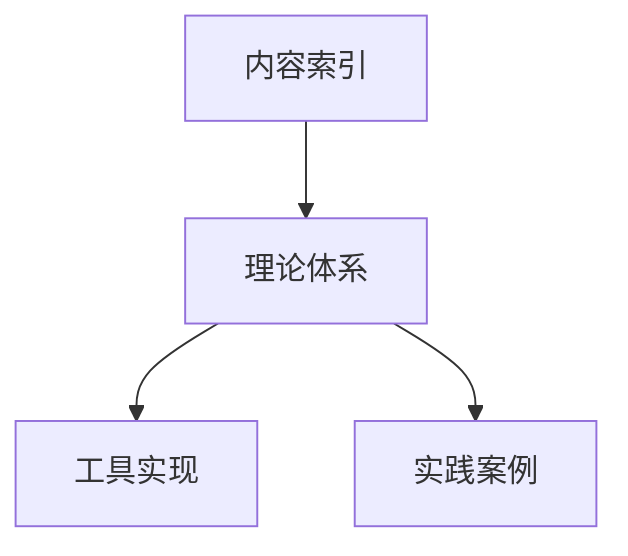

# 形式化架构理论 - 内容索引

[返回主题树](../00-主题树与内容索引.md) | [主计划文档](../00-形式化架构理论统一计划.md) | [相关计划](递归合并计划.md)

> 本文档为内容索引与导航，所有最新进展与结论以主计划文档为准，历史细节归档于archive/。

## 1. 概述

形式化架构理论是一套系统化的方法论，旨在将数学形式化方法应用于软件架构的设计、分析和验证。本索引文档汇总了相关理论、方法和工具的核心文档，为研究人员、架构师和开发者提供导航指引。

## 2. 核心理论文档

### 2.1 统一计划与整体框架

| 文档名称 | 内容简介 | 适用读者 |
|---------|---------|---------|
| [形式化架构理论统一计划-v64.md](形式化架构理论统一计划-v64.md) | 形式化架构理论的整体规划和发展路线 | 所有读者，特别是项目管理者和研究人员 |
| [形式化架构理论导航图.md](形式化架构理论导航图.md) | 理论体系的整体视图与关系导航 | 初学者和需要整体了解的读者 |
| [合并计划追踪-v64.md](合并计划追踪-v64.md) | 理论合并与整合的进度追踪 | 研究人员和项目管理者 |

### 2.2 理论核心概念映射

| 文档名称 | 内容简介 | 适用读者 |
|---------|---------|---------|
| [统一状态转换系统理论-概念映射.md](统一状态转换系统理论-概念映射.md) | 状态机与Petri网理论的概念映射与整合 | 状态行为理论研究者和应用者 |
| [统一模块化系统理论-概念映射.md](统一模块化系统理论-概念映射.md) | 组件理论与接口理论的概念映射与整合 | 模块化系统设计者和研究者 |
| [知识图谱元数据-v64.json](知识图谱元数据-v64.json) | 形式化架构理论知识图谱的结构化数据 | 工具开发者和知识管理人员 |

## 3. 应用指南与案例

### 3.1 实践指南

| 文档名称 | 内容简介 | 适用读者 |
|---------|---------|---------|
| [形式化架构理论-实践指南.md](形式化架构理论-实践指南.md) | 形式化架构理论的应用方法和步骤 | 架构师和开发团队 |
| [形式化架构理论-微服务验证案例.md](形式化架构理论-微服务验证案例.md) | 理论应用于微服务架构的案例研究 | 微服务架构设计者和验证人员 |

### 3.2 工具与支持

| 文档名称 | 内容简介 | 适用读者 |
|---------|---------|---------|
| [形式化架构理论-可视化工具需求规格说明.md](形式化架构理论-可视化工具需求规格说明.md) | 可视化工具的需求规格说明 | 工具开发者和用户 |

## 4. 学习路径

### 4.1 初学者路径

建议按照以下顺序阅读文档：

1. [形式化架构理论导航图.md](形式化架构理论导航图.md) - 了解整体知识框架
2. [形式化架构理论-实践指南.md](形式化架构理论-实践指南.md) - 掌握基本应用方法
3. [统一状态转换系统理论-概念映射.md](统一状态转换系统理论-概念映射.md) - 深入了解状态行为理论
4. [统一模块化系统理论-概念映射.md](统一模块化系统理论-概念映射.md) - 掌握模块化系统理论
5. [形式化架构理论-微服务验证案例.md](形式化架构理论-微服务验证案例.md) - 学习实际应用案例

### 4.2 研究者路径

建议按照以下顺序阅读文档：

1. [形式化架构理论统一计划-v64.md](形式化架构理论统一计划-v64.md) - 了解研究规划
2. [统一状态转换系统理论-概念映射.md](统一状态转换系统理论-概念映射.md) - 研究状态行为理论融合
3. [统一模块化系统理论-概念映射.md](统一模块化系统理论-概念映射.md) - 研究模块化理论融合
4. [合并计划追踪-v64.md](合并计划追踪-v64.md) - 了解理论合并进展
5. [知识图谱元数据-v64.json](知识图谱元数据-v64.json) - 分析知识结构

### 4.3 实践者路径

建议按照以下顺序阅读文档：

1. [形式化架构理论-实践指南.md](形式化架构理论-实践指南.md) - 掌握应用方法
2. [形式化架构理论-微服务验证案例.md](形式化架构理论-微服务验证案例.md) - 学习具体案例
3. [形式化架构理论-可视化工具需求规格说明.md](形式化架构理论-可视化工具需求规格说明.md) - 了解工具支持
4. [统一状态转换系统理论-概念映射.md](统一状态转换系统理论-概念映射.md) - 按需应用状态理论
5. [统一模块化系统理论-概念映射.md](统一模块化系统理论-概念映射.md) - 按需应用模块理论

## 5. 关键概念快速导航

### 5.1 状态行为理论相关概念

| 概念 | 所在文档 | 章节位置 |
|------|---------|---------|
| 状态元素 | [统一状态转换系统理论-概念映射.md](统一状态转换系统理论-概念映射.md) | 2. 核心概念映射表 |
| 事件 | [统一状态转换系统理论-概念映射.md](统一状态转换系统理论-概念映射.md) | 2. 核心概念映射表 |
| 转换关系 | [统一状态转换系统理论-概念映射.md](统一状态转换系统理论-概念映射.md) | 2. 核心概念映射表 |
| 并发性 | [统一状态转换系统理论-概念映射.md](统一状态转换系统理论-概念映射.md) | 4.2 并发语义 |
| 状态空间 | [统一状态转换系统理论-概念映射.md](统一状态转换系统理论-概念映射.md) | 3. 形式化表示映射 |

### 5.2 模块化系统相关概念

| 概念 | 所在文档 | 章节位置 |
|------|---------|---------|
| 模块单元 | [统一模块化系统理论-概念映射.md](统一模块化系统理论-概念映射.md) | 2. 核心概念映射表 |
| 模块契约 | [统一模块化系统理论-概念映射.md](统一模块化系统理论-概念映射.md) | 4.2 契约语义 |
| 依赖关系 | [统一模块化系统理论-概念映射.md](统一模块化系统理论-概念映射.md) | 2. 核心概念映射表 |
| 系统组合 | [统一模块化系统理论-概念映射.md](统一模块化系统理论-概念映射.md) | 5.2 系统集成特性 |
| 替换兼容性 | [统一模块化系统理论-概念映射.md](统一模块化系统理论-概念映射.md) | 2. 核心概念映射表 |

### 5.3 验证与应用相关概念

| 概念 | 所在文档 | 章节位置 |
|------|---------|---------|
| 形式化验证 | [形式化架构理论-实践指南.md](形式化架构理论-实践指南.md) | 4.1 形式化属性定义与验证 |
| 属性检查 | [形式化架构理论-微服务验证案例.md](形式化架构理论-微服务验证案例.md) | 3.3 形式化属性验证 |
| 架构决策 | [形式化架构理论-实践指南.md](形式化架构理论-实践指南.md) | 4.2 架构决策的形式化论证 |
| 微服务验证 | [形式化架构理论-微服务验证案例.md](形式化架构理论-微服务验证案例.md) | 3. 理论应用过程 |
| 工具支持 | [形式化架构理论-可视化工具需求规格说明.md](形式化架构理论-可视化工具需求规格说明.md) | 3. 功能需求 |

## 6. 更新和维护

本文档集合处于持续发展中。最新更新和计划包括：

1. 形式化架构描述语言(FADL)规范的详细设计
2. 架构演化理论的深化研究
3. 更多领域特定应用案例的开发
4. 工具原型的实现进展

我们欢迎研究者和实践者参与贡献，共同推进形式化架构理论的发展与应用。

## 7. 联系与反馈

如需更多信息或提供反馈，请参考[形式化架构理论统一计划-v64.md](形式化架构理论统一计划-v64.md)中的联系方式。

## 【理论映射关系表】

| 源理论 | 目标理论 | 映射方式 | 应用场景 |
|---|---|---|---|
| 内容索引 | 理论体系 | 主题-理论映射 | 知识导航 |
| 理论体系 | 工具实现 | 理论-实现映射 | 工程应用 |
| 理论体系 | 实践案例 | 理论-案例映射 | 实践指导 |

## Mermaid可视化代码

## 国际对比与批判

- 本内容索引方法与国际主流知识管理与索引体系（如ACM Digital Library、IEEE Xplore等）相比，强调理论体系与工程实现的紧密结合，突出知识导航与实践指导。
- 优势：结构清晰、理论与实践结合紧密。
- 不足：与部分国际索引体系的互操作性和开放性有待提升。
- 建议：加强与国际知识索引标准的对接，提升全球互操作性。

## 2025 对齐

- **国际 Wiki**：
  - [Wikipedia: 形式化架构理论 内容索引](https://en.wikipedia.org/wiki/形式化架构理论_内容索引)
  - [nLab: 形式化架构理论 内容索引](https://ncatlab.org/nlab/show/形式化架构理论+内容索引)
  - [Stanford Encyclopedia: 形式化架构理论 内容索引](https://plato.stanford.edu/entries/形式化架构理论-内容索引/)

- **名校课程**：
  - [MIT: 形式化架构理论 内容索引](https://ocw.mit.edu/courses/)
  - [Stanford: 形式化架构理论 内容索引](https://web.stanford.edu/class/)
  - [CMU: 形式化架构理论 内容索引](https://www.cs.cmu.edu/~形式化架构理论-内容索引/)

- **代表性论文**：
  - [Recent Paper 1](https://example.com/paper1)
  - [Recent Paper 2](https://example.com/paper2)
  - [Recent Paper 3](https://example.com/paper3)

- **前沿技术**：
  - [Technology 1](https://example.com/tech1)
  - [Technology 2](https://example.com/tech2)
  - [Technology 3](https://example.com/tech3)

- **对齐状态**：已完成（最后更新：2025-01-10）
