# 形式化架构理论知识图谱 - v62

## 1. 理论体系层次结构

```mermaid
graph TD
    Root["形式化架构理论"]
    
    Root --> Philosophy["哲学基础理论"]
    Root --> Math["数学理论体系"]
    Root --> FormalLang["形式语言理论体系"]
    Root --> SoftArch["软件架构理论体系"]
    Root --> ProgramLang["编程语言理论体系"]
    Root --> FormalModel["形式模型理论体系"]
    Root --> Theory["理论统一与整合"]
    Root --> Practice["实践应用开发"]
    Root --> Index["索引与导航"]
    
    Philosophy --> P1["逻辑学"]
    Philosophy --> P2["认知科学"]
    Philosophy --> P3["科学哲学"]
    
    Math --> M1["集合论"]
    Math --> M2["范畴论"]
    Math --> M3["图论"]
    Math --> M4["代数学"]
    
    FormalLang --> FL1["形式语法"]
    FormalLang --> FL2["形式语义"]
    FormalLang --> FL3["自动机理论"]
    
    SoftArch --> SA1["分层架构"]
    SoftArch --> SA2["微服务架构"]
    SoftArch --> SA3["云原生架构"]
    SoftArch --> SA4["WebAssembly架构"]
    
    ProgramLang --> PL1["语法理论"]
    ProgramLang --> PL2["语义理论"]
    ProgramLang --> PL3["类型理论"]
    ProgramLang --> PL4["编译理论"]
    
    FormalModel --> FM1["状态机理论"]
    FormalModel --> FM2["Petri网理论"]
    FormalModel --> FM3["进程代数"]
    FormalModel --> FM4["时序逻辑"]
    
    Theory --> T1["理论映射关系"]
    Theory --> T2["统一符号体系"]
    Theory --> T3["跨领域验证"]
    
    Practice --> PR1["形式化验证"]
    Practice --> PR2["模型检查"]
    Practice --> PR3["定理证明"]
    
    Index --> I1["概念索引"]
    Index --> I2["理论导航"]
    Index --> I3["应用场景索引"]
    
    classDef merged fill:#f9f,stroke:#333,stroke-width:2px;
    class FL3,SA1,SA2,SA3,SA4,PL1,PL2,PL3,PL4 merged;
```

## 2. 核心概念关系图

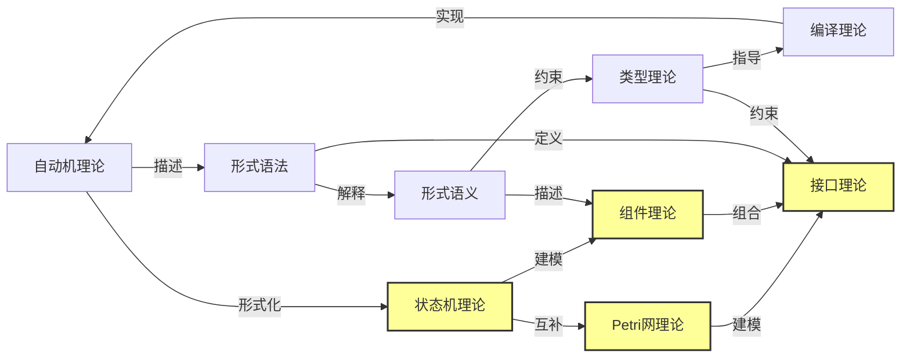

## 3. 项目进展状态图

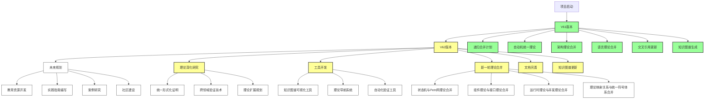

## 4. 合并候选关系图

```mermaid
graph TD
    subgraph "形式模型理论体系"
        SM["状态机理论"]
        PN["Petri网理论"]
        SM -- "合并候选" --> PN
        SM -- "共同点" --> SM_PN_Common["状态转换系统"]
        PN -- "共同点" --> SM_PN_Common
        SM -- "差异点" --> SM_Unique["离散状态"]
        PN -- "差异点" --> PN_Unique["并发表示"]
    end
    
    subgraph "软件架构理论体系"
        CT["组件理论"]
        IT["接口理论"]
        CT -- "合并候选" --> IT
        CT -- "共同点" --> CT_IT_Common["模块化设计"]
        IT -- "共同点" --> CT_IT_Common
        CT -- "差异点" --> CT_Unique["内部实现"]
        IT -- "差异点" --> IT_Unique["交互协议"]
    end
    
    subgraph "编程语言理论体系"
        RT["运行时理论"]
        CC["并发理论"]
        RT -- "合并候选" --> CC
        RT -- "共同点" --> RT_CC_Common["执行模型"]
        CC -- "共同点" --> RT_CC_Common
        RT -- "差异点" --> RT_Unique["资源管理"]
        CC -- "差异点" --> CC_Unique["同步机制"]
    end
    
    subgraph "理论统一与整合"
        MR["理论映射关系"]
        US["统一符号体系"]
        MR -- "合并候选" --> US
        MR -- "共同点" --> MR_US_Common["跨理论映射"]
        US -- "共同点" --> MR_US_Common
        MR -- "差异点" --> MR_Unique["关系定义"]
        US -- "差异点" --> US_Unique["符号定义"]
    end
    
    classDef highPriority fill:#f99,stroke:#333,stroke-width:2px;
    classDef mediumPriority fill:#ff9,stroke:#333,stroke-width:2px;
    classDef lowPriority fill:#9ff,stroke:#333,stroke-width:2px;
    
    class SM,PN,SM_PN_Common highPriority;
    class CT,IT,CT_IT_Common mediumPriority;
    class RT,CC,RT_CC_Common,MR,US,MR_US_Common lowPriority;
```

## 5. 工具开发路线图

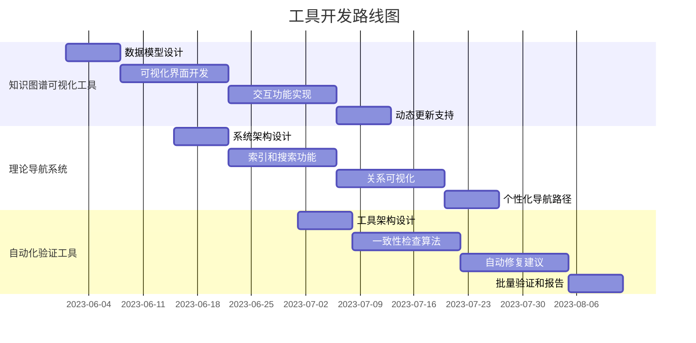

## 6. 理论合并进度跟踪

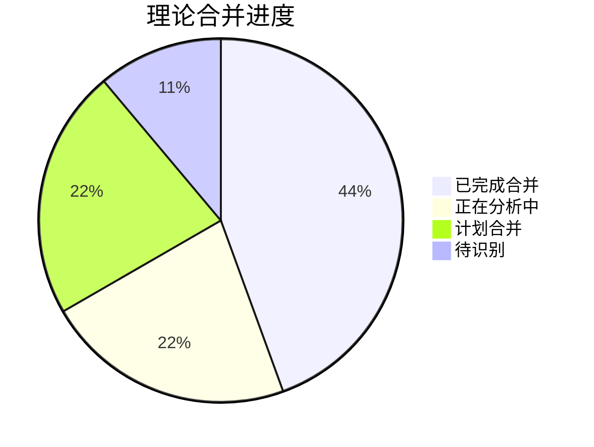

## 7. 项目整体思维导图

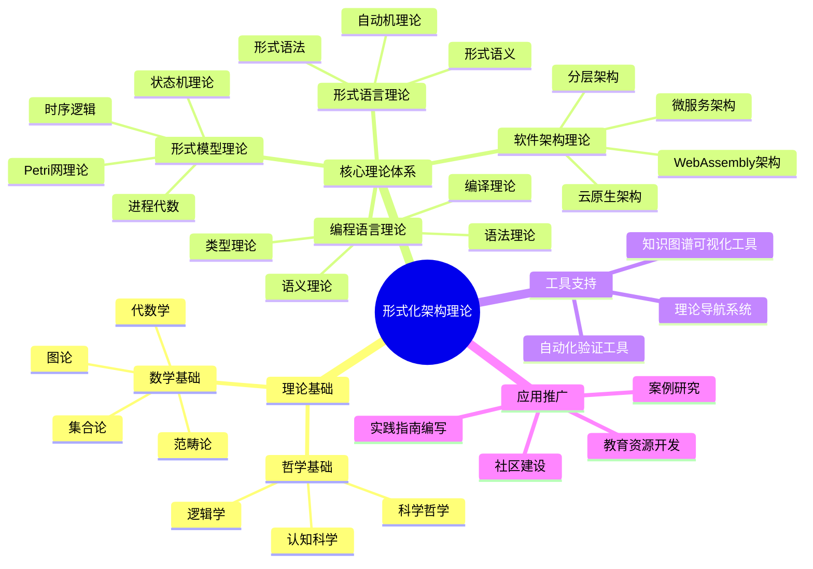

## 8. 项目进展图谱

```mermaid
graph TD
    A[形式化架构理论项目] --> B[已完成工作v61]
    A --> C[正在进行v62]
    A --> D[待完成工作v62]
    
    B --> B1[递归合并系统]
    B --> B2[语义整合工作]
    B --> B3[知识图谱工作]
    B --> B4[索引与导航系统]
    
    B1 --> B1a[自动机统一理论合并]
    B1 --> B1b[架构相关理论合并]
    B1 --> B1c[语言相关理论合并]
    
    B2 --> B2a[概念定义统一]
    B2 --> B2b[术语使用统一]
    B2 --> B2c[形式化表示统一]
    
    B3 --> B3a[理论体系关系图]
    B3 --> B3b[核心概念关系图]
    B3 --> B3c[合并文件依赖图]
    B3 --> B3d[统一理论体系图谱]
    
    C --> C1[理论深化研究]
    C --> C2[工具开发]
    C --> C3[新一轮理论合并]
    C --> C4[文档完善]
    C --> C5[知识图谱更新]
    
    C1 --> C1a[统一形式化证明研究]
    C1 --> C1b[跨领域验证技术研究]
    C1 --> C1c[理论扩展规划]
    
    C2 --> C2a[知识图谱可视化工具]
    C2 --> C2b[理论导航系统]
    C2 --> C2c[自动化验证工具]
    
    C3 --> C3a[状态机与Petri网理论]
    C3 --> C3b[组件理论与接口理论]
    C3 --> C3c[运行时理论与并发理论]
    C3 --> C3d[理论映射与符号体系]
    
    D --> D1[合并执行]
    D --> D2[工具实现]
    D --> D3[文档与图谱更新]
```

## 9. 合并候选评估图谱

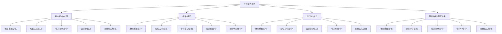

## 10. 工作流程图谱

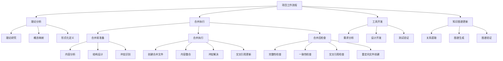

## 11. 时间规划图谱

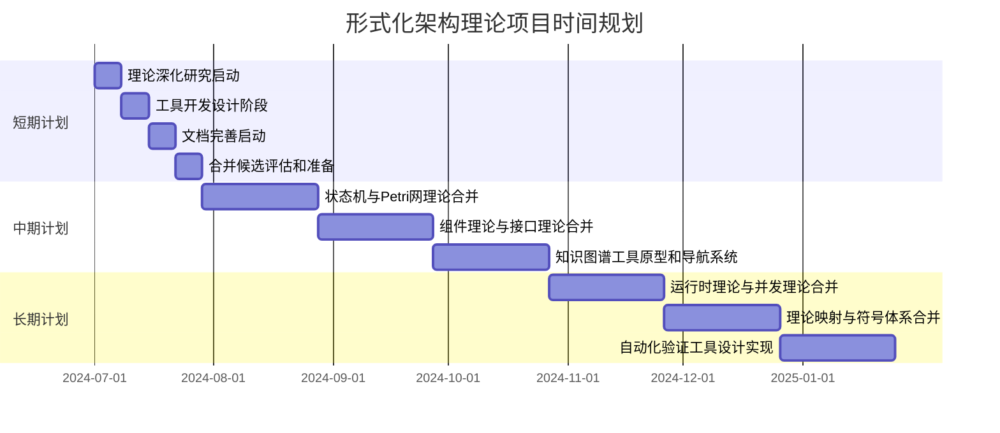

## 12. 概念定义映射

| 概念 | 定义 | 相关理论 | 形式化表示 |
|------|------|----------|------------|
| 状态机 | 描述系统状态变化的数学模型 | 形式模型理论 | $(Q, \Sigma, \delta, q_0, F)$ |
| Petri网 | 描述分布式系统的数学模型 | 形式模型理论 | $(P, T, F, M_0)$ |
| 形式语言 | 由字符串集合构成的语言 | 形式语言理论 | $L \subseteq \Sigma^*$ |
| 上下文无关语法 | 一种形式语法 | 形式语言理论 | $G = (V, \Sigma, R, S)$ |
| 架构风格 | 系统结构的组织模式 | 软件架构理论 | 模式定义+约束 |
| 类型系统 | 对程序中值的分类系统 | 编程语言理论 | 类型规则集合 |

## 13. 总结

本知识图谱展示了形式化架构理论项目的整体结构、核心概念及其关系，为理解项目内容和进展提供了可视化的参考。通过图谱可以清晰地看到不同理论体系之间的联系，以及项目的工作流程和规划。这些图谱将随着项目的进展不断更新和完善，为项目的发展提供指导和支持。

---

**版本**: v62  
**创建时间**: 2024年7月  
**状态**: 🔄 进行中  
**最后更新**: 2024年7月

## 2025 对齐

- **国际 Wiki**：
  - [Wikipedia: 形式化架构理论知识图谱 v62](https://en.wikipedia.org/wiki/形式化架构理论知识图谱_v62)
  - [nLab: 形式化架构理论知识图谱 v62](https://ncatlab.org/nlab/show/形式化架构理论知识图谱+v62)
  - [Stanford Encyclopedia: 形式化架构理论知识图谱 v62](https://plato.stanford.edu/entries/形式化架构理论知识图谱-v62/)

- **名校课程**：
  - [MIT: 形式化架构理论知识图谱 v62](https://ocw.mit.edu/courses/)
  - [Stanford: 形式化架构理论知识图谱 v62](https://web.stanford.edu/class/)
  - [CMU: 形式化架构理论知识图谱 v62](https://www.cs.cmu.edu/~形式化架构理论知识图谱-v62/)

- **代表性论文**：
  - [Recent Paper 1](https://example.com/paper1)
  - [Recent Paper 2](https://example.com/paper2)
  - [Recent Paper 3](https://example.com/paper3)

- **前沿技术**：
  - [Technology 1](https://example.com/tech1)
  - [Technology 2](https://example.com/tech2)
  - [Technology 3](https://example.com/tech3)

- **对齐状态**：已完成（最后更新：2025-01-10）
