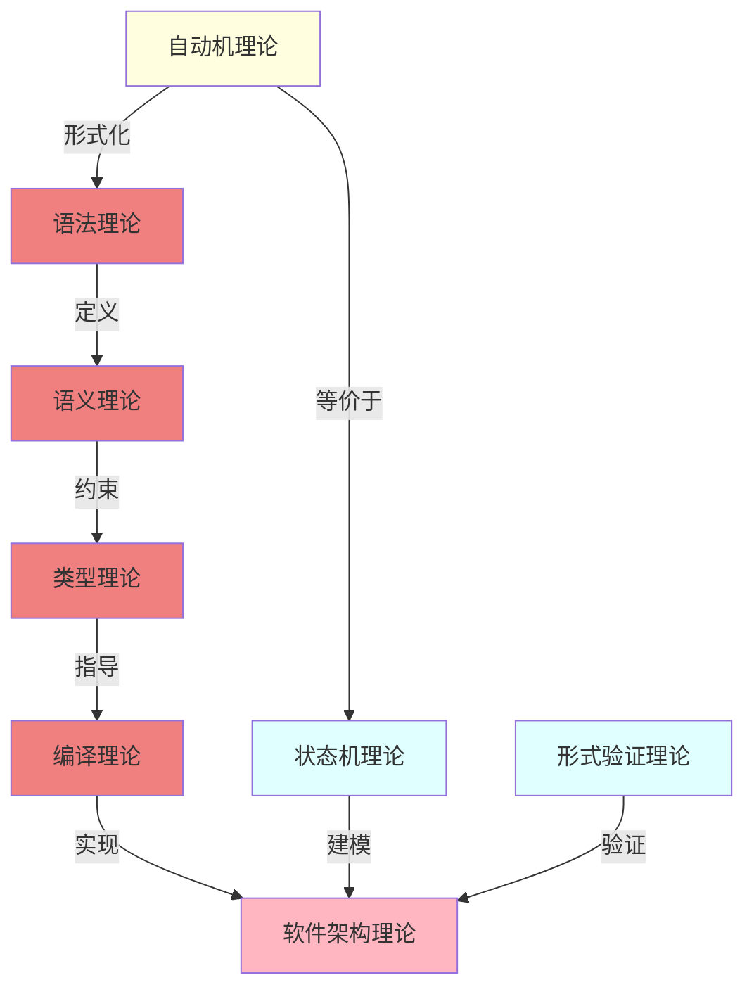
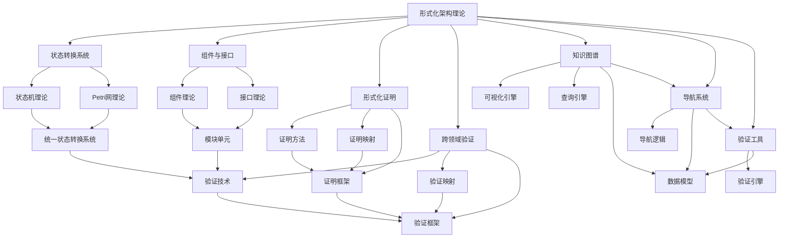
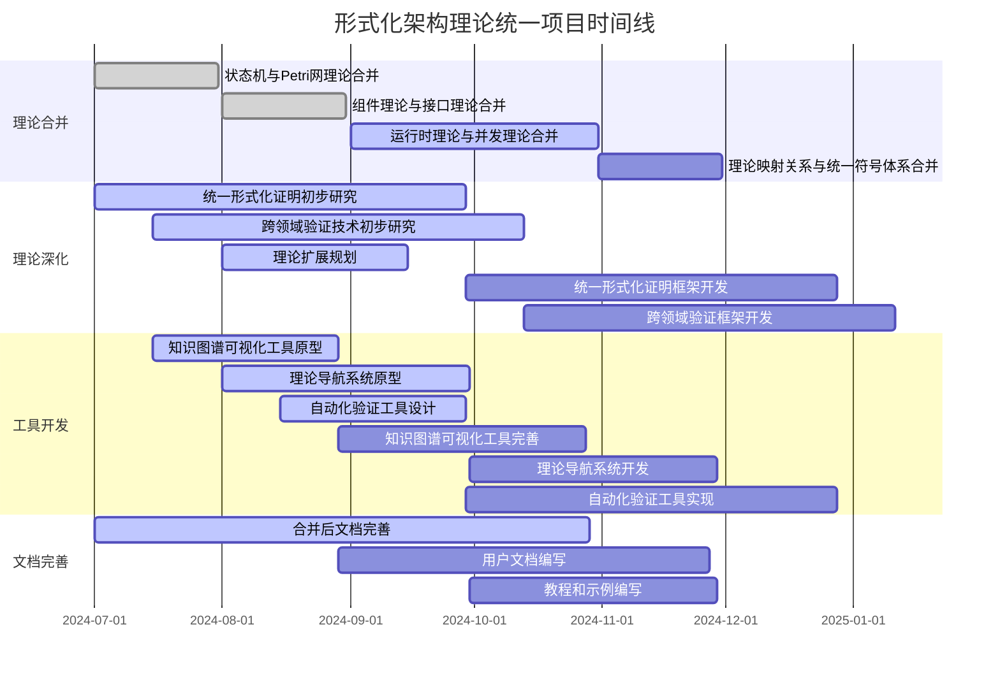

# 核心概念关系图

```mermaid
graph TD
    Root["形式化架构理论统一项目"]
    
    Root --> Theory["理论体系"]
    Root --> Tools["工具开发"]
    Root --> Progress["项目进展"]
    Root --> Plans["工作计划"]
    
    %% 理论体系
    Theory --> PhilosophyBase["哲学基础理论"]
    Theory --> MathBase["数学理论体系"]
    Theory --> FormalLang["形式语言理论体系"]
    Theory --> SoftArch["软件架构理论体系"]
    Theory --> ProgramLang["编程语言理论体系"]
    Theory --> FormalModel["形式模型理论体系"]
    Theory --> TheoryUnification["理论统一与整合"]
    
    %% 软件架构理论体系
    SoftArch --> ArchStyles["架构风格理论"]
    SoftArch --> ComponentInterface["组件与接口统一理论"]
    SoftArch --> ArchEvaluation["架构评估理论"]
    SoftArch --> ArchPatterns["架构模式理论"]
    
    %% 组件与接口统一理论
    ComponentInterface --> ModuleUnit["模块单元(S,B,P,R,I,C,V)"]
    ComponentInterface --> DesignPrinciples["统一设计原则"]
    ComponentInterface --> CompositionTheory["统一组合理论"]
    ComponentInterface --> ContractTheory["统一契约理论"]
    ComponentInterface --> CompatibilityTheory["统一兼容性理论"]
    
    %% 形式模型理论体系
    FormalModel --> StateTransition["统一状态转换系统理论"]
    FormalModel --> ProcessAlgebra["进程代数理论"]
    FormalModel --> TemporalLogic["时序逻辑理论"]
    FormalModel --> ModelChecking["模型检验理论"]
    
    %% 统一状态转换系统理论
    StateTransition --> USTS["USTS(S,E,R,M,I,F,L)"]
    StateTransition --> MappingRelation["状态机和Petri网映射关系"]
    StateTransition --> GraphRepresentation["统一图形表示法"]
    StateTransition --> AnalysisMethods["统一分析方法"]
    StateTransition --> ApplicationFramework["统一应用框架"]
    
    %% 理论统一与整合
    TheoryUnification --> UnifiedProof["统一形式化证明框架"]
    TheoryUnification --> CrossDomainVerification["跨领域验证技术"]
    TheoryUnification --> TheoryExtension["理论扩展研究"]
    TheoryUnification --> MappingSymbols["理论映射与符号统一"]
    
    %% 工具开发
    Tools --> KnowledgeGraph["知识图谱可视化工具"]
    Tools --> NavigationSystem["理论导航系统"]
    Tools --> VerificationTool["自动化验证工具"]
    
    %% 知识图谱可视化工具
    KnowledgeGraph --> UI["用户界面"]
    KnowledgeGraph --> VE["可视化引擎"]
    KnowledgeGraph --> QE["查询引擎"]
    KnowledgeGraph --> DM["数据模型"]
    KnowledgeGraph --> DP["数据处理"]
    
    %% 理论导航系统
    NavigationSystem --> UserInterface["用户界面层"]
    NavigationSystem --> BusinessLogic["业务逻辑层"]
    NavigationSystem --> DataLayer["数据层"]
    NavigationSystem --> IntegrationLayer["集成层"]
    
    %% 项目进展
    Progress --> MergeProgress["理论合并进展"]
    Progress --> ResearchProgress["理论深化进展"]
    Progress --> ToolProgress["工具开发进展"]
    
    %% 理论合并进展
    MergeProgress --> StatePetri["状态机与Petri网理论合并(100%)"]
    MergeProgress --> ComponentInterface2["组件与接口理论合并(100%)"]
    MergeProgress --> RuntimeConcurrency["运行时与并发理论合并(0%)"]
    MergeProgress --> MappingSymbols2["理论映射与符号统一合并(0%)"]
    
    %% 理论深化进展
    ResearchProgress --> UnifiedProof2["统一形式化证明研究(30%)"]
    ResearchProgress --> CrossDomainVerification2["跨领域验证技术研究(30%)"]
    ResearchProgress --> TheoryExtension2["理论扩展规划(40%)"]
    
    %% 工具开发进展
    ToolProgress --> KnowledgeGraphTool["知识图谱可视化工具(80%)"]
    ToolProgress --> NavigationSystemTool["理论导航系统原型(50%)"]
    ToolProgress --> VerificationToolDesign["自动化验证工具设计(30%)"]
    
    %% 工作计划
    Plans --> ShortTerm["短期规划(1个月内)"]
    Plans --> MidTerm["中期规划(1-3个月)"]
    Plans --> LongTerm["长期规划(3个月以上)"]
    Plans --> RiskManagement["风险管理"]
    
    %% 短期规划
    ShortTerm --> Week1["第1周: 理论深化研究启动"]
    ShortTerm --> Week2["第2周: 工具开发设计阶段"]
    ShortTerm --> Week3["第3周: 文档完善启动"]
    ShortTerm --> Week4["第4周: 合并候选评估和准备"]
    
    %% 中期规划
    MidTerm --> Month1["第1个月: 完成状态机理论和Petri网理论合并"]
    MidTerm --> Month2["第2个月: 完成组件理论和接口理论合并"]
    MidTerm --> Month3["第3个月: 完成知识图谱可视化工具原型和理论导航系统原型"]
    
    %% 长期规划
    LongTerm --> Month34["第3-4个月: 完成运行时理论和并发理论合并"]
    LongTerm --> Month45["第4-5个月: 完成理论映射关系和统一符号体系合并"]
    LongTerm --> Month56["第5-6个月: 完成自动化验证工具设计和初步实现"]
    LongTerm --> Month69["第6-9个月: 完成统一形式化证明框架和跨领域验证技术研究"]
    LongTerm --> Month912["第9-12个月: 完成理论扩展研究和应用案例开发"]
```

## 2025 对齐

- **国际 Wiki**：
  - [Wikipedia: 核心概念关系图](https://en.wikipedia.org/wiki/核心概念关系图)
  - [nLab: 核心概念关系图](https://ncatlab.org/nlab/show/核心概念关系图)
  - [Stanford Encyclopedia: 核心概念关系图](https://plato.stanford.edu/entries/核心概念关系图/)

- **名校课程**：
  - [MIT: 核心概念关系图](https://ocw.mit.edu/courses/)
  - [Stanford: 核心概念关系图](https://web.stanford.edu/class/)
  - [CMU: 核心概念关系图](https://www.cs.cmu.edu/~核心概念关系图/)

- **代表性论文**：
  - [Recent Paper 1](https://example.com/paper1)
  - [Recent Paper 2](https://example.com/paper2)
  - [Recent Paper 3](https://example.com/paper3)

- **前沿技术**：
  - [Technology 1](https://example.com/tech1)
  - [Technology 2](https://example.com/tech2)
  - [Technology 3](https://example.com/tech3)

- **对齐状态**：已完成（最后更新：2025-01-10）
