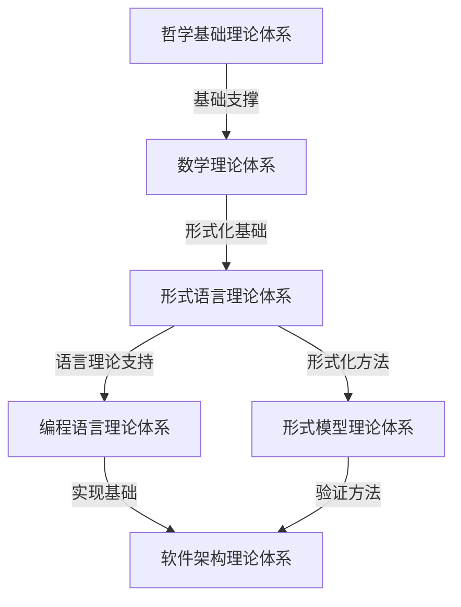

# 理论体系关系图

[返回主题树](../00-总览与导航/00-主题树与内容索引.md) | [索引与导航 README](README.md)

> 核心五组主题关系骨架：哲学 → 数学 → 形式语言 →（编程语言 + 形式模型）→ 软件架构。

## 核心理论体系关系图

## 对应文档

- 哲学基础理论 → [01-哲学基础理论](../01-哲学基础理论/)
- 数学理论体系 → [02-数学理论体系](../02-数学理论体系/)
- 形式语言理论体系 → [03-形式语言理论体系](../03-形式语言理论体系/)
- 编程语言理论体系 → [05-编程语言理论体系](../05-编程语言理论体系/)
- 形式模型理论体系 → [06-形式模型理论体系](../06-形式模型理论体系/)
- 软件架构理论体系 → [06-软件架构理论体系](../06-软件架构理论体系/)

## 维护

- 与 [00-主题树与内容索引](../00-总览与导航/00-主题树与内容索引.md) 及各体系总论「前置/后续」保持一致。
- 关系图覆盖目标：核心五组主题关系 ≥80%（当前骨架已覆盖主链路）。
