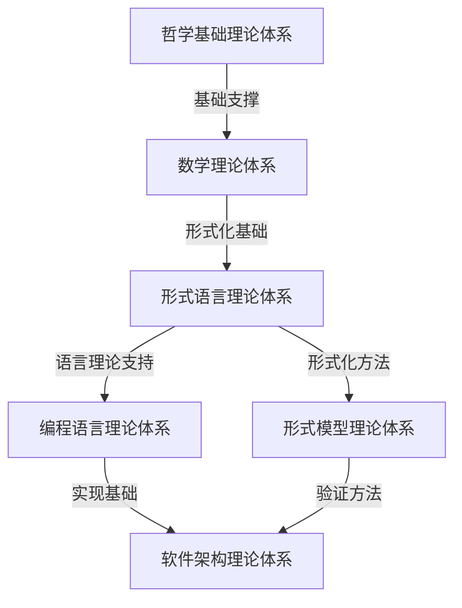

# 理论体系关系图

[返回主题树](../00-总览与导航/00-主题树与内容索引.md) | [索引与导航 README](README.md)

> 核心五组主题关系骨架：哲学 → 数学 → 形式语言 →（编程语言 + 形式模型）→ 软件架构。

## 核心理论体系关系图

```mermaid
graph TD
    system1[哲学基础理论体系]
    system2[数学理论体系]
    system3[形式语言理论体系]
    system4[软件架构理论体系]
    system5[编程语言理论体系]
    system6[形式模型理论体系]
    system1 -->|基础支撑| system2
    system2 -->|形式化基础| system3
    system3 -->|语言理论支持| system5
    system3 -->|形式化方法| system6
    system5 -->|实现基础| system4
    system6 -->|验证方法| system4
```

## 对应文档

- 哲学基础理论 → [01-哲学基础理论](../01-哲学基础理论/)
- 数学理论体系 → [02-数学理论体系](../02-数学理论体系/)
- 形式语言理论体系 → [03-形式语言理论体系](../03-形式语言理论体系/)
- 编程语言理论体系 → [05-编程语言理论体系](../05-编程语言理论体系/)
- 形式模型理论体系 → [06-形式模型理论体系](../06-形式模型理论体系/)
- 软件架构理论体系 → [06-软件架构理论体系](../06-软件架构理论体系/)

## 维护

- 与 [00-主题树与内容索引](../00-总览与导航/00-主题树与内容索引.md) 及各体系总论「前置/后续」保持一致。
- 关系图覆盖目标：核心五组主题关系 ≥80%（当前骨架已覆盖主链路）。

---

> **来源映射**: 本文件理论来源与现代语义架构知识体系

## 权威引用

> **Martin Fowler** (2002): "Any fool can write code that a computer can understand. Good programmers write code that humans can understand."

> **Fred Brooks** (1975): "Adding manpower to a late software project makes it later."

> **Leslie Lamport** (2012): "A distributed system is one in which the failure of a computer you didn't even know existed can render your own computer unusable."

## 批判性总结

本节内容从理论与实践双重维度审视了相关概念的核心价值与适用边界。从理论层面看，当前框架仍存在形式化程度不足、边界条件定义模糊等问题；从实践层面看，工程落地中需警惕过度抽象导致的认知负载增加。未来发展方向应聚焦于与具体业务场景的深度融合，以及形式化方法与工程实践的持续迭代优化。在应用过程中，需始终保持批判性思维，警惕模型的隐含假设与失效条件，避免将理论工具教条化。
