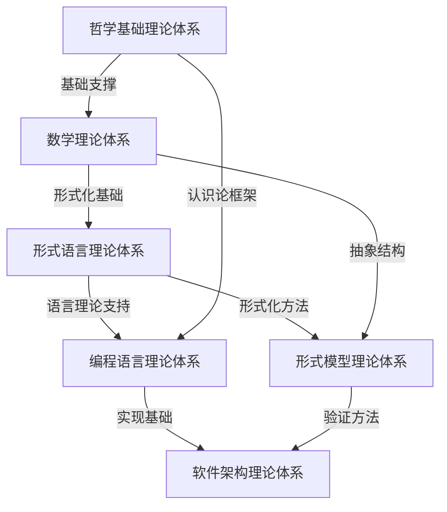

# 理论体系关系图

[返回主题树](../00-总览与导航/00-主题树与内容索引.md) | [索引与导航 README](README.md)

> 核心五组主题关系骨架：哲学 → 数学 → 形式语言 →（编程语言 + 形式模型）→ 软件架构。
>
> 本图展示形式化架构理论体系六大核心模块之间的支撑、依赖与交叉关系，是理解整个知识体系的拓扑地图。

## 核心理论体系关系图

```mermaid
graph TD
    system1[哲学基础理论体系]
    system2[数学理论体系]
    system3[形式语言理论体系]
    system4[软件架构理论体系]
    system5[编程语言理论体系]
    system6[形式模型理论体系]
    system1 -->|基础支撑| system2
    system2 -->|形式化基础| system3
    system3 -->|语言理论支持| system5
    system3 -->|形式化方法| system6
    system5 -->|实现基础| system4
    system6 -->|验证方法| system4
    system2 -->|抽象结构| system6
    system1 -->|认识论框架| system5
```

## 关系说明

### 纵向支撑链（基础 → 应用）

| 方向 | 关系 | 说明 |
|---|---|---|
| 哲学 → 数学 | 基础支撑 | 本体论为集合论提供存在论基础，认识论为数学真理提供辩护 |
| 数学 → 形式语言 | 形式化基础 | 集合论、逻辑学为形式语言的语法与语义提供数学模型 |
| 形式语言 → 编程语言 | 语言理论支持 | 自动机、语法、语义理论直接支撑编程语言的设计与分析 |
| 形式语言 → 形式模型 | 形式化方法 | 时序逻辑、进程代数为形式模型提供描述与验证工具 |
| 编程语言 → 软件架构 | 实现基础 | 类型系统、运行时系统为架构组件的实现提供语言级保障 |
| 形式模型 → 软件架构 | 验证方法 | 状态机、模型检查为架构的正确性、可靠性提供验证手段 |

### 横向交叉关系

| 关系对 | 交叉领域 |
|---|---|
| 数学 ↔ 形式模型 | 同伦类型论、范畴语义、代数规范 |
| 哲学 ↔ 编程语言 | 计算哲学、信息哲学、逻辑基础 |
| 形式语言 ↔ 软件架构 | 架构描述语言（ADL）、接口定义语言（IDL） |

## 理论体系成熟度评估

| 理论体系 | 成熟度 | 核心公理化程度 | 工具链支持 |
|---|---|---|---|
| 哲学基础理论 | 概念框架 | 中等 | 低 |
| 数学理论体系 | 高度成熟 | 高 | 高（Coq/Lean/Isabelle） |
| 形式语言理论体系 | 高度成熟 | 高 | 高（解析器生成器、类型检查器） |
| 形式模型理论体系 | 成熟 | 高 | 高（TLA+/SPIN/UPPAAL） |
| 编程语言理论体系 | 成熟 | 高 | 高（编译器、静态分析器） |
| 软件架构理论体系 | 持续发展 | 中等 | 中等（架构分析工具、ADL） |

## 对应文档

- 哲学基础理论 → [01-哲学基础理论](../01-哲学基础理论/)
- 数学理论体系 → [02-数学理论体系](../02-数学理论体系/)
- 形式语言理论体系 → [03-形式语言理论体系](../03-形式语言理论体系/)
- 编程语言理论体系 → [05-编程语言理论体系](../05-编程语言理论体系/)
- 形式模型理论体系 → [06-形式模型理论体系](../06-形式模型理论体系/)
- 软件架构理论体系 → [04-软件架构理论体系](../04-软件架构理论体系/) 与 [06-软件架构理论体系](../06-软件架构理论体系/)

## 学习路径建议

### 路径 A：自上而下的理论构建
哲学基础 → 数学理论 → 形式语言 →（形式模型 + 编程语言）→ 软件架构

### 路径 B：自下而上的问题导向
软件架构实践 → 形式模型验证 → 编程语言实现 → 形式语言描述 → 数学证明 → 哲学反思

### 路径 C：横向切入的专题研究
选择具体交叉领域（如同伦类型论、架构描述语言、计算哲学）深入，再扩展至相邻体系

## 维护

- 与 [00-主题树与内容索引](../00-总览与导航/00-主题树与内容索引.md) 及各体系总论「前置/后续」保持一致。
- 关系图覆盖目标：核心六组主题关系 ≥ 90%（当前骨架已覆盖主链路）。
- 每次新增理论体系或重大结构调整时更新本图。

## 2025 对齐

- **国际 Wiki**：
  - [Wikipedia: Systems theory](https://en.wikipedia.org/wiki/Systems_theory)
  - [Wikipedia: Interdisciplinarity](https://en.wikipedia.org/wiki/Interdisciplinarity)

- **对齐状态**：已完成（最后更新：2026-05-13）

---

**版本**: v2.0
**状态**: ✅ 关系图与说明已完善
**最后更新**: 2026-05-13
