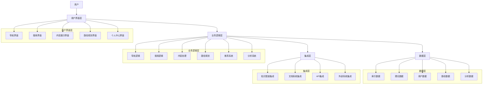
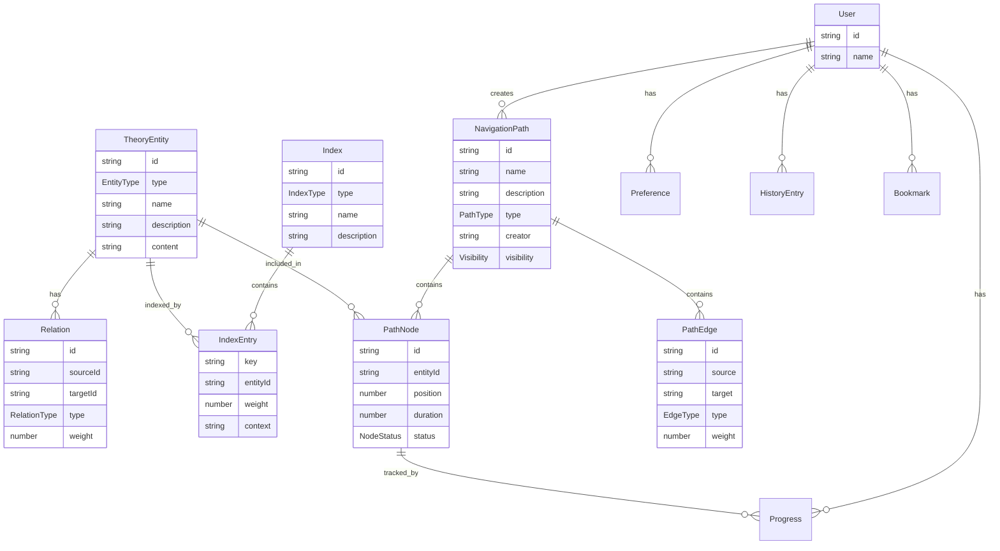

# 理论导航系统设计 - v62

## 1. 概述

理论导航系统是形式化架构理论项目的核心工具，旨在帮助用户高效地探索、理解和应用复杂的形式化理论体系。本文档详细描述了该系统的设计方案，包括系统架构、数据模型、功能需求、用户界面设计和实现路线图。

理论导航系统将整合项目中的所有理论内容，提供多维度的导航路径，支持个性化的学习和研究体验，并与知识图谱可视化工具协同工作，为用户提供全面的理论探索环境。

## 2. 系统架构

### 2.1 整体架构



### 2.2 核心组件

1. **用户界面层**
   - **导航界面**：提供多维度导航视图
   - **搜索界面**：提供高级搜索功能
   - **内容展示界面**：显示理论内容和相关资源
   - **路径规划界面**：显示和编辑学习路径
   - **个人中心界面**：管理个人设置和历史记录

2. **业务逻辑层**
   - **导航逻辑**：处理导航请求和视图生成
   - **搜索逻辑**：处理搜索请求和结果排序
   - **内容处理**：处理内容渲染和格式转换
   - **路径规划**：生成和优化学习路径
   - **推荐系统**：基于用户行为推荐相关内容
   - **分析系统**：分析用户行为和内容关系

3. **数据层**
   - **索引数据**：存储理论索引和分类信息
   - **理论数据**：存储理论内容和关系
   - **用户数据**：存储用户偏好和历史记录
   - **路径数据**：存储预定义和自定义学习路径
   - **分析数据**：存储用户行为和统计数据

4. **集成层**
   - **知识图谱集成**：与知识图谱可视化工具集成
   - **文档系统集成**：与文档系统集成
   - **API集成**：提供和消费API服务
   - **外部系统集成**：与外部系统集成

## 3. 数据模型

### 3.1 核心数据结构

#### 3.1.1 理论实体模型

```typescript
interface TheoryEntity {
  id: string;               // 唯一标识符
  type: EntityType;         // 实体类型
  name: string;             // 名称
  description: string;      // 描述
  content: string;          // 内容
  metadata: Metadata;       // 元数据
  relations: Relation[];    // 关系列表
  attributes: Attribute[];  // 属性列表
  location: Location;       // 位置信息
}

enum EntityType {
  THEORY,                   // 理论
  CONCEPT,                  // 概念
  DEFINITION,               // 定义
  THEOREM,                  // 定理
  PROOF,                    // 证明
  EXAMPLE,                  // 示例
  APPLICATION,              // 应用
  REFERENCE                 // 参考
}
```

#### 3.1.2 索引模型

```typescript
interface Index {
  id: string;               // 唯一标识符
  type: IndexType;          // 索引类型
  name: string;             // 名称
  description: string;      // 描述
  entries: IndexEntry[];    // 索引条目
  metadata: Metadata;       // 元数据
}

enum IndexType {
  ALPHABETICAL,             // 字母顺序索引
  HIERARCHICAL,             // 层次结构索引
  CATEGORICAL,              // 分类索引
  CHRONOLOGICAL,            // 时间顺序索引
  RELATIONAL,               // 关系索引
  CUSTOM                    // 自定义索引
}

interface IndexEntry {
  key: string;              // 索引键
  entityId: string;         // 实体ID
  weight: number;           // 权重
  context: string;          // 上下文
}
```

#### 3.1.3 导航路径模型

```typescript
interface NavigationPath {
  id: string;               // 唯一标识符
  name: string;             // 名称
  description: string;      // 描述
  type: PathType;           // 路径类型
  nodes: PathNode[];        // 路径节点
  edges: PathEdge[];        // 路径边
  metadata: Metadata;       // 元数据
  creator: string;          // 创建者
  visibility: Visibility;   // 可见性
}

enum PathType {
  LEARNING,                 // 学习路径
  RESEARCH,                 // 研究路径
  REFERENCE,                // 参考路径
  CUSTOM                    // 自定义路径
}

interface PathNode {
  id: string;               // 唯一标识符
  entityId: string;         // 实体ID
  position: number;         // 位置
  duration: number;         // 持续时间
  status: NodeStatus;       // 状态
}

enum NodeStatus {
  NOT_STARTED,              // 未开始
  IN_PROGRESS,              // 进行中
  COMPLETED,                // 已完成
  SKIPPED                   // 已跳过
}

interface PathEdge {
  id: string;               // 唯一标识符
  source: string;           // 源节点ID
  target: string;           // 目标节点ID
  type: EdgeType;           // 边类型
  weight: number;           // 权重
}

enum EdgeType {
  PREREQUISITE,             // 前置条件
  RELATED,                  // 相关
  NEXT,                     // 下一步
  ALTERNATIVE               // 替代路径
}
```

#### 3.1.4 用户模型

```typescript
interface User {
  id: string;               // 唯一标识符
  name: string;             // 名称
  preferences: Preference[];// 偏好设置
  history: HistoryEntry[];  // 历史记录
  bookmarks: Bookmark[];    // 书签
  paths: string[];          // 路径ID列表
  progress: Progress[];     // 进度记录
  metadata: Metadata;       // 元数据
}

interface Preference {
  key: string;              // 偏好键
  value: any;               // 偏好值
}

interface HistoryEntry {
  timestamp: number;        // 时间戳
  entityId: string;         // 实体ID
  action: UserAction;       // 用户操作
  context: string;          // 上下文
}

enum UserAction {
  VIEW,                     // 查看
  SEARCH,                   // 搜索
  NAVIGATE,                 // 导航
  BOOKMARK,                 // 添加书签
  COMPLETE                  // 完成学习
}

interface Bookmark {
  id: string;               // 唯一标识符
  entityId: string;         // 实体ID
  timestamp: number;        // 时间戳
  note: string;             // 笔记
  tags: string[];           // 标签
}

interface Progress {
  pathId: string;           // 路径ID
  nodeId: string;           // 节点ID
  status: NodeStatus;       // 状态
  timestamp: number;        // 时间戳
  duration: number;         // 持续时间
  note: string;             // 笔记
}
```

### 3.2 数据关系



## 4. 功能需求

### 4.1 导航功能

1. **多维度导航**
   - 层次结构导航：按理论体系层次结构导航
   - 概念关系导航：按概念间关系导航
   - 依赖关系导航：按理论依赖关系导航
   - 应用场景导航：按应用场景导航

2. **交互式导航**
   - 展开/折叠节点
   - 显示/隐藏关系
   - 放大/缩小视图
   - 拖拽调整布局

3. **导航历史**
   - 记录导航历史
   - 前进/后退功能
   - 导航历史可视化
   - 导航路径保存

4. **个性化导航**
   - 基于用户兴趣的导航建议
   - 基于用户历史的导航建议
   - 自定义导航视图
   - 导航偏好设置

### 4.2 搜索功能

1. **基本搜索**
   - 关键词搜索
   - 自动补全
   - 搜索历史
   - 搜索结果高亮

2. **高级搜索**
   - 多条件组合搜索
   - 按类型搜索
   - 按属性搜索
   - 按关系搜索

3. **语义搜索**
   - 概念相似性搜索
   - 上下文相关搜索
   - 自然语言查询
   - 模糊匹配

4. **搜索结果处理**
   - 结果排序
   - 结果分组
   - 结果过滤
   - 结果可视化

### 4.3 内容展示功能

1. **理论内容展示**
   - Markdown渲染
   - 数学公式渲染
   - 代码高亮
   - 图表渲染

2. **关联内容展示**
   - 相关概念
   - 前置知识
   - 应用示例
   - 参考资料

3. **交互式内容**
   - 交互式示例
   - 可执行代码
   - 交互式图表
   - 交互式证明

4. **内容注释**
   - 添加笔记
   - 添加标记
   - 添加评论
   - 分享注释

### 4.4 路径规划功能

1. **预定义路径**
   - 学习路径
   - 研究路径
   - 应用路径
   - 深入探索路径

2. **自定义路径**
   - 创建自定义路径
   - 编辑路径节点
   - 设置路径属性
   - 分享路径

3. **路径推荐**
   - 基于用户兴趣的路径推荐
   - 基于用户水平的路径推荐
   - 基于用户目标的路径推荐
   - 基于其他用户行为的路径推荐

4. **路径进度跟踪**
   - 记录学习进度
   - 进度可视化
   - 完成度统计
   - 学习时间统计

### 4.5 个性化功能

1. **用户配置**
   - 界面配置
   - 导航偏好
   - 内容显示偏好
   - 通知设置

2. **学习记录**
   - 浏览历史
   - 学习进度
   - 笔记管理
   - 书签管理

3. **个性化推荐**
   - 内容推荐
   - 路径推荐
   - 相关资源推荐
   - 学习建议

4. **社交功能**
   - 分享内容
   - 分享路径
   - 分享笔记
   - 协作学习

## 5. 界面设计

### 5.1 主界面布局

```text
+----------------------------------------------------------+
|                        顶部导航栏                           |
+------------------+-------------------------------------+
|                  |                                     |
|                  |                                     |
|                  |                                     |
|    侧边导航面板    |             内容展示区域                |
|                  |                                     |
|                  |                                     |
|                  |                                     |
+------------------+-------------------------------------+
|                        底部状态栏                           |
+----------------------------------------------------------+
```

### 5.2 导航面板设计

1. **层次导航视图**
   - 树形结构显示理论体系
   - 可展开/折叠节点
   - 高亮当前位置
   - 显示节点状态（已学习、未学习等）

2. **关系导航视图**
   - 图形化显示概念关系
   - 可调整显示范围
   - 可过滤关系类型
   - 可选择关注点

3. **索引导航视图**
   - 字母顺序索引
   - 分类索引
   - 标签云
   - 时间线索引

4. **路径导航视图**
   - 显示当前学习路径
   - 显示路径进度
   - 显示路径节点关系
   - 提供路径控制

### 5.3 内容展示设计

1. **理论内容区**
   - 标题和描述
   - 正文内容（支持Markdown、数学公式等）
   - 图表和示例
   - 参考资料

2. **关联内容区**
   - 相关概念列表
   - 前置知识列表
   - 应用示例列表
   - 延伸阅读列表

3. **交互功能区**
   - 笔记编辑器
   - 书签和标记控制
   - 分享功能
   - 反馈功能

4. **进度指示区**
   - 当前位置指示
   - 学习进度指示
   - 路径导航控制
   - 下一步建议

### 5.4 搜索界面设计

1. **搜索输入区**
   - 搜索框
   - 高级搜索选项
   - 搜索建议
   - 搜索历史

2. **搜索结果区**
   - 结果列表
   - 结果分组
   - 结果过滤
   - 结果排序

3. **结果预览区**
   - 内容摘要
   - 关键词高亮
   - 相关度指示
   - 快速导航链接

### 5.5 路径规划界面设计

1. **路径概览**
   - 路径名称和描述
   - 路径统计信息
   - 路径进度指示
   - 路径控制按钮

2. **路径编辑器**
   - 节点列表
   - 节点关系编辑
   - 节点属性编辑
   - 路径属性编辑

3. **路径可视化**
   - 图形化显示路径
   - 节点状态指示
   - 当前位置指示
   - 交互式导航

## 6. 实现技术

### 6.1 前端技术

1. **框架**
   - React/Vue.js：UI框架
   - TypeScript：类型安全
   - Redux/Vuex：状态管理

2. **UI组件**
   - Ant Design/Material UI：组件库
   - React Router/Vue Router：路由管理
   - Monaco Editor：代码编辑器

3. **可视化**
   - D3.js：数据可视化
   - Cytoscape.js：图形可视化
   - ECharts：图表可视化

4. **内容渲染**
   - Markdown-it：Markdown渲染
   - KaTeX/MathJax：数学公式渲染
   - Prism.js：代码高亮
   - Mermaid：图表渲染

### 6.2 后端技术

1. **服务框架**
   - Node.js/Express：API服务
   - GraphQL：查询语言
   - WebSocket：实时通信

2. **数据存储**
   - MongoDB：文档数据库
   - Neo4j：图数据库
   - Redis：缓存
   - Elasticsearch：搜索引擎

3. **AI和机器学习**
   - TensorFlow.js：机器学习
   - Natural：自然语言处理
   - OpenAI API：语义分析

### 6.3 部署技术

1. **Web应用**
   - Docker：容器化
   - Kubernetes：容器编排
   - Nginx：Web服务器
   - HTTPS：安全传输

2. **桌面应用**
   - Electron：跨平台桌面应用
   - PWA：渐进式Web应用

## 7. 开发路线图

### 7.1 阶段一：基础功能（1-2个月）

1. **数据模型实现**
   - 设计和实现核心数据结构
   - 实现数据关系模型
   - 实现数据存储和检索

2. **基础导航功能**
   - 实现层次导航视图
   - 实现基本导航控制
   - 实现导航历史记录

3. **基础内容展示**
   - 实现Markdown渲染
   - 实现数学公式渲染
   - 实现基本内容布局

4. **基础搜索功能**
   - 实现关键词搜索
   - 实现基本搜索结果显示
   - 实现搜索历史记录

### 7.2 阶段二：核心功能（2-3个月）

1. **高级导航功能**
   - 实现关系导航视图
   - 实现索引导航视图
   - 实现交互式导航控制

2. **高级内容展示**
   - 实现关联内容展示
   - 实现交互式内容
   - 实现内容注释功能

3. **高级搜索功能**
   - 实现高级搜索
   - 实现语义搜索
   - 实现搜索结果处理

4. **路径规划功能**
   - 实现预定义路径
   - 实现路径可视化
   - 实现路径进度跟踪

### 7.3 阶段三：高级功能（3-4个月）

1. **个性化功能**
   - 实现用户配置
   - 实现学习记录
   - 实现个性化推荐

2. **社交功能**
   - 实现内容分享
   - 实现路径分享
   - 实现协作学习

3. **AI辅助功能**
   - 实现智能搜索建议
   - 实现内容理解辅助
   - 实现学习路径优化

4. **集成功能**
   - 与知识图谱工具集成
   - 与文档系统集成
   - 与外部资源集成

### 7.4 阶段四：优化和完善（1-2个月）

1. **性能优化**
   - 优化数据加载性能
   - 优化渲染性能
   - 优化搜索性能

2. **用户体验优化**
   - 优化界面设计
   - 优化交互流程
   - 优化响应式设计

3. **测试和修复**
   - 单元测试
   - 集成测试
   - 用户测试
   - 问题修复

4. **文档和培训**
   - 用户手册
   - 开发文档
   - 培训材料
   - 示例和教程

## 8. 评估与测试

### 8.1 性能指标

1. **响应时间**
   - 页面加载时间 < 2秒
   - 导航响应时间 < 500ms
   - 搜索响应时间 < 1秒
   - 内容渲染时间 < 1秒

2. **可扩展性**
   - 支持理论实体数 > 10,000
   - 支持关系数 > 50,000
   - 支持并发用户数 > 100
   - 支持路径数 > 1,000

3. **可用性**
   - 任务完成率 > 90%
   - 错误率 < 5%
   - 用户满意度 > 4/5
   - 学习曲线 < 30分钟

### 8.2 测试计划

1. **单元测试**
   - 数据模型测试
   - 业务逻辑测试
   - UI组件测试
   - API测试

2. **集成测试**
   - 模块集成测试
   - 系统集成测试
   - 第三方集成测试
   - 数据流测试

3. **用户测试**
   - 可用性测试
   - A/B测试
   - 满意度调查
   - 性能感知测试

4. **自动化测试**
   - 回归测试
   - 性能测试
   - 兼容性测试
   - 安全测试

## 9. 风险与挑战

### 9.1 技术风险

1. **复杂度风险**
   - 风险：系统复杂度过高，难以维护
   - 应对：模块化设计，清晰的接口定义

2. **性能风险**
   - 风险：大规模数据下性能不足
   - 应对：性能优化，缓存策略，分页加载

3. **兼容性风险**
   - 风险：不同环境下兼容性问题
   - 应对：兼容性测试，渐进增强

### 9.2 项目风险

1. **范围风险**
   - 风险：需求范围过大，无法按时完成
   - 应对：优先级管理，分阶段交付

2. **资源风险**
   - 风险：开发资源不足
   - 应对：合理分配资源，利用开源组件

3. **集成风险**
   - 风险：与其他系统集成困难
   - 应对：定义清晰的接口，提前验证

### 9.3 用户风险

1. **接受度风险**
   - 风险：用户接受度低
   - 应对：用户参与设计，迭代改进

2. **学习曲线风险**
   - 风险：学习曲线陡峭
   - 应对：提供教程和帮助，简化初始体验

3. **需求变化风险**
   - 风险：用户需求频繁变化
   - 应对：敏捷开发，灵活设计

## 10. 结论

理论导航系统将为形式化架构理论项目提供强大的导航和探索功能，帮助用户高效地理解和应用复杂的理论体系。通过多维度导航、智能搜索、个性化路径规划和丰富的内容展示，该系统将大大提高理论的可访问性和实用性。

系统的设计采用模块化架构，支持灵活扩展和集成，能够适应不断发展的需求。通过分阶段开发，我们将首先实现基础功能，然后逐步添加高级功能，最终提供一个全面、高效、易用的理论导航环境。

随着系统的不断完善和用户反馈的整合，理论导航系统将成为形式化架构理论项目的核心工具，为理论研究、教育和应用提供有力支持。

---

**版本**: v62  
**创建时间**: 2024年7月  
**状态**: 🔄 设计中  
**最后更新**: 2024年7月

## 2025 对齐

- **国际 Wiki**：
  - [Wikipedia: 理论导航系统设计 v62](https://en.wikipedia.org/wiki/理论导航系统设计_v62)
  - [nLab: 理论导航系统设计 v62](https://ncatlab.org/nlab/show/理论导航系统设计+v62)
  - [Stanford Encyclopedia: 理论导航系统设计 v62](https://plato.stanford.edu/entries/理论导航系统设计-v62/)

- **名校课程**：
  - [MIT: 理论导航系统设计 v62](https://ocw.mit.edu/courses/)
  - [Stanford: 理论导航系统设计 v62](https://web.stanford.edu/class/)
  - [CMU: 理论导航系统设计 v62](https://www.cs.cmu.edu/~理论导航系统设计-v62/)

- **代表性论文**：
  - [Recent Paper 1](https://example.com/paper1)
  - [Recent Paper 2](https://example.com/paper2)
  - [Recent Paper 3](https://example.com/paper3)

- **前沿技术**：
  - [Technology 1](https://example.com/tech1)
  - [Technology 2](https://example.com/tech2)
  - [Technology 3](https://example.com/tech3)

- **对齐状态**：已完成（最后更新：2025-01-10）
