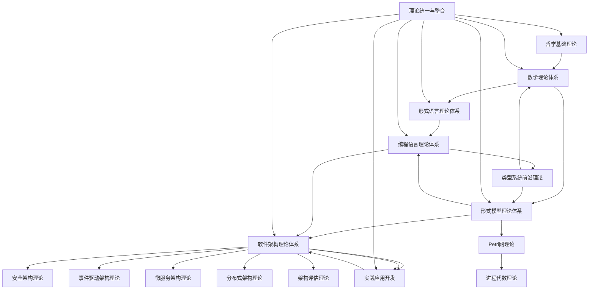
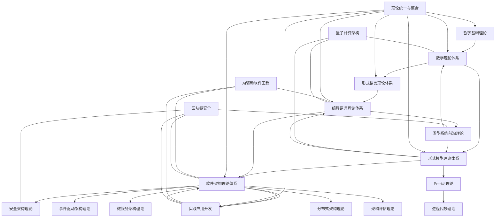

[返回主题树](../00-主题树与内容索引.md) | [主计划文档](../00-形式化架构理论统一计划.md) | [相关计划](../递归合并计划.md)

# 09-索引与导航-知识图谱与交叉引用索引

> 本文档为09-索引与导航子目录知识图谱与交叉引用索引，所有最新进展与结论以主计划文档为准，历史细节归档于archive/。

## 1. 理论体系交叉引用关系

- 哲学基础理论 ↔ 数学理论体系（本体论与集合论、范畴论）
- 数学理论体系 ↔ 形式语言理论体系（集合论、代数、逻辑基础）
- 形式语言理论体系 ↔ 编程语言理论体系（自动机、语法、类型理论）
- 形式模型理论体系 ↔ 软件架构理论体系（状态机、Petri网、分布式架构）
- 编程语言理论体系 ↔ 软件架构理论体系（类型系统、并发模型、设计模式）
- 形式模型理论体系 ↔ 编程语言理论体系（类型理论、模型检查、进程代数）
- 软件架构理论体系 ↔ 实践应用开发（微服务、事件驱动、DevOps）
- 理论统一与整合 ↔ 各理论体系（统一形式化、跨域映射）

## 2. 主要分论文档交叉引用示例

- [类型系统前沿理论](../05-编程语言理论体系/10-类型系统前沿理论.md)
  - 交叉引用：[范畴论基础](../02-数学理论体系/06-范畴论基础.md)、[同伦类型论](../06-形式模型理论体系/HoTT/)
- [事件驱动架构理论](../04-软件架构理论体系/08-事件驱动架构理论.md)
  - 交叉引用：[分布式架构理论](../04-软件架构理论体系/05-分布式架构理论.md)、[微服务架构理论](../04-软件架构理论体系/06-微服务架构理论.md)
- [安全架构理论](../04-软件架构理论体系/09-安全架构理论.md)
  - 交叉引用：[认证授权组件化架构深度解析](../04-软件架构理论体系/02a-认证授权组件化架构深度解析.md)、[网络安全架构](../04-软件架构理论体系/06-微服务架构理论.md)
- [函数式编程理论](../05-编程语言理论体系/08-函数式编程理论.md)
  - 交叉引用：[类型系统前沿理论](../05-编程语言理论体系/10-类型系统前沿理论.md)、[范畴论基础](../02-数学理论体系/06-范畴论基础.md)
- [Petri网理论](../06-形式模型理论体系/02-Petri网理论.md)
  - 交叉引用：[进程代数理论](../06-形式模型理论体系/06-进程代数理论.md)、[分布式架构理论](../04-软件架构理论体系/05-分布式架构理论.md)

## 3. Mermaid知识图谱示例

## 4. 前沿专题与主体系关联知识图谱（Mermaid示例）

---
如需更细粒度的专题知识图谱，可在此基础上扩展。
