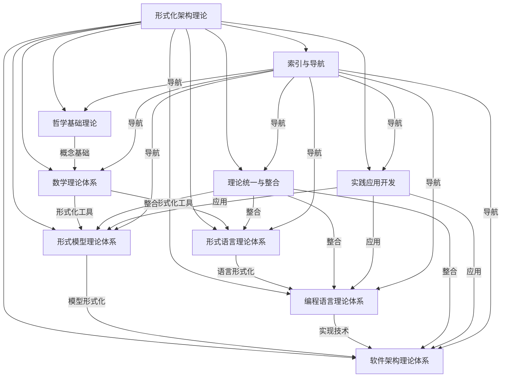
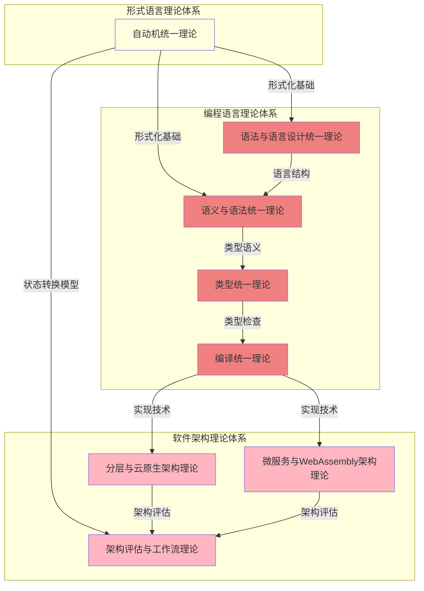
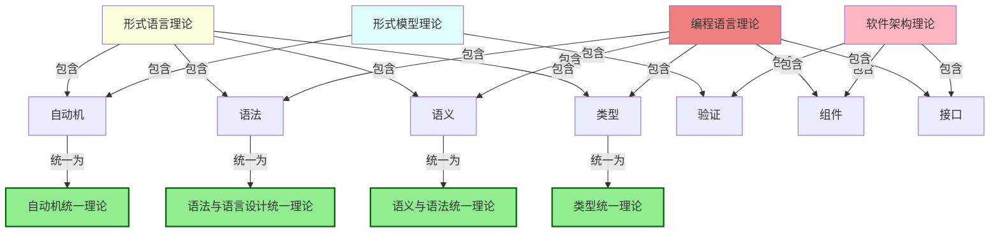
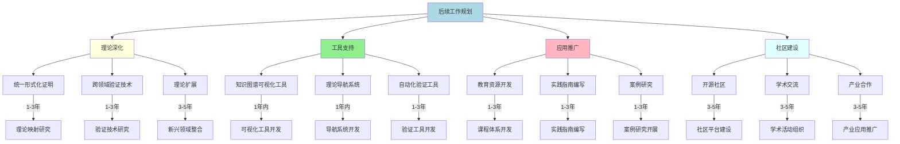

# 统一理论体系图谱

## 1. 概述

本文档整合了形式化架构理论项目中的所有理论体系和概念关系，提供一个统一的视图，帮助理解不同理论之间的联系和整体架构。该图谱是在完成递归合并与语义整合工作后，基于项目的最新状态生成的。

## 2. 顶层理论体系统一图谱

## 3. 合并后的核心理论关系图谱

## 4. 核心概念统一图谱

```mermaid
graph TD
    %% 核心概念
    D1[形式化]
    D2[架构]
    D3[语言]
    D4[模型]
    D5[验证]
    D6[实现]
    
    %% 一级概念
    D1 --> E1[形式语法]
    D1 --> E2[形式语义]
    D1 --> E3[形式模型]
    D1 --> E4[形式验证]
    
    D2 --> E5[架构风格]
    D2 --> E6[架构模式]
    D2 --> E7[架构评估]
    D2 --> E8[架构演化]
    
    D3 --> E9[语法理论]
    D3 --> E10[语义理论]
    D3 --> E11[类型理论]
    D3 --> E12[编译理论]
    
    D4 --> E13[状态模型]
    D4 --> E14[行为模型]
    D4 --> E15[交互模型]
    D4 --> E16[时序模型]
    
    %% 合并后的概念关系
    E1 -- "统一" --> E9
    E2 -- "统一" --> E10
    E3 -- "统一" --> E13
    E4 -- "应用于" --> E7
    
    E5 -- "包含" --> F1[分层架构]
    E5 -- "包含" --> F2[微服务架构]
    E5 -- "包含" --> F3[云原生架构]
    
    E11 -- "包含" --> F4[类型检查]
    E11 -- "包含" --> F5[类型推导]
    E11 -- "包含" --> F6[多态性]
    
    E12 -- "包含" --> F7[词法分析]
    E12 -- "包含" --> F8[语法分析]
    E12 -- "包含" --> F9[语义分析]
    E12 -- "包含" --> F10[代码生成]
    
    E13 -- "包含" --> F11[自动机]
    E13 -- "包含" --> F12[状态机]
    
    %% 合并后的概念
    F1 -- "合并" --> G1[分层与云原生架构]
    F2 -- "合并" --> G2[微服务与WebAssembly架构]
    F11 -- "统一" --> G3[自动机统一理论]
    E9 -- "合并" --> G4[语法与语言设计]
    E10 -- "合并" --> G5[语义与语法]
    E11 -- "合并" --> G6[类型统一理论]
    E12 -- "合并" --> G7[编译统一理论]
    
    %% 样式
    style D1 fill:lightblue
    style D2 fill:lightgreen
    style D3 fill:lightyellow
    style D4 fill:lightpink
    style D5 fill:lightcyan
    style D6 fill:lightgray
    
    style G1 fill:lightgreen,stroke:darkgreen,stroke-width:2px
    style G2 fill:lightgreen,stroke:darkgreen,stroke-width:2px
    style G3 fill:lightyellow,stroke:darkorange,stroke-width:2px
    style G4 fill:lightyellow,stroke:darkorange,stroke-width:2px
    style G5 fill:lightyellow,stroke:darkorange,stroke-width:2px
    style G6 fill:lightyellow,stroke:darkorange,stroke-width:2px
    style G7 fill:lightyellow,stroke:darkorange,stroke-width:2px
```

## 5. 跨领域概念映射

## 6. 理论体系演化图谱

```mermaid
graph TD
    %% 原始理论体系
    A1[形式语言自动机理论]
    A2[形式模型自动机理论]
    A3[分层架构理论]
    A4[云原生架构理论]
    A5[微服务架构理论]
    A6[WebAssembly架构理论]
    A7[架构评估理论]
    A8[工作流架构理论]
    A9[语法理论]
    A10[语言设计理论]
    A11[语义理论]
    A12[语法和语义]
    A13[类型理论]
    A14[类型系统]
    A15[编译理论]
    A16[编译器理论]
    
    %% 合并后的理论体系
    B1[自动机统一理论]
    B2[分层与云原生架构理论]
    B3[微服务与WebAssembly架构理论]
    B4[架构评估与工作流理论]
    B5[语法与语言设计统一理论]
    B6[语义与语法统一理论]
    B7[类型统一理论]
    B8[编译统一理论]
    
    %% 演化关系
    A1 -- "合并" --> B1
    A2 -- "合并" --> B1
    A3 -- "合并" --> B2
    A4 -- "合并" --> B2
    A5 -- "合并" --> B3
    A6 -- "合并" --> B3
    A7 -- "合并" --> B4
    A8 -- "合并" --> B4
    A9 -- "合并" --> B5
    A10 -- "合并" --> B5
    A11 -- "合并" --> B6
    A12 -- "合并" --> B6
    A13 -- "合并" --> B7
    A14 -- "合并" --> B7
    A15 -- "合并" --> B8
    A16 -- "合并" --> B8
    
    %% 样式
    style A1 fill:lightyellow,opacity:0.7
    style A2 fill:lightcyan,opacity:0.7
    style A3 fill:lightpink,opacity:0.7
    style A4 fill:lightpink,opacity:0.7
    style A5 fill:lightpink,opacity:0.7
    style A6 fill:lightpink,opacity:0.7
    style A7 fill:lightpink,opacity:0.7
    style A8 fill:lightpink,opacity:0.7
    style A9 fill:lightcoral,opacity:0.7
    style A10 fill:lightcoral,opacity:0.7
    style A11 fill:lightcoral,opacity:0.7
    style A12 fill:lightcoral,opacity:0.7
    style A13 fill:lightcoral,opacity:0.7
    style A14 fill:lightcoral,opacity:0.7
    style A15 fill:lightcoral,opacity:0.7
    style A16 fill:lightcoral,opacity:0.7
    
    style B1 fill:lightgreen,stroke:darkgreen,stroke-width:2px
    style B2 fill:lightgreen,stroke:darkgreen,stroke-width:2px
    style B3 fill:lightgreen,stroke:darkgreen,stroke-width:2px
    style B4 fill:lightgreen,stroke:darkgreen,stroke-width:2px
    style B5 fill:lightgreen,stroke:darkgreen,stroke-width:2px
    style B6 fill:lightgreen,stroke:darkgreen,stroke-width:2px
    style B7 fill:lightgreen,stroke:darkgreen,stroke-width:2px
    style B8 fill:lightgreen,stroke:darkgreen,stroke-width:2px
```

## 7. 后续工作规划图谱

## 8. 总结

本统一理论体系图谱整合了形式化架构理论项目中的所有理论体系和概念关系，展示了理论之间的联系和整体架构。通过递归合并与语义整合，项目已经建立了一个更加统一和连贯的理论框架，为后续的理论深化、工具支持、应用推广和社区建设奠定了坚实的基础。

后续工作将继续深化理论研究，开发更加完善的工具支持，推广理论在实践中的应用，并建设活跃的开源社区，促进形式化架构理论的发展和应用。
