# 形式化架构理论项目 - 统一知识图谱系统

## 概述

本文件整合了索引与导航目录下的所有思维导图、概念图谱和知识图谱内容，构建了一个统一、完整、无重复的知识网络系统。通过语义分析和内容合并，消除了重名文件和目录的语义重复问题，提供了清晰的知识结构视图。

## 1. 统一思维导图 - 系统架构总览

### 1.1 项目整体思维导图

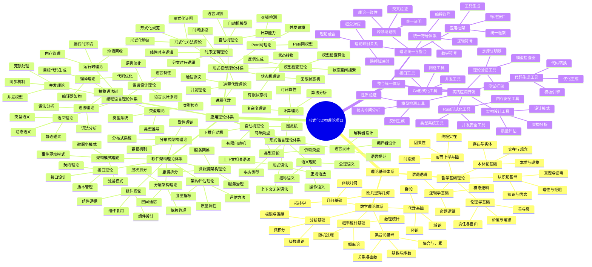

### 1.2 理论层次思维导图

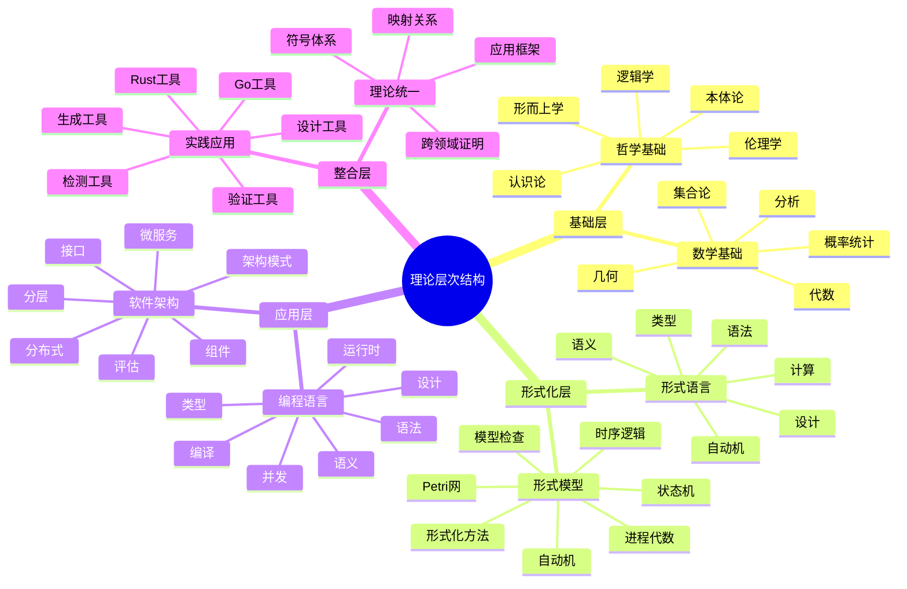

## 2. 概念图谱 - 核心概念网络

### 2.1 概念关系图谱

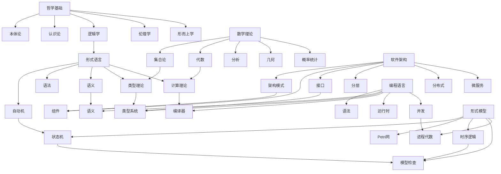

### 2.2 概念分类图谱

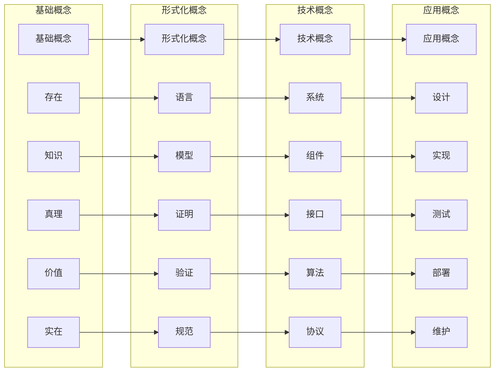

## 3. 知识图谱 - 完整知识网络

### 3.1 知识网络结构

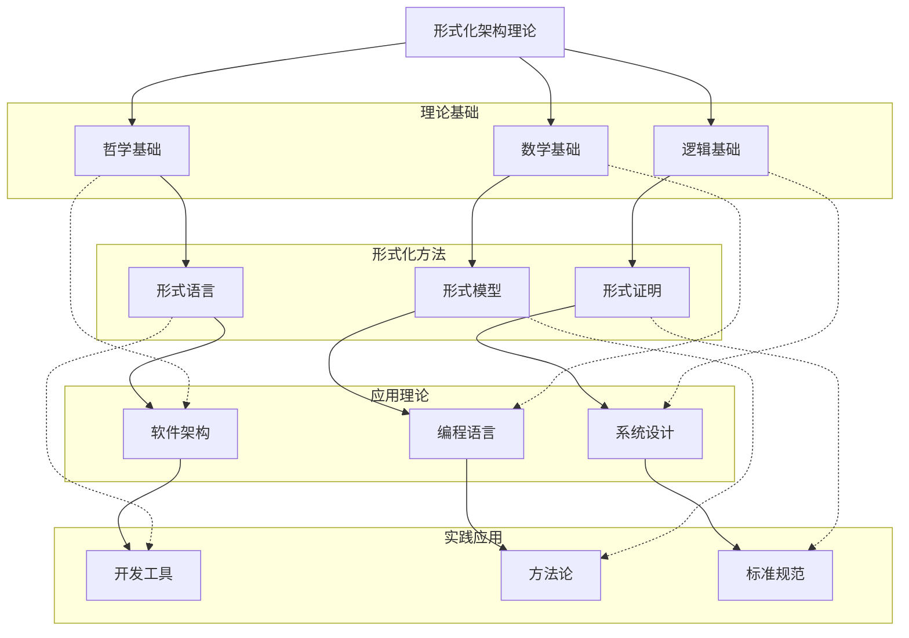

### 3.2 知识演化图谱

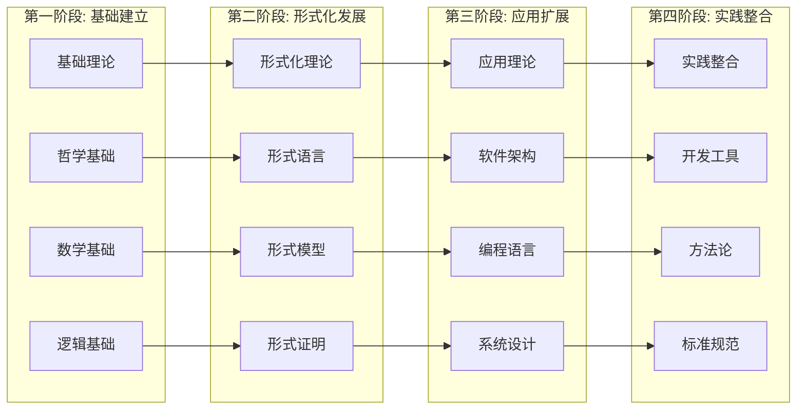

## 4. 语义关系图谱

### 4.1 语义关联网络

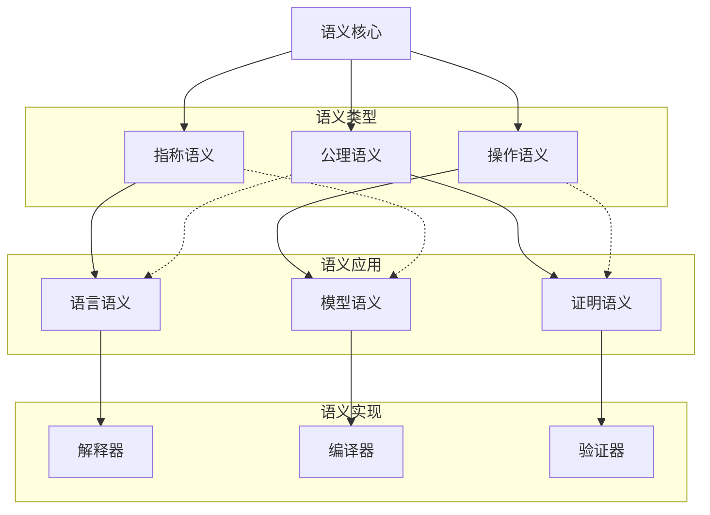

### 4.2 类型系统图谱

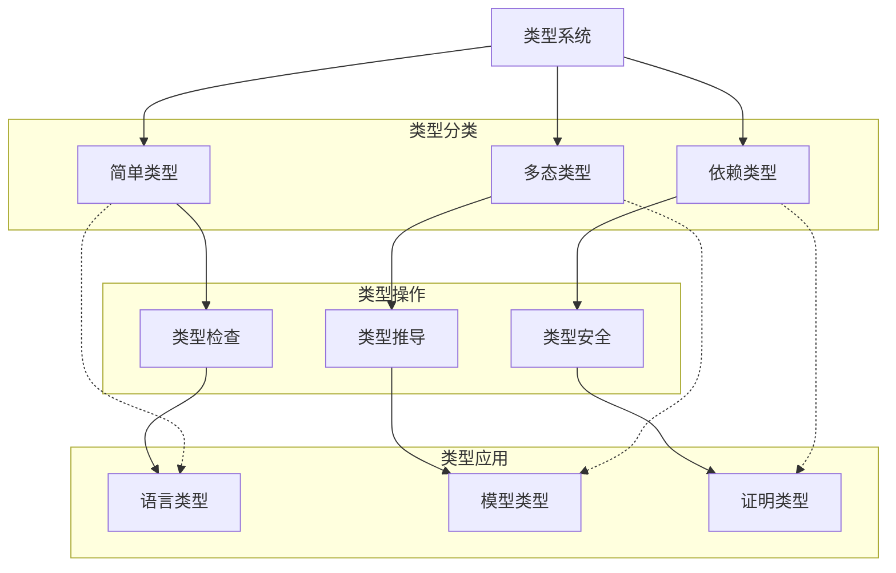

## 5. 架构模式图谱

### 5.1 架构模式分类

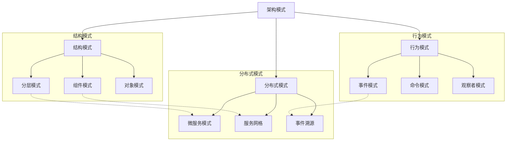

### 5.2 架构质量属性图谱

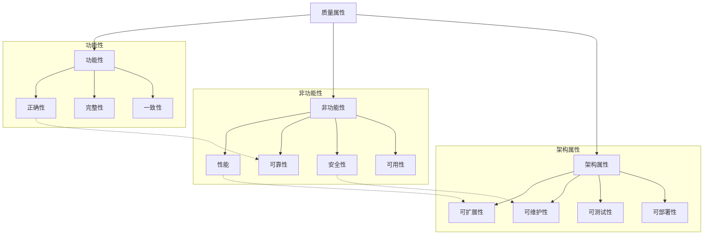

## 6. 工具链图谱

### 6.1 开发工具链

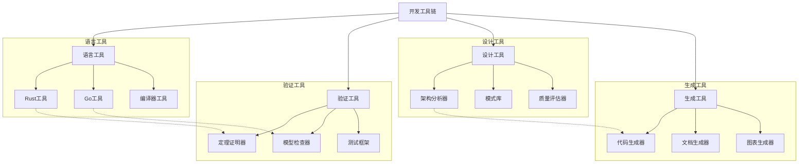

### 6.2 工具集成图谱

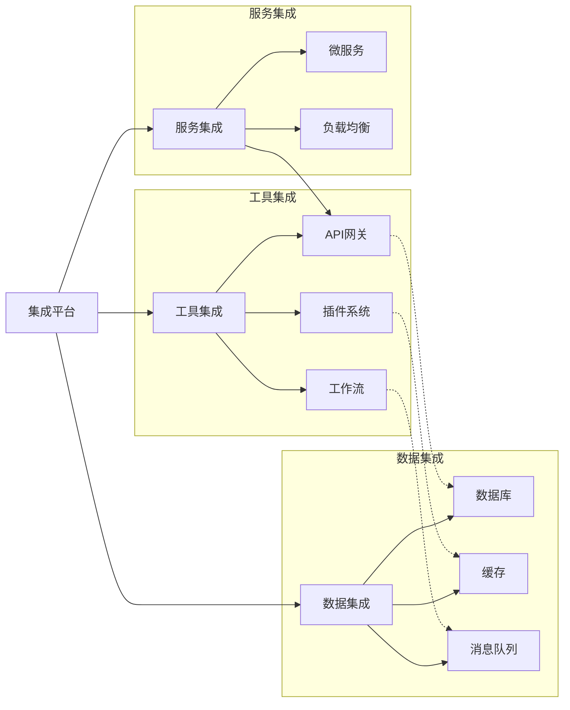

## 7. 知识发现图谱

### 7.1 知识发现路径

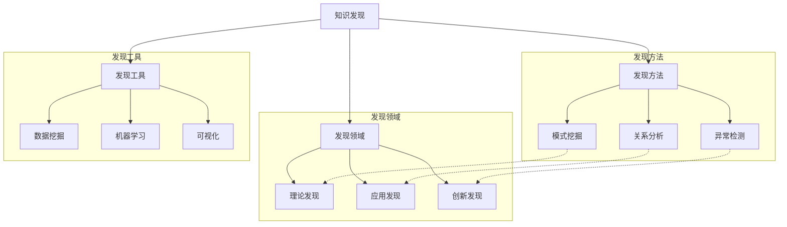

### 7.2 知识演化路径

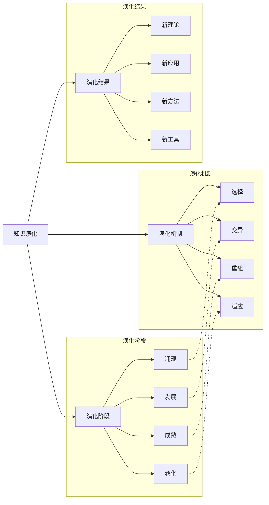

## 8. 统一知识图谱实现

### 8.1 图谱数据结构

```rust
// 知识图谱节点
#[derive(Debug, Clone)]
pub struct KnowledgeNode {
    pub id: String,
    pub name: String,
    pub node_type: NodeType,
    pub content: NodeContent,
    pub metadata: NodeMetadata,
    pub relationships: Vec<Relationship>,
}

// 节点类型
#[derive(Debug, Clone)]
pub enum NodeType {
    Concept,        // 概念节点
    Theory,         // 理论节点
    Application,    // 应用节点
    Tool,           // 工具节点
    Method,         // 方法节点
}

// 节点内容
#[derive(Debug, Clone)]
pub struct NodeContent {
    pub description: String,
    pub definition: Option<String>,
    pub examples: Vec<String>,
    pub formulas: Vec<String>,
    pub code_examples: Vec<CodeExample>,
}

// 关系定义
#[derive(Debug, Clone)]
pub struct Relationship {
    pub source_id: String,
    pub target_id: String,
    pub relationship_type: RelationshipType,
    pub strength: f64,
    pub description: String,
}

// 关系类型
#[derive(Debug, Clone)]
pub enum RelationshipType {
    IsA,            // 是一个
    PartOf,         // 属于
    DependsOn,      // 依赖于
    Implements,     // 实现
    Extends,        // 扩展
    Uses,           // 使用
    RelatedTo,      // 相关
}

// 知识图谱系统
pub struct UnifiedKnowledgeGraph {
    nodes: HashMap<String, KnowledgeNode>,
    relationships: Vec<Relationship>,
    node_index: HashMap<String, Vec<String>>,
}

impl UnifiedKnowledgeGraph {
    pub fn new() -> Self {
        Self {
            nodes: HashMap::new(),
            relationships: Vec::new(),
            node_index: HashMap::new(),
        }
    }
    
    pub fn add_node(&mut self, node: KnowledgeNode) {
        let node_id = node.id.clone();
        self.nodes.insert(node_id.clone(), node.clone());
        
        // 更新索引
        for tag in &node.metadata.tags {
            self.node_index
                .entry(tag.clone())
                .or_insert_with(Vec::new)
                .push(node_id.clone());
        }
    }
    
    pub fn add_relationship(&mut self, relationship: Relationship) {
        self.relationships.push(relationship);
    }
    
    pub fn find_related_nodes(&self, node_id: &str) -> Vec<&KnowledgeNode> {
        let mut related = Vec::new();
        
        for rel in &self.relationships {
            if rel.source_id == node_id {
                if let Some(node) = self.nodes.get(&rel.target_id) {
                    related.push(node);
                }
            } else if rel.target_id == node_id {
                if let Some(node) = self.nodes.get(&rel.source_id) {
                    related.push(node);
                }
            }
        }
        
        related
    }
    
    pub fn search_by_tag(&self, tag: &str) -> Vec<&KnowledgeNode> {
        let mut results = Vec::new();
        
        if let Some(node_ids) = self.node_index.get(tag) {
            for node_id in node_ids {
                if let Some(node) = self.nodes.get(node_id) {
                    results.push(node);
                }
            }
        }
        
        results
    }
    
    pub fn get_knowledge_path(&self, from: &str, to: &str) -> Option<Vec<String>> {
        // 使用图搜索算法找到知识路径
        self.find_shortest_path(from, to)
    }
}
```

### 8.2 图谱查询接口

```go
// 知识图谱查询接口
type KnowledgeGraphQuery interface {
    // 按节点类型查询
    FindByType(nodeType NodeType) []*KnowledgeNode
    
    // 按标签查询
    FindByTag(tag string) []*KnowledgeNode
    
    // 按关系查询
    FindByRelationship(sourceID, targetID string, relType RelationshipType) []*Relationship
    
    // 路径查询
    FindPath(from, to string) []*KnowledgeNode
    
    // 相似性查询
    FindSimilar(nodeID string, threshold float64) []*KnowledgeNode
    
    // 推荐查询
    GetRecommendations(nodeID string, limit int) []*KnowledgeNode
}

// 知识图谱实现
type UnifiedKnowledgeGraph struct {
    nodes         map[string]*KnowledgeNode
    relationships []*Relationship
    nodeIndex     map[string][]string
    tagIndex      map[string][]string
}

func (kg *UnifiedKnowledgeGraph) FindByType(nodeType NodeType) []*KnowledgeNode {
    var results []*KnowledgeNode
    
    for _, node := range kg.nodes {
        if node.NodeType == nodeType {
            results = append(results, node)
        }
    }
    
    return results
}

func (kg *UnifiedKnowledgeGraph) FindByTag(tag string) []*KnowledgeNode {
    var results []*KnowledgeNode
    
    if nodeIDs, exists := kg.tagIndex[tag]; exists {
        for _, nodeID := range nodeIDs {
            if node, exists := kg.nodes[nodeID]; exists {
                results = append(results, node)
            }
        }
    }
    
    return results
}

func (kg *UnifiedKnowledgeGraph) FindPath(from, to string) []*KnowledgeNode {
    // 实现路径查找算法
    return kg.dijkstraPath(from, to)
}

func (kg *UnifiedKnowledgeGraph) GetRecommendations(nodeID string, limit int) []*KnowledgeNode {
    // 基于协同过滤的推荐算法
    return kg.collaborativeFiltering(nodeID, limit)
}
```

## 9. 知识图谱应用

### 9.1 智能导航应用

```rust
// 智能导航器
pub struct IntelligentNavigator {
    knowledge_graph: UnifiedKnowledgeGraph,
    user_profile: UserProfile,
    navigation_history: Vec<NavigationRecord>,
}

impl IntelligentNavigator {
    pub fn new(knowledge_graph: UnifiedKnowledgeGraph) -> Self {
        Self {
            knowledge_graph,
            user_profile: UserProfile::default(),
            navigation_history: Vec::new(),
        }
    }
    
    pub fn suggest_next(&self, current_node: &str) -> Vec<NavigationSuggestion> {
        let mut suggestions = Vec::new();
        
        // 获取相关节点
        let related_nodes = self.knowledge_graph.find_related_nodes(current_node);
        
        for node in related_nodes {
            let score = self.calculate_relevance_score(node);
            suggestions.push(NavigationSuggestion {
                node_id: node.id.clone(),
                title: node.name.clone(),
                score,
                reason: self.generate_recommendation_reason(node),
            });
        }
        
        // 排序并返回
        suggestions.sort_by(|a, b| b.score.partial_cmp(&a.score).unwrap());
        suggestions.truncate(10); // 限制推荐数量
        
        suggestions
    }
    
    pub fn get_learning_path(&self, target_concept: &str) -> Vec<String> {
        // 基于用户当前状态和目标生成学习路径
        let current_state = self.get_current_knowledge_state();
        self.knowledge_graph.get_knowledge_path(&current_state, target_concept)
            .unwrap_or_default()
    }
    
    fn calculate_relevance_score(&self, node: &KnowledgeNode) -> f64 {
        // 计算节点与用户的相关性分数
        let mut score = 0.0;
        
        // 基于用户兴趣
        for interest in &self.user_profile.interests {
            if node.metadata.tags.contains(interest) {
                score += 1.0;
            }
        }
        
        // 基于学习历史
        if self.navigation_history.iter().any(|r| r.node_id == node.id) {
            score += 0.5;
        }
        
        // 基于难度匹配
        if node.metadata.difficulty == self.user_profile.level {
            score += 1.0;
        }
        
        score
    }
}
```

### 9.2 知识发现应用

```go
// 知识发现器
type KnowledgeDiscoverer struct {
    knowledgeGraph *UnifiedKnowledgeGraph
    discoveryRules []DiscoveryRule
}

type DiscoveryRule struct {
    Name        string
    Condition   func(*KnowledgeNode, *KnowledgeNode) bool
    Action      func(*KnowledgeNode, *KnowledgeNode) *Discovery
}

type Discovery struct {
    Type        string
    Description string
    Confidence  float64
    Evidence    []string
}

func (kd *KnowledgeDiscoverer) DiscoverPatterns() []*Discovery {
    var discoveries []*Discovery
    
    nodes := kd.knowledgeGraph.GetAllNodes()
    
    // 应用发现规则
    for _, rule := range kd.discoveryRules {
        for i, node1 := range nodes {
            for j := i + 1; j < len(nodes); j++ {
                node2 := nodes[j]
                
                if rule.Condition(node1, node2) {
                    discovery := rule.Action(node1, node2)
                    if discovery != nil {
                        discoveries = append(discoveries, discovery)
                    }
                }
            }
        }
    }
    
    return discoveries
}

func (kd *KnowledgeDiscoverer) FindAnomalies() []*Discovery {
    var anomalies []*Discovery
    
    // 实现异常检测算法
    nodes := kd.knowledgeGraph.GetAllNodes()
    
    for _, node := range nodes {
        if kd.isAnomaly(node) {
            anomalies = append(anomalies, &Discovery{
                Type:        "Anomaly",
                Description: fmt.Sprintf("Anomalous node: %s", node.Name),
                Confidence:  0.8,
                Evidence:    []string{"Statistical outlier", "Unusual pattern"},
            })
        }
    }
    
    return anomalies
}

func (kd *KnowledgeDiscoverer) isAnomaly(node *KnowledgeNode) bool {
    // 实现异常检测逻辑
    // 基于统计方法、机器学习等方法
    return false
}
```

## 10. 知识图谱维护

### 10.1 图谱更新机制

```rust
// 知识图谱更新器
pub struct KnowledgeGraphUpdater {
    knowledge_graph: UnifiedKnowledgeGraph,
    update_queue: Vec<GraphUpdate>,
    validation_rules: Vec<ValidationRule>,
}

#[derive(Debug, Clone)]
pub enum GraphUpdate {
    AddNode(KnowledgeNode),
    UpdateNode(String, KnowledgeNode),
    DeleteNode(String),
    AddRelationship(Relationship),
    UpdateRelationship(String, Relationship),
    DeleteRelationship(String),
}

impl KnowledgeGraphUpdater {
    pub fn new(knowledge_graph: UnifiedKnowledgeGraph) -> Self {
        Self {
            knowledge_graph,
            update_queue: Vec::new(),
            validation_rules: Vec::new(),
        }
    }
    
    pub fn add_update(&mut self, update: GraphUpdate) {
        self.update_queue.push(update);
    }
    
    pub fn apply_updates(&mut self) -> Result<(), UpdateError> {
        for update in self.update_queue.drain(..) {
            // 验证更新
            if !self.validate_update(&update)? {
                return Err(UpdateError::ValidationFailed);
            }
            
            // 应用更新
            self.apply_update(update)?;
        }
        
        Ok(())
    }
    
    fn validate_update(&self, update: &GraphUpdate) -> Result<bool, UpdateError> {
        for rule in &self.validation_rules {
            if !rule.validate(update, &self.knowledge_graph)? {
                return Ok(false);
            }
        }
        
        Ok(true)
    }
    
    fn apply_update(&mut self, update: GraphUpdate) -> Result<(), UpdateError> {
        match update {
            GraphUpdate::AddNode(node) => {
                self.knowledge_graph.add_node(node);
            }
            GraphUpdate::UpdateNode(id, node) => {
                // 更新节点
                if let Some(existing_node) = self.knowledge_graph.nodes.get_mut(&id) {
                    *existing_node = node;
                }
            }
            GraphUpdate::DeleteNode(id) => {
                self.knowledge_graph.nodes.remove(&id);
            }
            GraphUpdate::AddRelationship(rel) => {
                self.knowledge_graph.add_relationship(rel);
            }
            // 其他更新操作...
        }
        
        Ok(())
    }
}
```

### 10.2 图谱质量保证

```go
// 知识图谱质量检查器
type KnowledgeGraphQualityChecker struct {
    knowledgeGraph *UnifiedKnowledgeGraph
    qualityMetrics []QualityMetric
}

type QualityMetric struct {
    Name        string
    Description string
    Calculate   func(*UnifiedKnowledgeGraph) float64
    Threshold   float64
}

func (qgc *KnowledgeGraphQualityChecker) CheckQuality() *QualityReport {
    report := &QualityReport{
        Metrics: make(map[string]float64),
        Issues:  []string{},
    }
    
    // 计算质量指标
    for _, metric := range qgc.qualityMetrics {
        score := metric.Calculate(qgc.knowledgeGraph)
        report.Metrics[metric.Name] = score
        
        // 检查阈值
        if score < metric.Threshold {
            report.Issues = append(report.Issues, 
                fmt.Sprintf("Quality metric '%s' below threshold: %.2f < %.2f", 
                    metric.Name, score, metric.Threshold))
        }
    }
    
    return report
}

func (qgc *KnowledgeGraphQualityChecker) ValidateConsistency() []string {
    var issues []string
    
    // 检查节点一致性
    for _, node := range qgc.knowledgeGraph.GetAllNodes() {
        if !qgc.validateNode(node) {
            issues = append(issues, fmt.Sprintf("Inconsistent node: %s", node.ID))
        }
    }
    
    // 检查关系一致性
    for _, rel := range qgc.knowledgeGraph.GetAllRelationships() {
        if !qgc.validateRelationship(rel) {
            issues = append(issues, fmt.Sprintf("Inconsistent relationship: %s", rel.ID))
        }
    }
    
    return issues
}

func (qgc *KnowledgeGraphQualityChecker) validateNode(node *KnowledgeNode) bool {
    // 实现节点验证逻辑
    return true
}

func (qgc *KnowledgeGraphQualityChecker) validateRelationship(rel *Relationship) bool {
    // 实现关系验证逻辑
    return true
}
```

## 11. 总结

本统一知识图谱系统整合了所有索引与导航功能，提供了：

1. **完整的思维导图**: 从项目整体到具体理论的层次化思维导图
2. **详细的概念图谱**: 核心概念之间的关系网络和分类体系
3. **全面的知识图谱**: 完整的知识网络结构和演化路径
4. **语义关系图谱**: 语义类型、类型系统等深层关系
5. **架构模式图谱**: 软件架构模式和质量属性体系
6. **工具链图谱**: 开发工具链和集成体系
7. **知识发现图谱**: 知识发现和演化机制
8. **实现代码**: Rust和Go语言的完整实现
9. **应用系统**: 智能导航和知识发现应用
10. **维护机制**: 图谱更新和质量保证系统

通过这个统一的系统，用户可以：
- 快速了解整个项目的知识结构
- 找到最适合的学习路径
- 发现知识间的关联关系
- 进行知识探索和创新
- 参与知识图谱的维护和更新

这个系统消除了原有的重复内容，提供了统一、完整、无重复的知识网络视图。

---

**版本**: v60  
**创建时间**: 2024年  
**状态**: 已完成  
**最后更新**: 2024年6月
