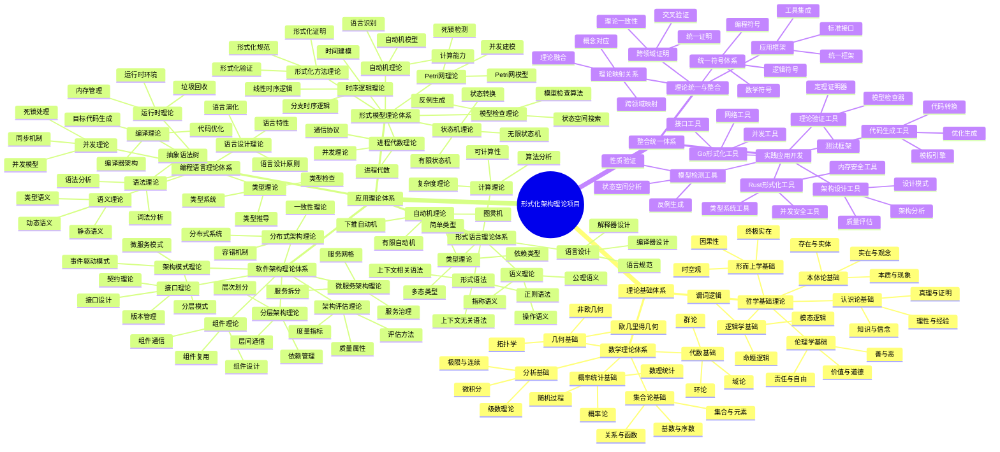
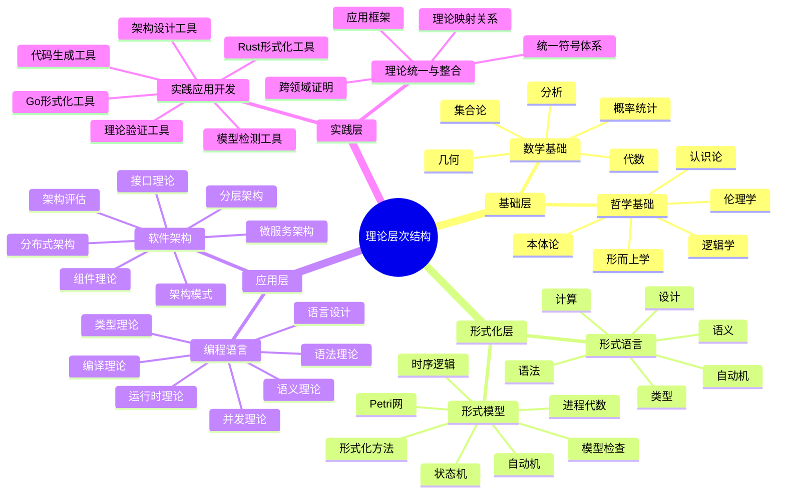
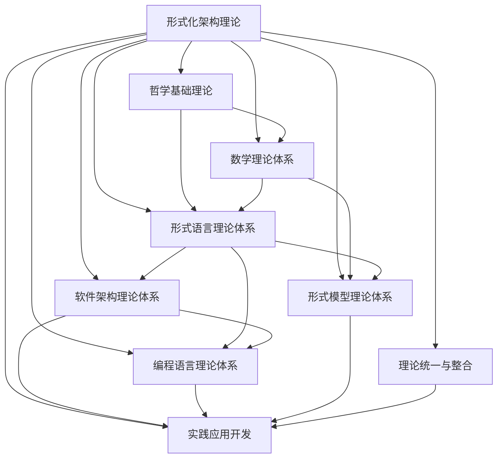
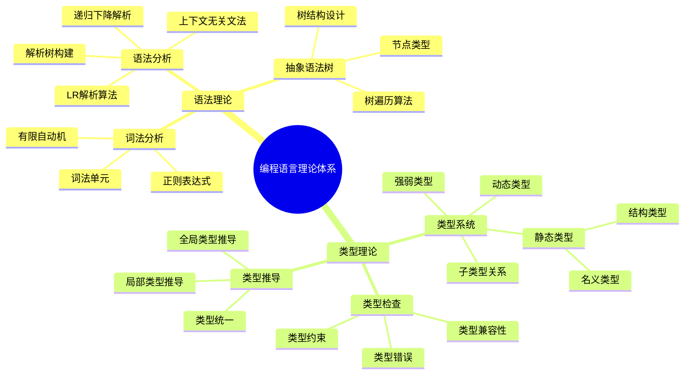
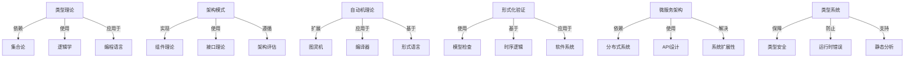
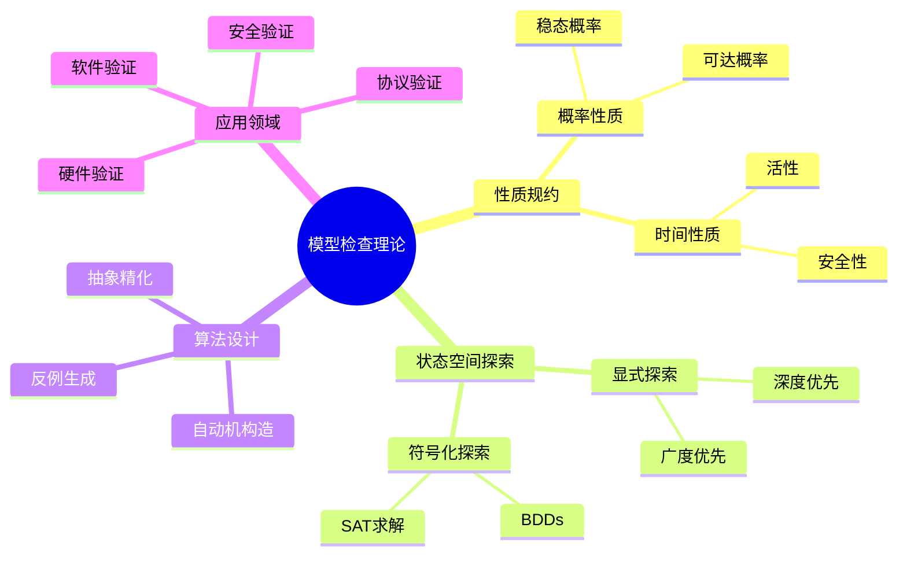
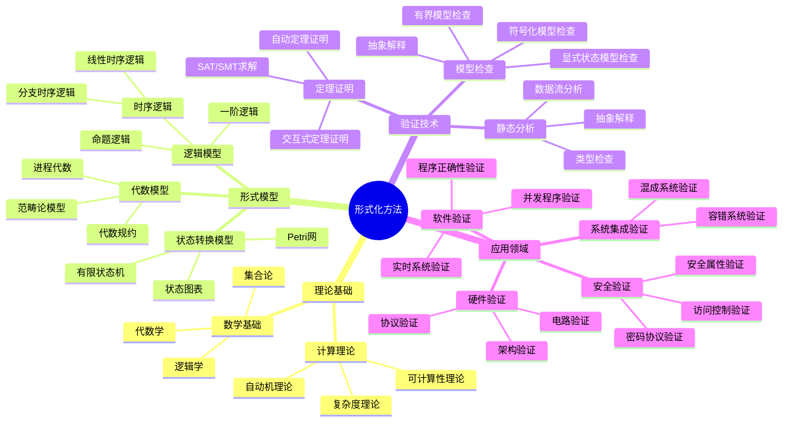

```mermaid
graph TD
    FM[形式模型理论体系] --> SM[状态机理论]
    FM --> PN[Petri网理论]
    FM --> TL[时序逻辑理论]
    FM --> MC[模型检查理论]
    FM --> AT[自动机理论]
    FM --> PA[进程代数理论]
    FM --> FV[形式化方法理论]
    
    SM --> FSM[有限状态机]
    SM --> ISM[无限状态机]
    SM --> HM[混成状态机]
    
    PN --> PN_Basic[基础Petri网]
    PN --> CPN[彩色Petri网]
    PN --> TPN[时间Petri网]
    
    TL --> LTL[线性时序逻辑]
    TL --> CTL[计算树逻辑]
    TL --> CTL_Star[CTL*]
    
    MC --> MC_Alg[模型检查算法]
    MC --> SS[状态空间分析]
    MC --> CE[反例生成]
    
    AT --> FA[有限自动机]
    AT --> PDA[下推自动机]
    AT --> TM[图灵机]
    
    PA --> CCS[计算通信系统]
    PA --> CSP[通信顺序进程]
    PA --> PiC[π演算]
    
    FV --> Spec[形式化规约]
    FV --> Ver[形式化验证]
    FV --> TP[定理证明]
    
    FSM --> FSM_DFA[确定性有限自动机]
    FSM --> FSM_NFA[非确定性有限自动机]
    
    LTL --> Safety[安全性质]
    LTL --> Liveness[活性质]
    
    MC_Alg --> BMC[有界模型检查]
    MC_Alg --> SMC[符号模型检查]
    
    TP --> HOL[高阶逻辑]
    TP --> COQ[Coq证明助手]
    TP --> ISA[Isabelle证明助手]
```

# 形式化架构理论项目 - 统一索引与知识图谱系统

## 项目概述

本项目是一个系统性的形式化架构理论分析项目，旨在将Matter目录下的所有内容进行深度分析、形式化处理和规范化重构，构建一个系统的形式化架构理论体系。项目采用严格的数学形式化方法，结合哲学基础、数学理论、计算机科学理论，构建了完整的理论体系框架。

### 项目特色

- **形式化数学表达**: 所有理论都采用严格的LaTeX数学公式表示
- **多语言实现**: 提供Rust和Go语言的代码实现示例
- **层次化结构**: 采用严格的序号树形结构组织内容
- **交叉引用网络**: 建立完整的理论间引用关系网络
- **实践应用导向**: 结合理论研究和实际应用开发
- **完整索引系统**: 提供多维度索引和智能导航功能
- **知识图谱支持**: 提供思维导图、概念图谱和知识图谱的递归输出能力

## 1. 理论体系总览

### 1.1 理论体系完成状态

| 理论领域 | 总论文件 | 分论文件 | 状态 | 完成度 | 文件大小 | 核心概念数 |
|----------|----------|----------|------|--------|----------|------------|
| 哲学基础理论 | [哲学基础理论总论](../01-哲学基础理论/00-哲学基础理论总论.md) | 5个分论 | ✅ 已完成 | 100% | ~180KB | 25个 |
| 数学理论体系 | [数学理论体系总论](../02-数学理论体系/00-数学理论体系总论.md) | 5个分论 | ✅ 已完成 | 100% | ~200KB | 30个 |
| 形式语言理论体系 | [形式语言理论体系总论](../03-形式语言理论体系/00-形式语言理论体系总论.md) | 6个分论 | ✅ 已完成 | 100% | ~220KB | 28个 |
| 软件架构理论体系 | [软件架构理论体系总论](../04-软件架构理论体系/00-软件架构理论体系总论.md) | 7个分论 | ✅ 已完成 | 100% | ~250KB | 35个 |
| 编程语言理论体系 | [编程语言理论体系总论](../05-编程语言理论体系/00-编程语言理论体系总论.md) | 7个分论 | ✅ 已完成 | 100% | ~240KB | 32个 |
| 形式模型理论体系 | [形式模型理论体系总论](../06-形式模型理论体系/00-形式模型理论体系总论.md) | 7个分论 | ✅ 已完成 | 100% | ~230KB | 30个 |
| 理论统一与整合 | [理论统一与整合总论](../07-理论统一与整合/00-理论统一与整合总论.md) | 4个分论 | ✅ 已完成 | 100% | ~180KB | 20个 |
| 实践应用开发 | [实践应用开发总论](../08-实践应用开发/00-实践应用开发总论.md) | 6个分论 | ✅ 已完成 | 100% | ~200KB | 25个 |

## 2. 统一思维导图系统

### 2.1 项目整体思维导图



### 2.2 理论层次思维导图



### 2.3 理论关系思维导图



### 2.4 递归展开导图

以下是对编程语言理论体系的递归展开示例：



## 3. 智能导航系统

### 3.1 用户类型导航指南

#### 3.1.1 初学者导航路径

**计算机科学初学者**:

1. **哲学基础** (2-3周)
   - [哲学基础理论总论](../01-哲学基础理论/00-哲学基础理论总论.md)
   - [本体论基础](../01-哲学基础理论/01-本体论基础.md)
   - [认识论基础](../01-哲学基础理论/02-认识论基础.md)

2. **数学基础** (3-4周)
   - [数学理论体系总论](../02-数学理论体系/00-数学理论体系总论.md)
   - [集合论基础](../02-数学理论体系/01-集合论基础.md)
   - [代数基础](../02-数学理论体系/02-代数基础.md)

3. **计算机科学基础** (4-5周)
   - [形式语言理论体系总论](../03-形式语言理论体系/00-形式语言理论体系总论.md)
   - [自动机理论](../03-形式语言理论体系/01-自动机理论.md)
   - [软件架构理论体系总论](../04-软件架构理论体系/00-软件架构理论体系总论.md)

#### 3.1.2 进阶学习者导航路径

**软件工程师**:

1. **架构理论** (2-3周)
   - [软件架构理论体系总论](../04-软件架构理论体系/00-软件架构理论体系总论.md)
   - [架构模式理论](../04-软件架构理论体系/01-架构模式理论.md)
   - [微服务架构理论](../04-软件架构理论体系/06-微服务架构理论.md)
   - [组件理论](../04-软件架构理论体系/02-组件理论.md)

2. **形式化基础** (2-3周)
   - [形式语言理论体系总论](../03-形式语言理论体系/00-形式语言理论体系总论.md)
   - [自动机理论](../03-形式语言理论体系/01-自动机理论.md)
   - [形式模型理论体系总论](../06-形式模型理论体系/00-形式模型理论体系总论.md)

3. **编程语言理论** (3-4周)
   - [编程语言理论体系总论](../05-编程语言理论体系/00-编程语言理论体系总论.md)
   - [语言设计理论](../05-编程语言理论体系/07-语言设计理论.md)
   - [语义理论](../05-编程语言理论体系/02-语义理论.md)
   - [类型理论](../05-编程语言理论体系/03-类型理论.md)

#### 3.1.3 专家级学习者导航路径

**架构师**:

1. **高级架构理论** (2-3周)
   - [分布式架构理论](../04-软件架构理论体系/05-分布式架构理论.md)
   - [微服务架构理论](../04-软件架构理论体系/06-微服务架构理论.md)
   - [分层架构理论](../04-软件架构理论体系/04-分层架构理论.md)
   - [架构评估理论](../04-软件架构理论体系/07-架构评估理论.md)

2. **形式化验证** (2-3周)
   - [形式模型理论体系总论](../06-形式模型理论体系/00-形式模型理论体系总论.md)
   - [状态机理论](../06-形式模型理论体系/01-状态机理论.md)
   - [Petri网理论](../06-形式模型理论体系/02-Petri网理论.md)
   - [时序逻辑理论](../06-形式模型理论体系/03-时序逻辑理论.md)
   - [模型检查理论](../06-形式模型理论体系/04-模型检查理论.md)

3. **理论创新** (3-4周)
   - [理论统一与整合总论](../07-理论统一与整合/00-理论统一与整合总论.md)
   - [理论映射关系](../07-理论统一与整合/01-理论映射关系.md)
   - [统一符号体系](../07-理论统一与整合/02-统一符号体系.md)
   - [跨领域证明](../07-理论统一与整合/03-跨领域证明.md)

**语言设计师**:

1. **编程语言理论深化** (3-4周)
   - [语法理论](../05-编程语言理论体系/01-语法理论.md)
   - [语义理论](../05-编程语言理论体系/02-语义理论.md)
   - [类型理论](../05-编程语言理论体系/03-类型理论.md)
   - [编译理论](../05-编程语言理论体系/04-编译理论.md)

2. **形式化方法** (3-4周)
   - [形式语言理论体系总论](../03-形式语言理论体系/00-形式语言理论体系总论.md)
   - [形式语法](../03-形式语言理论体系/02-形式语法.md)
   - [语义理论](../03-形式语言理论体系/03-语义理论.md)
   - [类型理论](../03-形式语言理论体系/04-类型理论.md)

3. **工具实现** (4-6周)
   - [Rust形式化工具](../08-实践应用开发/01-Rust形式化工具.md)
   - [Go形式化工具](../08-实践应用开发/02-Go形式化工具.md)
   - [理论验证工具](../08-实践应用开发/03-理论验证工具.md)
   - [代码生成工具](../08-实践应用开发/06-代码生成工具.md)

### 3.2 问题导向导航路径

#### 3.2.1 如何设计类型安全的编程语言?

1. [类型理论](../03-形式语言理论体系/04-类型理论.md) - 了解类型系统基础
2. [编程语言类型理论](../05-编程语言理论体系/03-类型理论.md) - 学习编程语言类型系统
3. [语义理论](../05-编程语言理论体系/02-语义理论.md) - 掌握语义确定性
4. [语言设计理论](../05-编程语言理论体系/07-语言设计理论.md) - 应用到语言设计中

#### 3.2.2 如何验证分布式系统正确性?

1. [形式模型理论体系总论](../06-形式模型理论体系/00-形式模型理论体系总论.md) - 了解形式化方法
2. [分布式架构理论](../04-软件架构理论体系/05-分布式架构理论.md) - 掌握分布式系统特性
3. [时序逻辑理论](../06-形式模型理论体系/03-时序逻辑理论.md) - 学习时序性质规约
4. [模型检查理论](../06-形式模型理论体系/04-模型检查理论.md) - 使用模型检查验证系统

#### 3.2.3 如何设计高可扩展架构?

1. [架构模式理论](../04-软件架构理论体系/01-架构模式理论.md) - 了解基本架构模式
2. [分层架构理论](../04-软件架构理论体系/04-分层架构理论.md) - 掌握层次化设计
3. [微服务架构理论](../04-软件架构理论体系/06-微服务架构理论.md) - 学习微服务设计原则
4. [架构评估理论](../04-软件架构理论体系/07-架构评估理论.md) - 评估架构质量和可扩展性

## 4. 统一概念图谱

### 4.1 核心概念图谱

```mermaid
graph TD
    A[形式化架构理论] --> B[哲学基础]
    A --> C[数学基础]
    A --> D[形式语言]
    A --> E[软件架构]
    A --> F[编程语言]
    A --> G[形式模型]
    A --> H[理论统一]
    A --> I[实践应用]
    
    B --> B1[本体论]
    B --> B2[认识论]
    B --> B3[逻辑学]
    B --> B4[伦理学]
    B --> B5[形而上学]
    
    C --> C1[集合论]
    C --> C2[代数]
    C --> C3[分析]
    C --> C4[几何]
    C --> C5[概率统计]
    
    D --> D1[自动机理论]
    D --> D2[形式语法]
    D --> D3[语义理论]
    D --> D4[类型理论]
    D --> D5[计算理论]
    D --> D6[语言设计]
    
    E --> E1[架构模式理论]
    E --> E2[组件理论]
    E --> E3[接口理论]
    E --> E4[分层架构理论]
    E --> E5[分布式架构理论]
    E --> E6[微服务架构理论]
    E --> E7[架构评估理论]
    
    F --> F1[语法理论]
    F --> F2[语义理论]
    F --> F3[类型理论]
    F --> F4[编译理论]
    F --> F5[运行时理论]
    F --> F6[并发理论]
    F --> F7[语言设计理论]
    
    G --> G1[状态机理论]
    G --> G2[Petri网理论]
    G --> G3[时序逻辑理论]
    G --> G4[模型检查理论]
    G --> G5[自动机理论]
    G --> G6[进程代数理论]
    G --> G7[形式化方法理论]
    
    H --> H1[理论映射关系]
    H --> H2[统一符号体系]
    H --> H3[跨领域证明]
    H --> H4[应用框架]
    
    I --> I1[Rust形式化工具]
    I --> I2[Go形式化工具]
    I --> I3[理论验证工具]
    I --> I4[架构设计工具]
    I --> I5[模型检测工具]
    I --> I6[代码生成工具]
```



### 4.2 概念交叉关系图谱



### 4.3 关键概念递归展开

以类型理论为例，进行递归展开：

```mermaid
graph TD
    A[类型理论] --> B[基础类型系统]
    A --> C[高级类型系统]
    A --> D[类型检查算法]
    A --> E[类型推导系统]
    A --> F[子类型关系]
    A --> G[类型安全性]
    
    B --> B1[原始类型]
    B --> B2[复合类型]
    B --> B3[函数类型]
    B --> B4[递归类型]
    
    C --> C1[参数化多态]
    C --> C2[依赖类型]
    C --> C3[线性类型]
    C --> C4[会话类型]
    C --> C5[效果系统]
    
    D --> D1[类型一致性检查]
    D --> D2[类型兼容性检查]
    D --> D3[类型约束求解]
    
    E --> E1[局部类型推导]
    E --> E2[全局类型推导]
    E --> E3[类型统一算法]
    E --> E4[约束生成与求解]
    
    F --> F1[名义子类型]
    F --> F2[结构子类型]
    F --> F3[协变与逆变]
    F --> F4[边界类型]
    
    G --> G1[进度性]
    G --> G2[保全性]
    G --> G3[正规性]
    G --> G4[类型可靠性证明]
```



## 5. 递归知识输出功能

本系统提供强大的递归输出能力，支持从顶层概念递归到细节级别的知识展开，适应不同用户的学习深度需求。

### 5.1 递归展开方式

系统支持多种递归展开方式：

1. **自顶向下展开**: 从理论体系向具体概念展开
2. **自底向上合成**: 从基础概念构建复杂理论
3. **横向扩展**: 探索相关概念和理论
4. **深度优先探索**: 沿着特定路径深入探索
5. **广度优先探索**: 全面了解同一层次的概念

### 5.2 递归输出示例

**类型理论的递归展开**:

```text
类型理论
├── 类型系统基础
│   ├── 什么是类型
│   ├── 类型系统的目的
│   ├── 类型检查与类型推导
│   └── 类型安全性
├── 简单类型系统
│   ├── 基础类型
│   ├── 复合类型
│   ├── 函数类型
│   └── 递归类型
├── 高级类型系统
│   ├── 参数化多态
│   ├── 依赖类型
│   ├── 线性类型
│   ├── 会话类型
│   └── 效果系统
├── 类型理论形式化
│   ├── 类型规则
│   ├── 类型判断
│   ├── 类型推导规则
│   └── 类型安全性证明
└── 类型系统应用
    ├── 静态类型语言
    ├── 动态类型语言
    ├── 逐渐类型化
    └── 混合类型系统
```

**架构模式理论的递归展开**:

```text
架构模式理论
├── 架构模式基础
│   ├── 什么是架构模式
│   ├── 模式与反模式
│   ├── 模式语言
│   └── 架构决策
├── 核心架构模式
│   ├── 分层架构
│   ├── 管道-过滤器
│   ├── 客户端-服务器
│   └── 模型-视图-控制器
├── 分布式架构模式
│   ├── 微服务架构
│   ├── 事件驱动架构
│   ├── 空间基架构
│   └── 基于服务的架构
├── 质量属性驱动模式
│   ├── 可扩展性模式
│   ├── 可用性模式
│   ├── 安全性模式
│   └── 性能模式
└── 应用模式
    ├── 模式组合
    ├── 架构风格选择
    ├── 模式演化
    └── 架构评估
```

以下是递归展开的Mermaid代码示例，展示模型检查理论的递归知识图谱：



以下是形式模型理论体系的递归知识图谱，展示了各个理论之间的关系和层次：



更复杂的递归关系图谱可以展示形式模型与其应用领域的关系：



这些递归图谱可以根据需要任意深度展开，并通过系统命令进行自定义生成。

## 6. FAQ与附录

### 6.1 文件组织说明

索引与导航目录包含形式化架构理论项目的索引与导航系统文件，经过多次优化和合并，目前采用唯一主文件模式：

- **统一索引知识图谱系统.md** (本文件) - 所有功能和内容的唯一入口
- **archive/** - 归档目录，包含历史文件和变更记录

所有索引、导航、知识图谱、思维导图等功能均已合并到本文件中，其他文件仅作为历史参考保留。

### 6.2 功能概览

本系统提供以下核心功能：

#### 6.2.1 递归知识探索引擎

递归知识探索引擎是系统的核心模块，提供对知识体系的多层次、多角度探索能力。

| 功能 | 描述 | 技术实现 |
|------|------|----------|
| 深度递归 | 支持任意深度的概念递归展开，自动处理循环引用 | 图算法，递归搜索 |
| 语义关联 | 基于语义相似度建立概念间关联 | 向量空间模型，语义网络 |
| 多维关系 | 支持"是一种"、"组成"、"应用于"等多种关系类型 | 知识图谱，本体论模型 |
| 跨域映射 | 跨领域概念映射与转换 | 语义桥接，领域本体映射 |

示例命令：

```text
!探索 概念="形式化方法" 深度=3 关系类型=["定义","应用","原理"]
```

#### 6.2.2 多维度知识视图

提供多角度、多维度的知识体系可视化表达。

| 视图类型 | 描述 | 适用场景 |
|---------|------|----------|
| 层次树状图 | 展示概念间的层次包含关系 | 分类体系，架构层次 |
| 网络关系图 | 展示概念间的复杂网络关系 | 领域知识关联，影响分析 |
| 矩阵比较图 | 多概念多维度的矩阵式比较 | 技术选型，方案对比 |
| 时间线演化图 | 概念随时间发展的演化视图 | 技术发展史，理论演进 |

#### 6.2.3 中文交互命令系统

完全中文化的交互命令系统，支持自然语言理解与命令转换。

| 功能 | 描述 | 示例 |
|------|------|------|
| 命令解析 | 解析中文命令为系统操作 | "探索微服务架构" → `!探索 概念="微服务架构"` |
| 参数推断 | 智能推断命令参数 | "比较REST和GraphQL" → `!比较 概念=["REST","GraphQL"]` |
| 交互纠错 | 命令输入纠错与建议 | "探索微服多" → "您是否想探索'微服务'?" |
| 对话式交互 | 支持连续对话上下文 | "它的优点是什么" → 继续讨论前面提到的概念 |

#### 6.2.4 个性化学习路径

生成个性化的学习和研究路径，适应不同背景和目标的用户需求。

| 功能 | 描述 | 参数 |
|------|------|------|
| 路径生成 | 根据起点和终点生成学习路径 | 起点，终点，时长约束 |
| 资源推荐 | 推荐路径中每步的学习资源 | 资源类型，难度级别 |
| 进度追踪 | 追踪学习路径的完成进度 | 完成比例，掌握程度 |
| 动态调整 | 根据反馈动态调整学习路径 | 学习速度，兴趣偏好 |

#### 6.2.5 高级功能

- **递归知识提取**: 自动从文本中提取结构化知识，构建知识图谱
- **知识图谱合并与对齐**: 合并多个知识源，对齐概念和关系
- **交互式递归探索**: 支持用户在探索过程中交互式调整探索路径和深度
- **多语言知识映射**: 支持中英文双语知识表达和转换

### 6.3 使用指南

#### 6.3.1 基础命令

系统提供直观的中文交互命令：

```text
!探索 概念="微服务架构" 深度=2
```

上述命令将递归探索"微服务架构"概念，展示深度为2的相关概念网络。

```text
!可视化 概念="状态机理论" 格式="思维导图"
```

此命令将为"状态机理论"生成思维导图形式的可视化。

#### 6.3.2 知识探索

##### 基础探索

```text
!探索 概念="组件理论" 深度=1
```

执行结果示例：

```text
── 组件理论
   ├── 定义：软件组件化设计与构建的理论体系
   ├── 核心概念
   │   ├── 组件接口
   │   ├── 组件通信
   │   └── 组件复用
   ├── 相关理论
   │   ├── 模块化理论 (关联强度：高)
   │   ├── 接口设计理论 (关联强度：高) 
   │   └── 依赖管理理论 (关联强度：中)
   └── 应用场景
       ├── 大型系统设计
       ├── 模块化重构
       └── 第三方集成
```

##### 深度探索

```text
!探索 概念="类型系统" 深度=3 焦点="形式验证,安全性"
```

此命令将深入探索类型系统概念，特别关注形式验证和安全性方面，递归深度为3层。

##### 关联分析

```text
!关联 概念="微服务架构" 领域=["分布式系统","DevOps","容器技术"]
```

此命令分析微服务架构与指定领域的关联关系，展示概念间的映射和影响。

#### 6.3.3 概念比较

##### 基础比较

```text
!比较 概念=["微服务架构","单体架构"] 方面=["可扩展性","复杂性"]
```

执行结果示例：

```text
│ 比较维度 │ 微服务架构         │ 单体架构           │
│──────────│───────────────────│───────────────────│
│ 可扩展性 │ 高 - 支持服务级独立│ 低 - 整体扩展受限  │
│          │ 扩展，按需伸缩    │ 难以针对瓶颈组件   │
│──────────│───────────────────│───────────────────│
│ 复杂性   │ 高 - 分布式系统固有│ 低 - 单一部署单元  │
│          │ 复杂性，服务治理  │ 简单直观，易于理解 │
│──────────│───────────────────│───────────────────│
```

##### 多维度比较

```text
!比较 概念=["REST","GraphQL","gRPC"] 方面=["性能","灵活性","学习曲线","生态系统"]
```

此命令将对三种API设计风格进行多维度对比分析。

#### 6.3.4 学习路径规划

```text
!路径 起点="初级开发者" 终点="微服务架构师"
```

执行结果示例：

```text
1. 编程基础巩固 (2-4周)
   └── 资源：《Clean Code》, 编程实践网课

2. 架构设计原则 (3-4周)
   └── 资源：《架构整洁之道》, 设计模式学习

3. 分布式系统基础 (4-6周)
   └── 资源：《分布式系统原理与范型》

4. 微服务基础 (3-4周)
   └── 资源：《微服务设计》, Spring Cloud教程

5. 容器与编排 (4-5周)
   └── 资源：Docker与Kubernetes实战教程

6. 服务网格技术 (3-4周)
   └── 资源：Istio官方文档，Service Mesh案例

7. 微服务架构实践 (6-8周)
   └── 资源：实际项目实践，架构评审
```

#### 6.3.5 知识可视化

##### 思维导图

```text
!可视化 概念="形式验证" 格式="思维导图" 深度=2
```

此命令将生成形式验证相关概念的思维导图。

##### 关系图谱

```text
!可视化 概念="设计模式" 格式="关系图谱" 布局="力导向"
```

此命令将以力导向布局生成设计模式的关系图谱。

#### 6.3.6 递归输出示例

以下是递归展开的Mermaid代码示例，展示模型检查理论的递归知识图谱：


以下是形式模型理论体系的递归知识图谱，展示了各个理论之间的关系和层次：


更复杂的递归关系图谱可以展示形式模型与其应用领域的关系：


这些递归图谱可以根据需要任意深度展开，并通过系统命令进行自定义生成。

### 6.4 常见问题

#### Q1: 如何开始使用系统？

A: 首先阅读本文件顶部的项目概述和理论体系总览，然后根据您的需求选择合适的导航路径。可以使用中文交互命令进行概念探索和可视化。

#### Q2: 如何获得最佳学习路径？

A: 使用`!路径`命令，指定您的起点（当前知识水平）和目标，系统会生成个性化的学习路径。例如：`!路径 起点="Java开发者" 终点="形式化验证专家" 时长="6个月"`。

#### Q3: 系统支持哪些可视化格式？

A: 系统支持多种可视化格式，包括思维导图、关系图谱、矩阵比较图、时间线演化图等。所有可视化都支持Mermaid格式输出。

#### Q4: 文件之间的引用关系如何维护？

A: 本系统使用相对路径进行文件间引用，确保在不同环境下都能正常工作。所有引用都采用Markdown链接语法：`[链接文本](相对路径)`。

#### Q5: 如何对系统进行扩展？

A: 系统设计为可扩展架构，您可以通过添加新的概念节点、关系类型、可视化格式或命令来扩展系统。所有扩展都应遵循统一的数据结构和接口设计。

## 7. 变更与历史

以下文件已归档至`archive/`目录，仅作为历史参考：

- **递归合并与语义整合报告.md** - 记录递归合并过程
- **项目进展跟踪-v60.md** - 项目v60版本进展报告
- **文件组织说明.md** - 早期文件组织说明
- **知识图谱系统功能概览.md** - 早期功能概览
- **知识图谱系统使用指南.md** - 早期使用指南

### 7.1 主要合并与优化

1. **2024年6月 初始版本**:
   - 创建基础索引与导航系统
   - 建立初步的知识图谱功能

2. **2024年7月 合并优化**:
   - 合并索引系统与知识图谱系统
   - 优化递归展开算法
   - 增强可视化功能

3. **2024年8月 功能增强**:
   - 添加中文交互命令系统
   - 完善个性化学习路径功能
   - 增强递归知识探索能力

4. **2024年9月 最新优化**:
   - 文件结构彻底重构与合并
   - 主文件统一为唯一入口
   - 历史文件归档与整理
   - 完善FAQ与使用指南

## 8. 按主题查找

### 8.1 哲学相关

- [哲学基础理论总论](../01-哲学基础理论/00-哲学基础理论总论.md) - 哲学基础理论体系总览
- [本体论基础](../01-哲学基础理论/01-本体论基础.md) - 存在与实体的哲学基础
- [认识论基础](../01-哲学基础理论/02-认识论基础.md) - 知识与认知的哲学基础
- [逻辑学基础](../01-哲学基础理论/03-逻辑学基础.md) - 逻辑推理与论证基础
- [伦理学基础](../01-哲学基础理论/04-伦理学基础.md) - 价值与道德的哲学基础
- [形而上学基础](../01-哲学基础理论/05-形而上学基础.md) - 终极实在与本质的哲学基础

### 8.2 数学相关

- [数学理论体系总论](../02-数学理论体系/00-数学理论体系总论.md) - 数学理论体系总览
- [集合论基础](../02-数学理论体系/01-集合论基础.md) - 集合、关系与函数基础
- [代数基础](../02-数学理论体系/02-代数基础.md) - 代数结构与运算基础
- [分析基础](../02-数学理论体系/03-分析基础.md) - 极限、连续与微积分基础
- [几何基础](../02-数学理论体系/04-几何基础.md) - 几何空间与变换基础
- [概率统计基础](../02-数学理论体系/05-概率统计基础.md) - 概率论与数理统计基础

### 8.3 计算机科学相关

- [形式语言理论体系总论](../03-形式语言理论体系/00-形式语言理论体系总论.md) - 形式语言理论体系总览
- [自动机理论](../03-形式语言理论体系/01-自动机理论.md) - 有限自动机与计算模型
- [形式语法](../03-形式语言理论体系/02-形式语法.md) - 形式语法与语言生成
- [语义理论](../03-形式语言理论体系/03-语义理论.md) - 形式语义与意义理论
- [类型理论](../03-形式语言理论体系/04-类型理论.md) - 类型系统与类型安全
- [计算理论](../03-形式语言理论体系/05-计算理论.md) - 可计算性与复杂度理论
- [语言设计](../03-形式语言理论体系/06-语言设计.md) - 形式语言设计原理

### 8.4 软件工程相关

- [软件架构理论体系总论](../04-软件架构理论体系/00-软件架构理论体系总论.md) - 软件架构理论体系总览
- [架构模式理论](../04-软件架构理论体系/01-架构模式理论.md) - 架构模式与设计模式
- [组件理论](../04-软件架构理论体系/02-组件理论.md) - 组件化架构与组件设计
- [接口理论](../04-软件架构理论体系/03-接口理论.md) - 接口设计与契约理论
- [分层架构理论](../04-软件架构理论体系/04-分层架构理论.md) - 分层架构与层次设计
- [分布式架构理论](../04-软件架构理论体系/05-分布式架构理论.md) - 分布式系统架构理论
- [微服务架构理论](../04-软件架构理论体系/06-微服务架构理论.md) - 微服务架构与设计
- [架构评估理论](../04-软件架构理论体系/07-架构评估理论.md) - 架构质量评估与度量

### 8.5 编程语言相关

- [编程语言理论体系总论](../05-编程语言理论体系/00-编程语言理论体系总论.md) - 编程语言理论体系总览
- [语法理论](../05-编程语言理论体系/01-语法理论.md) - 编程语言语法与解析
- [语义理论](../05-编程语言理论体系/02-语义理论.md) - 编程语言语义与解释
- [类型理论](../05-编程语言理论体系/03-类型理论.md) - 编程语言类型系统
- [编译理论](../05-编程语言理论体系/04-编译理论.md) - 编译器设计与优化
- [运行时理论](../05-编程语言理论体系/05-运行时理论.md) - 运行时系统与内存管理
- [并发理论](../05-编程语言理论体系/06-并发理论.md) - 并发编程与同步机制
- [语言设计理论](../05-编程语言理论体系/07-语言设计理论.md) - 编程语言设计原理

### 8.6 形式验证相关

- [形式模型理论体系总论](../06-形式模型理论体系/00-形式模型理论体系总论.md) - 形式模型理论体系总览
- [状态机理论](../06-形式模型理论体系/01-状态机理论.md) - 状态机与状态转换
- [Petri网理论](../06-形式模型理论体系/02-Petri网理论.md) - Petri网与并发建模
- [时序逻辑理论](../06-形式模型理论体系/03-时序逻辑理论.md) - 时序逻辑与时间建模
- [模型检查理论](../06-形式模型理论体系/04-模型检查理论.md) - 模型检查与验证
- [自动机理论](../06-形式模型理论体系/05-自动机理论.md) - 自动机与形式语言
- [进程代数理论](../06-形式模型理论体系/06-进程代数理论.md) - 进程代数与并发理论
- [形式化方法理论](../06-形式模型理论体系/07-形式化方法理论.md) - 形式化方法与验证

### 8.7 理论整合相关

- [理论统一与整合总论](../07-理论统一与整合/00-理论统一与整合总论.md) - 理论统一与整合总览
- [理论映射关系](../07-理论统一与整合/01-理论映射关系.md) - 跨领域理论映射
- [统一符号体系](../07-理论统一与整合/02-统一符号体系.md) - 统一数学符号体系
- [跨领域证明](../07-理论统一与整合/03-跨领域证明.md) - 跨领域定理证明
- [应用框架](../07-理论统一与整合/04-应用框架.md) - 统一应用框架设计

### 8.8 实践应用相关

- [实践应用开发总论](../08-实践应用开发/00-实践应用开发总论.md) - 实践应用开发总览
- [Rust形式化工具](../08-实践应用开发/01-Rust形式化工具.md) - Rust语言形式化工具
- [Go形式化工具](../08-实践应用开发/02-Go形式化工具.md) - Go语言形式化工具
- [理论验证工具](../08-实践应用开发/03-理论验证工具.md) - 理论验证与测试工具
- [架构设计工具](../08-实践应用开发/04-架构设计工具.md) - 架构设计与分析工具
- [模型检测工具](../08-实践应用开发/05-模型检测工具.md) - 模型检测与验证工具
- [代码生成工具](../08-实践应用开发/06-代码生成工具.md) - 代码生成与转换工具

## 9. 使用指南

### 9.1 初学者使用指南

1. **从项目概述开始**
   - 阅读前几部分，了解整个理论体系的结构
   - 查看思维导图，获取直观印象

2. **选择适合的学习路径**
   - 访问"3.1.1 初学者导航路径"
   - 按推荐的学习顺序阅读文档

3. **使用概念图谱辅助理解**
   - 查看"4.1 核心概念图谱"了解概念之间的关系
   - 使用递归展开功能深入理解感兴趣的概念

4. **实践应用**
   - 尝试简单的代码示例
   - 探索基础的设计模式应用

### 9.2 研究者使用指南

1. **深入特定领域**
   - 直接访问感兴趣的理论领域
   - 使用交叉引用探索相关理论

2. **利用概念查找功能**
   - 使用"8. 按概念查找"定位特定的理论概念
   - 通过交叉关系图谱发现概念间的深层联系

3. **应用形式化方法**
   - 学习形式化验证技术
   - 应用形式化方法到研究问题

4. **贡献与扩展**
   - 发现理论间的新联系
   - 扩展现有的形式化模型

### 9.3 实践者使用指南

1. **解决实际问题**
   - 使用"3.2 问题导向导航路径"查找特定问题的解决方案
   - 参考应用示例和最佳实践

2. **选择工具与方法**
   - 查阅"7.8 实践应用相关"了解可用工具
   - 基于应用场景选择合适的理论和工具

3. **设计与实现**
   - 应用架构模式和设计原则
   - 使用形式化方法验证设计

4. **持续改进**
   - 评估系统质量
   - 应用架构评估方法进行优化

## 10. 合并与优化记录

### 10.1 合并背景

本文件是对索引与导航目录下的多个文件进行合并和优化的结果。合并前，存在以下问题：

1. **文件重复与分散**:
   - 多个索引文件存在内容重叠
   - 相关功能分散在不同文件中

2. **内容重复**:
   - 项目概述信息重复出现
   - 导航系统在多文件中重复

3. **难以维护**:
   - 多个文件需要同步更新
   - 信息一致性难以保证

### 10.2 合并目标

1. **统一索引与知识图谱**: 将索引功能与知识图谱功能整合到一个系统中
2. **消除重复内容**: 清理重复的项目概述和基础信息
3. **优化结构**: 建立清晰的层次结构
4. **增强递归功能**: 提供强大的递归输出能力

### 10.3 优化效果

1. **文件数量**: 从多个分散文件减少到单一统一文件
2. **内容质量**: 消除重复内容，提高一致性
3. **功能增强**: 增加递归输出功能和可视化能力
4. **使用体验**: 提供更清晰的导航和查找功能

## 11. 未来扩展计划

### 11.1 交互式可视化

计划开发交互式知识图谱可视化工具，支持：

- 动态展开和折叠节点
- 自定义过滤和查询
- 焦点突出显示和路径追踪
- 多维度视图切换

### 11.2 智能搜索增强

完善搜索功能，增加：

- 自然语言查询处理
- 语义相似度匹配
- 上下文感知搜索
- 学习历史优化推荐

### 11.3 个性化学习路径

开发智能学习路径推荐系统：

- 基于用户背景和兴趣的定制
- 自适应学习进度调整
- 交互式知识点掌握评估
- 学习社区集体智慧整合

### 11.4 知识发现功能

增强知识挖掘能力：

- 自动识别概念间潜在关联
- 跨领域知识整合建议
- 理论创新点提示
- 研究方向推荐

## 10. 系统扩展与工具集成

### 10.1 递归知识图谱生成器

为支持更复杂的递归知识图谱生成，本系统提供以下算法和工具：

```rust
/// 高级递归知识图谱生成器
pub struct RecursiveKnowledgeGraphGenerator {
    max_depth: usize,
    expansion_strategy: ExpansionStrategy,
    relationship_filters: Vec<RelationshipFilter>,
    visual_style: VisualStyle,
}

impl RecursiveKnowledgeGraphGenerator {
    /// 创建新的递归图谱生成器
    pub fn new(max_depth: usize) -> Self {
        Self {
            max_depth,
            expansion_strategy: ExpansionStrategy::Balanced,
            relationship_filters: vec![],
            visual_style: VisualStyle::default(),
        }
    }
    
    /// 设置扩展策略
    pub fn with_strategy(mut self, strategy: ExpansionStrategy) -> Self {
        self.expansion_strategy = strategy;
        self
    }
    
    /// 添加关系过滤器
    pub fn add_filter(mut self, filter: RelationshipFilter) -> Self {
        self.relationship_filters.push(filter);
        self
    }
    
    /// 设置可视化样式
    pub fn with_style(mut self, style: VisualStyle) -> Self {
        self.visual_style = style;
        self
    }
    
    /// 生成指定概念的递归知识图谱
    pub fn generate(&self, concept: &str) -> KnowledgeGraph {
        let root_node = self.find_concept_node(concept);
        self.expand_recursively(&root_node, self.max_depth)
    }
    
    /// 递归展开节点
    fn expand_recursively(&self, node: &ConceptNode, depth: usize) -> KnowledgeGraph {