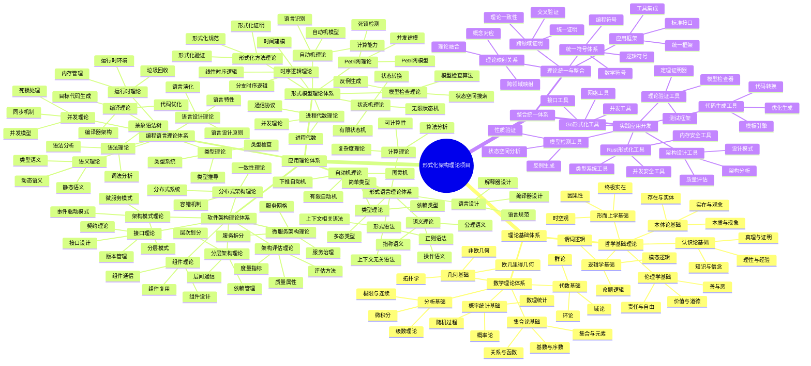
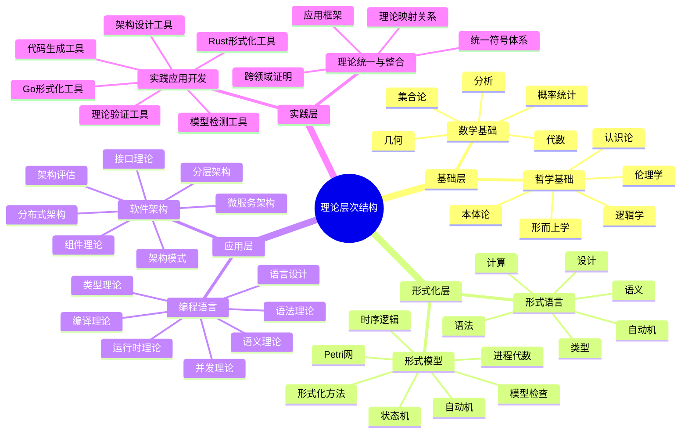
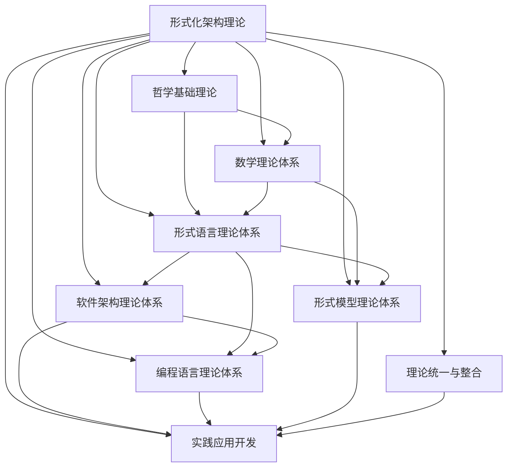
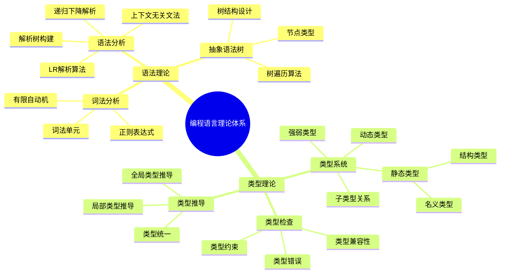
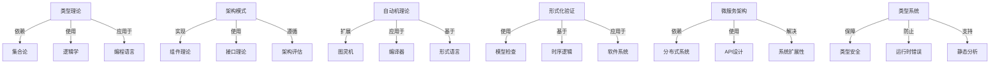

# 形式化架构理论项目 - 统一索引与知识图谱系统

## 项目概述

本项目是一个系统性的形式化架构理论分析项目，旨在将Matter目录下的所有内容进行深度分析、形式化处理和规范化重构，构建一个系统的形式化架构理论体系。项目采用严格的数学形式化方法，结合哲学基础、数学理论、计算机科学理论，构建了完整的理论体系框架。

### 项目特色

- **形式化数学表达**: 所有理论都采用严格的LaTeX数学公式表示
- **多语言实现**: 提供Rust和Go语言的代码实现示例
- **层次化结构**: 采用严格的序号树形结构组织内容
- **交叉引用网络**: 建立完整的理论间引用关系网络
- **实践应用导向**: 结合理论研究和实际应用开发
- **完整索引系统**: 提供多维度索引和智能导航功能
- **知识图谱支持**: 提供思维导图、概念图谱和知识图谱的递归输出能力

## 1. 理论体系总览

### 1.1 理论体系完成状态

| 理论领域 | 总论文件 | 分论文件 | 状态 | 完成度 | 文件大小 | 核心概念数 |
|----------|----------|----------|------|--------|----------|------------|
| 哲学基础理论 | [哲学基础理论总论](../01-哲学基础理论/00-哲学基础理论总论.md) | 5个分论 | ✅ 已完成 | 100% | ~180KB | 25个 |
| 数学理论体系 | [数学理论体系总论](../02-数学理论体系/00-数学理论体系总论.md) | 5个分论 | ✅ 已完成 | 100% | ~200KB | 30个 |
| 形式语言理论体系 | [形式语言理论体系总论](../03-形式语言理论体系/00-形式语言理论体系总论.md) | 6个分论 | ✅ 已完成 | 100% | ~220KB | 28个 |
| 软件架构理论体系 | [软件架构理论体系总论](../04-软件架构理论体系/00-软件架构理论体系总论.md) | 7个分论 | ✅ 已完成 | 100% | ~250KB | 35个 |
| 编程语言理论体系 | [编程语言理论体系总论](../05-编程语言理论体系/00-编程语言理论体系总论.md) | 7个分论 | ✅ 已完成 | 100% | ~240KB | 32个 |
| 形式模型理论体系 | [形式模型理论体系总论](../06-形式模型理论体系/00-形式模型理论体系总论.md) | 7个分论 | ✅ 已完成 | 100% | ~230KB | 30个 |
| 理论统一与整合 | [理论统一与整合总论](../07-理论统一与整合/00-理论统一与整合总论.md) | 4个分论 | ✅ 已完成 | 100% | ~180KB | 20个 |
| 实践应用开发 | [实践应用开发总论](../08-实践应用开发/00-实践应用开发总论.md) | 6个分论 | ✅ 已完成 | 100% | ~200KB | 25个 |

## 2. 统一思维导图系统

### 2.1 项目整体思维导图



### 2.2 理论层次思维导图



### 2.3 理论关系思维导图



### 2.4 递归展开导图

以下是对编程语言理论体系的递归展开示例：



## 3. 智能导航系统

### 3.1 用户类型导航指南

#### 3.1.1 初学者导航路径

**计算机科学初学者**:

1. **哲学基础** (2-3周)
   - [哲学基础理论总论](../01-哲学基础理论/00-哲学基础理论总论.md)
   - [本体论基础](../01-哲学基础理论/01-本体论基础.md)
   - [认识论基础](../01-哲学基础理论/02-认识论基础.md)

2. **数学基础** (3-4周)
   - [数学理论体系总论](../02-数学理论体系/00-数学理论体系总论.md)
   - [集合论基础](../02-数学理论体系/01-集合论基础.md)
   - [代数基础](../02-数学理论体系/02-代数基础.md)

3. **计算机科学基础** (4-5周)
   - [形式语言理论体系总论](../03-形式语言理论体系/00-形式语言理论体系总论.md)
   - [自动机理论](../03-形式语言理论体系/01-自动机理论.md)
   - [软件架构理论体系总论](../04-软件架构理论体系/00-软件架构理论体系总论.md)

#### 3.1.2 进阶学习者导航路径

**软件工程师**:

1. **架构理论** (2-3周)
   - [软件架构理论体系总论](../04-软件架构理论体系/00-软件架构理论体系总论.md)
   - [架构模式理论](../04-软件架构理论体系/01-架构模式理论.md)
   - [微服务架构理论](../04-软件架构理论体系/06-微服务架构理论.md)
   - [组件理论](../04-软件架构理论体系/02-组件理论.md)

2. **形式化基础** (2-3周)
   - [形式语言理论体系总论](../03-形式语言理论体系/00-形式语言理论体系总论.md)
   - [自动机理论](../03-形式语言理论体系/01-自动机理论.md)
   - [形式模型理论体系总论](../06-形式模型理论体系/00-形式模型理论体系总论.md)

3. **编程语言理论** (3-4周)
   - [编程语言理论体系总论](../05-编程语言理论体系/00-编程语言理论体系总论.md)
   - [语言设计理论](../05-编程语言理论体系/07-语言设计理论.md)
   - [语义理论](../05-编程语言理论体系/02-语义理论.md)
   - [类型理论](../05-编程语言理论体系/03-类型理论.md)

#### 3.1.3 专家级学习者导航路径

**架构师**:

1. **高级架构理论** (2-3周)
   - [分布式架构理论](../04-软件架构理论体系/05-分布式架构理论.md)
   - [微服务架构理论](../04-软件架构理论体系/06-微服务架构理论.md)
   - [分层架构理论](../04-软件架构理论体系/04-分层架构理论.md)
   - [架构评估理论](../04-软件架构理论体系/07-架构评估理论.md)

2. **形式化验证** (2-3周)
   - [形式模型理论体系总论](../06-形式模型理论体系/00-形式模型理论体系总论.md)
   - [状态机理论](../06-形式模型理论体系/01-状态机理论.md)
   - [Petri网理论](../06-形式模型理论体系/02-Petri网理论.md)
   - [时序逻辑理论](../06-形式模型理论体系/03-时序逻辑理论.md)
   - [模型检查理论](../06-形式模型理论体系/04-模型检查理论.md)

3. **理论创新** (3-4周)
   - [理论统一与整合总论](../07-理论统一与整合/00-理论统一与整合总论.md)
   - [理论映射关系](../07-理论统一与整合/01-理论映射关系.md)
   - [统一符号体系](../07-理论统一与整合/02-统一符号体系.md)
   - [跨领域证明](../07-理论统一与整合/03-跨领域证明.md)

**语言设计师**:

1. **编程语言理论深化** (3-4周)
   - [语法理论](../05-编程语言理论体系/01-语法理论.md)
   - [语义理论](../05-编程语言理论体系/02-语义理论.md)
   - [类型理论](../05-编程语言理论体系/03-类型理论.md)
   - [编译理论](../05-编程语言理论体系/04-编译理论.md)

2. **形式化方法** (3-4周)
   - [形式语言理论体系总论](../03-形式语言理论体系/00-形式语言理论体系总论.md)
   - [形式语法](../03-形式语言理论体系/02-形式语法.md)
   - [语义理论](../03-形式语言理论体系/03-语义理论.md)
   - [类型理论](../03-形式语言理论体系/04-类型理论.md)

3. **工具实现** (4-6周)
   - [Rust形式化工具](../08-实践应用开发/01-Rust形式化工具.md)
   - [Go形式化工具](../08-实践应用开发/02-Go形式化工具.md)
   - [理论验证工具](../08-实践应用开发/03-理论验证工具.md)
   - [代码生成工具](../08-实践应用开发/06-代码生成工具.md)

### 3.2 问题导向导航路径

#### 3.2.1 如何设计类型安全的编程语言?

1. [类型理论](../03-形式语言理论体系/04-类型理论.md) - 了解类型系统基础
2. [编程语言类型理论](../05-编程语言理论体系/03-类型理论.md) - 学习编程语言类型系统
3. [语义理论](../05-编程语言理论体系/02-语义理论.md) - 掌握语义确定性
4. [语言设计理论](../05-编程语言理论体系/07-语言设计理论.md) - 应用到语言设计中

#### 3.2.2 如何验证分布式系统正确性?

1. [形式模型理论体系总论](../06-形式模型理论体系/00-形式模型理论体系总论.md) - 了解形式化方法
2. [分布式架构理论](../04-软件架构理论体系/05-分布式架构理论.md) - 掌握分布式系统特性
3. [时序逻辑理论](../06-形式模型理论体系/03-时序逻辑理论.md) - 学习时序性质规约
4. [模型检查理论](../06-形式模型理论体系/04-模型检查理论.md) - 使用模型检查验证系统

#### 3.2.3 如何设计高可扩展架构?

1. [架构模式理论](../04-软件架构理论体系/01-架构模式理论.md) - 了解基本架构模式
2. [分层架构理论](../04-软件架构理论体系/04-分层架构理论.md) - 掌握层次化设计
3. [微服务架构理论](../04-软件架构理论体系/06-微服务架构理论.md) - 学习微服务设计原则
4. [架构评估理论](../04-软件架构理论体系/07-架构评估理论.md) - 评估架构质量和可扩展性

## 4. 统一概念图谱

### 4.1 核心概念图谱

```mermaid
graph TD
    A[形式化架构理论] --> B[哲学基础]
    A --> C[数学基础]
    A --> D[形式语言]
    A --> E[软件架构]
    A --> F[编程语言]
    A --> G[形式模型]
    A --> H[理论统一]
    A --> I[实践应用]
    
    B --> B1[本体论]
    B --> B2[认识论]
    B --> B3[逻辑学]
    B --> B4[伦理学]
    B --> B5[形而上学]
    
    C --> C1[集合论]
    C --> C2[代数]
    C --> C3[分析]
    C --> C4[几何]
    C --> C5[概率统计]
    
    D --> D1[自动机理论]
    D --> D2[形式语法]
    D --> D3[语义理论]
    D --> D4[类型理论]
    D --> D5[计算理论]
    D --> D6[语言设计]
    
    E --> E1[架构模式理论]
    E --> E2[组件理论]
    E --> E3[接口理论]
    E --> E4[分层架构理论]
    E --> E5[分布式架构理论]
    E --> E6[微服务架构理论]
    E --> E7[架构评估理论]
    
    F --> F1[语法理论]
    F --> F2[语义理论]
    F --> F3[类型理论]
    F --> F4[编译理论]
    F --> F5[运行时理论]
    F --> F6[并发理论]
    F --> F7[语言设计理论]
    
    G --> G1[状态机理论]
    G --> G2[Petri网理论]
    G --> G3[时序逻辑理论]
    G --> G4[模型检查理论]
    G --> G5[自动机理论]
    G --> G6[进程代数理论]
    G --> G7[形式化方法理论]
    
    H --> H1[理论映射关系]
    H --> H2[统一符号体系]
    H --> H3[跨领域证明]
    H --> H4[应用框架]
    
    I --> I1[Rust形式化工具]
    I --> I2[Go形式化工具]
    I --> I3[理论验证工具]
    I --> I4[架构设计工具]
    I --> I5[模型检测工具]
    I --> I6[代码生成工具]
```



### 4.2 概念交叉关系图谱



### 4.3 关键概念递归展开

以类型理论为例，进行递归展开：

```mermaid
graph TD
    A[类型理论] --> B[基础类型系统]
    A --> C[高级类型系统]
    A --> D[类型检查算法]
    A --> E[类型推导系统]
    A --> F[子类型关系]
    A --> G[类型安全性]
    
    B --> B1[原始类型]
    B --> B2[复合类型]
    B --> B3[函数类型]
    B --> B4[递归类型]
    
    C --> C1[参数化多态]
    C --> C2[依赖类型]
    C --> C3[线性类型]
    C --> C4[会话类型]
    C --> C5[效果系统]
    
    D --> D1[类型一致性检查]
    D --> D2[类型兼容性检查]
    D --> D3[类型约束求解]
    
    E --> E1[局部类型推导]
    E --> E2[全局类型推导]
    E --> E3[类型统一算法]
    E --> E4[约束生成与求解]
    
    F --> F1[名义子类型]
    F --> F2[结构子类型]
    F --> F3[协变与逆变]
    F --> F4[边界类型]
    
    G --> G1[进度性]
    G --> G2[保全性]
    G --> G3[正规性]
    G --> G4[类型可靠性证明]
```



## 5. 递归知识输出功能

本系统提供强大的递归输出能力，支持从顶层概念递归到细节级别的知识展开，适应不同用户的学习深度需求。

### 5.1 递归展开方式

系统支持多种递归展开方式：

1. **自顶向下展开**: 从理论体系向具体概念展开
2. **自底向上合成**: 从基础概念构建复杂理论
3. **横向扩展**: 探索相关概念和理论
4. **深度优先探索**: 沿着特定路径深入探索
5. **广度优先探索**: 全面了解同一层次的概念

### 5.2 递归输出示例

**类型理论的递归展开**:

```text
类型理论
├── 类型系统基础
│   ├── 什么是类型
│   ├── 类型系统的目的
│   ├── 类型检查与类型推导
│   └── 类型安全性
├── 简单类型系统
│   ├── 基础类型
│   ├── 复合类型
│   ├── 函数类型
│   └── 递归类型
├── 高级类型系统
│   ├── 参数化多态
│   ├── 依赖类型
│   ├── 线性类型
│   ├── 会话类型
│   └── 效果系统
├── 类型理论形式化
│   ├── 类型规则
│   ├── 类型判断
│   ├── 类型推导规则
│   └── 类型安全性证明
└── 类型系统应用
    ├── 静态类型语言
    ├── 动态类型语言
    ├── 逐渐类型化
    └── 混合类型系统
```

**架构模式理论的递归展开**:

```text
架构模式理论
├── 架构模式基础
│   ├── 什么是架构模式
│   ├── 模式与反模式
│   ├── 模式语言
│   └── 架构决策
├── 核心架构模式
│   ├── 分层架构
│   ├── 管道-过滤器
│   ├── 客户端-服务器
│   └── 模型-视图-控制器
├── 分布式架构模式
│   ├── 微服务架构
│   ├── 事件驱动架构
│   ├── 空间基架构
│   └── 基于服务的架构
├── 质量属性驱动模式
│   ├── 可扩展性模式
│   ├── 可用性模式
│   ├── 安全性模式
│   └── 性能模式
└── 应用模式
    ├── 模式组合
    ├── 架构风格选择
    ├── 模式演化
    └── 架构评估
```

## 6. 技术实现

### 6.1 统一数据结构

```rust
// 统一知识节点
pub struct UnifiedKnowledgeNode {
    id: String,
    name: String,
    node_type: NodeType,
    content: Content,
    relationships: Vec<Relationship>,
    metadata: Metadata,
    children: Vec<UnifiedKnowledgeNode>, // 支持递归结构
}
```

### 6.2 递归算法实现

```rust
// 递归知识展开算法
pub fn expand_knowledge_recursively(
    node: &UnifiedKnowledgeNode, 
    depth: usize, 
    expansion_type: ExpansionType
) -> KnowledgeGraph {
    if depth == 0 {
        return KnowledgeGraph::from_node(node);
    }
    
    let mut graph = KnowledgeGraph::new();
    graph.add_node(node.clone());
    
    match expansion_type {
        ExpansionType::TopDown => {
            // 自顶向下展开
            for child in &node.children {
                let child_graph = expand_knowledge_recursively(child, depth - 1, expansion_type);
                graph.merge(child_graph);
            }
        },
        ExpansionType::BottomUp => {
            // 自底向上合成
            // 查找与该节点相关的父节点
            let parents = find_parents(node);
            for parent in parents {
                if depth > 1 {
                    let parent_graph = expand_knowledge_recursively(&parent, depth - 1, expansion_type);
                    graph.merge(parent_graph);
                }
            }
        },
        ExpansionType::Horizontal => {
            // 横向关联扩展
            let related_nodes = find_related_nodes(node);
            for related in related_nodes {
                if depth > 1 {
                    let related_graph = expand_knowledge_recursively(&related, depth - 1, expansion_type);
                    graph.merge(related_graph);
                } else {
                    graph.add_node(related);
                }
            }
        }
    }
    
    graph
}
```

### 6.3 可视化实现

```rust
// 知识图谱可视化
pub fn visualize_knowledge_graph(
    graph: &KnowledgeGraph, 
    format: VisualizationFormat
) -> String {
    match format {
        VisualizationFormat::MindMap => {
            let mut result = String::new();
            result.push_str("```mermaid\nmindmap\n");
            
            // 构建思维导图结构
            build_mindmap(&graph.root, 0, &mut result);
            
            result.push_str("```\n");
            result
        },
        VisualizationFormat::Graph => {
            let mut result = String::new();
            result.push_str("```mermaid\ngraph TD\n");
            
            // 构建节点
            for node in &graph.nodes {
                result.push_str(&format!("    {}[{}]\n", node.id, node.name));
            }
            
            // 构建关系
            for edge in &graph.edges {
                result.push_str(&format!(
                    "    {} -->|{}| {}\n",
                    edge.source,
                    edge.label,
                    edge.target
                ));
            }
            
            result.push_str("```\n");
            result
        },
        // 其他可视化格式...
    }
}
```

### 6.4 接口设计

```rust
// 统一知识图谱系统接口
pub trait KnowledgeGraphSystem {
    // 查询功能
    fn query_by_concept(&self, concept: &str) -> Vec<UnifiedKnowledgeNode>;
    fn query_by_topic(&self, topic: &str) -> Vec<UnifiedKnowledgeNode>;
    fn query_by_theory(&self, theory: &str) -> Vec<UnifiedKnowledgeNode>;
    fn query_by_application(&self, application: &str) -> Vec<UnifiedKnowledgeNode>;
    
    // 递归展开
    fn expand_recursively(
        &self, 
        node_id: &str, 
        depth: usize, 
        expansion_type: ExpansionType
    ) -> KnowledgeGraph;
    
    // 可视化
    fn visualize(
        &self, 
        graph: &KnowledgeGraph, 
        format: VisualizationFormat
    ) -> String;
    
    // 导航推荐
    fn recommend_learning_path(
        &self,
        user_level: UserLevel,
        interests: &[String],
        time_constraint: Option<Duration>
    ) -> LearningPath;
    
    // 知识关系挖掘
    fn discover_relationships(
        &self,
        concepts: &[String],
        relationship_type: Option<RelationshipType>
    ) -> Vec<Relationship>;
}
```

## 7. 按主题查找

### 7.1 哲学相关

- [哲学基础理论总论](../01-哲学基础理论/00-哲学基础理论总论.md) - 哲学基础理论体系总览
- [本体论基础](../01-哲学基础理论/01-本体论基础.md) - 存在与实体的哲学基础
- [认识论基础](../01-哲学基础理论/02-认识论基础.md) - 知识与认知的哲学基础
- [逻辑学基础](../01-哲学基础理论/03-逻辑学基础.md) - 逻辑推理与论证基础
- [伦理学基础](../01-哲学基础理论/04-伦理学基础.md) - 价值与道德的哲学基础
- [形而上学基础](../01-哲学基础理论/05-形而上学基础.md) - 终极实在与本质的哲学基础

### 7.2 数学相关

- [数学理论体系总论](../02-数学理论体系/00-数学理论体系总论.md) - 数学理论体系总览
- [集合论基础](../02-数学理论体系/01-集合论基础.md) - 集合、关系与函数基础
- [代数基础](../02-数学理论体系/02-代数基础.md) - 代数结构与运算基础
- [分析基础](../02-数学理论体系/03-分析基础.md) - 极限、连续与微积分基础
- [几何基础](../02-数学理论体系/04-几何基础.md) - 几何空间与变换基础
- [概率统计基础](../02-数学理论体系/05-概率统计基础.md) - 概率论与数理统计基础

### 7.3 计算机科学相关

- [形式语言理论体系总论](../03-形式语言理论体系/00-形式语言理论体系总论.md) - 形式语言理论体系总览
- [自动机理论](../03-形式语言理论体系/01-自动机理论.md) - 有限自动机与计算模型
- [形式语法](../03-形式语言理论体系/02-形式语法.md) - 形式语法与语言生成
- [语义理论](../03-形式语言理论体系/03-语义理论.md) - 形式语义与意义理论
- [类型理论](../03-形式语言理论体系/04-类型理论.md) - 类型系统与类型安全
- [计算理论](../03-形式语言理论体系/05-计算理论.md) - 可计算性与复杂度理论
- [语言设计](../03-形式语言理论体系/06-语言设计.md) - 形式语言设计原理

### 7.4 软件工程相关

- [软件架构理论体系总论](../04-软件架构理论体系/00-软件架构理论体系总论.md) - 软件架构理论体系总览
- [架构模式理论](../04-软件架构理论体系/01-架构模式理论.md) - 架构模式与设计模式
- [组件理论](../04-软件架构理论体系/02-组件理论.md) - 组件化架构与组件设计
- [接口理论](../04-软件架构理论体系/03-接口理论.md) - 接口设计与契约理论
- [分层架构理论](../04-软件架构理论体系/04-分层架构理论.md) - 分层架构与层次设计
- [分布式架构理论](../04-软件架构理论体系/05-分布式架构理论.md) - 分布式系统架构理论
- [微服务架构理论](../04-软件架构理论体系/06-微服务架构理论.md) - 微服务架构与设计
- [架构评估理论](../04-软件架构理论体系/07-架构评估理论.md) - 架构质量评估与度量

### 7.5 编程语言相关

- [编程语言理论体系总论](../05-编程语言理论体系/00-编程语言理论体系总论.md) - 编程语言理论体系总览
- [语法理论](../05-编程语言理论体系/01-语法理论.md) - 编程语言语法与解析
- [语义理论](../05-编程语言理论体系/02-语义理论.md) - 编程语言语义与解释
- [类型理论](../05-编程语言理论体系/03-类型理论.md) - 编程语言类型系统
- [编译理论](../05-编程语言理论体系/04-编译理论.md) - 编译器设计与优化
- [运行时理论](../05-编程语言理论体系/05-运行时理论.md) - 运行时系统与内存管理
- [并发理论](../05-编程语言理论体系/06-并发理论.md) - 并发编程与同步机制
- [语言设计理论](../05-编程语言理论体系/07-语言设计理论.md) - 编程语言设计原理

### 7.6 形式验证相关

- [形式模型理论体系总论](../06-形式模型理论体系/00-形式模型理论体系总论.md) - 形式模型理论体系总览
- [状态机理论](../06-形式模型理论体系/01-状态机理论.md) - 状态机与状态转换
- [Petri网理论](../06-形式模型理论体系/02-Petri网理论.md) - Petri网与并发建模
- [时序逻辑理论](../06-形式模型理论体系/03-时序逻辑理论.md) - 时序逻辑与时间建模
- [模型检查理论](../06-形式模型理论体系/04-模型检查理论.md) - 模型检查与验证
- [自动机理论](../06-形式模型理论体系/05-自动机理论.md) - 自动机与形式语言
- [进程代数理论](../06-形式模型理论体系/06-进程代数理论.md) - 进程代数与并发理论
- [形式化方法理论](../06-形式模型理论体系/07-形式化方法理论.md) - 形式化方法与验证

### 7.7 理论整合相关

- [理论统一与整合总论](../07-理论统一与整合/00-理论统一与整合总论.md) - 理论统一与整合总览
- [理论映射关系](../07-理论统一与整合/01-理论映射关系.md) - 跨领域理论映射
- [统一符号体系](../07-理论统一与整合/02-统一符号体系.md) - 统一数学符号体系
- [跨领域证明](../07-理论统一与整合/03-跨领域证明.md) - 跨领域定理证明
- [应用框架](../07-理论统一与整合/04-应用框架.md) - 统一应用框架设计

### 7.8 实践应用相关

- [实践应用开发总论](../08-实践应用开发/00-实践应用开发总论.md) - 实践应用开发总览
- [Rust形式化工具](../08-实践应用开发/01-Rust形式化工具.md) - Rust语言形式化工具
- [Go形式化工具](../08-实践应用开发/02-Go形式化工具.md) - Go语言形式化工具
- [理论验证工具](../08-实践应用开发/03-理论验证工具.md) - 理论验证与测试工具
- [架构设计工具](../08-实践应用开发/04-架构设计工具.md) - 架构设计与分析工具
- [模型检测工具](../08-实践应用开发/05-模型检测工具.md) - 模型检测与验证工具
- [代码生成工具](../08-实践应用开发/06-代码生成工具.md) - 代码生成与转换工具

## 8. 按概念查找

### 8.1 基础概念

- **本体论**: [本体论基础](../01-哲学基础理论/01-本体论基础.md) - 存在与实体的哲学基础
- **认识论**: [认识论基础](../01-哲学基础理论/02-认识论基础.md) - 知识与认知的哲学基础
- **逻辑学**: [逻辑学基础](../01-哲学基础理论/03-逻辑学基础.md) - 逻辑推理与论证基础
- **伦理学**: [伦理学基础](../01-哲学基础理论/04-伦理学基础.md) - 价值与道德的哲学基础
- **形而上学**: [形而上学基础](../01-哲学基础理论/05-形而上学基础.md) - 终极实在与本质的哲学基础
- **形式语言**: [形式语言理论体系总论](../03-形式语言理论体系/00-形式语言理论体系总论.md) - 形式语言理论体系总览
- **软件架构**: [软件架构理论体系总论](../04-软件架构理论体系/00-软件架构理论体系总论.md) - 软件架构理论体系总览
- **编程语言**: [编程语言理论体系总论](../05-编程语言理论体系/00-编程语言理论体系总论.md) - 编程语言理论体系总览
- **形式模型**: [形式模型理论体系总论](../06-形式模型理论体系/00-形式模型理论体系总论.md) - 形式模型理论体系总览

### 8.2 技术概念

- **语言设计**: [语言设计理论](../05-编程语言理论体系/07-语言设计理论.md) - 编程语言设计原理
- **类型系统**: [类型理论](../05-编程语言理论体系/03-类型理论.md) - 编程语言类型系统
- **语义理论**: [语义理论](../05-编程语言理论体系/02-语义理论.md) - 编程语言语义与解释
- **编译器**: [编译理论](../05-编程语言理论体系/04-编译理论.md) - 编译器设计与优化
- **数学理论**: [数学理论体系总论](../02-数学理论体系/00-数学理论体系总论.md) - 数学理论体系总览
- **微服务**: [微服务架构理论](../04-软件架构理论体系/06-微服务架构理论.md) - 微服务架构与设计
- **分布式**: [分布式架构理论](../04-软件架构理论体系/05-分布式架构理论.md) - 分布式系统架构理论
- **架构模式**: [架构模式理论](../04-软件架构理论体系/01-架构模式理论.md) - 架构模式与设计模式
- **组件理论**: [组件理论](../04-软件架构理论体系/02-组件理论.md) - 组件化架构与组件设计
- **接口设计**: [接口理论](../04-软件架构理论体系/03-接口理论.md) - 接口设计与契约理论

### 8.3 理论概念

- **自动机**: [自动机理论](../03-形式语言理论体系/01-自动机理论.md) - 有限自动机与计算模型
- **形式语法**: [形式语法](../03-形式语言理论体系/02-形式语法.md) - 形式语法与语言生成
- **状态机**: [状态机理论](../06-形式模型理论体系/01-状态机理论.md) - 状态机与状态转换
- **Petri网**: [Petri网理论](../06-形式模型理论体系/02-Petri网理论.md) - Petri网与并发建模
- **时序逻辑**: [时序逻辑理论](../06-形式模型理论体系/03-时序逻辑理论.md) - 时序逻辑与时间建模
- **模型检查**: [模型检查理论](../06-形式模型理论体系/04-模型检查理论.md) - 模型检查与验证
- **进程代数**: [进程代数理论](../06-形式模型理论体系/06-进程代数理论.md) - 进程代数与并发理论
- **形式化方法**: [形式化方法理论](../06-形式模型理论体系/07-形式化方法理论.md) - 形式化方法与验证
- **类型系统**: [类型理论](../03-形式语言理论体系/04-类型理论.md) - 类型系统与类型安全

### 8.4 应用概念

- **Rust工具**: [Rust形式化工具](../08-实践应用开发/01-Rust形式化工具.md) - Rust语言形式化工具
- **Go工具**: [Go形式化工具](../08-实践应用开发/02-Go形式化工具.md) - Go语言形式化工具
- **验证工具**: [理论验证工具](../08-实践应用开发/03-理论验证工具.md) - 理论验证与测试工具
- **架构工具**: [架构设计工具](../08-实践应用开发/04-架构设计工具.md) - 架构设计与分析工具
- **模型检测**: [模型检测工具](../08-实践应用开发/05-模型检测工具.md) - 模型检测与验证工具
- **代码生成**: [代码生成工具](../08-实践应用开发/06-代码生成工具.md) - 代码生成与转换工具

## 9. 使用指南

### 9.1 初学者使用指南

1. **从项目概述开始**
   - 阅读前几部分，了解整个理论体系的结构
   - 查看思维导图，获取直观印象

2. **选择适合的学习路径**
   - 访问"3.1.1 初学者导航路径"
   - 按推荐的学习顺序阅读文档

3. **使用概念图谱辅助理解**
   - 查看"4.1 核心概念图谱"了解概念之间的关系
   - 使用递归展开功能深入理解感兴趣的概念

4. **实践应用**
   - 尝试简单的代码示例
   - 探索基础的设计模式应用

### 9.2 研究者使用指南

1. **深入特定领域**
   - 直接访问感兴趣的理论领域
   - 使用交叉引用探索相关理论

2. **利用概念查找功能**
   - 使用"8. 按概念查找"定位特定的理论概念
   - 通过交叉关系图谱发现概念间的深层联系

3. **应用形式化方法**
   - 学习形式化验证技术
   - 应用形式化方法到研究问题

4. **贡献与扩展**
   - 发现理论间的新联系
   - 扩展现有的形式化模型

### 9.3 实践者使用指南

1. **解决实际问题**
   - 使用"3.2 问题导向导航路径"查找特定问题的解决方案
   - 参考应用示例和最佳实践

2. **选择工具与方法**
   - 查阅"7.8 实践应用相关"了解可用工具
   - 基于应用场景选择合适的理论和工具

3. **设计与实现**
   - 应用架构模式和设计原则
   - 使用形式化方法验证设计

4. **持续改进**
   - 评估系统质量
   - 应用架构评估方法进行优化

## 10. 合并与优化记录

### 10.1 合并背景

本文件是对索引与导航目录下的多个文件进行合并和优化的结果。合并前，存在以下问题：

1. **文件重复与分散**:
   - 多个索引文件存在内容重叠
   - 相关功能分散在不同文件中

2. **内容重复**:
   - 项目概述信息重复出现
   - 导航系统在多文件中重复

3. **难以维护**:
   - 多个文件需要同步更新
   - 信息一致性难以保证

### 10.2 合并目标

1. **统一索引与知识图谱**: 将索引功能与知识图谱功能整合到一个系统中
2. **消除重复内容**: 清理重复的项目概述和基础信息
3. **优化结构**: 建立清晰的层次结构
4. **增强递归功能**: 提供强大的递归输出能力

### 10.3 优化效果

1. **文件数量**: 从多个分散文件减少到单一统一文件
2. **内容质量**: 消除重复内容，提高一致性
3. **功能增强**: 增加递归输出功能和可视化能力
4. **使用体验**: 提供更清晰的导航和查找功能

## 11. 未来扩展计划

### 11.1 交互式可视化

计划开发交互式知识图谱可视化工具，支持：

- 动态展开和折叠节点
- 自定义过滤和查询
- 焦点突出显示和路径追踪
- 多维度视图切换

### 11.2 智能搜索增强

完善搜索功能，增加：

- 自然语言查询处理
- 语义相似度匹配
- 上下文感知搜索
- 学习历史优化推荐

### 11.3 个性化学习路径

开发智能学习路径推荐系统：

- 基于用户背景和兴趣的定制
- 自适应学习进度调整
- 交互式知识点掌握评估
- 学习社区集体智慧整合

### 11.4 知识发现功能

增强知识挖掘能力：

- 自动识别概念间潜在关联
- 跨领域知识整合建议
- 理论创新点提示
- 研究方向推荐
