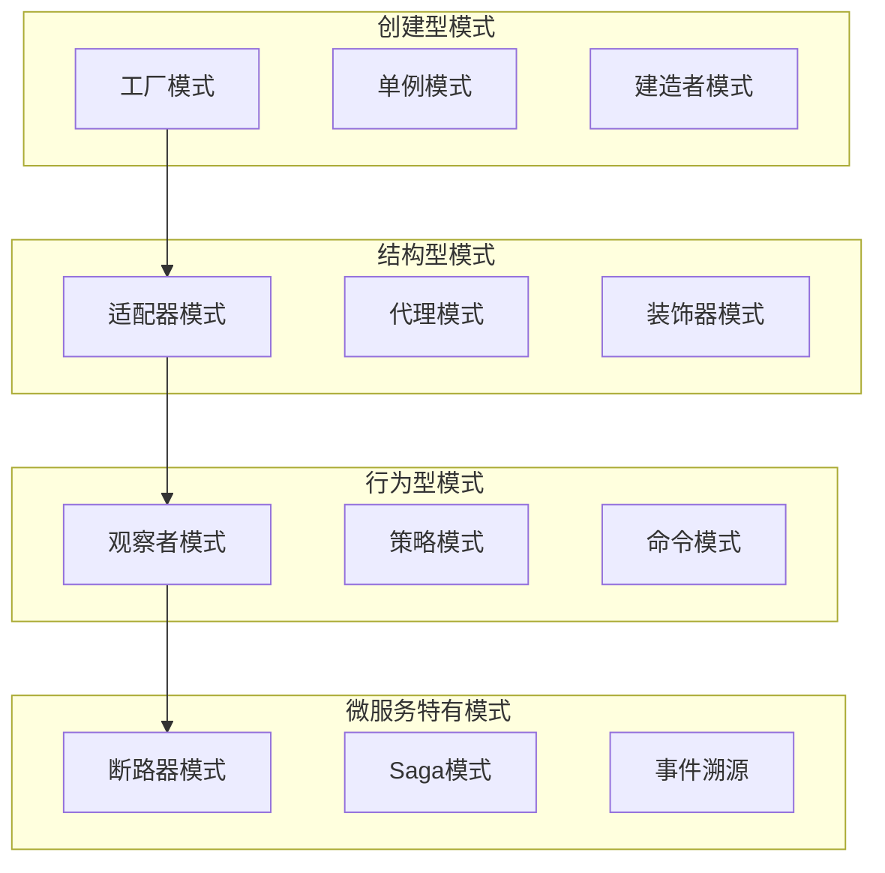
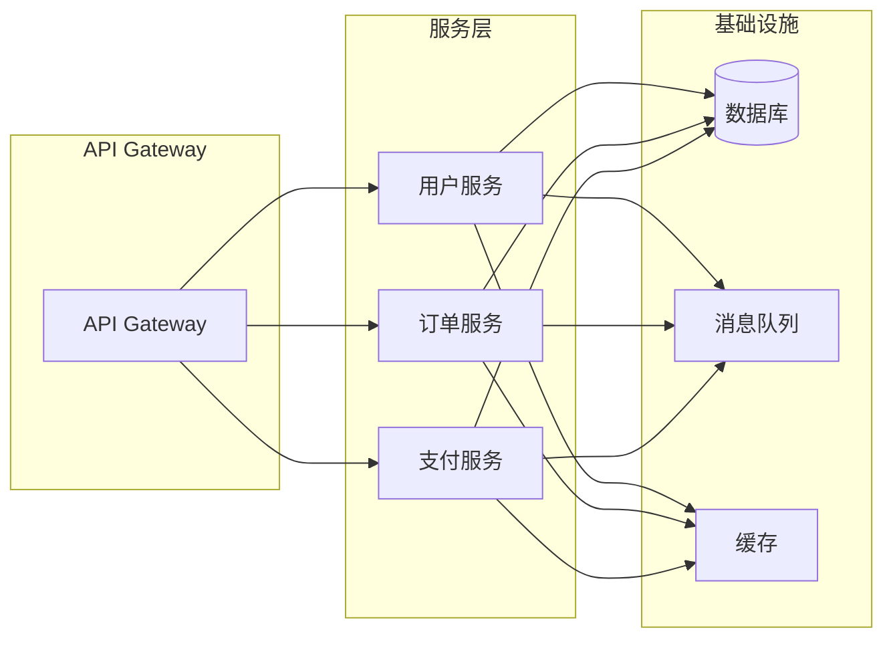

# 1.1.5.1 微服务架构设计模式综述

> 本文属于1.1-Microservice主题，建议配合[主题树与内容索引](../../00-主题树与内容索引.md)一同阅读。

## 目录

- [1.1.5.1 微服务架构设计模式综述](#1151-微服务架构设计模式综述)
  - [目录](#目录)
  - [1.1.5.1.1 引言](#11511-引言)
  - [1.1.5.1.2 设计模式分类](#11512-设计模式分类)
  - [1.1.5.1.3 典型模式详解](#11513-典型模式详解)
  - [1.1.5.1.4 Rust/Haskell/Go代码示例](#11514-rusthaskellgo代码示例)
  - [1.1.5.1.5 图表与形式化分析](#11515-图表与形式化分析)
  - [1.1.5.1.6 参考文献](#11516-参考文献)

---

## 1.1.5.1.1 引言

微服务架构设计模式是解决分布式系统复杂性的重要工具。在微服务环境中，传统的单体应用设计模式需要重新审视和调整，以适应分布式、异步、容错的特性。设计模式不仅帮助解决技术挑战，更重要的是提供可重用、可维护的解决方案。

**微服务设计模式的核心价值**：
- **服务解耦**：通过模式实现服务间的松耦合
- **容错处理**：提供可靠的错误处理和恢复机制
- **性能优化**：通过缓存、异步等模式提升系统性能
- **可维护性**：提高代码的可读性和可维护性
- **可扩展性**：支持系统的水平扩展和垂直扩展

## 1.1.5.1.2 设计模式分类

### 1.1.5.1.2.1 按目的分类

**创建型模式**
- **工厂模式**：统一服务实例的创建
- **单例模式**：确保全局唯一实例
- **建造者模式**：复杂对象的逐步构建
- **原型模式**：通过克隆创建对象

**结构型模式**
- **适配器模式**：兼容不同接口的服务
- **装饰器模式**：动态扩展服务功能
- **代理模式**：控制服务访问
- **组合模式**：统一处理服务集合

**行为型模式**
- **观察者模式**：服务间的事件通知
- **策略模式**：算法的动态选择
- **命令模式**：请求的封装和排队
- **状态模式**：服务状态的管理

### 1.1.5.1.2.2 微服务特有模式

**分布式系统模式**
- **断路器模式**：防止级联故障
- **重试模式**：处理临时性故障
- **超时模式**：避免无限等待
- **熔断器模式**：快速失败机制

**数据管理模式**
- **Saga模式**：分布式事务管理
- **CQRS模式**：命令查询职责分离
- **事件溯源**：基于事件的持久化
- **API网关模式**：统一入口管理

**通信模式**
- **同步通信**：REST、gRPC等
- **异步通信**：消息队列、事件驱动
- **服务发现**：动态服务定位
- **负载均衡**：请求分发策略

## 1.1.5.1.3 典型模式详解

### 1.1.5.1.3.1 断路器模式

**模式定义**：断路器模式用于防止级联故障，当依赖服务出现问题时，快速失败而不是等待超时。

**状态转换**：
- **关闭状态**：正常执行，统计失败次数
- **开启状态**：快速失败，不调用依赖服务
- **半开状态**：允许少量请求测试服务恢复

**Rust实现**：
```rust
use std::sync::{Arc, Mutex};
use std::time::{Duration, Instant};

#[derive(Debug, Clone)]
enum CircuitState {
    Closed,
    Open,
    HalfOpen,
}

struct CircuitBreaker {
    state: Arc<Mutex<CircuitState>>,
    failure_threshold: u32,
    timeout: Duration,
    last_failure_time: Arc<Mutex<Option<Instant>>>,
    failure_count: Arc<Mutex<u32>>,
}

impl CircuitBreaker {
    fn new(failure_threshold: u32, timeout: Duration) -> Self {
        Self {
            state: Arc::new(Mutex::new(CircuitState::Closed)),
            failure_threshold,
            timeout,
            last_failure_time: Arc::new(Mutex::new(None)),
            failure_count: Arc::new(Mutex::new(0)),
        }
    }
    
    async fn call<F, T, E>(&self, operation: F) -> Result<T, E>
    where
        F: FnOnce() -> Result<T, E>,
    {
        let current_state = *self.state.lock().unwrap();
        
        match current_state {
            CircuitState::Open => {
                if self.should_attempt_reset().await {
                    self.set_half_open().await;
                } else {
                    return Err(/* circuit breaker error */);
                }
            }
            CircuitState::HalfOpen => {
                // 允许一次尝试
            }
            CircuitState::Closed => {
                // 正常执行
            }
        }
        
        match operation() {
            Ok(result) => {
                self.on_success().await;
                Ok(result)
            }
            Err(error) => {
                self.on_failure().await;
                Err(error)
            }
        }
    }
    
    async fn should_attempt_reset(&self) -> bool {
        if let Some(last_failure) = *self.last_failure_time.lock().unwrap() {
            return Instant::now().duration_since(last_failure) >= self.timeout;
        }
        false
    }
    
    async fn set_half_open(&self) {
        *self.state.lock().unwrap() = CircuitState::HalfOpen;
    }
    
    async fn on_success(&self) {
        *self.state.lock().unwrap() = CircuitState::Closed;
        *self.failure_count.lock().unwrap() = 0;
    }
    
    async fn on_failure(&self) {
        let mut failure_count = self.failure_count.lock().unwrap();
        *failure_count += 1;
        
        if *failure_count >= self.failure_threshold {
            *self.state.lock().unwrap() = CircuitState::Open;
            *self.last_failure_time.lock().unwrap() = Some(Instant::now());
        }
    }
}
```

### 1.1.5.1.3.2 Saga模式

**模式定义**：Saga模式用于管理分布式事务，通过一系列本地事务和补偿操作来保证最终一致性。

**核心概念**：
- **Choreography**：通过事件协调各个服务
- **Orchestration**：通过中央协调器管理流程
- **补偿操作**：撤销已执行的操作

**Rust实现**：
```rust
use async_trait::async_trait;

#[async_trait]
trait SagaStep {
    async fn execute(&self) -> Result<(), Error>;
    async fn compensate(&self) -> Result<(), Error>;
}

struct CreateOrderSaga {
    steps: Vec<Box<dyn SagaStep + Send + Sync>>,
}

impl CreateOrderSaga {
    fn new() -> Self {
        Self { steps: Vec::new() }
    }
    
    fn add_step(&mut self, step: Box<dyn SagaStep + Send + Sync>) {
        self.steps.push(step);
    }
    
    async fn execute(&self) -> Result<(), Error> {
        let mut executed_steps = Vec::new();
        
        for step in &self.steps {
            match step.execute().await {
                Ok(()) => {
                    executed_steps.push(step);
                }
                Err(error) => {
                    // 补偿已执行的步骤
                    for executed_step in executed_steps.iter().rev() {
                        if let Err(compensation_error) = executed_step.compensate().await {
                            // 记录补偿错误
                            eprintln!("Compensation failed: {:?}", compensation_error);
                        }
                    }
                    return Err(error);
                }
            }
        }
        
        Ok(())
    }
}

// 具体步骤实现
struct ReserveInventoryStep {
    product_id: String,
    quantity: u32,
}

#[async_trait]
impl SagaStep for ReserveInventoryStep {
    async fn execute(&self) -> Result<(), Error> {
        // 预留库存
        println!("Reserving inventory for product: {}", self.product_id);
        Ok(())
    }
    
    async fn compensate(&self) -> Result<(), Error> {
        // 释放库存
        println!("Releasing inventory for product: {}", self.product_id);
        Ok(())
    }
}
```

### 1.1.5.1.3.3 CQRS模式

**模式定义**：命令查询职责分离模式将读写操作分离，使用不同的模型和存储来优化性能。

**核心概念**：
- **Command**：修改数据的操作
- **Query**：查询数据的操作
- **Event Sourcing**：基于事件的持久化
- **Projection**：查询模型的构建

**Rust实现**：
```rust
use async_trait::async_trait;
use serde::{Deserialize, Serialize};

// 命令
#[derive(Debug, Clone, Serialize, Deserialize)]
enum Command {
    CreateUser { name: String, email: String },
    UpdateUser { id: String, name: String },
    DeleteUser { id: String },
}

// 查询
#[derive(Debug, Clone, Serialize, Deserialize)]
enum Query {
    GetUser { id: String },
    ListUsers { limit: u32, offset: u32 },
    SearchUsers { query: String },
}

// 事件
#[derive(Debug, Clone, Serialize, Deserialize)]
enum Event {
    UserCreated { id: String, name: String, email: String },
    UserUpdated { id: String, name: String },
    UserDeleted { id: String },
}

// 命令处理器
struct CommandHandler {
    event_store: Arc<dyn EventStore>,
}

impl CommandHandler {
    async fn handle(&self, command: Command) -> Result<(), Error> {
        match command {
            Command::CreateUser { name, email } => {
                let user_id = generate_id();
                let event = Event::UserCreated {
                    id: user_id.clone(),
                    name,
                    email,
                };
                self.event_store.append_events(&user_id, vec![event]).await?;
            }
            Command::UpdateUser { id, name } => {
                let event = Event::UserUpdated { id, name };
                self.event_store.append_events(&id, vec![event]).await?;
            }
            Command::DeleteUser { id } => {
                let event = Event::UserDeleted { id };
                self.event_store.append_events(&id, vec![event]).await?;
            }
        }
        Ok(())
    }
}

// 查询处理器
struct QueryHandler {
    read_model: Arc<dyn ReadModel>,
}

impl QueryHandler {
    async fn handle(&self, query: Query) -> Result<QueryResult, Error> {
        match query {
            Query::GetUser { id } => {
                let user = self.read_model.get_user(&id).await?;
                Ok(QueryResult::User(user))
            }
            Query::ListUsers { limit, offset } => {
                let users = self.read_model.list_users(limit, offset).await?;
                Ok(QueryResult::UserList(users))
            }
            Query::SearchUsers { query } => {
                let users = self.read_model.search_users(&query).await?;
                Ok(QueryResult::UserList(users))
            }
        }
    }
}
```

## 1.1.5.1.4 Rust/Haskell/Go代码示例

### 1.1.5.1.4.1 Rust实现

**事件溯源模式**
```rust
use serde::{Deserialize, Serialize};
use std::collections::HashMap;

#[derive(Debug, Clone, Serialize, Deserialize)]
enum DomainEvent {
    OrderCreated { order_id: String, customer_id: String },
    OrderConfirmed { order_id: String },
    OrderCancelled { order_id: String, reason: String },
}

#[derive(Debug, Clone)]
struct EventStore {
    events: HashMap<String, Vec<DomainEvent>>,
}

impl EventStore {
    fn new() -> Self {
        Self {
            events: HashMap::new(),
        }
    }
    
    fn append_events(&mut self, aggregate_id: &str, events: Vec<DomainEvent>) {
        self.events.entry(aggregate_id.to_string())
            .or_insert_with(Vec::new)
            .extend(events);
    }
    
    fn get_events(&self, aggregate_id: &str) -> Vec<DomainEvent> {
        self.events.get(aggregate_id)
            .cloned()
            .unwrap_or_default()
    }
}

#[derive(Debug, Clone)]
struct OrderAggregate {
    id: String,
    customer_id: String,
    status: OrderStatus,
    version: u64,
}

#[derive(Debug, Clone)]
enum OrderStatus {
    Created,
    Confirmed,
    Cancelled,
}

impl OrderAggregate {
    fn new(id: String, customer_id: String) -> Self {
        Self {
            id,
            customer_id,
            status: OrderStatus::Created,
            version: 0,
        }
    }
    
    fn apply_event(&mut self, event: &DomainEvent) {
        match event {
            DomainEvent::OrderCreated { order_id, customer_id } => {
                self.id = order_id.clone();
                self.customer_id = customer_id.clone();
                self.status = OrderStatus::Created;
            }
            DomainEvent::OrderConfirmed { order_id } => {
                if self.id == *order_id {
                    self.status = OrderStatus::Confirmed;
                }
            }
            DomainEvent::OrderCancelled { order_id, .. } => {
                if self.id == *order_id {
                    self.status = OrderStatus::Cancelled;
                }
            }
        }
        self.version += 1;
    }
    
    fn create_order(&mut self) -> Vec<DomainEvent> {
        vec![DomainEvent::OrderCreated {
            order_id: self.id.clone(),
            customer_id: self.customer_id.clone(),
        }]
    }
    
    fn confirm_order(&mut self) -> Vec<DomainEvent> {
        vec![DomainEvent::OrderConfirmed {
            order_id: self.id.clone(),
        }]
    }
    
    fn cancel_order(&mut self, reason: String) -> Vec<DomainEvent> {
        vec![DomainEvent::OrderCancelled {
            order_id: self.id.clone(),
            reason,
        }]
    }
}
```

### 1.1.5.1.4.2 Haskell实现

**函数式设计模式**
```haskell
-- 单子变换器模式
newtype ServiceT m a = ServiceT { runServiceT :: ReaderT Config (ExceptT Error m) a }
  deriving (Functor, Applicative, Monad)

instance MonadTrans ServiceT where
  lift = ServiceT . lift . lift

-- 配置单子
data Config = Config
  { databaseUrl :: String
  , apiKey :: String
  , timeout :: Int
  }

-- 错误类型
data Error = DatabaseError String
           | NetworkError String
           | ValidationError String
  deriving (Show, Eq)

-- 服务类型类
class Monad m => Service m where
  getUser :: UserId -> m (Maybe User)
  createUser :: User -> m UserId
  updateUser :: UserId -> User -> m Bool

-- 具体实现
instance MonadIO m => Service (ServiceT m) where
  getUser userId = do
    config <- ask
    result <- liftIO $ queryDatabase (databaseUrl config) userId
    case result of
      Left err -> throwError (DatabaseError err)
      Right user -> return user
  
  createUser user = do
    config <- ask
    result <- liftIO $ insertUser (databaseUrl config) user
    case result of
      Left err -> throwError (DatabaseError err)
      Right userId -> return userId
  
  updateUser userId user = do
    config <- ask
    result <- liftIO $ updateUserInDb (databaseUrl config) userId user
    case result of
      Left err -> throwError (DatabaseError err)
      Right success -> return success

-- 使用示例
main :: IO ()
main = do
  let config = Config "postgresql://localhost/db" "api-key" 30
  result <- runExceptT $ runReaderT (runServiceT createUserService) config
  case result of
    Left err -> putStrLn $ "Error: " ++ show err
    Right userId -> putStrLn $ "Created user: " ++ show userId

createUserService :: ServiceT IO UserId
createUserService = do
  let user = User "john" "john@example.com"
  userId <- createUser user
  return userId
```

### 1.1.5.1.4.3 Go实现

**微服务模式**
```go
package main

import (
    "context"
    "errors"
    "time"
)

// 服务接口
type UserService interface {
    GetUser(ctx context.Context, id string) (*User, error)
    CreateUser(ctx context.Context, user *User) (string, error)
    UpdateUser(ctx context.Context, id string, user *User) error
}

// 用户模型
type User struct {
    ID       string    `json:"id"`
    Name     string    `json:"name"`
    Email    string    `json:"email"`
    Created  time.Time `json:"created"`
}

// 服务实现
type userService struct {
    repo   UserRepository
    cache  Cache
    events EventBus
}

func NewUserService(repo UserRepository, cache Cache, events EventBus) UserService {
    return &userService{
        repo:   repo,
        cache:  cache,
        events: events,
    }
}

func (s *userService) GetUser(ctx context.Context, id string) (*User, error) {
    // 先查缓存
    if user, found := s.cache.Get(id); found {
        return user.(*User), nil
    }
    
    // 查数据库
    user, err := s.repo.GetByID(ctx, id)
    if err != nil {
        return nil, err
    }
    
    // 更新缓存
    s.cache.Set(id, user, time.Hour)
    
    return user, nil
}

func (s *userService) CreateUser(ctx context.Context, user *User) (string, error) {
    // 创建用户
    id, err := s.repo.Create(ctx, user)
    if err != nil {
        return "", err
    }
    
    // 发布事件
    s.events.Publish("user.created", &UserCreatedEvent{
        UserID: id,
        User:   user,
    })
    
    return id, nil
}

func (s *userService) UpdateUser(ctx context.Context, id string, user *User) error {
    // 更新用户
    err := s.repo.Update(ctx, id, user)
    if err != nil {
        return err
    }
    
    // 清除缓存
    s.cache.Delete(id)
    
    // 发布事件
    s.events.Publish("user.updated", &UserUpdatedEvent{
        UserID: id,
        User:   user,
    })
    
    return nil
}

// 中间件模式
type Middleware func(UserService) UserService

func LoggingMiddleware(logger Logger) Middleware {
    return func(next UserService) UserService {
        return &loggingService{
            next:   next,
            logger: logger,
        }
    }
}

type loggingService struct {
    next   UserService
    logger Logger
}

func (s *loggingService) GetUser(ctx context.Context, id string) (*User, error) {
    s.logger.Info("Getting user", "id", id)
    user, err := s.next.GetUser(ctx, id)
    if err != nil {
        s.logger.Error("Failed to get user", "id", id, "error", err)
    } else {
        s.logger.Info("Successfully got user", "id", id)
    }
    return user, err
}

// 使用中间件
func main() {
    repo := NewUserRepository()
    cache := NewCache()
    events := NewEventBus()
    
    service := NewUserService(repo, cache, events)
    service = LoggingMiddleware(NewLogger())(service)
    service = MetricsMiddleware(NewMetrics())(service)
    
    // 使用服务
    user, err := service.GetUser(context.Background(), "123")
    if err != nil {
        panic(err)
    }
    fmt.Printf("User: %+v\n", user)
}
```

## 1.1.5.1.5 图表与形式化分析

### 1.1.5.1.5.1 设计模式关系图



### 1.1.5.1.5.2 微服务架构模式



### 1.1.5.1.5.3 性能分析

**模式性能影响**：
- **缓存模式**：减少数据库访问，提升响应速度
- **异步模式**：提高并发处理能力
- **连接池模式**：减少连接开销
- **懒加载模式**：减少内存占用

**最佳实践**：
- 合理使用设计模式，避免过度设计
- 考虑模式对性能的影响
- 在分布式环境中特别注意模式的一致性
- 定期重构，保持代码简洁

## 1.1.5.1.6 参考文献

1. **经典设计模式**：
   - Gamma, E., Helm, R., Johnson, R., & Vlissides, J. (1994). Design Patterns: Elements of Reusable Object-Oriented Software
   - Freeman, E., Robson, E., Sierra, K., & Bates, B. (2004). Head First Design Patterns

2. **微服务模式**：
   - Richardson, C. (2018). Microservices Patterns
   - Newman, S. (2021). Building Microservices
   - Fowler, M. (2014). Microservices

3. **分布式系统模式**：
   - Hohpe, G., & Woolf, B. (2003). Enterprise Integration Patterns
   - Kleppmann, M. (2017). Designing Data-Intensive Applications

4. **函数式编程模式**：
   - Bird, R. (1998). Introduction to Functional Programming using Haskell
   - Hutton, G. (2016). Programming in Haskell

5. **Rust设计模式**：
   - Blandy, J., & Orendorff, J. (2017). Programming Rust
   - Klabnik, S., & Nichols, C. (2019). The Rust Programming Language

---

> 本文档为微服务架构设计模式综述，后续将根据具体实现需求进行细化。
