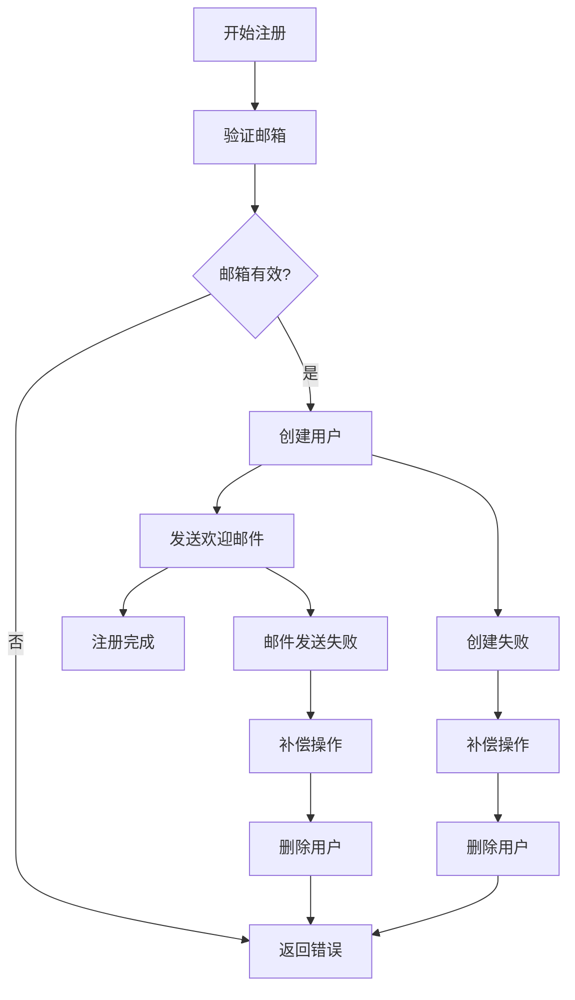
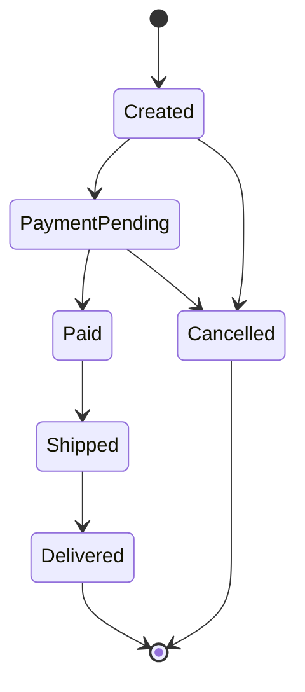
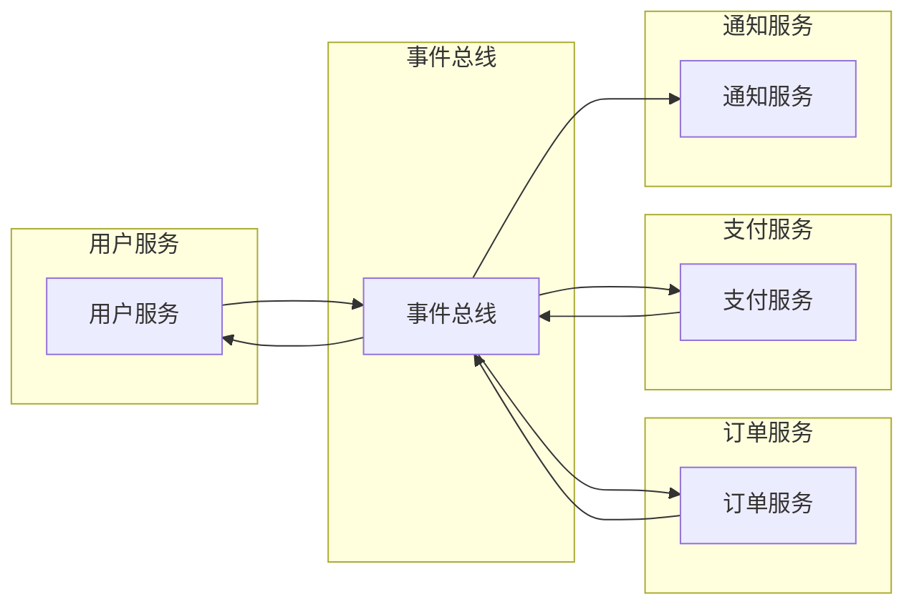

# 1.1.5.2 微服务架构设计模式案例与实现

> 本文属于1.1-Microservice主题，建议配合[主题树与内容索引](../../00-主题树与内容索引.md)一同阅读。

## 目录

- [1.1.5.2 微服务架构设计模式案例与实现](#1152-微服务架构设计模式案例与实现)
  - [目录](#目录)
  - [1.1.5.2.1 引言](#11521-引言)
  - [1.1.5.2.2 典型设计模式案例](#11522-典型设计模式案例)
    - [1.1.5.2.2.1 案例一：用户注册流程](#115221-案例一用户注册流程)
    - [1.1.5.2.2.2 案例二：商品下单流程](#115222-案例二商品下单流程)
    - [1.1.5.2.2.3 案例三：支付处理流程](#115223-案例三支付处理流程)
  - [1.1.5.2.3 Rust/Haskell/Go代码实现](#11523-rusthaskellgo代码实现)
    - [1.1.5.2.3.1 Rust实现](#115231-rust实现)
    - [1.1.5.2.3.2 Haskell实现](#115232-haskell实现)
    - [1.1.5.2.3.3 Go实现](#115233-go实现)
  - [1.1.5.2.4 图表与形式化分析](#11524-图表与形式化分析)
    - [1.1.5.2.4.1 用户注册Saga流程图](#115241-用户注册saga流程图)
    - [1.1.5.2.4.2 订单状态转换图](#115242-订单状态转换图)
    - [1.1.5.2.4.3 微服务事件驱动架构](#115243-微服务事件驱动架构)
    - [1.1.5.2.4.4 性能分析](#115244-性能分析)
  - [1.1.5.2.5 参考文献](#11525-参考文献)

---

## 1.1.5.2.1 引言

微服务架构设计模式的实际应用案例是理解和掌握这些模式的最佳方式。通过具体的业务场景和技术实现，我们可以深入理解模式的价值和应用方法。本文将通过电商系统的典型场景，展示各种设计模式的实际应用。

**案例背景**：电商微服务系统

- **用户服务**：用户注册、登录、信息管理
- **商品服务**：商品信息、库存管理
- **订单服务**：订单创建、状态管理
- **支付服务**：支付处理、退款管理
- **通知服务**：邮件、短信通知

**技术栈**：

- **Rust**：高性能服务，内存安全
- **Haskell**：函数式编程，类型安全
- **Go**：并发处理，简单易用

## 1.1.5.2.2 典型设计模式案例

### 1.1.5.2.2.1 案例一：用户注册流程

**业务场景**：用户注册时需要验证邮箱、创建用户账户、发送欢迎邮件

**涉及模式**：

- **Saga模式**：管理分布式事务
- **事件溯源**：记录用户创建过程
- **观察者模式**：通知相关服务

**流程设计**：

1. 验证邮箱格式
2. 检查邮箱是否已注册
3. 创建用户账户
4. 发送验证邮件
5. 记录用户创建事件

### 1.1.5.2.2.2 案例二：商品下单流程

**业务场景**：用户下单时需要检查库存、创建订单、预扣库存、处理支付

**涉及模式**：

- **断路器模式**：处理支付服务故障
- **重试模式**：处理网络临时故障
- **状态模式**：管理订单状态

**流程设计**：

1. 验证商品信息
2. 检查库存
3. 创建订单
4. 预扣库存
5. 处理支付
6. 更新订单状态

### 1.1.5.2.2.3 案例三：支付处理流程

**业务场景**：支付处理需要支持多种支付方式、处理支付结果、更新订单状态

**涉及模式**：

- **策略模式**：不同支付方式处理
- **命令模式**：支付请求封装
- **责任链模式**：支付验证流程

**流程设计**：

1. 验证支付信息
2. 选择支付策略
3. 执行支付
4. 处理支付结果
5. 更新订单状态

## 1.1.5.2.3 Rust/Haskell/Go代码实现

### 1.1.5.2.3.1 Rust实现

**用户注册Saga模式**:

```rust
use async_trait::async_trait;
use serde::{Deserialize, Serialize};
use std::sync::Arc;
use tokio::sync::Mutex;

#[derive(Debug, Clone, Serialize, Deserialize)]
struct User {
    id: String,
    email: String,
    name: String,
    status: UserStatus,
}

#[derive(Debug, Clone, Serialize, Deserialize)]
enum UserStatus {
    Pending,
    Active,
    Suspended,
}

#[derive(Debug, Clone, Serialize, Deserialize)]
enum UserEvent {
    UserCreated { user_id: String, email: String, name: String },
    EmailVerified { user_id: String },
    UserActivated { user_id: String },
}

// Saga步骤定义
#[async_trait]
trait SagaStep {
    async fn execute(&self) -> Result<(), String>;
    async fn compensate(&self) -> Result<(), String>;
}

struct ValidateEmailStep {
    email: String,
}

#[async_trait]
impl SagaStep for ValidateEmailStep {
    async fn execute(&self) -> Result<(), String> {
        if !self.email.contains('@') {
            return Err("Invalid email format".to_string());
        }
        println!("Email validated: {}", self.email);
        Ok(())
    }
    
    async fn compensate(&self) -> Result<(), String> {
        println!("Email validation compensation");
        Ok(())
    }
}

struct CreateUserStep {
    user: User,
    event_store: Arc<Mutex<Vec<UserEvent>>>,
}

#[async_trait]
impl SagaStep for CreateUserStep {
    async fn execute(&self) -> Result<(), String> {
        let event = UserEvent::UserCreated {
            user_id: self.user.id.clone(),
            email: self.user.email.clone(),
            name: self.user.name.clone(),
        };
        
        let mut events = self.event_store.lock().await;
        events.push(event);
        
        println!("User created: {}", self.user.id);
        Ok(())
    }
    
    async fn compensate(&self) -> Result<(), String> {
        println!("User creation compensation for: {}", self.user.id);
        Ok(())
    }
}

struct SendWelcomeEmailStep {
    user_id: String,
    email: String,
}

#[async_trait]
impl SagaStep for SendWelcomeEmailStep {
    async fn execute(&self) -> Result<(), String> {
        println!("Sending welcome email to: {}", self.email);
        // 模拟邮件发送
        tokio::time::sleep(tokio::time::Duration::from_millis(100)).await;
        Ok(())
    }
    
    async fn compensate(&self) -> Result<(), String> {
        println!("Welcome email compensation");
        Ok(())
    }
}

// Saga协调器
struct UserRegistrationSaga {
    steps: Vec<Box<dyn SagaStep + Send + Sync>>,
}

impl UserRegistrationSaga {
    fn new() -> Self {
        Self { steps: Vec::new() }
    }
    
    fn add_step(&mut self, step: Box<dyn SagaStep + Send + Sync>) {
        self.steps.push(step);
    }
    
    async fn execute(&self) -> Result<(), String> {
        let mut executed_steps = Vec::new();
        
        for step in &self.steps {
            match step.execute().await {
                Ok(()) => {
                    executed_steps.push(step);
                }
                Err(error) => {
                    println!("Step failed: {}", error);
                    // 补偿已执行的步骤
                    for executed_step in executed_steps.iter().rev() {
                        if let Err(compensation_error) = executed_step.compensate().await {
                            println!("Compensation failed: {}", compensation_error);
                        }
                    }
                    return Err(error);
                }
            }
        }
        
        Ok(())
    }
}

// 使用示例
async fn register_user() -> Result<(), String> {
    let event_store = Arc::new(Mutex::new(Vec::new()));
    
    let user = User {
        id: "user_123".to_string(),
        email: "user@example.com".to_string(),
        name: "John Doe".to_string(),
        status: UserStatus::Pending,
    };
    
    let mut saga = UserRegistrationSaga::new();
    saga.add_step(Box::new(ValidateEmailStep {
        email: user.email.clone(),
    }));
    saga.add_step(Box::new(CreateUserStep {
        user: user.clone(),
        event_store: event_store.clone(),
    }));
    saga.add_step(Box::new(SendWelcomeEmailStep {
        user_id: user.id.clone(),
        email: user.email.clone(),
    }));
    
    saga.execute().await
}
```

**订单处理状态模式**:

```rust
use std::collections::HashMap;

#[derive(Debug, Clone)]
enum OrderState {
    Created,
    PaymentPending,
    Paid,
    Shipped,
    Delivered,
    Cancelled,
}

#[derive(Debug, Clone)]
struct Order {
    id: String,
    user_id: String,
    items: Vec<OrderItem>,
    total_amount: f64,
    state: OrderState,
}

#[derive(Debug, Clone)]
struct OrderItem {
    product_id: String,
    quantity: u32,
    price: f64,
}

// 状态处理器
trait StateHandler {
    fn can_transition_to(&self, new_state: &OrderState) -> bool;
    fn on_enter(&self, order: &mut Order);
    fn on_exit(&self, order: &mut Order);
}

struct CreatedStateHandler;

impl StateHandler for CreatedStateHandler {
    fn can_transition_to(&self, new_state: &OrderState) -> bool {
        matches!(new_state, OrderState::PaymentPending | OrderState::Cancelled)
    }
    
    fn on_enter(&self, order: &mut Order) {
        println!("Order {} created", order.id);
    }
    
    fn on_exit(&self, order: &mut Order) {
        println!("Order {} leaving created state", order.id);
    }
}

struct PaymentPendingStateHandler;

impl StateHandler for PaymentPendingStateHandler {
    fn can_transition_to(&self, new_state: &OrderState) -> bool {
        matches!(new_state, OrderState::Paid | OrderState::Cancelled)
    }
    
    fn on_enter(&self, order: &mut Order) {
        println!("Order {} payment pending", order.id);
    }
    
    fn on_exit(&self, order: &mut Order) {
        println!("Order {} leaving payment pending state", order.id);
    }
}

// 订单状态机
struct OrderStateMachine {
    handlers: HashMap<OrderState, Box<dyn StateHandler>>,
}

impl OrderStateMachine {
    fn new() -> Self {
        let mut handlers: HashMap<OrderState, Box<dyn StateHandler>> = HashMap::new();
        handlers.insert(OrderState::Created, Box::new(CreatedStateHandler));
        handlers.insert(OrderState::PaymentPending, Box::new(PaymentPendingStateHandler));
        
        Self { handlers }
    }
    
    fn transition(&self, order: &mut Order, new_state: OrderState) -> Result<(), String> {
        if let Some(handler) = self.handlers.get(&order.state) {
            if handler.can_transition_to(&new_state) {
                handler.on_exit(order);
                order.state = new_state.clone();
                if let Some(new_handler) = self.handlers.get(&new_state) {
                    new_handler.on_enter(order);
                }
                Ok(())
            } else {
                Err(format!("Invalid transition from {:?} to {:?}", order.state, new_state))
            }
        } else {
            Err("No handler found for current state".to_string())
        }
    }
}
```

### 1.1.5.2.3.2 Haskell实现

**函数式支付处理**:

```haskell
-- 支付类型
data PaymentMethod = CreditCard | PayPal | Alipay | WeChatPay
  deriving (Show, Eq)

data PaymentStatus = Pending | Processing | Completed | Failed
  deriving (Show, Eq)

data Payment = Payment
  { paymentId :: String
  , amount :: Double
  , method :: PaymentMethod
  , status :: PaymentStatus
  , orderId :: String
  }

-- 支付策略
class PaymentProcessor a where
  processPayment :: a -> Payment -> IO (Either String Payment)
  validatePayment :: a -> Payment -> Bool
  refundPayment :: a -> Payment -> IO (Either String Payment)

-- 信用卡支付处理器
data CreditCardProcessor = CreditCardProcessor
  { apiKey :: String
  , endpoint :: String
  }

instance PaymentProcessor CreditCardProcessor where
  processPayment processor payment = do
    putStrLn $ "Processing credit card payment: " ++ paymentId payment
    -- 模拟API调用
    threadDelay 1000000 -- 1秒
    return $ Right payment { status = Completed }
  
  validatePayment processor payment = 
    amount payment > 0 && method payment == CreditCard
  
  refundPayment processor payment = do
    putStrLn $ "Processing credit card refund: " ++ paymentId payment
    return $ Right payment { status = Completed }

-- PayPal支付处理器
data PayPalProcessor = PayPalProcessor
  { clientId :: String
  , clientSecret :: String
  }

instance PaymentProcessor PayPalProcessor where
  processPayment processor payment = do
    putStrLn $ "Processing PayPal payment: " ++ paymentId payment
    threadDelay 1500000 -- 1.5秒
    return $ Right payment { status = Completed }
  
  validatePayment processor payment = 
    amount payment > 0 && method payment == PayPal
  
  refundPayment processor payment = do
    putStrLn $ "Processing PayPal refund: " ++ paymentId payment
    return $ Right payment { status = Completed }

-- 支付工厂
data PaymentFactory = PaymentFactory
  { creditCardProcessor :: CreditCardProcessor
  , paypalProcessor :: PayPalProcessor
  }

createPaymentProcessor :: PaymentMethod -> PaymentFactory -> Either String (SomePaymentProcessor)
createPaymentProcessor method factory = case method of
  CreditCard -> Right $ SomePaymentProcessor $ creditCardProcessor factory
  PayPal -> Right $ SomePaymentProcessor $ paypalProcessor factory
  _ -> Left $ "Unsupported payment method: " ++ show method

-- 类型擦除包装器
data SomePaymentProcessor = forall a. PaymentProcessor a => SomePaymentProcessor a

instance PaymentProcessor SomePaymentProcessor where
  processPayment (SomePaymentProcessor p) = processPayment p
  validatePayment (SomePaymentProcessor p) = validatePayment p
  refundPayment (SomePaymentProcessor p) = refundPayment p

-- 支付服务
data PaymentService = PaymentService
  { factory :: PaymentFactory
  , paymentHistory :: [Payment]
  }

processPaymentRequest :: PaymentService -> Payment -> IO (Either String Payment)
processPaymentRequest service payment = do
  case createPaymentProcessor (method payment) (factory service) of
    Left error -> return $ Left error
    Right processor -> do
      if validatePayment processor payment
        then processPayment processor payment
        else return $ Left "Payment validation failed"

-- 使用示例
main :: IO ()
main = do
  let factory = PaymentFactory
        { creditCardProcessor = CreditCardProcessor "cc_key" "cc_endpoint"
        , paypalProcessor = PayPalProcessor "pp_client" "pp_secret"
        }
  
  let service = PaymentService factory []
  
  let payment = Payment
        { paymentId = "pay_123"
        , amount = 99.99
        , method = CreditCard
        , status = Pending
        , orderId = "order_456"
        }
  
  result <- processPaymentRequest service payment
  case result of
    Left error -> putStrLn $ "Payment failed: " ++ error
    Right completedPayment -> putStrLn $ "Payment completed: " ++ show completedPayment
```

### 1.1.5.2.3.3 Go实现

**微服务通信模式**:

```go
package main

import (
    "context"
    "encoding/json"
    "fmt"
    "log"
    "time"
)

// 事件定义
type Event struct {
    ID        string    `json:"id"`
    Type      string    `json:"type"`
    Data      string    `json:"data"`
    Timestamp time.Time `json:"timestamp"`
}

// 事件总线
type EventBus interface {
    Publish(event Event) error
    Subscribe(eventType string, handler EventHandler) error
}

type EventHandler func(Event) error

// 内存事件总线实现
type InMemoryEventBus struct {
    handlers map[string][]EventHandler
}

func NewInMemoryEventBus() *InMemoryEventBus {
    return &InMemoryEventBus{
        handlers: make(map[string][]EventHandler),
    }
}

func (bus *InMemoryEventBus) Publish(event Event) error {
    if handlers, exists := bus.handlers[event.Type]; exists {
        for _, handler := range handlers {
            go func(h EventHandler, e Event) {
                if err := h(e); err != nil {
                    log.Printf("Event handler error: %v", err)
                }
            }(handler, event)
        }
    }
    return nil
}

func (bus *InMemoryEventBus) Subscribe(eventType string, handler EventHandler) error {
    bus.handlers[eventType] = append(bus.handlers[eventType], handler)
    return nil
}

// 用户服务
type UserService struct {
    eventBus EventBus
    users    map[string]User
}

type User struct {
    ID    string `json:"id"`
    Email string `json:"email"`
    Name  string `json:"name"`
}

func NewUserService(eventBus EventBus) *UserService {
    return &UserService{
        eventBus: eventBus,
        users:    make(map[string]User),
    }
}

func (s *UserService) CreateUser(ctx context.Context, user User) error {
    // 创建用户
    s.users[user.ID] = user
    
    // 发布用户创建事件
    event := Event{
        ID:        generateID(),
        Type:      "user.created",
        Data:      user.ID,
        Timestamp: time.Now(),
    }
    
    return s.eventBus.Publish(event)
}

func (s *UserService) GetUser(ctx context.Context, id string) (*User, error) {
    if user, exists := s.users[id]; exists {
        return &user, nil
    }
    return nil, fmt.Errorf("user not found: %s", id)
}

// 订单服务
type OrderService struct {
    eventBus EventBus
    orders   map[string]Order
}

type Order struct {
    ID       string    `json:"id"`
    UserID   string    `json:"user_id"`
    Amount   float64   `json:"amount"`
    Status   string    `json:"status"`
    Created  time.Time `json:"created"`
}

func NewOrderService(eventBus EventBus) *OrderService {
    return &OrderService{
        eventBus: eventBus,
        orders:   make(map[string]Order),
    }
}

func (s *OrderService) CreateOrder(ctx context.Context, order Order) error {
    // 创建订单
    s.orders[order.ID] = order
    
    // 发布订单创建事件
    event := Event{
        ID:        generateID(),
        Type:      "order.created",
        Data:      order.ID,
        Timestamp: time.Now(),
    }
    
    return s.eventBus.Publish(event)
}

// 通知服务
type NotificationService struct {
    eventBus EventBus
}

func NewNotificationService(eventBus EventBus) *NotificationService {
    service := &NotificationService{eventBus: eventBus}
    
    // 订阅用户创建事件
    eventBus.Subscribe("user.created", service.handleUserCreated)
    eventBus.Subscribe("order.created", service.handleOrderCreated)
    
    return service
}

func (s *NotificationService) handleUserCreated(event Event) error {
    log.Printf("Sending welcome email to user: %s", event.Data)
    // 模拟发送邮件
    time.Sleep(100 * time.Millisecond)
    return nil
}

func (s *NotificationService) handleOrderCreated(event Event) error {
    log.Printf("Sending order confirmation for order: %s", event.Data)
    // 模拟发送订单确认
    time.Sleep(100 * time.Millisecond)
    return nil
}

// 断路器模式
type CircuitBreaker struct {
    state           string
    failureCount    int
    failureThreshold int
    timeout         time.Duration
    lastFailureTime time.Time
}

func NewCircuitBreaker(failureThreshold int, timeout time.Duration) *CircuitBreaker {
    return &CircuitBreaker{
        state:           "CLOSED",
        failureCount:    0,
        failureThreshold: failureThreshold,
        timeout:         timeout,
    }
}

func (cb *CircuitBreaker) Call(operation func() error) error {
    switch cb.state {
    case "OPEN":
        if time.Since(cb.lastFailureTime) >= cb.timeout {
            cb.state = "HALF_OPEN"
        } else {
            return fmt.Errorf("circuit breaker is open")
        }
    case "HALF_OPEN":
        // 允许一次尝试
    case "CLOSED":
        // 正常执行
    }
    
    err := operation()
    if err != nil {
        cb.onFailure()
        return err
    }
    
    cb.onSuccess()
    return nil
}

func (cb *CircuitBreaker) onFailure() {
    cb.failureCount++
    cb.lastFailureTime = time.Now()
    
    if cb.failureCount >= cb.failureThreshold {
        cb.state = "OPEN"
    }
}

func (cb *CircuitBreaker) onSuccess() {
    cb.state = "CLOSED"
    cb.failureCount = 0
}

// 使用示例
func main() {
    eventBus := NewInMemoryEventBus()
    
    userService := NewUserService(eventBus)
    orderService := NewOrderService(eventBus)
    notificationService := NewNotificationService(eventBus)
    
    // 创建断路器
    circuitBreaker := NewCircuitBreaker(3, 5*time.Second)
    
    // 创建用户
    user := User{
        ID:    "user_123",
        Email: "user@example.com",
        Name:  "John Doe",
    }
    
    err := circuitBreaker.Call(func() error {
        return userService.CreateUser(context.Background(), user)
    })
    
    if err != nil {
        log.Printf("Failed to create user: %v", err)
        return
    }
    
    // 创建订单
    order := Order{
        ID:       "order_456",
        UserID:   user.ID,
        Amount:   99.99,
        Status:   "pending",
        Created:  time.Now(),
    }
    
    err = circuitBreaker.Call(func() error {
        return orderService.CreateOrder(context.Background(), order)
    })
    
    if err != nil {
        log.Printf("Failed to create order: %v", err)
        return
    }
    
    // 等待事件处理
    time.Sleep(1 * time.Second)
    log.Println("All operations completed successfully")
}

func generateID() string {
    return fmt.Sprintf("event_%d", time.Now().UnixNano())
}
```

## 1.1.5.2.4 图表与形式化分析

### 1.1.5.2.4.1 用户注册Saga流程图



### 1.1.5.2.4.2 订单状态转换图



### 1.1.5.2.4.3 微服务事件驱动架构



### 1.1.5.2.4.4 性能分析

**模式性能影响分析**：

1. **Saga模式**：
   - 优点：保证最终一致性
   - 缺点：增加系统复杂性
   - 性能影响：补偿操作增加延迟

2. **事件驱动模式**：
   - 优点：服务解耦，异步处理
   - 缺点：事件顺序问题
   - 性能影响：减少同步调用，提升吞吐量

3. **断路器模式**：
   - 优点：防止级联故障
   - 缺点：增加延迟
   - 性能影响：快速失败，减少资源浪费

**最佳实践建议**：

- 合理使用设计模式，避免过度设计
- 监控模式对性能的影响
- 在分布式环境中特别注意模式的一致性
- 定期重构，保持代码简洁

## 1.1.5.2.5 参考文献

1. **微服务模式实践**：
   - Richardson, C. (2018). Microservices Patterns
   - Newman, S. (2021). Building Microservices
   - Fowler, M. (2014). Microservices

2. **分布式系统设计**：
   - Kleppmann, M. (2017). Designing Data-Intensive Applications
   - Hohpe, G., & Woolf, B. (2003). Enterprise Integration Patterns

3. **函数式编程模式**：
   - Bird, R. (1998). Introduction to Functional Programming using Haskell
   - Hutton, G. (2016). Programming in Haskell

4. **Rust系统编程**：
   - Blandy, J., & Orendorff, J. (2017). Programming Rust
   - Klabnik, S., & Nichols, C. (2019). The Rust Programming Language

5. **Go并发编程**：
   - Donovan, A. A. A., & Kernighan, B. W. (2015). The Go Programming Language
   - Cox, R. (2014). Go Concurrency Patterns

6. **事件驱动架构**：
   - Hohpe, G. (2005). Event-Driven Architecture
   - Fowler, M. (2017). Event Sourcing

---

> 本文档为微服务架构设计模式案例与实现，通过具体业务场景展示各种模式的实际应用。
