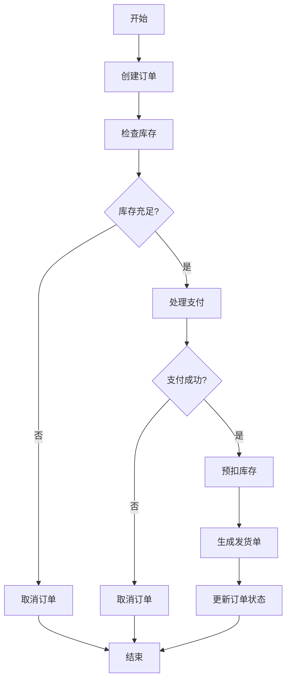
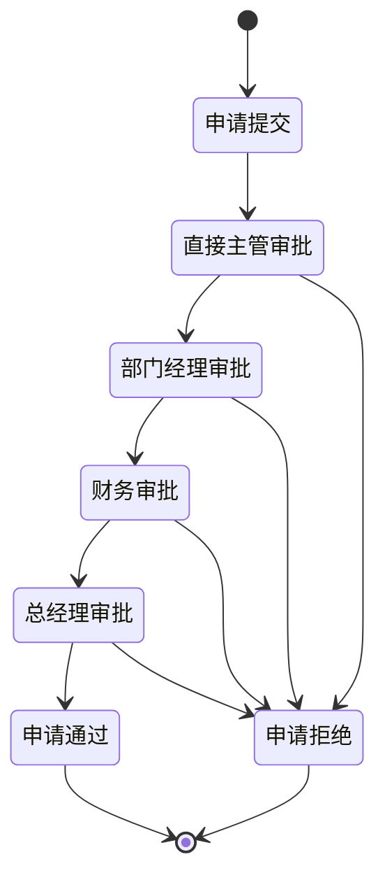
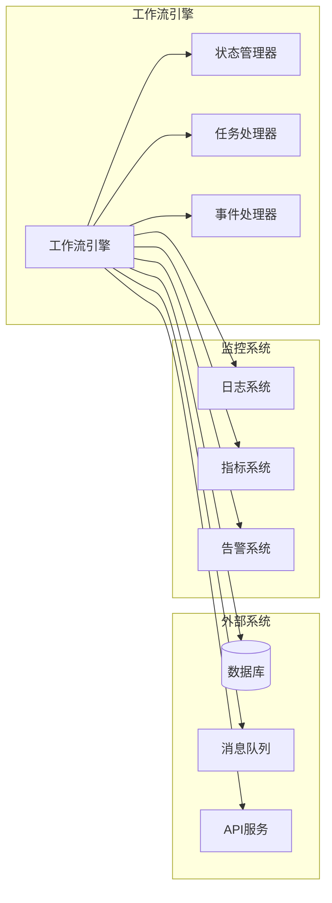

# 1.2.2 WorkflowDomain 典型案例与实现

> 本文属于1.2-WorkflowDomain主题，建议配合[主题树与内容索引](../../00-主题树与内容索引.md)一同阅读。

## 目录

- [1.2.2 WorkflowDomain 典型案例与实现](#122-workflowdomain-典型案例与实现)
  - [目录](#目录)
  - [1.2.2.1 引言](#1221-引言)
  - [1.2.2.2 典型工作流案例](#1222-典型工作流案例)
    - [1.2.2.2.1 电商订单处理流程](#12221-电商订单处理流程)
    - [1.2.2.2.2 企业审批流程](#12222-企业审批流程)
    - [1.2.2.2.3 数据处理ETL流程](#12223-数据处理etl流程)
  - [1.2.2.3 主流工作流引擎实现](#1223-主流工作流引擎实现)
    - [1.2.2.3.1 Apache Airflow](#12231-apache-airflow)
    - [1.2.2.3.2 Temporal](#12232-temporal)
    - [1.2.2.3.3 Camunda](#12233-camunda)
  - [1.2.2.4 Rust/Go实现示例](#1224-rustgo实现示例)
    - [1.2.2.4.1 Rust实现](#12241-rust实现)
    - [1.2.2.4.2 Go实现](#12242-go实现)
  - [1.2.2.5 图表与形式化分析](#1225-图表与形式化分析)
    - [1.2.2.5.1 订单处理工作流图](#12251-订单处理工作流图)
    - [1.2.2.5.2 审批流程状态图](#12252-审批流程状态图)
    - [1.2.2.5.3 工作流引擎架构图](#12253-工作流引擎架构图)
    - [1.2.2.5.4 性能分析](#12254-性能分析)
  - [1.2.2.6 参考文献](#1226-参考文献)

---

## 1.2.2.1 引言

工作流域（WorkflowDomain）是微服务架构中的核心概念，负责协调和管理复杂的业务流程。在实际应用中，工作流域通过定义、执行和监控业务流程，确保业务逻辑的一致性和可靠性。本文将通过具体的案例和实现，展示工作流域在微服务架构中的应用。

**工作流域的核心价值**：

- **业务流程自动化**：将复杂的手工流程自动化
- **状态管理**：统一管理业务流程的状态转换
- **错误处理**：提供可靠的错误处理和恢复机制
- **监控和追踪**：实时监控业务流程的执行状态
- **可扩展性**：支持动态添加和修改业务流程

**典型应用场景**：

- **订单处理流程**：从下单到发货的完整流程
- **审批流程**：多级审批和权限控制
- **数据处理流程**：ETL和数据分析流程
- **集成流程**：多系统间的数据同步和集成

## 1.2.2.2 典型工作流案例

### 1.2.2.2.1 电商订单处理流程

**业务场景**：用户下单后，系统需要处理订单确认、库存检查、支付处理、发货等步骤

**流程步骤**：

1. **订单创建**：接收用户订单，验证商品信息
2. **库存检查**：检查商品库存是否充足
3. **支付处理**：处理用户支付，支持多种支付方式
4. **订单确认**：确认订单信息，生成订单号
5. **库存预扣**：预扣商品库存
6. **发货处理**：生成发货单，安排物流
7. **状态更新**：更新订单状态，通知用户

**技术特点**：

- 支持并行处理（库存检查和支付处理可并行）
- 支持条件分支（库存不足时的处理）
- 支持补偿操作（支付失败时的回滚）
- 支持超时处理（支付超时自动取消）

### 1.2.2.2.2 企业审批流程

**业务场景**：员工提交申请，需要经过多级审批才能最终通过

**流程步骤**：

1. **申请提交**：员工提交申请，系统记录申请信息
2. **直接主管审批**：直接主管进行第一级审批
3. **部门经理审批**：部门经理进行第二级审批
4. **财务审批**：财务部门进行预算审批
5. **总经理审批**：总经理进行最终审批
6. **申请通过**：申请通过，执行相应操作

**技术特点**：

- 支持条件审批（金额超过阈值需要更高级别审批）
- 支持并行审批（某些步骤可并行处理）
- 支持委托审批（主管可委托他人审批）
- 支持审批历史记录

### 1.2.2.2.3 数据处理ETL流程

**业务场景**：从多个数据源提取数据，进行转换和清洗，最终加载到数据仓库

**流程步骤**：

1. **数据提取**：从多个数据源并行提取数据
2. **数据验证**：验证数据格式和完整性
3. **数据转换**：进行数据格式转换和清洗
4. **数据合并**：将多个数据源的数据进行合并
5. **数据加载**：将处理后的数据加载到目标系统
6. **质量检查**：进行数据质量检查和报告

**技术特点**：

- 支持大数据量处理
- 支持增量处理
- 支持错误重试
- 支持数据质量监控

## 1.2.2.3 主流工作流引擎实现

### 1.2.2.3.1 Apache Airflow

**特点**：

- 基于Python的DAG（有向无环图）工作流引擎
- 支持复杂的依赖关系和调度
- 提供丰富的操作符和传感器
- 支持动态任务生成

**核心概念**：

- **DAG**：定义工作流的有向无环图
- **Task**：工作流中的具体任务
- **Operator**：任务的执行器
- **Sensor**：等待外部条件的传感器

**适用场景**：

- 数据处理和ETL流程
- 机器学习流水线
- 系统监控和告警
- 定期任务调度

### 1.2.2.3.2 Temporal

**特点**：

- 基于Go的分布式工作流引擎
- 支持长时间运行的业务流程
- 提供强大的错误处理和重试机制
- 支持版本控制和兼容性

**核心概念**：

- **Workflow**：定义业务流程
- **Activity**：具体的业务活动
- **Signal**：工作流间的通信机制
- **Query**：查询工作流状态

**适用场景**：

- 微服务业务流程
- 订单处理流程
- 审批流程
- 集成流程

### 1.2.2.3.3 Camunda

**特点**：

- 基于BPMN 2.0标准的工作流引擎
- 提供可视化的流程设计工具
- 支持复杂的分支和合并逻辑
- 提供丰富的监控和管理功能

**核心概念**：

- **Process**：BPMN流程定义
- **Task**：用户任务或服务任务
- **Gateway**：网关，控制流程分支
- **Event**：事件，触发流程动作

**适用场景**：

- 企业业务流程
- 审批流程
- 合规流程
- 客户服务流程

## 1.2.2.4 Rust/Go实现示例

### 1.2.2.4.1 Rust实现

**简单工作流引擎**

```rust
use async_trait::async_trait;
use serde::{Deserialize, Serialize};
use std::collections::HashMap;
use tokio::sync::Mutex;

#[derive(Debug, Clone, Serialize, Deserialize)]
enum WorkflowState {
    Created,
    Running,
    Completed,
    Failed,
}

#[derive(Debug, Clone, Serialize, Deserialize)]
struct WorkflowInstance {
    id: String,
    workflow_id: String,
    state: WorkflowState,
    variables: HashMap<String, String>,
    current_step: Option<String>,
    steps: Vec<WorkflowStep>,
}

#[derive(Debug, Clone, Serialize, Deserialize)]
struct WorkflowStep {
    id: String,
    name: String,
    step_type: StepType,
    dependencies: Vec<String>,
    status: StepStatus,
}

#[derive(Debug, Clone, Serialize, Deserialize)]
enum StepType {
    Task { task_name: String },
    Condition { condition: String },
    Parallel { branches: Vec<String> },
}

#[derive(Debug, Clone, Serialize, Deserialize)]
enum StepStatus {
    Pending,
    Running,
    Completed,
    Failed,
}

// 工作流引擎
struct WorkflowEngine {
    instances: Arc<Mutex<HashMap<String, WorkflowInstance>>>,
    task_handlers: HashMap<String, Box<dyn TaskHandler + Send + Sync>>,
}

#[async_trait]
trait TaskHandler {
    async fn execute(&self, variables: &HashMap<String, String>) -> Result<HashMap<String, String>, String>;
}

// 具体任务处理器
struct OrderCreationTask;

#[async_trait]
impl TaskHandler for OrderCreationTask {
    async fn execute(&self, variables: &HashMap<String, String>) -> Result<HashMap<String, String>, String> {
        let mut result = variables.clone();
        result.insert("order_id".to_string(), generate_order_id());
        result.insert("status".to_string(), "created".to_string());
        println!("Order created: {}", result.get("order_id").unwrap());
        Ok(result)
    }
}

struct InventoryCheckTask;

#[async_trait]
impl TaskHandler for InventoryCheckTask {
    async fn execute(&self, variables: &HashMap<String, String>) -> Result<HashMap<String, String>, String> {
        let mut result = variables.clone();
        let product_id = variables.get("product_id").unwrap_or(&"".to_string());
        
        // 模拟库存检查
        if product_id == "out_of_stock" {
            return Err("Product out of stock".to_string());
        }
        
        result.insert("inventory_available".to_string(), "true".to_string());
        println!("Inventory checked for product: {}", product_id);
        Ok(result)
    }
}

impl WorkflowEngine {
    fn new() -> Self {
        let mut engine = Self {
            instances: Arc::new(Mutex::new(HashMap::new())),
            task_handlers: HashMap::new(),
        };
        
        // 注册任务处理器
        engine.task_handlers.insert("create_order".to_string(), Box::new(OrderCreationTask));
        engine.task_handlers.insert("check_inventory".to_string(), Box::new(InventoryCheckTask));
        
        engine
    }
    
    async fn create_instance(&self, workflow_id: String) -> String {
        let instance_id = generate_instance_id();
        let instance = WorkflowInstance {
            id: instance_id.clone(),
            workflow_id,
            state: WorkflowState::Created,
            variables: HashMap::new(),
            current_step: None,
            steps: Vec::new(),
        };
        
        let mut instances = self.instances.lock().await;
        instances.insert(instance_id.clone(), instance);
        
        instance_id
    }
    
    async fn execute_instance(&self, instance_id: String) -> Result<(), String> {
        let mut instances = self.instances.lock().await;
        let instance = instances.get_mut(&instance_id)
            .ok_or("Instance not found")?;
        
        instance.state = WorkflowState::Running;
        
        // 执行工作流步骤
        for step in &mut instance.steps {
            if step.status == StepStatus::Pending {
                step.status = StepStatus::Running;
                
                match &step.step_type {
                    StepType::Task { task_name } => {
                        if let Some(handler) = self.task_handlers.get(task_name) {
                            match handler.execute(&instance.variables).await {
                                Ok(new_variables) => {
                                    instance.variables.extend(new_variables);
                                    step.status = StepStatus::Completed;
                                }
                                Err(error) => {
                                    step.status = StepStatus::Failed;
                                    instance.state = WorkflowState::Failed;
                                    return Err(error);
                                }
                            }
                        }
                    }
                    StepType::Condition { condition } => {
                        // 处理条件逻辑
                        step.status = StepStatus::Completed;
                    }
                    StepType::Parallel { branches } => {
                        // 处理并行逻辑
                        step.status = StepStatus::Completed;
                    }
                }
            }
        }
        
        instance.state = WorkflowState::Completed;
        Ok(())
    }
}

fn generate_instance_id() -> String {
    format!("instance_{}", chrono::Utc::now().timestamp_millis())
}

fn generate_order_id() -> String {
    format!("order_{}", chrono::Utc::now().timestamp_millis())
}

// 使用示例
async fn run_order_workflow() -> Result<(), String> {
    let engine = WorkflowEngine::new();
    
    // 创建工作流实例
    let instance_id = engine.create_instance("order_processing".to_string()).await;
    
    // 设置初始变量
    let mut instances = engine.instances.lock().await;
    let instance = instances.get_mut(&instance_id).unwrap();
    instance.variables.insert("product_id".to_string(), "product_123".to_string());
    instance.variables.insert("quantity".to_string(), "2".to_string());
    
    // 添加工作流步骤
    instance.steps.push(WorkflowStep {
        id: "step_1".to_string(),
        name: "Create Order".to_string(),
        step_type: StepType::Task { task_name: "create_order".to_string() },
        dependencies: Vec::new(),
        status: StepStatus::Pending,
    });
    
    instance.steps.push(WorkflowStep {
        id: "step_2".to_string(),
        name: "Check Inventory".to_string(),
        step_type: StepType::Task { task_name: "check_inventory".to_string() },
        dependencies: vec!["step_1".to_string()],
        status: StepStatus::Pending,
    });
    
    drop(instances);
    
    // 执行工作流
    engine.execute_instance(instance_id).await
}
```

### 1.2.2.4.2 Go实现

**基于状态机的工作流引擎**

```go
package main

import (
    "context"
    "fmt"
    "sync"
    "time"
)

// 工作流状态
type WorkflowState string

const (
    StateCreated   WorkflowState = "CREATED"
    StateRunning   WorkflowState = "RUNNING"
    StateCompleted WorkflowState = "COMPLETED"
    StateFailed    WorkflowState = "FAILED"
)

// 步骤状态
type StepStatus string

const (
    StepPending   StepStatus = "PENDING"
    StepRunning   StepStatus = "RUNNING"
    StepCompleted StepStatus = "COMPLETED"
    StepFailed    StepStatus = "FAILED"
)

// 工作流实例
type WorkflowInstance struct {
    ID           string                 `json:"id"`
    WorkflowID   string                 `json:"workflow_id"`
    State        WorkflowState          `json:"state"`
    Variables    map[string]interface{} `json:"variables"`
    Steps        []*WorkflowStep        `json:"steps"`
    CurrentStep  int                    `json:"current_step"`
    CreatedAt    time.Time              `json:"created_at"`
    UpdatedAt    time.Time              `json:"updated_at"`
}

// 工作流步骤
type WorkflowStep struct {
    ID           string                 `json:"id"`
    Name         string                 `json:"name"`
    Type         StepType               `json:"type"`
    Status       StepStatus             `json:"status"`
    Dependencies []string               `json:"dependencies"`
    Variables    map[string]interface{} `json:"variables"`
}

// 步骤类型
type StepType struct {
    Type       string                 `json:"type"`
    TaskName   string                 `json:"task_name,omitempty"`
    Condition  string                 `json:"condition,omitempty"`
    Branches   []string               `json:"branches,omitempty"`
    Config     map[string]interface{} `json:"config,omitempty"`
}

// 任务处理器接口
type TaskHandler interface {
    Execute(ctx context.Context, variables map[string]interface{}) (map[string]interface{}, error)
}

// 工作流引擎
type WorkflowEngine struct {
    instances    map[string]*WorkflowInstance
    taskHandlers map[string]TaskHandler
    mu           sync.RWMutex
}

// 创建订单任务
type CreateOrderTask struct{}

func (t *CreateOrderTask) Execute(ctx context.Context, variables map[string]interface{}) (map[string]interface{}, error) {
    orderID := fmt.Sprintf("order_%d", time.Now().UnixNano())
    result := make(map[string]interface{})
    for k, v := range variables {
        result[k] = v
    }
    result["order_id"] = orderID
    result["status"] = "created"
    fmt.Printf("Order created: %s\n", orderID)
    return result, nil
}

// 检查库存任务
type CheckInventoryTask struct{}

func (t *CheckInventoryTask) Execute(ctx context.Context, variables map[string]interface{}) (map[string]interface{}, error) {
    productID, ok := variables["product_id"].(string)
    if !ok {
        return nil, fmt.Errorf("product_id not found")
    }
    
    // 模拟库存检查
    if productID == "out_of_stock" {
        return nil, fmt.Errorf("product out of stock")
    }
    
    result := make(map[string]interface{})
    for k, v := range variables {
        result[k] = v
    }
    result["inventory_available"] = true
    fmt.Printf("Inventory checked for product: %s\n", productID)
    return result, nil
}

// 支付处理任务
type ProcessPaymentTask struct{}

func (t *ProcessPaymentTask) Execute(ctx context.Context, variables map[string]interface{}) (map[string]interface{}, error) {
    amount, ok := variables["amount"].(float64)
    if !ok {
        return nil, fmt.Errorf("amount not found")
    }
    
    // 模拟支付处理
    if amount > 1000 {
        return nil, fmt.Errorf("payment failed: amount too high")
    }
    
    result := make(map[string]interface{})
    for k, v := range variables {
        result[k] = v
    }
    result["payment_status"] = "completed"
    result["transaction_id"] = fmt.Sprintf("txn_%d", time.Now().UnixNano())
    fmt.Printf("Payment processed: %f\n", amount)
    return result, nil
}

// 创建新的工作流引擎
func NewWorkflowEngine() *WorkflowEngine {
    engine := &WorkflowEngine{
        instances:    make(map[string]*WorkflowInstance),
        taskHandlers: make(map[string]TaskHandler),
    }
    
    // 注册任务处理器
    engine.taskHandlers["create_order"] = &CreateOrderTask{}
    engine.taskHandlers["check_inventory"] = &CheckInventoryTask{}
    engine.taskHandlers["process_payment"] = &ProcessPaymentTask{}
    
    return engine
}

// 创建工作流实例
func (e *WorkflowEngine) CreateInstance(workflowID string) string {
    e.mu.Lock()
    defer e.mu.Unlock()
    
    instanceID := fmt.Sprintf("instance_%d", time.Now().UnixNano())
    instance := &WorkflowInstance{
        ID:          instanceID,
        WorkflowID:  workflowID,
        State:       StateCreated,
        Variables:   make(map[string]interface{}),
        Steps:       make([]*WorkflowStep, 0),
        CurrentStep: 0,
        CreatedAt:   time.Now(),
        UpdatedAt:   time.Now(),
    }
    
    e.instances[instanceID] = instance
    return instanceID
}

// 执行工作流实例
func (e *WorkflowEngine) ExecuteInstance(ctx context.Context, instanceID string) error {
    e.mu.Lock()
    instance, exists := e.instances[instanceID]
    if !exists {
        e.mu.Unlock()
        return fmt.Errorf("instance not found: %s", instanceID)
    }
    
    instance.State = StateRunning
    instance.UpdatedAt = time.Now()
    e.mu.Unlock()
    
    // 执行工作流步骤
    for i, step := range instance.Steps {
        if step.Status == StepPending {
            step.Status = StepRunning
            instance.CurrentStep = i
            instance.UpdatedAt = time.Now()
            
            // 检查依赖
            if !e.checkDependencies(instance, step) {
                step.Status = StepFailed
                instance.State = StateFailed
                return fmt.Errorf("dependencies not met for step: %s", step.ID)
            }
            
            // 执行步骤
            if err := e.executeStep(ctx, instance, step); err != nil {
                step.Status = StepFailed
                instance.State = StateFailed
                return err
            }
            
            step.Status = StepCompleted
        }
    }
    
    instance.State = StateCompleted
    instance.UpdatedAt = time.Now()
    return nil
}

// 检查步骤依赖
func (e *WorkflowEngine) checkDependencies(instance *WorkflowInstance, step *WorkflowStep) bool {
    for _, depID := range step.Dependencies {
        found := false
        for _, s := range instance.Steps {
            if s.ID == depID && s.Status == StepCompleted {
                found = true
                break
            }
        }
        if !found {
            return false
        }
    }
    return true
}

// 执行单个步骤
func (e *WorkflowEngine) executeStep(ctx context.Context, instance *WorkflowInstance, step *WorkflowStep) error {
    switch step.Type.Type {
    case "task":
        handler, exists := e.taskHandlers[step.Type.TaskName]
        if !exists {
            return fmt.Errorf("task handler not found: %s", step.Type.TaskName)
        }
        
        result, err := handler.Execute(ctx, instance.Variables)
        if err != nil {
            return err
        }
        
        // 更新变量
        for k, v := range result {
            instance.Variables[k] = v
        }
        
    case "condition":
        // 处理条件逻辑
        condition := step.Type.Condition
        fmt.Printf("Evaluating condition: %s\n", condition)
        
    case "parallel":
        // 处理并行逻辑
        branches := step.Type.Branches
        fmt.Printf("Executing parallel branches: %v\n", branches)
    }
    
    return nil
}

// 获取工作流实例
func (e *WorkflowEngine) GetInstance(instanceID string) (*WorkflowInstance, error) {
    e.mu.RLock()
    defer e.mu.RUnlock()
    
    instance, exists := e.instances[instanceID]
    if !exists {
        return nil, fmt.Errorf("instance not found: %s", instanceID)
    }
    
    return instance, nil
}

// 使用示例
func main() {
    engine := NewWorkflowEngine()
    
    // 创建工作流实例
    instanceID := engine.CreateInstance("order_processing")
    
    // 设置初始变量
    instance, _ := engine.GetInstance(instanceID)
    instance.Variables["product_id"] = "product_123"
    instance.Variables["quantity"] = 2
    instance.Variables["amount"] = 99.99
    
    // 添加工作流步骤
    instance.Steps = append(instance.Steps, &WorkflowStep{
        ID:     "step_1",
        Name:   "Create Order",
        Type:   StepType{Type: "task", TaskName: "create_order"},
        Status: StepPending,
    })
    
    instance.Steps = append(instance.Steps, &WorkflowStep{
        ID:           "step_2",
        Name:         "Check Inventory",
        Type:         StepType{Type: "task", TaskName: "check_inventory"},
        Status:       StepPending,
        Dependencies: []string{"step_1"},
    })
    
    instance.Steps = append(instance.Steps, &WorkflowStep{
        ID:           "step_3",
        Name:         "Process Payment",
        Type:         StepType{Type: "task", TaskName: "process_payment"},
        Status:       StepPending,
        Dependencies: []string{"step_2"},
    })
    
    // 执行工作流
    ctx := context.Background()
    err := engine.ExecuteInstance(ctx, instanceID)
    if err != nil {
        fmt.Printf("Workflow execution failed: %v\n", err)
        return
    }
    
    // 获取最终结果
    finalInstance, _ := engine.GetInstance(instanceID)
    fmt.Printf("Workflow completed: %s\n", finalInstance.State)
    fmt.Printf("Final variables: %+v\n", finalInstance.Variables)
}
```

## 1.2.2.5 图表与形式化分析

### 1.2.2.5.1 订单处理工作流图



### 1.2.2.5.2 审批流程状态图



### 1.2.2.5.3 工作流引擎架构图



### 1.2.2.5.4 性能分析

**工作流引擎性能指标**：

- **吞吐量**：每秒处理的工作流实例数
- **延迟**：工作流执行的平均时间
- **可用性**：工作流引擎的可用性百分比
- **扩展性**：支持的最大并发实例数

**优化策略**：

- **并行执行**：支持步骤的并行执行
- **缓存机制**：缓存常用的工作流定义
- **异步处理**：使用消息队列进行异步处理
- **负载均衡**：在多个工作流引擎间分配负载

## 1.2.2.6 参考文献

1. **工作流引擎理论**：
   - van der Aalst, W. M. P. (2016). Process Mining: Data Science in Action
   - Dumas, M., La Rosa, M., Mendling, J., & Reijers, H. A. (2018). Fundamentals of Business Process Management

2. **Apache Airflow**：
   - Bas Harenslak & Julian Rutger de Ruiter (2021). Data Pipelines with Apache Airflow
   - Marc Lamberti (2018). Learning Apache Airflow

3. **Temporal**：
   - Maxim Fateev (2020). Temporal: Open Source Workflow as Code
   - Temporal Documentation: <https://docs.temporal.io/>

4. **Camunda**：
   - Bernd Rücker (2019). Real-Life BPMN
   - Camunda Documentation: <https://docs.camunda.org/>

5. **微服务工作流**：
   - Richardson, C. (2018). Microservices Patterns
   - Newman, S. (2021). Building Microservices

6. **分布式系统**：
   - Kleppmann, M. (2017). Designing Data-Intensive Applications
   - Hohpe, G., & Woolf, B. (2003). Enterprise Integration Patterns

---

> 本文档为工作流域典型案例与实现，通过具体案例展示工作流引擎的设计和应用。
