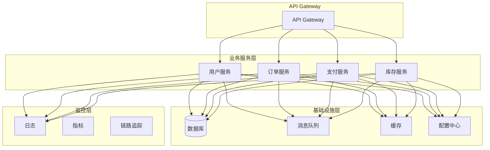
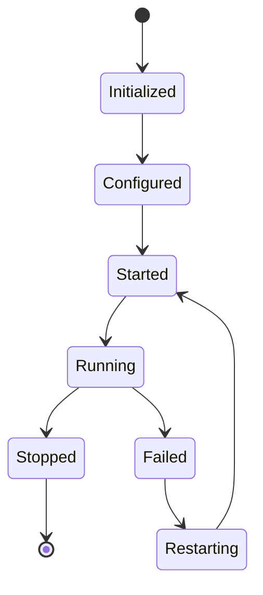

# 1.4 Component 微服务组件化架构综述

> 本文属于1.1-Microservice主题，建议配合[主题树与内容索引](../../00-主题树与内容索引.md)一同阅读。

## 目录

- [1.4 Component 微服务组件化架构综述](#14-component-微服务组件化架构综述)
  - [目录](#目录)
  - [1.4.1 引言](#141-引言)
  - [1.4.2 组件化架构核心概念](#142-组件化架构核心概念)
    - [1.4.2.1 组件定义](#1421-组件定义)
    - [1.4.2.2 组件分类](#1422-组件分类)
    - [1.4.2.3 组件设计原则](#1423-组件设计原则)
  - [1.4.3 典型微服务组件](#143-典型微服务组件)
    - [1.4.3.1 基础设施组件](#1431-基础设施组件)
    - [1.4.3.2 业务组件](#1432-业务组件)
    - [1.4.3.3 集成组件](#1433-集成组件)
  - [1.4.4 组件化设计与实现](#144-组件化设计与实现)
    - [1.4.4.1 组件接口设计](#1441-组件接口设计)
    - [1.4.4.2 组件依赖管理](#1442-组件依赖管理)
    - [1.4.4.3 组件配置管理](#1443-组件配置管理)
  - [1.4.5 图表与形式化分析](#145-图表与形式化分析)
    - [1.4.5.1 组件关系图](#1451-组件关系图)
    - [1.4.5.2 组件生命周期](#1452-组件生命周期)
    - [1.4.5.3 性能分析](#1453-性能分析)
  - [1.4.6 参考文献](#146-参考文献)

---

## 1.4.1 引言

组件化架构是微服务系统设计的重要原则，通过将系统分解为独立、可重用、可组合的组件，实现高内聚、低耦合的架构目标。在微服务环境中，组件化不仅体现在单个服务内部，更体现在服务间的协作和集成模式上。

**组件化架构的核心价值**：

- **可重用性**：组件可以在不同场景中重复使用
- **可维护性**：独立的组件便于单独维护和升级
- **可扩展性**：组件可以独立扩展和优化
- **可测试性**：组件可以独立进行单元测试和集成测试

## 1.4.2 组件化架构核心概念

### 1.4.2.1 组件定义

**组件（Component）**：具有明确接口、独立部署、可重用功能的软件单元。在微服务架构中，组件可以是单个微服务、服务内的模块，或者是跨服务的共享组件。

**组件特征**：

- **封装性**：组件内部实现对外部隐藏
- **接口性**：通过明确的接口与外部交互
- **独立性**：组件可以独立开发、测试、部署
- **可组合性**：组件可以组合成更复杂的系统

### 1.4.2.2 组件分类

**按功能分类**：

- **业务组件**：实现具体业务逻辑的组件
- **技术组件**：提供技术基础设施的组件
- **集成组件**：处理系统间集成的组件
- **监控组件**：提供可观测性的组件

**按粒度分类**：

- **微服务级组件**：独立的微服务
- **模块级组件**：服务内部的模块
- **库级组件**：可重用的代码库
- **框架级组件**：提供开发框架的组件

### 1.4.2.3 组件设计原则

**SOLID原则**：

- **单一职责原则（SRP）**：组件只负责一个功能
- **开闭原则（OCP）**：对扩展开放，对修改关闭
- **里氏替换原则（LSP）**：子组件可以替换父组件
- **接口隔离原则（ISP）**：接口要小而精确
- **依赖倒置原则（DIP）**：依赖抽象而非具体实现

**微服务特有原则**：

- **服务自治**：每个服务独立管理自己的数据
- **技术多样性**：不同服务可以使用不同技术栈
- **故障隔离**：单个服务故障不影响整个系统
- **数据一致性**：通过最终一致性保证数据正确性

## 1.4.3 典型微服务组件

### 1.4.3.1 基础设施组件

**API网关组件**:

```rust
use actix_web::{web, App, HttpServer, middleware};
use std::sync::Arc;

#[derive(Clone)]
struct ApiGateway {
    routes: Arc<RouteRegistry>,
    auth_service: Arc<AuthService>,
    rate_limiter: Arc<RateLimiter>,
}

impl ApiGateway {
    fn new() -> Self {
        Self {
            routes: Arc::new(RouteRegistry::new()),
            auth_service: Arc::new(AuthService::new()),
            rate_limiter: Arc::new(RateLimiter::new()),
        }
    }
    
    async fn handle_request(&self, request: HttpRequest) -> Result<HttpResponse, Error> {
        // 1. 认证
        let user = self.auth_service.authenticate(&request).await?;
        
        // 2. 限流
        self.rate_limiter.check_limit(&user).await?;
        
        // 3. 路由
        let route = self.routes.find_route(&request.path())?;
        
        // 4. 转发请求
        let response = self.forward_request(route, request).await?;
        
        // 5. 记录日志
        self.log_request(&request, &response).await;
        
        Ok(response)
    }
    
    async fn forward_request(&self, route: Route, request: HttpRequest) -> Result<HttpResponse, Error> {
        let client = reqwest::Client::new();
        let response = client
            .request(request.method().clone(), &route.target_url)
            .headers(request.headers().clone())
            .body(request.body().clone())
            .send()
            .await?;
        
        Ok(HttpResponse::from(response))
    }
}
```

**服务发现组件**:

```rust
use std::collections::HashMap;
use std::sync::{Arc, RwLock};
use tokio::time::{Duration, interval};

#[derive(Clone, Debug)]
struct ServiceInstance {
    id: String,
    service_name: String,
    host: String,
    port: u16,
    health_check_url: String,
    metadata: HashMap<String, String>,
}

struct ServiceRegistry {
    instances: Arc<RwLock<HashMap<String, Vec<ServiceInstance>>>>,
    health_checker: Arc<HealthChecker>,
}

impl ServiceRegistry {
    fn new() -> Self {
        let registry = Self {
            instances: Arc::new(RwLock::new(HashMap::new())),
            health_checker: Arc::new(HealthChecker::new()),
        };
        
        // 启动健康检查
        let health_checker = registry.health_checker.clone();
        tokio::spawn(async move {
            let mut interval = interval(Duration::from_secs(30));
            loop {
                interval.tick().await;
                health_checker.check_all_services().await;
            }
        });
        
        registry
    }
    
    async fn register_service(&self, instance: ServiceInstance) -> Result<(), Error> {
        let mut instances = self.instances.write().unwrap();
        let service_instances = instances.entry(instance.service_name.clone())
            .or_insert_with(Vec::new);
        
        service_instances.push(instance);
        Ok(())
    }
    
    async fn discover_service(&self, service_name: &str) -> Result<Vec<ServiceInstance>, Error> {
        let instances = self.instances.read().unwrap();
        Ok(instances.get(service_name)
            .cloned()
            .unwrap_or_default())
    }
    
    async fn deregister_service(&self, service_id: &str) -> Result<(), Error> {
        let mut instances = self.instances.write().unwrap();
        
        for service_instances in instances.values_mut() {
            service_instances.retain(|instance| instance.id != service_id);
        }
        
        Ok(())
    }
}
```

### 1.4.3.2 业务组件

**用户服务组件**:

```rust
use async_trait::async_trait;
use serde::{Deserialize, Serialize};

#[derive(Debug, Clone, Serialize, Deserialize)]
struct User {
    id: String,
    username: String,
    email: String,
    created_at: DateTime<Utc>,
    updated_at: DateTime<Utc>,
}

#[async_trait]
trait UserRepository {
    async fn find_by_id(&self, id: &str) -> Result<Option<User>, Error>;
    async fn find_by_email(&self, email: &str) -> Result<Option<User>, Error>;
    async fn save(&self, user: &User) -> Result<(), Error>;
    async fn delete(&self, id: &str) -> Result<(), Error>;
}

struct UserService {
    repository: Box<dyn UserRepository>,
    event_publisher: Arc<EventPublisher>,
    cache: Arc<Cache>,
}

impl UserService {
    fn new(repository: Box<dyn UserRepository>, event_publisher: Arc<EventPublisher>, cache: Arc<Cache>) -> Self {
        Self {
            repository,
            event_publisher,
            cache,
        }
    }
    
    async fn create_user(&self, username: &str, email: &str) -> Result<User, Error> {
        // 验证输入
        self.validate_user_input(username, email)?;
        
        // 检查邮箱是否已存在
        if let Some(_) = self.repository.find_by_email(email).await? {
            return Err(Error::UserAlreadyExists);
        }
        
        // 创建用户
        let user = User {
            id: generate_id(),
            username: username.to_string(),
            email: email.to_string(),
            created_at: Utc::now(),
            updated_at: Utc::now(),
        };
        
        // 保存到数据库
        self.repository.save(&user).await?;
        
        // 发布事件
        self.event_publisher.publish("user.created", &UserCreatedEvent {
            user_id: user.id.clone(),
            username: user.username.clone(),
            email: user.email.clone(),
        }).await?;
        
        // 缓存用户信息
        self.cache.set(&user.id, &user, Duration::from_secs(3600)).await?;
        
        Ok(user)
    }
    
    async fn get_user(&self, id: &str) -> Result<Option<User>, Error> {
        // 先查缓存
        if let Some(user) = self.cache.get::<User>(id).await? {
            return Ok(Some(user));
        }
        
        // 查数据库
        let user = self.repository.find_by_id(id).await?;
        
        // 更新缓存
        if let Some(ref user) = user {
            self.cache.set(id, user, Duration::from_secs(3600)).await?;
        }
        
        Ok(user)
    }
    
    async fn update_user(&self, id: &str, updates: UserUpdates) -> Result<User, Error> {
        // 获取当前用户
        let mut user = self.repository.find_by_id(id).await?
            .ok_or(Error::UserNotFound)?;
        
        // 更新字段
        if let Some(username) = updates.username {
            user.username = username;
        }
        if let Some(email) = updates.email {
            user.email = email;
        }
        user.updated_at = Utc::now();
        
        // 保存更新
        self.repository.save(&user).await?;
        
        // 清除缓存
        self.cache.delete(id).await?;
        
        // 发布事件
        self.event_publisher.publish("user.updated", &UserUpdatedEvent {
            user_id: user.id.clone(),
            updates,
        }).await?;
        
        Ok(user)
    }
    
    fn validate_user_input(&self, username: &str, email: &str) -> Result<(), Error> {
        if username.is_empty() || username.len() > 50 {
            return Err(Error::InvalidUsername);
        }
        
        if !email.contains('@') {
            return Err(Error::InvalidEmail);
        }
        
        Ok(())
    }
}
```

**订单服务组件**:

```rust
#[derive(Debug, Clone, Serialize, Deserialize)]
struct Order {
    id: String,
    user_id: String,
    items: Vec<OrderItem>,
    total_amount: Decimal,
    status: OrderStatus,
    created_at: DateTime<Utc>,
    updated_at: DateTime<Utc>,
}

#[derive(Debug, Clone)]
enum OrderStatus {
    Created,
    Confirmed,
    Paid,
    Shipped,
    Delivered,
    Cancelled,
}

struct OrderService {
    repository: Box<dyn OrderRepository>,
    user_service: Arc<UserService>,
    payment_service: Arc<PaymentService>,
    inventory_service: Arc<InventoryService>,
    event_publisher: Arc<EventPublisher>,
}

impl OrderService {
    async fn create_order(&self, user_id: &str, items: Vec<OrderItem>) -> Result<Order, Error> {
        // 验证用户
        let user = self.user_service.get_user(user_id).await?
            .ok_or(Error::UserNotFound)?;
        
        // 检查库存
        for item in &items {
            self.inventory_service.check_availability(&item.product_id, item.quantity).await?;
        }
        
        // 计算总金额
        let total_amount = items.iter()
            .map(|item| item.price * Decimal::from(item.quantity))
            .sum();
        
        // 创建订单
        let order = Order {
            id: generate_id(),
            user_id: user_id.to_string(),
            items,
            total_amount,
            status: OrderStatus::Created,
            created_at: Utc::now(),
            updated_at: Utc::now(),
        };
        
        // 保存订单
        self.repository.save(&order).await?;
        
        // 发布事件
        self.event_publisher.publish("order.created", &OrderCreatedEvent {
            order_id: order.id.clone(),
            user_id: order.user_id.clone(),
            total_amount: order.total_amount,
        }).await?;
        
        Ok(order)
    }
    
    async fn confirm_order(&self, order_id: &str) -> Result<Order, Error> {
        let mut order = self.repository.find_by_id(order_id).await?
            .ok_or(Error::OrderNotFound)?;
        
        // 检查订单状态
        if order.status != OrderStatus::Created {
            return Err(Error::InvalidOrderStatus);
        }
        
        // 更新状态
        order.status = OrderStatus::Confirmed;
        order.updated_at = Utc::now();
        
        // 保存更新
        self.repository.save(&order).await?;
        
        // 发布事件
        self.event_publisher.publish("order.confirmed", &OrderConfirmedEvent {
            order_id: order.id.clone(),
        }).await?;
        
        Ok(order)
    }
    
    async fn process_payment(&self, order_id: &str, payment_method: &str) -> Result<Order, Error> {
        let mut order = self.repository.find_by_id(order_id).await?
            .ok_or(Error::OrderNotFound)?;
        
        // 处理支付
        let payment_result = self.payment_service.process_payment(
            &order.id,
            &order.total_amount,
            payment_method
        ).await?;
        
        if payment_result.success {
            order.status = OrderStatus::Paid;
            order.updated_at = Utc::now();
            
            // 保存更新
            self.repository.save(&order).await?;
            
            // 发布事件
            self.event_publisher.publish("order.paid", &OrderPaidEvent {
                order_id: order.id.clone(),
                payment_id: payment_result.payment_id,
            }).await?;
            
            Ok(order)
        } else {
            Err(Error::PaymentFailed)
        }
    }
}
```

### 1.4.3.3 集成组件

**消息队列组件**:

```rust
use async_trait::async_trait;
use serde::{Deserialize, Serialize};

#[async_trait]
trait MessageQueue {
    async fn publish(&self, topic: &str, message: &[u8]) -> Result<(), Error>;
    async fn subscribe(&self, topic: &str, handler: Box<dyn MessageHandler>) -> Result<(), Error>;
    async fn unsubscribe(&self, topic: &str) -> Result<(), Error>;
}

#[async_trait]
trait MessageHandler: Send + Sync {
    async fn handle_message(&self, topic: &str, message: &[u8]) -> Result<(), Error>;
}

struct RabbitMQAdapter {
    connection: lapin::Connection,
    channel: lapin::Channel,
}

impl RabbitMQAdapter {
    async fn new(connection_string: &str) -> Result<Self, Error> {
        let connection = lapin::Connection::connect(connection_string, Default::default()).await?;
        let channel = connection.create_channel().await?;
        
        Ok(Self {
            connection,
            channel,
        })
    }
}

#[async_trait]
impl MessageQueue for RabbitMQAdapter {
    async fn publish(&self, topic: &str, message: &[u8]) -> Result<(), Error> {
        self.channel
            .basic_publish(
                "",
                topic,
                lapin::options::BasicPublishOptions::default(),
                message,
                lapin::properties::BasicProperties::default(),
            )
            .await?;
        
        Ok(())
    }
    
    async fn subscribe(&self, topic: &str, handler: Box<dyn MessageHandler>) -> Result<(), Error> {
        let queue = self.channel
            .queue_declare(
                topic,
                lapin::options::QueueDeclareOptions::default(),
                lapin::types::FieldTable::default(),
            )
            .await?;
        
        let consumer = self.channel
            .basic_consume(
                &queue.queue_name,
                "consumer",
                lapin::options::BasicConsumeOptions::default(),
                lapin::types::FieldTable::default(),
            )
            .await?;
        
        // 启动消费者
        tokio::spawn(async move {
            for delivery in consumer {
                if let Ok((channel, delivery)) = delivery {
                    if let Err(e) = handler.handle_message(topic, &delivery.data).await {
                        eprintln!("Error handling message: {}", e);
                    }
                    channel.basic_ack(delivery.delivery_tag, false).await.ok();
                }
            }
        });
        
        Ok(())
    }
    
    async fn unsubscribe(&self, topic: &str) -> Result<(), Error> {
        // 实现取消订阅逻辑
        Ok(())
    }
}
```

## 1.4.4 组件化设计与实现

### 1.4.4.1 组件接口设计

**接口定义原则**：

- **明确性**：接口语义清晰，易于理解
- **稳定性**：接口变更要向后兼容
- **版本化**：支持接口版本管理
- **文档化**：提供完整的接口文档

**Rust接口示例**：

```rust
use async_trait::async_trait;
use serde::{Deserialize, Serialize};

// 用户服务接口
#[async_trait]
pub trait UserService {
    async fn create_user(&self, request: CreateUserRequest) -> Result<User, Error>;
    async fn get_user(&self, id: &str) -> Result<Option<User>, Error>;
    async fn update_user(&self, id: &str, request: UpdateUserRequest) -> Result<User, Error>;
    async fn delete_user(&self, id: &str) -> Result<(), Error>;
}

// 订单服务接口
#[async_trait]
pub trait OrderService {
    async fn create_order(&self, request: CreateOrderRequest) -> Result<Order, Error>;
    async fn get_order(&self, id: &str) -> Result<Option<Order>, Error>;
    async fn update_order_status(&self, id: &str, status: OrderStatus) -> Result<Order, Error>;
    async fn cancel_order(&self, id: &str) -> Result<Order, Error>;
}

// 支付服务接口
#[async_trait]
pub trait PaymentService {
    async fn process_payment(&self, request: PaymentRequest) -> Result<PaymentResult, Error>;
    async fn refund_payment(&self, payment_id: &str, amount: Decimal) -> Result<PaymentResult, Error>;
    async fn get_payment_status(&self, payment_id: &str) -> Result<PaymentStatus, Error>;
}
```

### 1.4.4.2 组件依赖管理

**依赖注入模式**：

```rust
use std::sync::Arc;

struct ServiceContainer {
    user_service: Arc<dyn UserService>,
    order_service: Arc<dyn OrderService>,
    payment_service: Arc<dyn PaymentService>,
    event_publisher: Arc<EventPublisher>,
}

impl ServiceContainer {
    fn new() -> Self {
        // 创建共享组件
        let event_publisher = Arc::new(EventPublisher::new());
        let cache = Arc::new(Cache::new());
        
        // 创建业务服务
        let user_service = Arc::new(UserServiceImpl::new(
            Arc::new(UserRepositoryImpl::new()),
            event_publisher.clone(),
            cache.clone(),
        ));
        
        let order_service = Arc::new(OrderServiceImpl::new(
            Arc::new(OrderRepositoryImpl::new()),
            user_service.clone(),
            Arc::new(PaymentServiceImpl::new()),
            event_publisher.clone(),
        ));
        
        let payment_service = Arc::new(PaymentServiceImpl::new());
        
        Self {
            user_service,
            order_service,
            payment_service,
            event_publisher,
        }
    }
    
    fn user_service(&self) -> Arc<dyn UserService> {
        self.user_service.clone()
    }
    
    fn order_service(&self) -> Arc<dyn OrderService> {
        self.order_service.clone()
    }
    
    fn payment_service(&self) -> Arc<dyn PaymentService> {
        self.payment_service.clone()
    }
}
```

### 1.4.4.3 组件配置管理

**配置管理组件**：

```rust
use serde::{Deserialize, Serialize};
use std::collections::HashMap;
use std::sync::{Arc, RwLock};

#[derive(Debug, Clone, Serialize, Deserialize)]
struct ComponentConfig {
    name: String,
    version: String,
    settings: HashMap<String, serde_json::Value>,
    dependencies: Vec<String>,
}

struct ConfigurationManager {
    configs: Arc<RwLock<HashMap<String, ComponentConfig>>>,
    watchers: Arc<RwLock<Vec<Box<dyn ConfigWatcher>>>>,
}

impl ConfigurationManager {
    fn new() -> Self {
        Self {
            configs: Arc::new(RwLock::new(HashMap::new())),
            watchers: Arc::new(RwLock::new(Vec::new())),
        }
    }
    
    fn register_config(&self, config: ComponentConfig) -> Result<(), Error> {
        let mut configs = self.configs.write().unwrap();
        configs.insert(config.name.clone(), config);
        
        // 通知观察者
        self.notify_watchers(&config.name);
        
        Ok(())
    }
    
    fn get_config(&self, component_name: &str) -> Result<ComponentConfig, Error> {
        let configs = self.configs.read().unwrap();
        configs.get(component_name)
            .cloned()
            .ok_or(Error::ConfigNotFound)
    }
    
    fn add_watcher(&self, watcher: Box<dyn ConfigWatcher>) {
        let mut watchers = self.watchers.write().unwrap();
        watchers.push(watcher);
    }
    
    fn notify_watchers(&self, component_name: &str) {
        let watchers = self.watchers.read().unwrap();
        for watcher in watchers.iter() {
            watcher.on_config_changed(component_name);
        }
    }
}

trait ConfigWatcher: Send + Sync {
    fn on_config_changed(&self, component_name: &str);
}
```

## 1.4.5 图表与形式化分析

### 1.4.5.1 组件关系图



### 1.4.5.2 组件生命周期



### 1.4.5.3 性能分析

**组件性能指标**：

- **响应时间**：组件处理请求的平均时间
- **吞吐量**：组件每秒处理的请求数量
- **错误率**：组件处理请求的错误比例
- **资源使用**：CPU、内存、网络等资源使用情况

**优化策略**：

- **缓存优化**：合理使用缓存减少重复计算
- **异步处理**：使用异步模式提高并发能力
- **连接池**：复用数据库和网络连接
- **负载均衡**：分散请求压力

## 1.4.6 参考文献

1. **组件化架构**：
   - Szyperski, C. (2002). Component Software: Beyond Object-Oriented Programming
   - Heineman, G. T., & Councill, W. T. (2001). Component-Based Software Engineering

2. **微服务组件**：
   - Newman, S. (2021). Building Microservices
   - Richardson, C. (2018). Microservices Patterns
   - Fowler, M. (2014). Microservices

3. **Rust组件开发**：
   - Blandy, J., & Orendorff, J. (2017). Programming Rust
   - Klabnik, S., & Nichols, C. (2019). The Rust Programming Language

4. **分布式组件**：
   - Kleppmann, M. (2017). Designing Data-Intensive Applications
   - Hohpe, G., & Woolf, B. (2003). Enterprise Integration Patterns

5. **组件测试**：
   - Meszaros, G. (2007). xUnit Test Patterns
   - Freeman, S., & Pryce, N. (2009). Growing Object-Oriented Software, Guided by Tests

---

> 本文档为微服务组件化架构综述，后续将根据具体实现需求进行细化。
