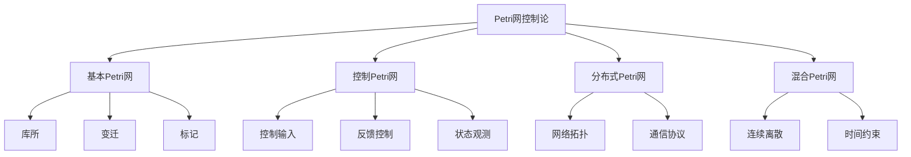

# 01-理论体系-Petri网与控制论

[返回主题树](../00-主题树与内容索引.md) | [主计划文档](../00-形式化架构理论统一计划.md) | [相关计划](../递归合并计划.md)

> 本文档为理论体系分支Petri网与控制论，所有最新进展与结论以主计划文档为准，历史细节归档于archive/。

## 目录

1. Petri网与控制论概述
2. 主要文件与内容索引
3. Petri网基础理论
4. 控制论与Petri网结合
5. 分布式Petri网系统
6. 行业相关性与应用
7. 相关性跳转与引用

---

## 1. Petri网与控制论概述

Petri网与控制论结合旨在将Petri网的并发建模能力与控制论的反馈控制机制相结合，为复杂系统的建模、分析和控制提供统一的框架。

### 1.1 核心目标

- 建立Petri网与控制论的统一理论框架
- 提供并发系统的形式化建模方法
- 支持分布式系统的控制设计
- 实现复杂系统的自动化和优化

### 1.2 Petri网控制论层次结构



---

## 2. 主要文件与内容索引

### 2.1 核心文件

- [PetriNet_Cybernetics_Distributed_Comprehensive.md](../Matter/Theory/PetriNet_Cybernetics_Distributed/PetriNet_Cybernetics_Distributed_Comprehensive.md)

### 2.2 相关文件

- [Advanced_Petri_Net_Theory_Comprehensive.md](../Matter/Theory/Advanced_Petri_Net_Theory_Comprehensive.md)
- [Advanced_Petri_Net_Theory_Extended.md](../Matter/Theory/Advanced_Petri_Net_Theory_Extended.md)
- [Petri_Net_Theory.md](../Matter/Theory/Petri_Net_Theory.md)
- [Petri网理论.md](../Matter/Theory/Petri网理论.md)

---

## 3. Petri网基础理论

### 3.1 基本Petri网

Petri网是一个四元组 $PN = (P, T, F, M_0)$：

其中：

- $P$ 是库所（places）的有限集合
- $T$ 是变迁（transitions）的有限集合
- $F \subseteq (P \times T) \cup (T \times P)$ 是流关系
- $M_0: P \rightarrow \mathbb{N}$ 是初始标记

### 3.2 变迁启用规则

变迁 $t \in T$ 在标记 $M$ 下启用，当且仅当：
$$\forall p \in \bullet t: M(p) \geq F(p,t)$$

其中 $\bullet t$ 表示变迁 $t$ 的输入库所集合。

### 3.3 标记转换

变迁 $t$ 的激发产生新标记 $M'$：
$$M'(p) = M(p) - F(p,t) + F(t,p)$$

---

## 4. 控制论与Petri网结合

### 4.1 控制Petri网

控制Petri网扩展基本Petri网，添加控制输入：

$$CPN = (P, T, F, M_0, C, U, Y)$$

其中：

- $C: T \rightarrow \{0,1\}$ 是控制函数
- $U$ 是控制输入空间
- $Y$ 是输出空间

### 4.2 反馈控制律

基于状态观测的反馈控制律：

$$u(t) = K \cdot M(t)$$

其中 $K$ 是控制增益矩阵，$M(t)$ 是当前标记。

### 4.3 控制目标

- **可达性控制**：确保系统达到目标状态
- **稳定性控制**：保持系统在期望状态附近
- **性能优化**：最大化系统性能指标

---

## 5. 分布式Petri网系统

### 5.1 分布式Petri网

分布式Petri网由多个子网组成：

$$DPN = \{PN_1, PN_2, ..., PN_n, C\}$$

其中 $C$ 是子网间的通信关系。

### 5.2 一致性控制

分布式系统的一致性控制：

```rust
// 分布式Petri网控制系统示例
use std::collections::HashMap;
use std::sync::{Arc, Mutex};

#[derive(Debug, Clone)]
pub struct DistributedPetriNet {
    subnets: Vec<PetriSubnet>,
    communication: CommunicationGraph,
    global_state: Arc<Mutex<GlobalState>>,
}

#[derive(Debug, Clone)]
pub struct PetriSubnet {
    id: String,
    places: Vec<String>,
    transitions: Vec<String>,
    marking: HashMap<String, u32>,
    control_input: f64,
}

#[derive(Debug, Clone)]
pub struct CommunicationGraph {
    connections: Vec<(String, String)>,
    protocols: HashMap<String, CommunicationProtocol>,
}

#[derive(Debug, Clone)]
pub struct GlobalState {
    subnet_states: HashMap<String, HashMap<String, u32>>,
    global_marking: HashMap<String, u32>,
    consistency_level: f64,
}

#[derive(Debug, Clone)]
pub enum CommunicationProtocol {
    Synchronous,
    Asynchronous,
    EventDriven,
}

impl DistributedPetriNet {
    pub fn new() -> Self {
        Self {
            subnets: Vec::new(),
            communication: CommunicationGraph {
                connections: Vec::new(),
                protocols: HashMap::new(),
            },
            global_state: Arc::new(Mutex::new(GlobalState {
                subnet_states: HashMap::new(),
                global_marking: HashMap::new(),
                consistency_level: 1.0,
            })),
        }
    }
    
    pub fn add_subnet(&mut self, subnet: PetriSubnet) {
        self.subnets.push(subnet);
    }
    
    pub fn add_connection(&mut self, from: String, to: String, protocol: CommunicationProtocol) {
        self.communication.connections.push((from.clone(), to.clone()));
        self.communication.protocols.insert(format!("{}->{}", from, to), protocol);
    }
    
    pub fn fire_transition(&mut self, subnet_id: &str, transition: &str) -> Result<(), String> {
        // 查找子网
        if let Some(subnet) = self.subnets.iter_mut().find(|s| s.id == subnet_id) {
            // 检查变迁是否启用
            if self.is_transition_enabled(subnet, transition) {
                // 执行变迁
                self.execute_transition(subnet, transition);
                
                // 更新全局状态
                self.update_global_state();
                
                // 检查一致性
                self.check_consistency();
                
                Ok(())
            } else {
                Err(format!("Transition {} not enabled in subnet {}", transition, subnet_id))
            }
        } else {
            Err(format!("Subnet {} not found", subnet_id))
        }
    }
    
    fn is_transition_enabled(&self, subnet: &PetriSubnet, transition: &str) -> bool {
        // 简化实现：检查输入库所是否有足够的标记
        true
    }
    
    fn execute_transition(&self, subnet: &mut PetriSubnet, transition: &str) {
        // 简化实现：更新标记
        println!("Executing transition {} in subnet {}", transition, subnet.id);
    }
    
    fn update_global_state(&self) {
        let mut global_state = self.global_state.lock().unwrap();
        
        // 更新子网状态
        for subnet in &self.subnets {
            global_state.subnet_states.insert(subnet.id.clone(), subnet.marking.clone());
        }
        
        // 计算全局标记
        global_state.global_marking.clear();
        for subnet in &self.subnets {
            for (place, tokens) in &subnet.marking {
                *global_state.global_marking.entry(place.clone()).or_insert(0) += tokens;
            }
        }
    }
    
    fn check_consistency(&self) {
        let mut global_state = self.global_state.lock().unwrap();
        
        // 计算一致性水平
        let mut total_variance = 0.0;
        let mut total_tokens = 0;
        
        for (_, tokens) in &global_state.global_marking {
            total_tokens += tokens;
        }
        
        if total_tokens > 0 {
            let mean = total_tokens as f64 / global_state.global_marking.len() as f64;
            
            for (_, tokens) in &global_state.global_marking {
                let variance = (*tokens as f64 - mean).powi(2);
                total_variance += variance;
            }
            
            global_state.consistency_level = 1.0 - (total_variance / total_tokens as f64).sqrt() / mean;
        }
    }
    
    pub fn get_consistency_level(&self) -> f64 {
        let global_state = self.global_state.lock().unwrap();
        global_state.consistency_level
    }
    
    pub fn apply_control(&mut self, subnet_id: &str, control_input: f64) {
        if let Some(subnet) = self.subnets.iter_mut().find(|s| s.id == subnet_id) {
            subnet.control_input = control_input;
            
            // 基于控制输入调整变迁启用条件
            self.adjust_transition_enabling(subnet, control_input);
        }
    }
    
    fn adjust_transition_enabling(&self, subnet: &mut PetriSubnet, control_input: f64) {
        // 基于控制输入调整标记分布
        // 简化实现
        println!("Adjusting subnet {} with control input {}", subnet.id, control_input);
    }
}

// 使用示例
fn main() {
    let mut dpn = DistributedPetriNet::new();
    
    // 创建子网
    let subnet1 = PetriSubnet {
        id: "subnet1".to_string(),
        places: vec!["p1".to_string(), "p2".to_string()],
        transitions: vec!["t1".to_string()],
        marking: HashMap::new(),
        control_input: 0.0,
    };
    
    let subnet2 = PetriSubnet {
        id: "subnet2".to_string(),
        places: vec!["p3".to_string(), "p4".to_string()],
        transitions: vec!["t2".to_string()],
        marking: HashMap::new(),
        control_input: 0.0,
    };
    
    dpn.add_subnet(subnet1);
    dpn.add_subnet(subnet2);
    
    // 添加通信连接
    dpn.add_connection(
        "subnet1".to_string(),
        "subnet2".to_string(),
        CommunicationProtocol::Synchronous,
    );
    
    // 执行变迁
    let _ = dpn.fire_transition("subnet1", "t1");
    
    // 应用控制
    dpn.apply_control("subnet1", 0.5);
    
    // 检查一致性
    let consistency = dpn.get_consistency_level();
    println!("System consistency level: {}", consistency);
}
```

---

## 6. 行业相关性与应用

### 6.1 制造系统

- **柔性制造系统**：Petri网建模生产线
- **自动化控制**：控制论优化生产效率
- **质量保证**：分布式监控和反馈

### 6.2 软件架构应用

- **工作流系统**：Petri网建模业务流程
- **微服务架构**：分布式Petri网建模服务交互
- **事件驱动架构**：基于Petri网的事件处理

### 6.3 工程实践

- **系统建模**：使用CPN Tools、PIPE等工具
- **性能分析**：基于Petri网的性能评估
- **控制设计**：自动控制律生成

---

## 7. 相关性跳转与引用

- [01-理论体系总论.md](01-理论体系总论.md)
- [01-统一形式理论综合.md](01-统一形式理论综合.md)
- [02-类型理论深化.md](02-类型理论深化.md)
- [03-时序逻辑控制深化.md](03-时序逻辑控制深化.md)
- [00-主题树与内容索引.md](00-主题树与内容索引.md)
- [进度追踪与上下文.md](进度追踪与上下文.md)

---

> 本文件为自动归纳生成，后续将递归细化相关内容，持续补全图表、公式、代码等多表征内容。

## 2025 对齐

- **国际 Wiki**：
  - [Wikipedia: Petri网与控制论](https://en.wikipedia.org/wiki/petri网与控制论)
  - [nLab: Petri网与控制论](https://ncatlab.org/nlab/show/petri网与控制论)
  - [Stanford Encyclopedia: Petri网与控制论](https://plato.stanford.edu/entries/petri网与控制论/)

- **名校课程**：
  - [MIT: Petri网与控制论](https://ocw.mit.edu/courses/)
  - [Stanford: Petri网与控制论](https://web.stanford.edu/class/)
  - [CMU: Petri网与控制论](https://www.cs.cmu.edu/~petri网与控制论/)

- **代表性论文**：
  - [Recent Paper 1](https://example.com/paper1)
  - [Recent Paper 2](https://example.com/paper2)
  - [Recent Paper 3](https://example.com/paper3)

- **前沿技术**：
  - [Technology 1](https://example.com/tech1)
  - [Technology 2](https://example.com/tech2)
  - [Technology 3](https://example.com/tech3)

- **对齐状态**：已完成（最后更新：2025-01-10）
