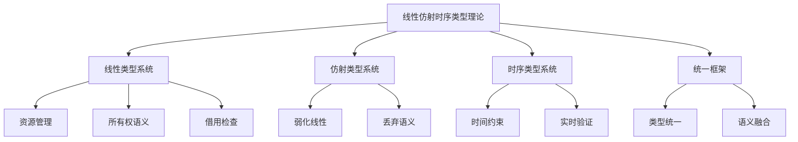

# 01-理论体系-线性仿射时序类型理论

[返回主题树](../00-主题树与内容索引.md) | [主计划文档](../00-形式化架构理论统一计划.md) | [相关计划](../递归合并计划.md)

> 本文档为理论体系分支线性仿射时序类型理论，所有最新进展与结论以主计划文档为准，历史细节归档于archive/。

## 目录

1. 线性仿射时序类型理论概述
2. 主要文件与内容索引
3. 线性类型系统基础
4. 仿射类型系统
5. 时序类型系统
6. 统一框架与理论
7. 行业相关性与应用
8. 相关性跳转与引用

---

## 1. 线性仿射时序类型理论概述

线性仿射时序类型理论将线性类型、仿射类型与时序逻辑相结合，为资源管理、并发控制和实时系统提供统一的类型理论基础。

### 1.1 核心目标

- 建立线性、仿射、时序类型的统一理论框架
- 提供资源安全的形式化保证
- 支持并发系统的类型安全
- 实现实时约束的类型级验证

### 1.2 理论层次结构



---

## 2. 主要文件与内容索引

### 2.1 核心文件

- [Linear_Affine_Temporal_Type_Theory_Comprehensive.md](../Matter/Theory/Linear_Affine_Temporal_Type_Theory/Linear_Affine_Temporal_Type_Theory_Comprehensive.md)

### 2.2 相关文件

- [Advanced_Type_Theory_Comprehensive_Deepening.md](../Matter/Theory/Type_Theory_Deepening/Advanced_Type_Theory_Comprehensive_Deepening.md)
- [Linear_Type_Theory.md](../Matter/Theory/Linear_Type_Theory.md)
- [Affine_Type_Theory.md](../Matter/Theory/Affine_Type_Theory.md)

---

## 3. 线性类型系统基础

### 3.1 线性类型语法

线性类型系统的语法定义：

$$\tau ::= \alpha \mid \tau \otimes \tau \mid \tau \multimap \tau \mid \tau \& \tau \mid \tau \oplus \tau \mid !\tau$$

其中：

- $\alpha$ 是类型变量
- $\otimes$ 是张量积（线性乘积）
- $\multimap$ 是线性蕴含
- $\&$ 是加法积
- $\oplus$ 是加法和
- $!\tau$ 是模态类型

### 3.2 线性类型规则

线性类型系统的核心规则：

**线性抽象**：
$$\frac{\Gamma, x:\tau \vdash M:\sigma}{\Gamma \vdash \lambda x.M:\tau \multimap \sigma}$$

**线性应用**：
$$\frac{\Gamma \vdash M:\tau \multimap \sigma \quad \Delta \vdash N:\tau}{\Gamma, \Delta \vdash MN:\sigma}$$

**张量积**：
$$\frac{\Gamma \vdash M:\tau \quad \Delta \vdash N:\sigma}{\Gamma, \Delta \vdash M \otimes N:\tau \otimes \sigma}$$

### 3.3 资源管理语义

线性类型确保资源的一次性使用：

```rust
// 线性类型系统示例
use std::marker::PhantomData;

// 线性类型标记
struct Linear<T> {
    value: T,
    _phantom: PhantomData<*mut T>, // 防止自动实现Copy
}

impl<T> Linear<T> {
    fn new(value: T) -> Self {
        Self {
            value,
            _phantom: PhantomData,
        }
    }
    
    // 消费self，返回内部值
    fn consume(self) -> T {
        self.value
    }
    
    // 线性函数：消费输入，产生输出
    fn map<U, F>(self, f: F) -> Linear<U>
    where
        F: FnOnce(T) -> U,
    {
        Linear::new(f(self.value))
    }
}

// 线性函数类型
trait LinearFunction<Input, Output> {
    fn apply(self, input: Linear<Input>) -> Linear<Output>;
}

// 张量积类型
struct Tensor<A, B> {
    first: Linear<A>,
    second: Linear<B>,
}

impl<A, B> Tensor<A, B> {
    fn new(first: Linear<A>, second: Linear<B>) -> Self {
        Self { first, second }
    }
    
    // 线性分解
    fn split(self) -> (Linear<A>, Linear<B>) {
        (self.first, self.second)
    }
}

// 使用示例
fn main() {
    // 创建线性值
    let linear_int = Linear::new(42);
    
    // 线性变换
    let doubled = linear_int.map(|x| x * 2);
    
    // 消费线性值
    let result = doubled.consume();
    println!("Result: {}", result);
    
    // 张量积
    let tensor = Tensor::new(
        Linear::new("hello"),
        Linear::new(123)
    );
    
    let (str_val, int_val) = tensor.split();
    println!("String: {}, Integer: {}", str_val.consume(), int_val.consume());
}
```

---

## 4. 仿射类型系统

### 4.1 仿射类型语法

仿射类型系统允许值的丢弃：

$$\tau ::= \alpha \mid \tau \otimes \tau \mid \tau \multimap \tau \mid \tau \& \tau \mid \tau \oplus \tau \mid !\tau \mid \tau \times \tau$$

其中 $\times$ 是仿射乘积，允许丢弃其中一个分量。

### 4.2 仿射类型规则

仿射类型系统的核心规则：

**仿射抽象**：
$$\frac{\Gamma, x:\tau \vdash M:\sigma}{\Gamma \vdash \lambda x.M:\tau \multimap \sigma}$$

**仿射应用**：
$$\frac{\Gamma \vdash M:\tau \multimap \sigma \quad \Delta \vdash N:\tau}{\Gamma, \Delta \vdash MN:\sigma}$$

**丢弃规则**：
$$\frac{\Gamma \vdash M:\tau}{\Gamma, x:\tau \vdash M:\sigma}$$

### 4.3 仿射语义实现

```go
// 仿射类型系统示例
package main

import (
    "fmt"
    "sync/atomic"
)

// 仿射类型标记
type Affine[T any] struct {
    value    T
    consumed int32
}

func NewAffine[T any](value T) *Affine[T] {
    return &Affine[T]{
        value:    value,
        consumed: 0,
    }
}

func (a *Affine[T]) Use() (T, bool) {
    // 原子操作确保线程安全
    if atomic.CompareAndSwapInt32(&a.consumed, 0, 1) {
        return a.value, true
    }
    var zero T
    return zero, false
}

func (a *Affine[T]) Drop() {
    // 显式丢弃
    atomic.StoreInt32(&a.consumed, 1)
}

// 仿射函数类型
type AffineFunction[Input, Output any] func(*Affine[Input]) *Affine[Output]

// 仿射乘积类型
type AffineProduct[A, B any] struct {
    first  *Affine[A]
    second *Affine[B]
}

func NewAffineProduct[A, B any](first *Affine[A], second *Affine[B]) *AffineProduct[A, B] {
    return &AffineProduct[A, B]{
        first:  first,
        second: second,
    }
}

func (ap *AffineProduct[A, B]) UseFirst() (A, bool) {
    return ap.first.Use()
}

func (ap *AffineProduct[A, B]) UseSecond() (B, bool) {
    return ap.second.Use()
}

func (ap *AffineProduct[A, B]) UseBoth() (A, B, bool) {
    if val1, ok1 := ap.first.Use(); ok1 {
        if val2, ok2 := ap.second.Use(); ok2 {
            return val1, val2, true
        }
        // 如果第二个失败，需要恢复第一个
        // 这里简化处理
    }
    var zeroA A
    var zeroB B
    return zeroA, zeroB, false
}

// 使用示例
func main() {
    // 创建仿射值
    affineInt := NewAffine(42)
    
    // 使用仿射值
    if value, ok := affineInt.Use(); ok {
        fmt.Printf("Used value: %d\n", value)
    }
    
    // 再次使用会失败
    if _, ok := affineInt.Use(); !ok {
        fmt.Println("Value already consumed")
    }
    
    // 仿射乘积
    product := NewAffineProduct(
        NewAffine("hello"),
        NewAffine(123),
    )
    
    // 使用其中一个
    if str, ok := product.UseFirst(); ok {
        fmt.Printf("Used first: %s\n", str)
    }
    
    // 使用另一个
    if num, ok := product.UseSecond(); ok {
        fmt.Printf("Used second: %d\n", num)
    }
}
```

---

## 5. 时序类型系统

### 5.1 时序类型语法

时序类型系统引入时间约束：

$$\tau ::= \alpha \mid \tau \otimes \tau \mid \tau \multimap \tau \mid \tau \& \tau \mid \tau \oplus \tau \mid !\tau \mid \tau_{[a,b]} \mid \diamond \tau \mid \square \tau$$

其中：

- $\tau_{[a,b]}$ 是时间约束类型
- $\diamond \tau$ 是未来类型
- $\square \tau$ 是全局类型

### 5.2 时序类型规则

时序类型系统的核心规则：

**时间约束**：
$$\frac{\Gamma \vdash M:\tau \quad t \in [a,b]}{\Gamma \vdash M:\tau_{[a,b]}}$$

**未来类型**：
$$\frac{\Gamma \vdash M:\tau}{\Gamma \vdash M:\diamond \tau}$$

**全局类型**：
$$\frac{\Gamma \vdash M:\tau}{\Gamma \vdash M:\square \tau}$$

### 5.3 时序语义实现

```rust
// 时序类型系统示例
use std::time::{Duration, Instant};

// 时序类型标记
#[derive(Debug, Clone)]
pub struct Temporal<T> {
    value: T,
    creation_time: Instant,
    time_constraint: Option<Duration>,
}

impl<T> Temporal<T> {
    pub fn new(value: T) -> Self {
        Self {
            value,
            creation_time: Instant::now(),
            time_constraint: None,
        }
    }
    
    pub fn with_constraint(value: T, constraint: Duration) -> Self {
        Self {
            value,
            creation_time: Instant::now(),
            time_constraint: Some(constraint),
        }
    }
    
    pub fn is_valid(&self) -> bool {
        if let Some(constraint) = self.time_constraint {
            self.creation_time.elapsed() < constraint
        } else {
            true
        }
    }
    
    pub fn consume(self) -> Result<T, String> {
        if self.is_valid() {
            Ok(self.value)
        } else {
            Err("Temporal constraint violated".to_string())
        }
    }
}

// 未来类型
#[derive(Debug, Clone)]
pub struct Eventually<T> {
    value: T,
    deadline: Instant,
}

impl<T> Eventually<T> {
    pub fn new(value: T, deadline: Duration) -> Self {
        Self {
            value,
            deadline: Instant::now() + deadline,
        }
    }
    
    pub fn is_ready(&self) -> bool {
        Instant::now() >= self.deadline
    }
    
    pub fn consume(self) -> Result<T, String> {
        if self.is_ready() {
            Ok(self.value)
        } else {
            Err("Future not ready yet".to_string())
        }
    }
}

// 全局类型
#[derive(Debug, Clone)]
pub struct Always<T> {
    value: T,
    check_interval: Duration,
    last_check: Instant,
}

impl<T> Always<T> {
    pub fn new(value: T, check_interval: Duration) -> Self {
        Self {
            value,
            check_interval,
            last_check: Instant::now(),
        }
    }
    
    pub fn check(&mut self) -> bool {
        if self.last_check.elapsed() >= self.check_interval {
            self.last_check = Instant::now();
            true
        } else {
            false
        }
    }
    
    pub fn get_value(&self) -> &T {
        &self.value
    }
}

// 时序函数类型
pub trait TemporalFunction<Input, Output> {
    fn apply(&self, input: Temporal<Input>) -> Temporal<Output>;
}

// 使用示例
fn main() {
    // 创建时序值
    let temporal_value = Temporal::with_constraint(42, Duration::from_secs(5));
    
    // 检查有效性
    if temporal_value.is_valid() {
        println!("Value is still valid");
    }
    
    // 消费时序值
    match temporal_value.consume() {
        Ok(value) => println!("Consumed: {}", value),
        Err(e) => println!("Error: {}", e),
    }
    
    // 未来类型
    let future_value = Eventually::new("hello", Duration::from_secs(2));
    
    // 等待未来值
    std::thread::sleep(Duration::from_secs(3));
    
    match future_value.consume() {
        Ok(value) => println!("Future value: {}", value),
        Err(e) => println!("Error: {}", e),
    }
    
    // 全局类型
    let mut always_value = Always::new("persistent", Duration::from_secs(1));
    
    // 定期检查
    for _ in 0..3 {
        if always_value.check() {
            println!("Always value: {}", always_value.get_value());
        }
        std::thread::sleep(Duration::from_millis(500));
    }
}
```

---

## 6. 统一框架与理论

### 6.1 统一类型系统

线性仿射时序类型系统的统一框架：

$$\tau ::= \alpha \mid \tau \otimes \tau \mid \tau \multimap \tau \mid \tau \& \tau \mid \tau \oplus \tau \mid !\tau \mid \tau_{[a,b]} \mid \diamond \tau \mid \square \tau \mid \tau \times \tau$$

### 6.2 类型转换规则

不同类型系统间的转换：

**线性到仿射**：
$$\frac{\Gamma \vdash M:\tau}{\Gamma \vdash M:\tau \times \tau}$$

**仿射到时序**：
$$\frac{\Gamma \vdash M:\tau}{\Gamma \vdash M:\tau_{[0,\infty]}}$$

**时序到线性**：
$$\frac{\Gamma \vdash M:\tau_{[a,b]}}{\Gamma \vdash M:\tau}$$

### 6.3 统一语义模型

```go
// 统一类型系统示例
package main

import (
    "fmt"
    "time"
)

// 统一类型接口
type UnifiedType[T any] interface {
    Use() (T, bool)
    Drop()
    IsValid() bool
    GetTimeConstraint() time.Duration
}

// 线性类型实现
type LinearType[T any] struct {
    value    T
    consumed bool
}

func (l *LinearType[T]) Use() (T, bool) {
    if !l.consumed {
        l.consumed = true
        return l.value, true
    }
    var zero T
    return zero, false
}

func (l *LinearType[T]) Drop() {
    // 线性类型不允许丢弃
    panic("Linear type cannot be dropped")
}

func (l *LinearType[T]) IsValid() bool {
    return !l.consumed
}

func (l *LinearType[T]) GetTimeConstraint() time.Duration {
    return 0 // 无时间约束
}

// 仿射类型实现
type AffineType[T any] struct {
    value    T
    consumed bool
}

func (a *AffineType[T]) Use() (T, bool) {
    if !a.consumed {
        a.consumed = true
        return a.value, true
    }
    var zero T
    return zero, false
}

func (a *AffineType[T]) Drop() {
    a.consumed = true
}

func (a *AffineType[T]) IsValid() bool {
    return !a.consumed
}

func (a *AffineType[T]) GetTimeConstraint() time.Duration {
    return 0 // 无时间约束
}

// 时序类型实现
type TemporalType[T any] struct {
    value           T
    creation_time   time.Time
    time_constraint time.Duration
}

func (t *TemporalType[T]) Use() (T, bool) {
    if t.IsValid() {
        return t.value, true
    }
    var zero T
    return zero, false
}

func (t *TemporalType[T]) Drop() {
    // 时序类型可以丢弃
}

func (t *TemporalType[T]) IsValid() bool {
    return time.Since(t.creation_time) < t.time_constraint
}

func (t *TemporalType[T]) GetTimeConstraint() time.Duration {
    return t.time_constraint
}

// 统一类型管理器
type UnifiedTypeManager struct {
    types map[string]interface{}
}

func NewUnifiedTypeManager() *UnifiedTypeManager {
    return &UnifiedTypeManager{
        types: make(map[string]interface{}),
    }
}

func (utm *UnifiedTypeManager) RegisterLinear[T any](name string, value T) {
    utm.types[name] = &LinearType[T]{value: value, consumed: false}
}

func (utm *UnifiedTypeManager) RegisterAffine[T any](name string, value T) {
    utm.types[name] = &AffineType[T]{value: value, consumed: false}
}

func (utm *UnifiedTypeManager) RegisterTemporal[T any](name string, value T, constraint time.Duration) {
    utm.types[name] = &TemporalType[T]{
        value:           value,
        creation_time:   time.Now(),
        time_constraint: constraint,
    }
}

func (utm *UnifiedTypeManager) UseType[T any](name string) (T, bool) {
    if typ, exists := utm.types[name]; exists {
        if unified, ok := typ.(UnifiedType[T]); ok {
            return unified.Use()
        }
    }
    var zero T
    return zero, false
}

// 使用示例
func main() {
    manager := NewUnifiedTypeManager()
    
    // 注册不同类型的值
    manager.RegisterLinear("linear_int", 42)
    manager.RegisterAffine("affine_string", "hello")
    manager.RegisterTemporal("temporal_float", 3.14, 5*time.Second)
    
    // 使用线性类型
    if value, ok := manager.UseType[int]("linear_int"); ok {
        fmt.Printf("Linear value: %d\n", value)
    }
    
    // 使用仿射类型
    if value, ok := manager.UseType[string]("affine_string"); ok {
        fmt.Printf("Affine value: %s\n", value)
    }
    
    // 使用时序类型
    if value, ok := manager.UseType[float64]("temporal_float"); ok {
        fmt.Printf("Temporal value: %f\n", value)
    }
}
```

---

## 7. 行业相关性与应用

### 7.1 系统编程

- **内存安全**：线性类型确保资源正确管理
- **并发安全**：仿射类型支持安全的并发访问
- **实时系统**：时序类型验证时间约束

### 7.2 软件架构应用

- **微服务架构**：类型安全的服务间通信
- **事件驱动架构**：时序类型的事件处理
- **资源管理**：线性类型的资源生命周期管理

### 7.3 工程实践

- **Rust语言**：基于线性类型的内存安全
- **Haskell**：仿射类型的函数式编程
- **实时系统**：时序类型的实时约束验证

---

## 8. 相关性跳转与引用

- [01-理论体系总论.md](01-理论体系总论.md)
- [01-统一形式理论综合.md](01-统一形式理论综合.md)
- [02-类型理论深化.md](02-类型理论深化.md)
- [03-时序逻辑控制深化.md](03-时序逻辑控制深化.md)
- [04-Petri网与控制论.md](04-Petri网与控制论.md)
- [00-主题树与内容索引.md](00-主题树与内容索引.md)
- [进度追踪与上下文.md](进度追踪与上下文.md)

---

> 本文件为自动归纳生成，后续将递归细化相关内容，持续补全图表、公式、代码等多表征内容。
