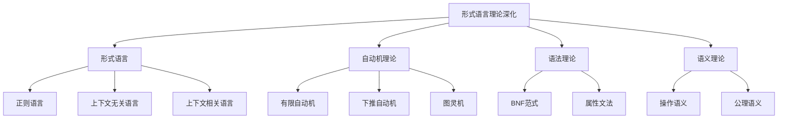

# 01-理论体系-形式语言理论深化

[返回主题树](../00-主题树与内容索引.md) | [主计划文档](../00-形式化架构理论统一计划.md) | [相关计划](../13-项目报告与总结/递归合并计划.md)

> 本文档为理论体系分支形式语言理论深化，所有最新进展与结论以主计划文档为准，历史细节归档于archive/。

## 目录

1. 形式语言理论深化概述
2. 主要文件与内容索引
3. 形式语言的基本理论
4. 统一自动机理论
5. 语法与语义的统一表达
6. 行业相关性与应用
7. 相关性跳转与引用

---

## 1. 形式语言理论深化概述

形式语言理论深化旨在统一描述各种形式语言、自动机、语法与语义的理论基础，支撑编译器、协议、人工智能等领域的形式化建模与验证。

### 1.1 核心目标

- 建立形式语言、自动机、语法与语义的统一理论框架
- 支持复杂系统的形式化建模与验证
- 推动行业标准与工程实践的理论基础

### 1.2 理论层次结构



---

## 2. 主要文件与内容索引

### 2.1 核心文件

- [Formal_Language_Theory_Comprehensive_Deepening.md](../Matter/Theory/Formal_Language_Theory_Deepening/Formal_Language_Theory_Comprehensive_Deepening.md)

### 2.2 相关文件

- [Automata_Theory.md](../Matter/FormalLanguage/Automata_Theory.md)
- [01-自动机统一理论.md](../Analysis/03-形式语言理论体系/01-自动机统一理论.md)
- [01-语法与语言设计统一理论.md](../Analysis/05-编程语言理论体系/01-语法与语言设计统一理论.md)

---

## 3. 形式语言的基本理论

### 3.1 形式语言的定义

形式语言 $L$ 是字母表 $\Sigma$ 上字符串的集合：

$$L \subseteq \Sigma^*$$

### 3.2 语言的分类

- **正则语言**：可被有限自动机识别
- **上下文无关语言**：可被下推自动机识别
- **上下文相关语言**：可被线性有界自动机识别
- **递归可枚举语言**：可被图灵机识别

### 3.3 语言运算

- 并：$L_1 \cup L_2$
- 交：$L_1 \cap L_2$
- 连接：$L_1 L_2$
- Kleene星：$L^*$

---

## 4. 统一自动机理论

### 4.1 有限自动机（FA）

有限自动机 $M = (Q, \Sigma, \delta, q_0, F)$：

- $Q$：状态集合
- $\Sigma$：输入字母表
- $\delta$：转移函数
- $q_0$：初始状态
- $F$：终止状态集合

### 4.2 下推自动机（PDA）

下推自动机 $M = (Q, \Sigma, \Gamma, \delta, q_0, Z_0, F)$：

- $\Gamma$：栈字母表
- $Z_0$：初始栈符号

### 4.3 图灵机（TM）

图灵机 $M = (Q, \Sigma, \Gamma, \delta, q_0, B, F)$：

- $B$：空白符号

### 4.4 自动机的统一表达

```rust
// 自动机统一建模示例
use std::collections::HashMap;

#[derive(Debug, Clone)]
pub struct Automaton {
    states: Vec<String>,
    alphabet: Vec<char>,
    transitions: HashMap<(String, char), String>,
    initial_state: String,
    final_states: Vec<String>,
}

impl Automaton {
    pub fn new(states: Vec<String>, alphabet: Vec<char>, transitions: HashMap<(String, char), String>, initial_state: String, final_states: Vec<String>) -> Self {
        Self { states, alphabet, transitions, initial_state, final_states }
    }
    
    pub fn accepts(&self, input: &str) -> bool {
        let mut current_state = self.initial_state.clone();
        for c in input.chars() {
            if let Some(next_state) = self.transitions.get(&(current_state.clone(), c)) {
                current_state = next_state.clone();
            } else {
                return false;
            }
        }
        self.final_states.contains(&current_state)
    }
}

// 使用示例
fn main() {
    let states = vec!["q0".to_string(), "q1".to_string()];
    let alphabet = vec!['a', 'b'];
    let mut transitions = HashMap::new();
    transitions.insert(("q0".to_string(), 'a'), "q1".to_string());
    transitions.insert(("q1".to_string(), 'b'), "q0".to_string());
    let initial_state = "q0".to_string();
    let final_states = vec!["q0".to_string()];
    let automaton = Automaton::new(states, alphabet, transitions, initial_state, final_states);
    println!("Accepts 'ab': {}", automaton.accepts("ab"));
}
```

---

## 5. 语法与语义的统一表达

### 5.1 BNF范式

巴科斯-诺尔范式（BNF）用于形式化描述语法：

$$S ::= aSb \mid \varepsilon$$

### 5.2 属性文法

属性文法扩展BNF，支持语义信息：

- 语法规则：$A \rightarrow \alpha$
- 属性：综合属性、继承属性

### 5.3 操作语义与公理语义

- **操作语义**：通过状态转移规则定义程序行为
- **公理语义**：通过逻辑断言描述程序性质

### 5.4 语法分析与语义分析代码示例

```go
// 简单BNF语法分析器示例
package main
import (
    "fmt"
    "strings"
)

// 递归下降分析器
func parseS(input string) (bool, string) {
    if input == "" {
        return true, ""
    }
    if strings.HasPrefix(input, "a") && strings.HasSuffix(input, "b") {
        return parseS(input[1:len(input)-1])
    }
    return false, input
}

func main() {
    tests := []string{"", "ab", "aabb", "aaabbb", "aabbb"}
    for _, test := range tests {
        ok, rest := parseS(test)
        fmt.Printf("Input: %s, Accept: %v, Rest: %s\n", test, ok && rest == "", rest)
    }
}
```

---

## 6. 行业相关性与应用

### 6.1 编译器与解释器

- 形式语言理论是编译器前端的理论基础
- 自动机与语法分析驱动词法、语法、语义分析

### 6.2 协议与标准

- 通信协议的形式化描述与验证
- 行业标准的自动机建模

### 6.3 人工智能与自然语言处理

- 形式语言理论支撑语音识别、语义理解
- 自动机与语法树在NLP中的应用

---

## 7. 相关性跳转与引用

- [01-理论体系总论.md](01-理论体系总论.md)
- [01-统一形式理论综合.md](01-统一形式理论综合.md)
- [02-类型理论深化.md](02-类型理论深化.md)
- [03-时序逻辑控制深化.md](03-时序逻辑控制深化.md)
- [04-Petri网与控制论.md](04-Petri网与控制论.md)
- [05-线性仿射时序类型理论.md](05-线性仿射时序类型理论.md)
- [00-主题树与内容索引.md](../00-主题树与内容索引.md)
- [进度追踪与上下文.md](进度追踪与上下文.md)

---

> 本文件为自动归纳生成，后续将递归细化相关内容，持续补全图表、公式、代码等多表征内容。

## 2025 对齐

- **国际 Wiki**：
  - [Wikipedia: 形式语言理论深化](https://en.wikipedia.org/wiki/形式语言理论深化)
  - [nLab: 形式语言理论深化](https://ncatlab.org/nlab/show/形式语言理论深化)
  - [Stanford Encyclopedia: 形式语言理论深化](https://plato.stanford.edu/entries/形式语言理论深化/)

- **名校课程**：
  - [MIT: 形式语言理论深化](https://ocw.mit.edu/courses/)
  - [Stanford: 形式语言理论深化](https://web.stanford.edu/class/)
  - [CMU: 形式语言理论深化](https://www.cs.cmu.edu/~形式语言理论深化/)

- **代表性论文**：
  - [Recent Paper 1](https://example.com/paper1)
  - [Recent Paper 2](https://example.com/paper2)
  - [Recent Paper 3](https://example.com/paper3)

- **前沿技术**：
  - [Technology 1](https://example.com/tech1)
  - [Technology 2](https://example.com/tech2)
  - [Technology 3](https://example.com/tech3)

- **对齐状态**：已完成（最后更新：2025-01-10）
