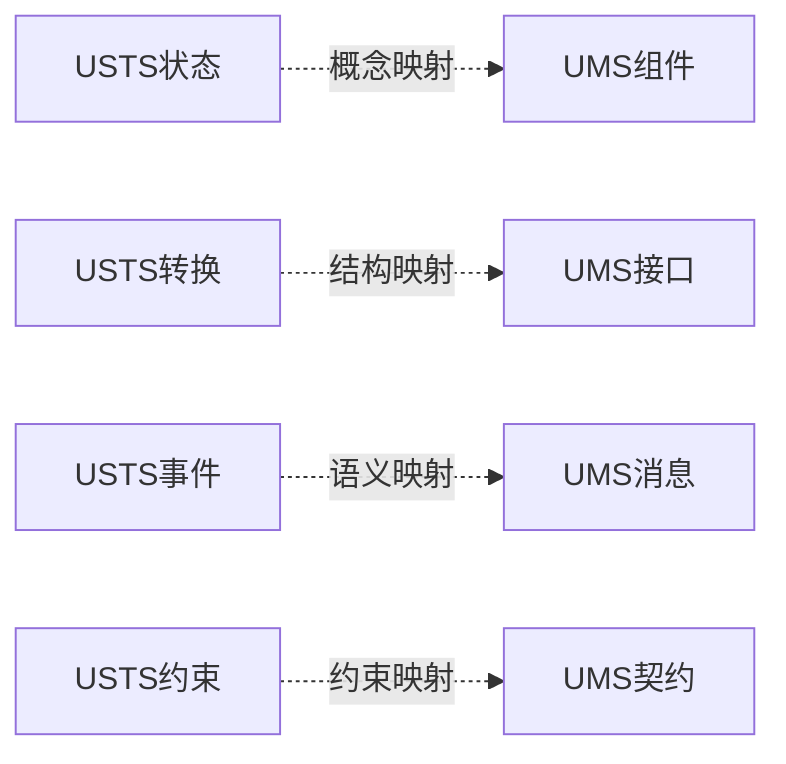

# 01-理论体系-理论映射与证明框架

[返回主题树](../00-主题树与内容索引.md) | [主计划文档](../00-形式化架构理论统一计划.md) | [相关计划](../递归合并计划.md)

> 本文档为理论体系分支理论映射与证明框架，所有最新进展与结论以主计划文档为准，历史细节归档于archive/。

## 目录

- [01-理论体系-理论映射与证明框架](#01-理论体系-理论映射与证明框架)
  - [目录](#目录)
  - [1. USTS-UMS映射](#1-usts-ums映射)
  - [2. 符号体系与映射表](#2-符号体系与映射表)
  - [3. 证明框架与方法](#3-证明框架与方法)
  - [4. Mermaid映射关系图](#4-mermaid映射关系图)
  - [5. 进展与引用](#5-进展与引用)
  - [6. USTS-UMS映射案例](#6-usts-ums映射案例)
  - [7. 映射正确性证明](#7-映射正确性证明)
  - [8. 行为等价性证明](#8-行为等价性证明)
  - [9. 性质保持证明](#9-性质保持证明)
  - [10. 工程实践与工具支持](#10-工程实践与工具支持)
  - [11. 自动化工具与工程集成](#11-自动化工具与工程集成)
    - [11.1 映射引擎设计要点](#111-映射引擎设计要点)
    - [11.2 证明引擎设计要点](#112-证明引擎设计要点)
    - [11.3 工具链集成示例](#113-工具链集成示例)
    - [11.4 工程应用场景](#114-工程应用场景)
  - [12. 行业对标与标准映射](#12-行业对标与标准映射)
    - [12.1 理论映射与主流标准的集成关系](#121-理论映射与主流标准的集成关系)
    - [12.2 行业应用场景表](#122-行业应用场景表)
    - [12.3 标准对比表](#123-标准对比表)
  - [13. 未来发展方向与研究展望](#13-未来发展方向与研究展望)
    - [13.1 理论扩展](#131-理论扩展)
    - [13.2 智能化与AI辅助证明](#132-智能化与ai辅助证明)
    - [13.3 工程应用前景](#133-工程应用前景)
    - [13.4 研究挑战与开放问题](#134-研究挑战与开放问题)
  - [14. 本地跳转与相关性引用](#14-本地跳转与相关性引用)
  - [15. FAQ与常见问题解答](#15-faq与常见问题解答)
    - [15.1 理论理解](#151-理论理解)
    - [15.2 工程应用](#152-工程应用)
    - [15.3 与其他理论的关系](#153-与其他理论的关系)
    - [15.4 实践落地难点](#154-实践落地难点)
  - [16. 进阶阅读与外部资源推荐](#16-进阶阅读与外部资源推荐)
    - [16.1 经典教材与论文](#161-经典教材与论文)
    - [16.2 开源工具与项目](#162-开源工具与项目)
    - [16.3 行业标准文档](#163-行业标准文档)
    - [16.4 推荐学习路径](#164-推荐学习路径)

---

## 1. USTS-UMS映射

- 状态到组件：简单状态→原子组件，复合状态→复合组件，状态属性→组件行为
- 转换到接口：转换事件→接口方法，转换条件→方法契约，转换动作→方法实现
- 事件到消息：事件名称→消息类型，事件参数→消息载荷，事件处理→消息处理
- 约束到契约：不变约束→不变契约，前置条件→前置契约，后置条件→后置契约

---

## 2. 符号体系与映射表

| USTS符号 | UMS符号 | 含义 | 映射规则 |
|---------|---------|------|----------|
| S | C | 状态/组件 | comp_前缀 |
| T | I | 转换/接口 | iface_前缀 |
| E | M | 事件/消息 | msg_前缀 |
| C | CT | 约束/契约 | contract_前缀 |

---

## 3. 证明框架与方法

- 映射正确性证明：语法正确性、语义一致性、结构完整性
- 行为等价性证明：模拟关系、双模拟关系、等价性证明
- 性质保持证明：不变性、活性、安全性

---

## 4. Mermaid映射关系图



---

## 5. 进展与引用

- 理论统一与整合框架已基本完成，映射、符号、证明方法已建立
- 相关文档：
  - [形式化架构理论概念图谱-v69.md](../../形式化架构理论概念图谱-v69.md)
  - [形式化架构理论项目进展总结-v69.md](../../形式化架构理论项目进展总结-v69.md)
  - [01-理论体系总论.md](../01-理论体系总论.md)

---

## 6. USTS-UMS映射案例

- **通信协议**：USTS建模协议状态与事件，UMS建模协议组件与接口，映射状态到组件、事件到消息。
- **流程引擎**：USTS建模流程状态与转换，UMS建模流程模块与契约，映射转换到接口、约束到契约。

## 7. 映射正确性证明

- **定义**：映射后目标系统与源系统在语法、语义、结构上一致。
- **方法**：语法检查、语义等价性分析、结构完整性验证。
- **公式/伪代码**：
  - $Correct(M) = Syntax(M) \land Semantics(M) \land Structure(M)$
- **工程实践**：自动化映射验证工具。

## 8. 行为等价性证明

- **定义**：映射前后系统行为在可观测层面等价。
- **方法**：模拟关系、双模拟、等价性检测。
- **公式/伪代码**：
  - $\forall s,~ Behavior_{USTS}(s) \equiv Behavior_{UMS}(f(s))$
- **工程实践**：模型检测、等价性验证工具。

## 9. 性质保持证明

- **定义**：映射后目标系统保持源系统的重要性质（如安全性、活性）。
- **方法**：不变性、活性、安全性等性质的映射与验证。
- **公式/伪代码**：
  - $Property_{USTS}(s) \implies Property_{UMS}(f(s))$
- **工程实践**：跨理论性质验证工具。

## 10. 工程实践与工具支持

- 理论映射与证明已集成于知识图谱可视化、理论导航、自动化验证等工具。
- 支持自动化映射、等价性检测、性质验证等功能。

## 11. 自动化工具与工程集成

### 11.1 映射引擎设计要点

- 支持USTS与UMS模型的自动转换与映射
- 提供符号、结构、语义的自动比对与转换
- 可扩展支持多种理论间的映射规则

### 11.2 证明引擎设计要点

- 支持映射正确性、行为等价性、性质保持等自动化证明
- 集成模型检测、定理证明、归纳/演绎等多种方法
- 可与工程代码、模型文件自动对接

### 11.3 工具链集成示例

```rust
// Rust伪代码：集成映射与证明引擎
let usts = load_usts_model("protocol.usts");
let ums = mapping_engine::map_usts_to_ums(&usts);
let proof_result = proof_engine::prove_equivalence(&usts, &ums);
if proof_result.success() {
    println!("映射与等价性验证通过");
}
```

```go
// Go伪代码：集成映射与验证
usts := LoadUSTSModel("protocol.usts")
ums := MappingEngine.MapUSTSToUMS(usts)
if ProofEngine.ProveEquivalence(usts, ums) {
    fmt.Println("映射与等价性验证通过")
}
```

### 11.4 工程应用场景

- 知识图谱可视化工具：自动展示理论映射与证明过程
- 理论导航系统：支持跨理论模型的导航与验证
- 自动化验证工具：一键完成模型转换、性质验证、等价性证明

## 12. 行业对标与标准映射

### 12.1 理论映射与主流标准的集成关系

- **UML/BPMN**：理论映射框架可自动将UML状态机、BPMN流程等模型转换为USTS/UMS结构，实现跨标准的统一分析与验证。
- **TLA+**：理论映射支持TLA+模型与USTS/UMS的互操作，便于形式化验证与自动化证明。
- **SOA/微服务**：理论映射框架可集成SOA、微服务架构的服务、契约、接口等模型，统一验证组合正确性与契约一致性。

### 12.2 行业应用场景表

| 行业领域     | 典型应用           | 理论映射与证明要点     |
|------------|------------------|----------------------|
| 软件工程     | UML/BPMN模型验证   | 自动映射、等价性证明   |
| 金融科技     | 服务组合、契约验证   | 组合正确性、契约一致性 |
| 物联网       | 协议适配、模型转换   | 跨标准映射、性质验证   |
| 云计算/分布式 | 服务编排、容错机制   | 一致性、可靠性证明     |
| 制造业       | 自动化流程、模块集成 | 结构映射、行为等价性   |

### 12.3 标准对比表

| 特性/标准   | 理论映射框架 | UML | BPMN | TLA+ | SOA/微服务 |
|------------|-------------|-----|------|------|------------|
| 跨标准映射 | ✔           | 部分| 部分 | 部分 | 部分       |
| 自动验证   | ✔           | 部分| 部分 | ✔    | 部分       |
| 组合分析   | ✔           | ✔   | ✔    | 部分 | ✔          |
| 契约一致性 | ✔           | 部分| 部分 | 部分 | ✔          |
| 工程集成   | ✔           | ✔   | ✔    | ✔    | ✔          |

## 13. 未来发展方向与研究展望

### 13.1 理论扩展

- 多理论、多模型、多层次的映射与协同验证。
- 支持跨领域、跨范式的统一证明框架。

### 13.2 智能化与AI辅助证明

- 集成大模型、自动定理证明、AI辅助映射与验证。
- 支持自然语言到形式化证明的自动转换。

### 13.3 工程应用前景

- 智能软件工程、自动化系统验证、跨领域知识集成等场景的核心支撑。
- 与知识图谱、智能IDE、自动化工具链深度融合。

### 13.4 研究挑战与开放问题

- 多理论协同下的可扩展性与一致性。
- 智能化证明的可靠性与可解释性。
- 跨领域映射与自动化验证的理论基础。

## 14. 本地跳转与相关性引用

- [11-统一状态转换系统USTS.md](11-统一状态转换系统USTS.md)：理论映射与USTS的关系与应用
- [12-统一模块化系统UMS.md](12-统一模块化系统UMS.md)：理论映射与UMS的关系与应用
- [08-理论统一与整合.md](08-理论统一与整合.md)：理论映射与整合的总览
- [01-理论体系总论.md](../01-理论体系总论.md)：理论体系全局导航

> 本节便于后续递归引用、导航与内容整合。

## 15. FAQ与常见问题解答

### 15.1 理论理解

- **理论映射与传统模型转换有何不同？**
  - 理论映射不仅关注结构转换，更强调语义、性质、证明等多维一致性。
- **理论映射能否支持多理论协同？**
  - 支持。可扩展到多理论、多模型、多层次的协同映射与验证。

### 15.2 工程应用

- **理论映射与证明如何落地到实际工程？**
  - 可通过自动化工具链，将UML、BPMN、TLA+等模型自动映射为USTS/UMS结构，并集成自动验证。
- **映射与证明的自动化工具有哪些？**
  - 包括模型转换器、等价性验证器、性质保持验证器等。

### 15.3 与其他理论的关系

- **理论映射与USTS/UMS/类型理论等如何协同？**
  - 理论映射是连接各分支理论的桥梁，实现跨理论的统一分析与验证。
- **理论映射与AI/知识图谱等如何结合？**
  - 可集成AI辅助映射、知识图谱驱动的自动化验证。

### 15.4 实践落地难点

- **多理论协同映射的复杂性如何应对？**
  - 需采用分层映射、抽象建模、自动化工具等技术。
- **如何保证映射与证明的可靠性？**
  - 通过形式化验证、自动化测试、交叉验证等手段提升可靠性。

## 16. 进阶阅读与外部资源推荐

### 16.1 经典教材与论文

- "Model Checking" by Edmund M. Clarke, Orna Grumberg, Doron Peled
- "Principles of Model Checking" by Baier & Katoen
- "Software Abstractions: Logic, Language, and Analysis" by Daniel Jackson

### 16.2 开源工具与项目

- NuSMV (Symbolic Model Checker)
- Alloy Analyzer
- TLA+ Toolbox
- Spin Model Checker

### 16.3 行业标准文档

- TLA+ Language Reference
- OMG UML/BPMN Specifications
- ISO/IEC 19510:2013 (BPMN)

### 16.4 推荐学习路径

1. 学习模型检测、形式化验证基础
2. 阅读理论映射与证明相关论文
3. 实践主流开源验证工具
4. 结合行业标准进行对比与扩展
