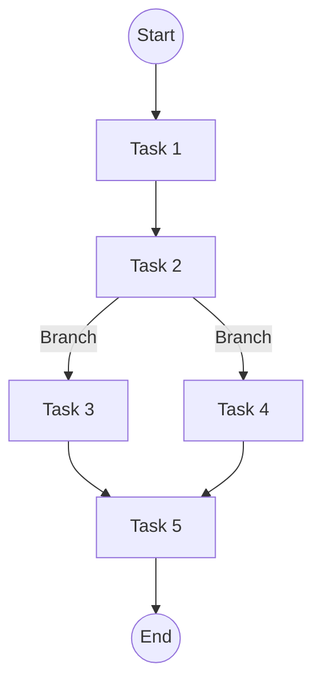

# 2.1-WorkflowDomain-理论基础

> **重定向声明**: 本文档内容已合并至 [05-工作流与自动化平台/](05-工作流与自动化平台/)目录下的相关文件，请参考主权威文件获取最新内容。
> 本文属于2-WorkflowDomain主题，建议配合[主题树与内容索引](./00-主题树与内容索引.md)一同阅读。

## 目录

- [2.1-WorkflowDomain-理论基础](#21-workflowdomain-理论基础)
  - [目录](#目录)
  - [2.1.1 引言](#211-引言)
  - [2.1.2 工作流基本概念](#212-工作流基本概念)
  - [2.1.3 工作流模型与分类](#213-工作流模型与分类)
  - [2.1.4 工作流理论与形式化](#214-工作流理论与形式化)
  - [2.1.5 图表与形式化分析](#215-图表与形式化分析)
  - [2.1.6 参考文献](#216-参考文献)

---

## 2.1.1 引言

工作流（Workflow）是指一组有序的任务、活动或过程，按照预定的规则和依赖关系自动流转，实现业务目标。
工作流理论是现代自动化、软件工程、企业信息化的核心基础之一。

## 2.1.2 工作流基本概念

**定义1（工作流）**：

一个工作流可形式化为五元组：
$$
WF = (T, D, S, E, F)
$$
其中：

- $T = \{t_1, t_2, ..., t_n\}$：任务集合
- $D$：任务依赖关系（有向图）
- $S$：初始状态
- $E$：事件集合
- $F$：终止条件

**注释**：$D$可用有向无环图（DAG）建模，$E$为触发事件。

## 2.1.3 工作流模型与分类

- **顺序模型**：任务线性排列，$D$为链式结构。
- **分支/并行模型**：任务可分支、并行，$D$为DAG。
- **循环模型**：任务可循环，$D$含有回路。
- **层次模型**：任务可嵌套，$WF$递归定义。

**定理1（DAG可达性）**：若$D$为DAG，则存在唯一拓扑排序。

**证明**：采用拓扑排序算法，若无回路则排序唯一。

**反例**：若$D$含回路，则拓扑排序不存在。

## 2.1.4 工作流理论与形式化

- **Petri网建模**：$PN = (P, T, F, M_0)$，$P$为库所，$T$为变迁，$F$为流关系，$M_0$为初始标记。
- **状态机建模**：$SM = (S, E, \delta, s_0, F)$，$\delta$为转移函数。
- **形式化验证**：可达性、活性、不变式、死锁检测。

**定理2（Petri网可达性）**：若存在变迁序列使$M_0$到$M_f$，则$M_f$可达。

**证明**：递归应用变迁规则，构造可达树。

**反例**：死锁状态不可达。

## 2.1.5 图表与形式化分析

## 2.1.6 参考文献

- van der Aalst, W.M.P. "The Application of Petri Nets to Workflow Management." Journal of Circuits, Systems, and Computers, 1998.
- Russell, N., et al. "Workflow Control-Flow Patterns: A Revised View." BPM 2006.
- Rust/Go实现见2.5节。
