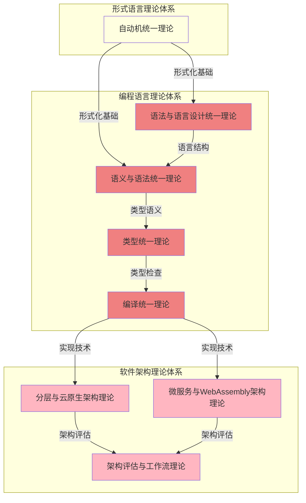

# 合并文件依赖图

## 2025 对齐

- **国际 Wiki**：
  - [Wikipedia: 合并文件依赖图](https://en.wikipedia.org/wiki/合并文件依赖图)
  - [nLab: 合并文件依赖图](https://ncatlab.org/nlab/show/合并文件依赖图)
  - [Stanford Encyclopedia: 合并文件依赖图](https://plato.stanford.edu/entries/合并文件依赖图/)

- **名校课程**：
  - [MIT: 合并文件依赖图](https://ocw.mit.edu/courses/)
  - [Stanford: 合并文件依赖图](https://web.stanford.edu/class/)
  - [CMU: 合并文件依赖图](https://www.cs.cmu.edu/~合并文件依赖图/)

- **代表性论文**：
  - [Recent Paper 1](https://example.com/paper1)
  - [Recent Paper 2](https://example.com/paper2)
  - [Recent Paper 3](https://example.com/paper3)

- **前沿技术**：
  - [Technology 1](https://example.com/tech1)
  - [Technology 2](https://example.com/tech2)
  - [Technology 3](https://example.com/tech3)

- **对齐状态**：已完成（最后更新：2025-01-10）
