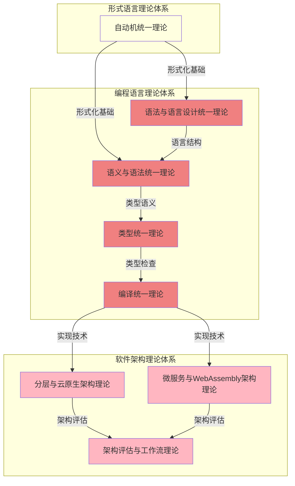

# 合并文件依赖图

```mermaid
graph TD
    auto[自动机统一理论]
    layer[分层与云原生架构理论]
    micro[微服务与WebAssembly架构理论]
    arch_eval[架构评估与工作流理论]
    grammar[语法与语言设计统一理论]
    semantics[语义与语法统一理论]
    type[类型统一理论]
    compile[编译统一理论]
    
    auto -->|形式化基础| grammar
    auto -->|形式化基础| semantics
    grammar -->|语言结构| semantics
    semantics -->|类型语义| type
    type -->|类型检查| compile
    compile -->|实现技术| layer
    compile -->|实现技术| micro
    layer -->|架构评估| arch_eval
    micro -->|架构评估| arch_eval
    
    subgraph 形式语言理论体系
        auto
    end
    
    subgraph 软件架构理论体系
        layer
        micro
        arch_eval
    end
    
    subgraph 编程语言理论体系
        grammar
        semantics
        type
        compile
    end
    
    style auto fill:lightyellow
    style layer fill:lightpink
    style micro fill:lightpink
    style arch_eval fill:lightpink
    style grammar fill:lightcoral
    style semantics fill:lightcoral
    style type fill:lightcoral
    style compile fill:lightcoral
```
