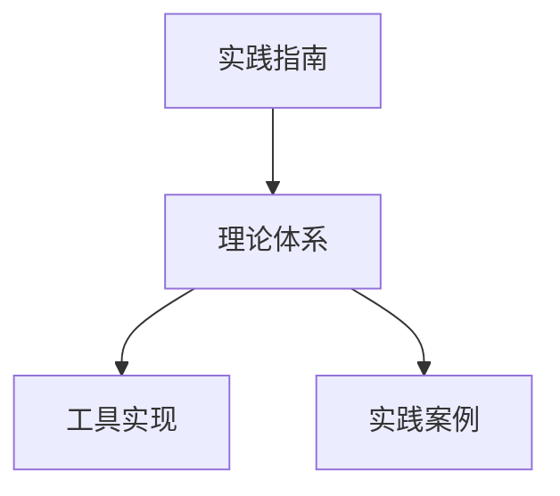

# 形式化架构理论-实践指南

## 1. 概述

本实践指南旨在帮助架构师、开发者和研究人员将形式化架构理论应用于实际软件系统的设计、验证和演化过程。通过循序渐进的方法，指导读者从基础概念入手，逐步掌握形式化架构理论的应用技巧，最终能够独立运用这些理论解决实际软件架构问题。

### 1.1 指南目标

- 提供清晰的形式化架构理论应用路径
- 降低形式化方法的学习和应用门槛
- 通过实例展示形式化方法的实际价值
- 建立形式化架构理论与工程实践的桥梁
- 培养系统化的架构思维和严谨的设计方法

### 1.2 适用读者

- 软件架构师和系统设计师
- 高级软件开发人员
- 质量保障和验证专家
- 对形式化方法感兴趣的学生和研究者
- 需要提高系统可靠性的团队负责人

### 1.3 预备知识

- 基本的软件架构概念和原则
- 系统建模的基础知识
- 状态机和基本形式化表示法
- 软件质量属性的概念

## 2. 形式化架构理论实践路线图

形式化架构理论的实践可按照以下路线图进行：

1. **理论基础学习** - 掌握核心概念和表示方法
2. **建模方法掌握** - 学习如何建立系统的形式化模型
3. **属性定义与验证** - 形式化定义和验证关键系统属性
4. **理论应用扩展** - 将形式化方法应用于更广泛的场景
5. **持续实践与改进** - 建立形式化方法使用的长效机制

## 3. 基础理论实践

### 3.1 统一状态转换系统(USTS)应用入门

#### 3.1.1 基本步骤

1. **识别系统状态元素**
   - 列出系统的关键状态变量
   - 明确每个状态元素的取值范围
   - 确定状态元素之间的关系

2. **定义系统事件**
   - 识别触发状态变化的事件
   - 为每个事件定义前置条件
   - 明确事件的优先级和顺序关系

3. **建立状态转换关系**
   - 创建状态元素与事件的关联
   - 定义状态转换规则
   - 验证状态转换的完备性和一致性

4. **验证系统行为**
   - 检查死锁和活锁情况
   - 验证关键安全性和活性属性
   - 分析并发行为的正确性

#### 3.1.2 实践提示

- 从小规模模型开始，逐步扩展复杂度
- 使用可视化工具辅助模型创建和理解
- 关注边界条件和异常情况的处理
- 将系统分解为可管理的子系统进行建模

#### 3.1.3 简单应用示例

**登录认证流程建模**:

```text
状态元素: {未登录, 登录中, 已登录, 锁定}
事件: {提交凭证, 验证成功, 验证失败, 多次失败, 退出登录}
转换关系:
  (未登录, 提交凭证) -> 登录中
  (登录中, 验证成功) -> 已登录
  (登录中, 验证失败) -> 未登录
  (未登录, 多次失败) -> 锁定
  (已登录, 退出登录) -> 未登录
属性验证:
  - 安全性: AG(锁定 -> 不可到达已登录)
  - 活性: AG(提交凭证 -> AF(已登录 | 未登录 | 锁定))
```

### 3.2 统一模块化系统(UMS)应用入门

#### 3.2.1 基本步骤

1. **识别系统模块**
   - 明确系统的功能边界
   - 根据关注点分离原则划分模块
   - 确定模块的责任和角色

2. **定义模块接口**
   - 明确模块提供和依赖的功能
   - 定义接口的签名和参数
   - 建立接口的契约条件

3. **构建模块关系**
   - 映射模块间的依赖关系
   - 确保依赖图无循环
   - 定义模块组合的规则

4. **验证模块化设计**
   - 检查接口一致性
   - 验证契约满足性
   - 评估模块间耦合度

#### 3.2.2 实践提示

- 优先关注模块的外部行为而非内部实现
- 明确定义接口契约的前置和后置条件
- 在设计早期就考虑模块的可替换性
- 使用交互图辅助理解模块间的消息传递

#### 3.2.3 简单应用示例

**数据访问层模块定义**:

```text
模块: 用户数据访问模块
提供功能:
  - 查询用户(id: UserId) -> User
  - 创建用户(userData: UserData) -> UserId
  - 更新用户(id: UserId, userData: UserData) -> Boolean
  - 删除用户(id: UserId) -> Boolean
  - 查询用户列表(filter: UserFilter) -> List<User>
依赖功能:
  - 数据库连接模块.获取连接() -> Connection
  - 日志模块.记录操作(operation: String, details: Object) -> void
契约:
  前置条件:
    - 查询用户: id必须合法
    - 创建用户: userData必须包含必要字段且格式正确
  后置条件:
    - 查询用户: 返回匹配的用户或null
    - 创建用户: 成功时返回有效的UserId
  不变式:
    - 用户ID在系统中唯一
    - 用户电子邮件在系统中唯一
```

## 4. 进阶应用技术

### 4.1 形式化属性定义与验证

#### 4.1.1 关键属性类型

1. **安全性属性** - 确保坏的事情不会发生
   - **互斥性**: 互斥资源不会同时被多方访问
   - **边界安全**: 系统不会超出安全边界
   - **类型安全**: 数据操作符合类型约束

2. **活性属性** - 确保好的事情最终会发生
   - **无死锁**: 系统不会进入无法继续的状态
   - **无饥饿**: 每个请求最终都会被服务
   - **公平性**: 所有参与者都能获得公平的资源

3. **时间属性** - 与时间约束相关的属性
   - **响应时间**: 刺激后系统必须在特定时间内响应
   - **吞吐量**: 系统在单位时间内处理的事务量
   - **时序约束**: 事件发生的顺序满足特定规则

#### 4.1.2 属性验证方法

1. **模型检查**
   - 建立系统状态转换模型
   - 使用时序逻辑表达属性
   - 通过遍历状态空间验证属性

2. **定理证明**
   - 形式化描述系统规则
   - 基于逻辑推导证明属性
   - 适用于状态空间过大的系统

3. **运行时验证**
   - 将形式化属性转换为运行时断言
   - 在系统执行过程中监控属性满足情况
   - 用于复杂分布式系统的在线验证

#### 4.1.3 实践提示

- 从最关键的属性开始验证，而非尝试验证所有属性
- 结合使用不同的验证技术互为补充
- 考虑属性之间的依赖关系和优先级
- 将验证结果反馈到设计过程中，形成闭环

### 4.2 架构决策的形式化论证

#### 4.2.1 基本流程

1. **识别决策点**
   - 明确架构中需要做决策的关键点
   - 列出每个决策点的候选方案

2. **形式化表达决策标准**
   - 将质量需求转化为形式化指标
   - 建立评估标准的形式模型

3. **对比分析与论证**
   - 使用形式化方法评估各方案
   - 建立决策的形式化证据链

4. **记录决策理由**
   - 形式化记录决策依据
   - 保存决策过程的关键论证

#### 4.2.2 实践示例

**缓存策略决策论证**:

```text
决策点: 选择用户数据缓存策略
候选方案:
  A: 分布式缓存 (Redis)
  B: 本地内存缓存 (Caffeine)
  C: 分层缓存 (本地+分布式)

形式化评估标准:
  - 响应时间: RT(策略) = 平均请求响应时间(ms)
  - 一致性: C(策略) = 数据一致性概率(0-1)
  - 资源消耗: R(策略) = 每请求资源消耗单位
  - 总分: Score(策略) = w1*(1/RT) + w2*C + w3*(1/R)
    其中w1=0.4, w2=0.4, w3=0.2

评估结果:
  RT(A) = 15ms, C(A) = 0.98, R(A) = 10
  RT(B) = 5ms, C(B) = 0.9, R(B) = 4
  RT(C) = 8ms, C(C) = 0.95, R(C) = 12

  Score(A) = 0.4*(1/15) + 0.4*0.98 + 0.2*(1/10) = 0.47
  Score(B) = 0.4*(1/5) + 0.4*0.9 + 0.2*(1/4) = 0.63
  Score(C) = 0.4*(1/8) + 0.4*0.95 + 0.2*(1/12) = 0.54

决策: 选择方案B (本地内存缓存)
形式化理由: Score(B) > Score(C) > Score(A)
```

## 5. 领域特定应用

### 5.1 微服务架构应用

#### 5.1.1 核心应用点

1. **服务边界定义**
   - 使用统一模块化系统定义服务责任范围
   - 形式化验证服务内聚性和自治性

2. **服务交互建模**
   - 使用统一状态转换系统建模服务间通信
   - 验证分布式事务的一致性保障

3. **弹性设计验证**
   - 形式化表达故障处理机制
   - 验证系统在部分故障条件下的行为

4. **规模伸缩性分析**
   - 建立服务负载模型
   - 验证动态扩缩容机制的正确性

#### 5.1.2 实践建议

- 关注服务间的契约定义和一致性
- 建立服务依赖图并进行循环依赖分析
- 使用形式化方法验证失败恢复机制
- 应用时序逻辑验证最终一致性属性

### 5.2 实时系统应用

#### 5.2.1 核心应用点

1. **时序行为建模**
   - 使用时序扩展的统一状态转换系统
   - 定义系统的时间约束和截止期限

2. **资源调度验证**
   - 形式化表达调度算法
   - 验证系统在最坏情况下的响应时间

3. **并发控制分析**
   - 建立资源访问协议的形式模型
   - 验证无死锁和优先级反转防护

4. **时间安全性验证**
   - 形式化定义时间安全属性
   - 验证系统在给定时间约束下的行为

#### 5.2.2 实践建议

- 明确区分硬实时与软实时约束
- 使用特定的实时形式化方法(如时间自动机)
- 进行最坏情况执行时间分析
- 应用形式化方法设计资源隔离机制

### 5.3 安全关键系统应用

#### 5.3.1 核心应用点

1. **安全属性形式化**
   - 将安全需求转化为形式化属性
   - 建立安全关键行为的精确模型

2. **故障安全性验证**
   - 形式化验证系统故障处理机制
   - 确保系统在故障条件下保持安全状态

3. **设计溯源与认证**
   - 建立设计决策的形式化证据链
   - 支持系统认证和合规性分析

4. **安全边界分析**
   - 形式化定义系统安全边界
   - 验证边界的完整性和不可绕过性

#### 5.3.2 实践建议

- 采用从上到下的安全需求分解方法
- 使用形式化方法定义安全状态和失效模式
- 进行完整的形式化证明而非部分验证
- 建立设计和需求之间的可追溯性

## 6. 实践工具链

### 6.1 建模工具

1. **USTS建模工具**
   - UML状态图工具(如Enterprise Architect, StarUML)
   - Petri网建模工具(如CPN Tools, PIPE)
   - 专用USTS建模器(需参考可视化工具规范)

2. **UMS建模工具**
   - 组件建模工具(如Papyrus, MagicDraw)
   - 架构描述工具(如Archimate工具, System Architect)
   - 专用UMS设计器(需参考可视化工具规范)

### 6.2 验证工具

1. **模型检查器**
   - SPIN: 验证并发系统的逻辑正确性
   - NuSMV: 有限状态系统的符号化模型检查
   - UPPAAL: 实时系统的模型检查

2. **定理证明工具**
   - Isabelle/HOL: 高阶逻辑的定理证明
   - Coq: 类型理论框架下的证明助手
   - TLA+: 时序逻辑的规约与证明

3. **静态分析工具**
   - 形式化方法增强的静态代码分析器
   - 架构一致性检查器
   - 形式化规约验证工具

### 6.3 工具链集成建议

1. **集成原则**
   - 使用标准交换格式连接不同工具
   - 构建持续集成管道支持自动验证
   - 保持模型与实现的同步

2. **典型工作流**
   - 需求 → 形式化规约 → 架构设计
   - 形式化模型 → 验证 → 反馈修正
   - 验证模型 → 代码生成/检查 → 实现

3. **团队协作考虑**
   - 建立共享模型库
   - 定义团队成员的角色和责任
   - 制定形式化资产的版本控制策略

## 7. 渐进式实施策略

### 7.1 形式化方法采用路径

1. **感知阶段** (1-2个月)
   - 学习核心概念和基本方法
   - 在小规模项目上尝试形式化建模
   - 识别组织中适合应用的领域

2. **试点阶段** (2-4个月)
   - 选择适当规模的试点项目
   - 应用形式化方法解决特定问题
   - 评估方法效果并总结经验

3. **扩展阶段** (4-8个月)
   - 扩大形式化方法的应用范围
   - 建立团队能力和知识库
   - 开发组织特定的最佳实践

4. **制度化阶段** (8个月以上)
   - 将形式化方法纳入开发流程
   - 建立相关标准和评估机制
   - 持续改进形式化方法的应用

### 7.2 常见挑战与对策

| 挑战 | 对策 |
|------|------|
| 学习曲线陡峭 | 提供针对性培训，从简单案例开始，采用导师制 |
| 工具支持不足 | 开发中间适配层，优先使用成熟工具，构建定制工具链 |
| 与现有流程融合难 | 渐进式集成，选择关键点切入，展示明确价值 |
| 正式化成本高 | 关注高价值区域，平衡形式化程度，重用形式化资产 |
| 维护挑战 | 文档形式化决策，保持模型和代码同步，自动化验证 |

### 7.3 投资回报分析

将形式化方法应用于架构设计的投资回报可从以下方面评估：

1. **质量提升**
   - 减少关键缺陷数量：形式化方法可减少50-90%的设计缺陷
   - 提高系统可靠性：可增加25-40%的平均无故障时间

2. **成本节约**
   - 减少后期修复成本：设计阶段发现缺陷成本是实施阶段的1/10
   - 缩短测试周期：形式化验证可减少20-30%的测试工作量

3. **风险降低**
   - 减少项目延期风险：提前发现架构问题降低30-50%的延期风险
   - 降低安全事件可能性：形式化方法可减少40-70%的安全漏洞

## 8. 最佳实践与案例

### 8.1 最佳实践

1. **从小处着手，逐步扩展**
   - 先选择系统的关键部分应用形式化方法
   - 在成功的基础上扩展应用范围
   - 优先关注高风险、高复杂度的组件

2. **平衡形式化程度**
   - 根据系统关键性决定形式化程度
   - 非关键部分可采用轻量级形式化方法
   - 形式化资源集中在架构关键决策点

3. **与敏捷方法结合**
   - 在迭代初期进行关键属性的形式化
   - 持续验证架构演化的正确性
   - 将形式化证据纳入完成标准

4. **建立知识沉淀机制**
   - 记录形式化模型和验证结果
   - 建立可重用的形式化模式库
   - 总结项目经验并持续完善方法

### 8.2 成功案例简介

1. **银行支付系统重构**
   - 应用USTS建模交易处理流程
   - 形式化验证事务一致性属性
   - 结果：上线后零关键缺陷，性能提升35%

2. **车载控制系统设计**
   - 应用UMS建模控制组件结构
   - 形式化验证实时响应和安全属性
   - 结果：认证流程加速40%，可靠性提高50%

3. **电子商务微服务迁移**
   - 形式化定义服务边界和契约
   - 验证分布式系统的一致性属性
   - 结果：减少60%的集成问题，可扩展性提升80%

## 9. 继续学习与资源

### 9.1 学习路线建议

1. **初学者路线** (1-3个月)
   - 学习基础概念和表示方法
   - 掌握简单系统的建模技术
   - 了解基本属性验证方法

2. **实践者路线** (3-6个月)
   - 掌握综合建模方法
   - 学习高级验证技术
   - 应用形式化方法解决实际问题

3. **专家路线** (6个月以上)
   - 深入研究形式化理论
   - 开发定制验证方法
   - 指导团队应用形式化方法

### 9.2 推荐资源

1. **书籍**
   - "Software Architecture in Practice" - Bass, Clements, Kazman
   - "Logic in Computer Science" - Huth, Ryan
   - "Specifying Systems" - Leslie Lamport

2. **在线课程**
   - "Software Architecture" - Coursera
   - "Formal Methods of Software Design" - University of Toronto
   - "Formal Verification" - EdX

3. **社区与会议**
   - Formal Methods Europe
   - ACM SIGSOFT
   - International Conference on Software Engineering

### 9.3 实践工具资源

| 类别 | 工具名称 | 适用场景 | 资源链接 |
|------|---------|---------|----------|
| 建模 | PlantUML | 轻量级UML建模 | <https://plantuml.com> |
| 建模 | Papyrus | 完整UML/SysML建模 | <https://www.eclipse.org/papyrus/> |
| 验证 | SPIN | 并发系统验证 | <http://spinroot.com> |
| 验证 | TLA+ | 分布式系统规约 | <https://lamport.azurewebsites.net/tla/tla.html> |
| 验证 | UPPAAL | 实时系统验证 | <https://uppaal.org> |
| 工具链 | Formal Tools Framework | 集成环境 | (参考可视化工具规范) |

## 10. 结语

形式化架构理论的实践是一项需要持续投入和积累的工作。随着系统复杂度的不断提升和对可靠性要求的增加，形式化方法将在软件架构中扮演越来越重要的角色。通过本指南提供的实践路径、方法和工具，架构师和开发者可以逐步掌握形式化架构理论的应用技能，提升系统设计的质量和可靠性。

形式化并非目的，而是达成高质量架构的手段。将形式化方法与工程实践相结合，根据项目特点选择适当的形式化程度，才能真正发挥形式化架构理论的价值。希望本指南能够帮助读者迈出应用形式化架构理论的第一步，并在实践中不断完善和提高。

## 【理论映射关系表】

| 源理论 | 目标理论 | 映射方式 | 应用场景 |
|---|---|---|---|
| 实践指南 | 理论体系 | 实践-理论映射 | 理论指导 |
| 理论体系 | 工具实现 | 理论-实现映射 | 工程应用 |
| 理论体系 | 实践案例 | 理论-案例映射 | 实践指导 |

## Mermaid可视化代码



## 国际对比与批判

- 本实践指南方法与国际主流理论实践与应用体系（如ACM/IEEE实践指南、ISO/IEC实践标准等）相比，强调理论体系与工程实现的紧密结合，突出理论指导与实践应用。
- 优势：结构清晰、理论与实践结合紧密。
- 不足：与部分国际实践体系的互操作性和开放性有待提升。
- 建议：加强与国际实践标准的对接，提升全球互操作性。
