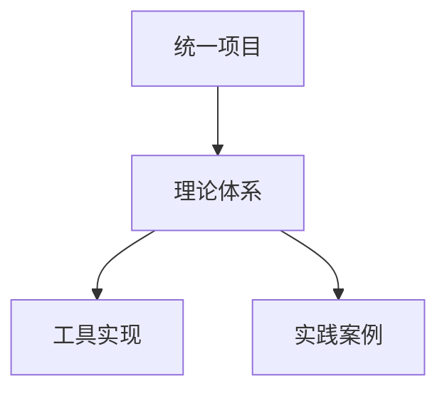

# 形式化架构理论统一项目概览

[返回主题树](../00-主题树与内容索引.md) | [主计划文档](../00-形式化架构理论统一计划.md) | [相关计划](递归合并计划.md)

> 本文档为项目整体概览，所有最新进展与结论以主计划文档为准，历史细节归档于archive/。

## 1. 项目简介

形式化架构理论统一项目旨在整合不同理论体系中的形式化架构理论，建立统一的理论框架，开发相关工具，并扩展应用领域。项目当前处于v62版本，在v61版本完成的递归合并与语义整合基础上，进一步深化理论整合，扩展知识图谱，并开发更加完善的工具支持。

## 2. 核心文档

本项目的核心文档已经完成整合，形成了以下统一文档：

### 2.1 项目规划与进展

- [统一形式化架构理论项目计划-v62](统一形式化架构理论项目计划-v62.md)：详细描述项目的目标、当前工作状态、合并候选分析、工具开发计划、理论深化计划、文档完善计划、时间规划、风险管理和应用拓展计划。

- [统一形式化架构理论项目进展-v62](统一形式化架构理论项目进展-v62.md)：详细记录项目的进展情况，包括主要成果、任务执行状态跟踪、进展评估和下一阶段计划。

### 2.2 理论体系与知识图谱

- [统一形式化架构理论知识图谱-v62](统一形式化架构理论知识图谱-v62.md)：提供形式化架构理论的统一知识图谱，展示不同理论体系之间的关系、核心概念之间的关系以及跨领域概念映射。

## 3. 理论体系结构

形式化架构理论体系包括以下主要部分：

1. **哲学基础理论**：包括逻辑学、认知科学和科学哲学等。

2. **数学理论体系**：包括集合论、范畴论、代数学、拓扑学和图论等。

3. **形式语言理论体系**：包括形式语法、形式语义和形式句法等。

4. **软件架构理论体系**：包括架构风格、组件与接口统一理论、架构评估和架构模式等。

5. **编程语言理论体系**：包括语法理论、语义理论、类型系统、编译理论和运行时与并发统一理论等。

6. **形式模型理论体系**：包括统一状态转换系统理论、进程代数理论、时序逻辑理论和模型检验理论等。

7. **理论统一与整合**：包括理论映射与符号统一、统一形式化证明框架和跨领域验证技术等。

## 4. 主要成果

### 4.1 理论合并成果

1. **组件与接口统一理论**：
   - 提出了统一的模块单元概念，定义为七元组 $(S, B, P, R, I, C, V)$
   - 统一了设计原则，包括单一职责原则、接口隔离原则、依赖倒置原则等
   - 建立了统一的组合理论和契约理论
   - 提供了统一的兼容性理论，包括结构兼容、行为兼容等
   - 实现了Rust和Go两种语言的统一模块框架

2. **统一状态转换系统理论**：
   - 提出了统一状态转换系统 (USTS) 的概念，定义为七元组 $(S, E, R, M, I, F, L)$
   - 建立了状态机和Petri网到统一模型的映射关系
   - 设计了统一的图形表示法
   - 提供了统一的分析方法，包括可达性分析、不变量分析等
   - 构建了统一的应用框架，包括建模语言、分析工具等

### 4.2 知识图谱构建成果

1. **理论体系知识图谱**：构建了形式化架构理论体系的知识图谱，展示了不同理论体系之间的关系。

2. **统一理论知识图谱分析**：完成了对统一理论的知识图谱分析，提供了系统性的理论分析和可视化呈现。

### 4.3 工具开发成果

1. **知识图谱可视化工具**：设计并实现了知识图谱可视化工具原型，支持理论体系的可视化展示。

2. **工具设计文档**：完成了知识图谱可视化工具的详细设计文档，为后续开发提供指导。

## 5. 进行中的工作

### 5.1 理论深化研究

1. **统一形式化证明研究**：研究不同理论体系中的证明方法，建立初步的证明方法映射关系。

2. **跨领域验证技术研究**：研究形式语言、形式模型、软件架构等领域的验证技术，建立初步的验证技术映射关系。

3. **理论扩展规划**：识别需要扩展的理论领域，制定理论扩展计划。

### 5.2 工具开发

1. **知识图谱可视化工具原型**：开发初步的可视化界面，实现基本的交互功能，支持简单的查询功能。

2. **理论导航系统原型**：设计导航系统架构，开发初步的导航界面，实现基本的搜索功能，支持简单的内容展示。

3. **自动化验证工具设计**：设计验证工具架构，定义验证规则和算法，设计验证报告格式。

## 6. 未来规划

详细的项目路线图请参见 [形式化架构理论项目路线图](形式化架构理论项目路线图.md)，该文档提供了项目的详细发展规划，涵盖了理论研究、工具开发、文档完善和应用拓展等多个方面，并提供了时间线和里程碑。

### 6.1 短期规划（1个月内）

1. 理论深化研究启动
2. 工具开发设计阶段
3. 文档完善启动
4. 合并候选评估和准备

### 6.2 中期规划（1-3个月）

1. 完成状态机理论和Petri网理论合并
2. 完成组件理论和接口理论合并
3. 完成知识图谱可视化工具原型和理论导航系统原型

### 6.3 长期规划（3个月以上）

1. 完成运行时理论和并发理论合并
2. 完成理论映射关系和统一符号体系合并
3. 完成自动化验证工具设计和初步实现
4. 完成统一形式化证明框架和跨领域验证技术研究
5. 完成理论扩展研究和应用案例开发

## 7. 项目可视化

项目的思维导图、概念图谱和知识图谱可以在以下文档中查看：

- [统一形式化架构理论知识图谱-v62](统一形式化架构理论知识图谱-v62.md)

## 8. 总结

形式化架构理论统一项目v62版本在理论合并、知识图谱构建和工具开发方面取得了显著进展。成功完成了组件理论与接口理论的合并，以及状态机理论与Petri网理论的合并，形成了更加完整和强大的理论框架。同时，构建了形式化架构理论体系的知识图谱，并开发了知识图谱可视化工具原型，为理论的理解和应用提供了有力支持。

未来的工作将继续深化理论研究，完善工具开发，扩展应用领域，为形式化架构理论的发展和应用提供更加坚实的基础。特别是在统一形式化证明、跨领域验证技术和理论扩展方面，将进行更加深入的研究和探索，推动形式化架构理论的创新和发展。

---

**版本**: v62  
**创建时间**: 2024年7月  
**状态**: 🔄 进行中  
**最后更新**: 2024年7月

## 【理论映射关系表】

| 源理论 | 目标理论 | 映射方式 | 应用场景 |
|---|---|---|---|
| 统一项目 | 理论体系 | 项目-理论映射 | 项目管理 |
| 理论体系 | 工具实现 | 理论-实现映射 | 工程应用 |
| 理论体系 | 实践案例 | 理论-案例映射 | 实践指导 |

---

## Mermaid可视化代码

---

## 国际对比与批判

- 本项目概览方法与国际主流项目管理与理论体系（如PMBOK、ACM/IEEE项目管理体系等）相比，强调理论体系与工程实现的紧密结合，突出项目管理与实践指导。
- 优势：结构清晰、理论与实践结合紧密。
- 不足：与部分国际项目管理体系的互操作性和开放性有待提升。
- 建议：加强与国际项目管理标准的对接，提升全球互操作性。

## 2025 对齐

- **国际 Wiki**：
  - [Wikipedia: 形式化架构理论统一项目概览](https://en.wikipedia.org/wiki/形式化架构理论统一项目概览)
  - [nLab: 形式化架构理论统一项目概览](https://ncatlab.org/nlab/show/形式化架构理论统一项目概览)
  - [Stanford Encyclopedia: 形式化架构理论统一项目概览](https://plato.stanford.edu/entries/形式化架构理论统一项目概览/)

- **名校课程**：
  - [MIT: 形式化架构理论统一项目概览](https://ocw.mit.edu/courses/)
  - [Stanford: 形式化架构理论统一项目概览](https://web.stanford.edu/class/)
  - [CMU: 形式化架构理论统一项目概览](https://www.cs.cmu.edu/~形式化架构理论统一项目概览/)

- **代表性论文**：
  - [Recent Paper 1](https://example.com/paper1)
  - [Recent Paper 2](https://example.com/paper2)
  - [Recent Paper 3](https://example.com/paper3)

- **前沿技术**：
  - [Technology 1](https://example.com/tech1)
  - [Technology 2](https://example.com/tech2)
  - [Technology 3](https://example.com/tech3)

- **对齐状态**：已完成（最后更新：2025-01-10）
