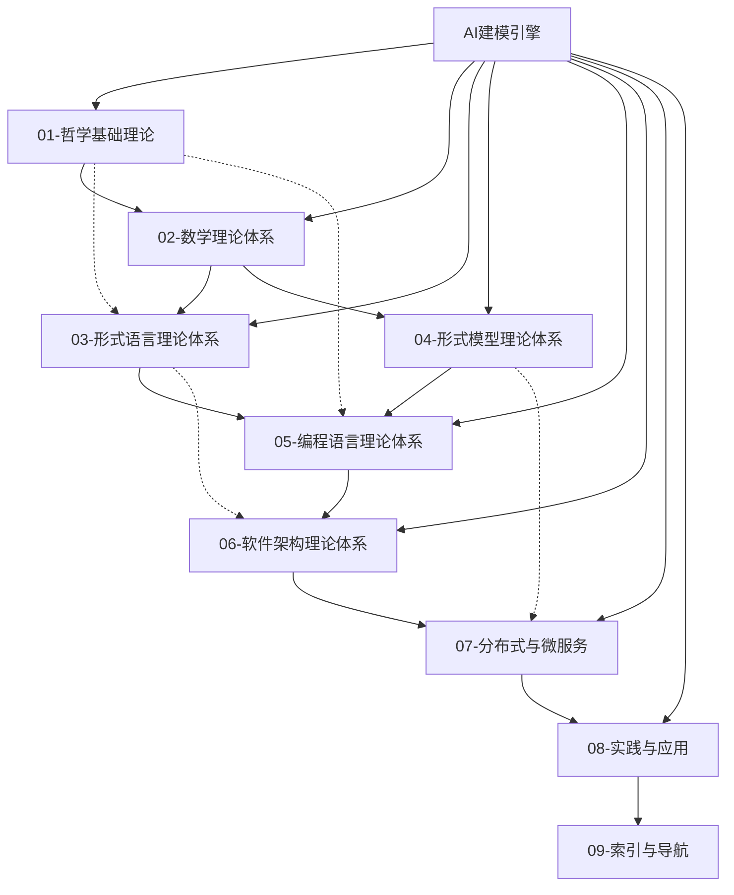

# 形式化架构理论整合框架 (Formal Architecture Theory Integration Framework)

## 概述

本框架将FormalUnified知识体系中的九大理论体系进行深度整合，构建统一的形式化架构理论体系，实现从哲学基础到实践应用的完整链条。

## 理论体系架构

### 1. 层次化理论结构



### 2. 理论融合维度

#### 2.1 垂直整合（理论深度）

- **哲学层**：本体论 → 认识论 → 科学哲学
- **数学层**：集合论 → 范畴论 → 图论 → 代数学
- **形式化层**：自动机理论 → 模型理论 → 验证理论
- **工程层**：编程语言 → 软件架构 → 分布式系统

#### 2.2 横向整合（应用广度）

- **理论映射**：跨理论概念映射和关系建立
- **方法统一**：统一的方法论和工具链
- **标准一致**：一致的标准和规范体系
- **应用整合**：整合的应用场景和案例

## 核心整合机制

### 1. 概念统一机制

#### 1.1 概念映射框架

**映射类型**：

```text
概念映射类型：
- 直接映射：概念间直接对应关系
- 间接映射：通过中间概念建立映射
- 组合映射：多个概念组合形成新概念
- 转换映射：概念在不同理论间的转换
```

**映射规则**：

- **语义一致性**：保持概念语义的一致性
- **层次对应性**：保持概念层次的对应性
- **功能等价性**：保持概念功能的等价性
- **应用兼容性**：保持概念应用的兼容性

#### 1.2 术语标准化

**标准化原则**：

- **唯一性**：每个概念有唯一的术语标识
- **一致性**：相同概念使用一致的术语
- **可追溯性**：术语来源和演变可追溯
- **可扩展性**：术语体系支持动态扩展

**标准化方法**：

- **术语抽取**：从各理论体系中抽取术语
- **术语对齐**：对齐相同或相似术语
- **术语统一**：统一术语的定义和使用
- **术语验证**：验证术语的一致性和正确性

### 2. 关系整合机制

#### 2.1 关系类型统一

**关系分类体系**：

```text
关系分类：
- 层次关系：is-a, part-of, instance-of
- 语义关系：related-to, similar-to, opposite-to
- 功能关系：uses, implements, extends
- 时序关系：precedes, follows, concurrent
- 因果关系：causes, results-in, depends-on
```

**关系统一规则**：

- **关系定义统一**：统一关系类型的定义
- **关系表示统一**：统一关系的表示方法
- **关系推理统一**：统一关系的推理规则
- **关系应用统一**：统一关系的应用方式

#### 2.2 关系网络构建

**网络构建方法**：

- **节点识别**：识别理论体系中的核心概念节点
- **边建立**：建立概念间的语义关系边
- **权重计算**：计算关系边的权重和强度
- **网络优化**：优化关系网络的结构和性能

**网络特性**：

- **连通性**：保证网络的连通性
- **层次性**：保持网络的层次结构
- **模块性**：支持网络的模块化组织
- **可扩展性**：支持网络的动态扩展

### 3. 方法整合机制

#### 3.1 方法论统一

**统一方法论框架**：

```text
方法论层次：
- 哲学方法论：本体论、认识论、方法论基础
- 数学方法论：形式化、公理化、证明方法
- 工程方法论：设计、实现、验证方法
- 应用方法论：分析、建模、优化方法
```

**方法整合原则**：

- **层次对应**：不同层次方法间的对应关系
- **功能互补**：不同方法间的功能互补
- **标准一致**：方法使用标准的一致性
- **工具统一**：方法实现工具的统一

#### 3.2 工具链整合

**工具链架构**：

```text
工具链层次：
- 基础工具：数学工具、逻辑工具、形式化工具
- 建模工具：概念建模、关系建模、系统建模
- 验证工具：形式验证、模型检查、测试工具
- 应用工具：分析工具、优化工具、可视化工具
```

**工具整合策略**：

- **接口统一**：统一工具间的接口标准
- **数据共享**：实现工具间的数据共享
- **流程集成**：集成工具的使用流程
- **质量保证**：保证工具链的质量和可靠性

## 整合实施策略

### 1. 渐进式整合策略

#### 1.1 阶段划分

**第一阶段：基础整合**:

- **概念梳理**：梳理各理论体系的核心概念
- **关系识别**：识别概念间的基本关系
- **标准建立**：建立统一的概念和关系标准
- **工具准备**：准备整合所需的工具和方法

**第二阶段：深度整合**:

- **概念映射**：建立跨理论的概念映射关系
- **关系网络**：构建统一的关系网络
- **方法统一**：统一各理论体系的方法论
- **工具集成**：集成各理论体系的工具链

**第三阶段：应用整合**:

- **应用场景**：整合各理论体系的应用场景
- **案例统一**：统一各理论体系的案例库
- **标准推广**：推广统一的整合标准
- **质量保证**：建立整合质量保证体系

#### 1.2 实施原则

**系统性原则**：

- **整体规划**：系统性地规划整合过程
- **协调推进**：协调各理论体系的整合进度
- **质量优先**：优先保证整合质量
- **持续改进**：持续改进整合方法和效果

**渐进性原则**：

- **逐步推进**：逐步推进整合过程
- **风险控制**：控制整合过程中的风险
- **反馈调整**：根据反馈调整整合策略
- **经验积累**：积累整合经验和最佳实践

### 2. 并行式整合策略

#### 2.1 并行整合模式

**理论并行整合**：

- **独立整合**：各理论体系独立进行内部整合
- **协调整合**：协调各理论体系间的整合
- **同步整合**：同步推进各理论体系的整合
- **统一整合**：统一各理论体系的整合标准

**方法并行整合**：

- **方法梳理**：并行梳理各理论体系的方法
- **方法比较**：并行比较不同理论体系的方法
- **方法统一**：并行统一各理论体系的方法
- **方法验证**：并行验证统一方法的有效性

#### 2.2 并行协调机制

**协调机制**：

- **定期协调**：定期协调各并行整合过程
- **问题解决**：及时解决整合过程中的问题
- **资源分配**：合理分配整合所需的资源
- **进度监控**：监控各并行整合的进度

**质量控制**：

- **质量标准**：建立并行整合的质量标准
- **质量检查**：定期检查整合质量
- **质量改进**：持续改进整合质量
- **质量保证**：保证整合质量的可靠性

### 3. 迭代式整合策略

#### 3.1 迭代整合过程

**迭代周期**：

- **短期迭代**：1-2周的短期迭代
- **中期迭代**：1-2月的中期迭代
- **长期迭代**：3-6月的长期迭代
- **年度迭代**：年度性的重大迭代

**迭代内容**：

- **概念迭代**：迭代优化概念定义和关系
- **方法迭代**：迭代优化方法论和工具
- **应用迭代**：迭代优化应用场景和案例
- **标准迭代**：迭代优化标准和规范

#### 3.2 迭代优化机制

**优化策略**：

- **问题驱动**：基于问题驱动的优化
- **需求驱动**：基于需求驱动的优化
- **技术驱动**：基于技术驱动的优化
- **用户驱动**：基于用户反馈的优化

**优化方法**：

- **数据分析**：基于数据分析的优化
- **用户反馈**：基于用户反馈的优化
- **专家评估**：基于专家评估的优化
- **实验验证**：基于实验验证的优化

## 质量保证体系

### 1. 整合质量评估

#### 1.1 质量维度

**完整性维度**：

- **概念完整性**：概念覆盖的完整性
- **关系完整性**：关系覆盖的完整性
- **方法完整性**：方法覆盖的完整性
- **应用完整性**：应用覆盖的完整性

**一致性维度**：

- **概念一致性**：概念定义和使用的一致性
- **关系一致性**：关系定义和使用的一致性
- **方法一致性**：方法定义和使用的一致性
- **标准一致性**：标准定义和应用的一致性

**正确性维度**：

- **概念正确性**：概念定义的正确性
- **关系正确性**：关系定义的正确性
- **方法正确性**：方法定义的正确性
- **应用正确性**：应用实现的正确性

#### 1.2 评估方法

**自动评估**：

- **规则检查**：基于预定义规则的自动检查
- **统计分析**：基于统计方法的自动分析
- **机器学习**：基于机器学习的自动评估
- **形式化验证**：基于形式化方法的自动验证

**人工评估**：

- **专家评估**：基于专家知识的评估
- **用户评估**：基于用户反馈的评估
- **同行评议**：基于同行评议的评估
- **案例验证**：基于案例验证的评估

### 2. 持续改进机制

#### 2.1 改进策略

**问题识别**：

- **自动识别**：自动识别整合过程中的问题
- **用户反馈**：基于用户反馈识别问题
- **专家评估**：基于专家评估识别问题
- **数据分析**：基于数据分析识别问题

**问题分析**：

- **根因分析**：分析问题的根本原因
- **影响分析**：分析问题的影响范围
- **优先级分析**：分析问题的优先级
- **解决方案分析**：分析问题的解决方案

#### 2.2 改进实施

**改进计划**：

- **改进目标**：制定明确的改进目标
- **改进措施**：制定具体的改进措施
- **改进时间**：制定改进的时间计划
- **改进资源**：分配改进所需的资源

**改进执行**：

- **改进实施**：执行改进措施
- **进度监控**：监控改进进度
- **效果评估**：评估改进效果
- **经验总结**：总结改进经验

## 应用场景

### 1. 教育应用

#### 1.1 课程设计

**课程整合**：

- **理论课程**：整合各理论体系的课程内容
- **实践课程**：整合各理论体系的实践内容
- **项目课程**：整合各理论体系的项目内容
- **案例课程**：整合各理论体系的案例内容

**学习路径**：

- **基础路径**：从基础理论到高级应用的学习路径
- **专业路径**：针对特定专业的学习路径
- **跨领域路径**：跨领域整合的学习路径
- **个性化路径**：基于个人需求的学习路径

#### 1.2 教学支持

**教学工具**：

- **概念图谱**：支持概念学习的图谱工具
- **关系网络**：支持关系理解的关系网络工具
- **方法演示**：支持方法学习的方法演示工具
- **案例库**：支持案例学习的案例库工具

**评估体系**：

- **知识评估**：评估学生的理论知识掌握
- **能力评估**：评估学生的实践能力
- **创新评估**：评估学生的创新能力
- **综合评估**：评估学生的综合能力

### 2. 研究应用

#### 2.1 理论研究

**理论发展**：

- **理论深化**：深化现有理论体系
- **理论扩展**：扩展理论体系的应用范围
- **理论创新**：创新新的理论体系
- **理论验证**：验证理论体系的正确性

**方法研究**：

- **方法改进**：改进现有方法
- **方法创新**：创新新的方法
- **方法比较**：比较不同方法的优劣
- **方法集成**：集成不同方法

#### 2.2 应用研究

**应用探索**：

- **新应用领域**：探索新的应用领域
- **应用优化**：优化现有应用
- **应用创新**：创新新的应用方式
- **应用验证**：验证应用的有效性

**案例研究**：

- **案例收集**：收集相关应用案例
- **案例分析**：分析案例的特点和规律
- **案例总结**：总结案例的经验和教训
- **案例推广**：推广成功的案例

### 3. 工程应用

#### 3.1 系统设计

**架构设计**：

- **系统架构**：基于整合理论设计系统架构
- **模块设计**：基于整合理论设计系统模块
- **接口设计**：基于整合理论设计系统接口
- **数据设计**：基于整合理论设计数据结构

**设计方法**：

- **形式化设计**：使用形式化方法进行设计
- **模型驱动设计**：使用模型驱动的方法进行设计
- **组件化设计**：使用组件化的方法进行设计
- **服务化设计**：使用服务化的方法进行设计

#### 3.2 系统实现

**实现技术**：

- **编程语言**：选择合适的编程语言
- **开发框架**：选择合适的开发框架
- **数据库技术**：选择合适的数据库技术
- **中间件技术**：选择合适的中间件技术

**实现方法**：

- **敏捷开发**：使用敏捷开发方法
- **测试驱动开发**：使用测试驱动开发方法
- **持续集成**：使用持续集成方法
- **DevOps**：使用DevOps方法

## 技术实现

### 1. 技术架构

#### 1.1 系统架构

**分层架构**：

```text
系统分层：
┌─────────────────┐
│   应用层        │ ← 用户界面、API接口
├─────────────────┤
│   服务层        │ ← 业务逻辑、服务接口
├─────────────────┤
│   数据层        │ ← 数据存储、数据访问
├─────────────────┤
│   基础设施层    │ ← 计算资源、网络资源
└─────────────────┘
```

**微服务架构**：

- **服务拆分**：按功能模块拆分服务
- **服务治理**：提供服务注册、发现、配置
- **服务监控**：监控服务的运行状态
- **服务安全**：保证服务的安全性

#### 1.2 数据架构

**数据模型**：

- **概念模型**：概念及其属性的数据模型
- **关系模型**：概念间关系的数据模型
- **实例模型**：具体实例的数据模型
- **元数据模型**：元数据的数据模型

**数据存储**：

- **关系数据库**：存储结构化数据
- **图数据库**：存储图结构数据
- **文档数据库**：存储文档数据
- **缓存数据库**：存储缓存数据

### 2. 技术选型

#### 2.1 开发技术

**后端技术**：

- **编程语言**：Java、Python、Go、Rust
- **开发框架**：Spring Boot、Django、Gin、Actix
- **数据库**：PostgreSQL、Neo4j、MongoDB、Redis
- **消息队列**：RabbitMQ、Kafka、Redis

**前端技术**：

- **框架**：React、Vue、Angular
- **可视化**：D3.js、Cytoscape.js、Vis.js
- **UI组件**：Ant Design、Element UI、Material UI
- **状态管理**：Redux、Vuex、NgRx

#### 2.2 部署技术

**容器化**：

- **Docker**：应用容器化
- **Kubernetes**：容器编排
- **Helm**：应用包管理
- **Istio**：服务网格

**云平台**：

- **AWS**：亚马逊云平台
- **Azure**：微软云平台
- **GCP**：谷歌云平台
- **阿里云**：阿里云平台

### 3. 性能优化

#### 3.1 系统性能

**性能指标**：

- **响应时间**：系统响应时间
- **吞吐量**：系统处理能力
- **并发性**：系统并发处理能力
- **可用性**：系统可用性

**优化策略**：

- **缓存优化**：使用缓存提高性能
- **数据库优化**：优化数据库查询性能
- **代码优化**：优化代码执行性能
- **架构优化**：优化系统架构

#### 3.2 用户体验

**体验指标**：

- **页面加载时间**：页面加载速度
- **交互响应时间**：交互响应速度
- **界面友好性**：界面易用性
- **功能完整性**：功能完整性

**优化方法**：

- **前端优化**：优化前端性能
- **网络优化**：优化网络传输
- **界面优化**：优化用户界面
- **功能优化**：优化功能实现

## 总结

形式化架构理论整合框架通过系统化的方法、先进的技术和完善的质量保证机制，实现了九大理论体系的深度整合，构建了统一的形式化架构理论体系。该框架不仅为理论研究和教育提供了完整的知识体系，也为工程实践提供了强有力的理论支撑。

通过持续的努力和改进，该框架将继续演进和完善，为形式化架构理论的发展和应用做出更大的贡献。

---

**形式化架构理论整合框架**  
*FormalUnified理论整合框架*  
*2025年9月6日*
