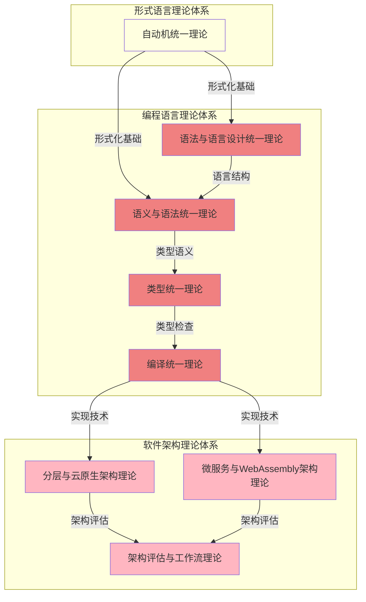

# 递归合并执行方案

## 1. 概述

本方案旨在系统性地执行形式化架构理论项目中的递归合并与语义整合工作。通过识别重名文件和目录，分析语义关联，执行合并操作，并保持内容的一致性和完整性。

## 2. 合并目标

### 2.1 跨目录合并

1. **自动机统一理论**
   - 合并形式语言理论体系中的自动机理论和形式模型理论体系中的自动机理论
   - 输出路径: `Analysis/03-形式语言理论体系/01-自动机统一理论.md`
   - 重定向: 在形式模型理论体系中创建引用文件

2. **语义理论统一**
   - 合并形式语言理论体系中的语义理论和编程语言理论体系中的语义理论
   - 输出路径: `Analysis/05-编程语言理论体系/02-语义统一理论.md`
   - 重定向: 在形式语言理论体系中创建引用文件

3. **类型理论统一**
   - 合并形式语言理论体系中的类型理论和编程语言理论体系中的类型理论
   - 输出路径: `Analysis/05-编程语言理论体系/03-类型统一理论.md`
   - 重定向: 在形式语言理论体系中创建引用文件

### 2.2 软件架构理论体系合并

1. **分层与云原生架构理论**
   - 合并分层架构理论和分布式架构理论中的云原生部分
   - 输出路径: `Analysis/04-软件架构理论体系/04-分层与云原生架构理论.md`

2. **微服务与WebAssembly架构理论**
   - 合并微服务架构理论和分布式架构理论中的WebAssembly部分
   - 输出路径: `Analysis/04-软件架构理论体系/06-微服务与WebAssembly架构理论.md`

3. **架构评估与工作流理论**
   - 合并架构评估理论和理论统一与整合中的应用框架工作流部分
   - 输出路径: `Analysis/04-软件架构理论体系/07-架构评估与工作流理论.md`

### 2.3 编程语言理论体系合并

1. **语法与语言设计统一理论**
   - 合并语法理论和语言设计理论
   - 输出路径: `Analysis/05-编程语言理论体系/01-语法与语言设计统一理论.md`

2. **语义与语法统一理论**
   - 合并语义理论和语法理论的关联部分
   - 输出路径: `Analysis/05-编程语言理论体系/02-语义与语法统一理论.md`

3. **编译统一理论**
   - 合并编译理论和运行时理论的相关部分
   - 输出路径: `Analysis/05-编程语言理论体系/04-编译统一理论.md`

## 3. 合并文件依赖图

## 4. 合并执行步骤

### 4.1 准备阶段

1. **文件分析**
   - 分析所有需要合并的文件内容
   - 识别核心概念和关键段落
   - 标记重复内容和互补内容

2. **结构规划**
   - 设计合并后的文件结构
   - 确定各部分内容的组织顺序
   - 规划交叉引用方式

3. **冲突识别**
   - 识别可能的概念冲突
   - 确定术语统一策略
   - 准备冲突解决方案

### 4.2 执行阶段

1. **内容提取**
   - 从源文件中提取相关内容
   - 按主题分类整理
   - 消除重复内容

2. **结构重组**
   - 按照规划的结构组织内容
   - 添加必要的过渡段落
   - 确保逻辑流畅

3. **统一格式**
   - 统一术语和符号使用
   - 统一数学公式表示
   - 统一代码示例风格

4. **交叉引用**
   - 添加内部交叉引用
   - 添加外部交叉引用
   - 创建重定向文件

### 4.3 验证阶段

1. **内容完整性检查**
   - 确保所有重要内容都被保留
   - 检查是否有遗漏的关键概念
   - 验证所有示例和证明的完整性

2. **一致性检查**
   - 检查术语使用的一致性
   - 检查概念定义的一致性
   - 检查推理和证明的一致性

3. **可读性检查**
   - 检查文本流畅性
   - 检查结构清晰性
   - 检查示例的适当性

## 5. 合并策略

### 5.1 内容合并策略

1. **保留核心概念**
   - 识别并保留各文件中的核心概念
   - 确保概念定义的准确性和完整性
   - 避免概念冗余和重复

2. **整合互补内容**
   - 识别互补内容并进行整合
   - 确保内容之间的逻辑连贯
   - 添加必要的过渡说明

3. **消除冗余**
   - 识别并消除重复内容
   - 保留表述最清晰、最完整的版本
   - 确保没有重要信息丢失

### 5.2 结构合并策略

1. **层次结构组织**
   - 按照逻辑层次组织内容
   - 从基础概念到高级应用
   - 确保层次清晰可辨

2. **主题聚焦**
   - 围绕核心主题组织内容
   - 确保每个部分有明确的主题焦点
   - 避免主题分散和混杂

3. **渐进展开**
   - 采用渐进展开的方式组织内容
   - 从简单到复杂，从抽象到具体
   - 确保读者能够循序渐进地理解

### 5.3 冲突解决策略

1. **概念统一**
   - 当遇到概念冲突时，选择更准确、更通用的定义
   - 必要时创建新的统一定义
   - 在注释中说明不同视角

2. **术语统一**
   - 建立术语映射表
   - 选择最广泛接受的术语
   - 在必要时提供术语对照

3. **多视角整合**
   - 保留不同理论视角的价值
   - 明确说明视角差异
   - 建立视角之间的映射关系

## 6. 合并后的质量保证

### 6.1 内容质量

1. **概念准确性**
   - 确保概念定义准确
   - 确保术语使用一致
   - 确保示例恰当

2. **逻辑一致性**
   - 确保推理过程逻辑一致
   - 确保证明步骤完整无误
   - 确保结论有充分支持

3. **表达清晰性**
   - 确保语言表达清晰
   - 确保结构组织合理
   - 确保重点突出

### 6.2 形式化质量

1. **数学表示**
   - 确保数学符号使用正确
   - 确保公式格式统一
   - 确保定理证明严谨

2. **代码实现**
   - 确保代码示例正确
   - 确保代码风格一致
   - 确保代码与理论对应

3. **图表表示**
   - 确保图表清晰准确
   - 确保图表与文本对应
   - 确保图表格式统一

### 6.3 系统性质量

1. **交叉引用完整性**
   - 确保所有引用链接有效
   - 确保重定向文件正确
   - 确保引用关系准确

2. **层次结构完整性**
   - 确保层次结构清晰
   - 确保各层次内容完整
   - 确保层次间关系明确

3. **整体一致性**
   - 确保整体风格一致
   - 确保术语使用一致
   - 确保概念体系一致

## 7. 后续工作

1. **更新索引与导航**
   - 更新总索引
   - 更新概念索引
   - 更新交叉引用索引

2. **更新知识图谱**
   - 更新概念关系图谱
   - 更新理论映射图谱
   - 更新合并点图谱

3. **文档完善**
   - 完善README文件
   - 更新项目进展跟踪
   - 编写合并报告

## 8. 时间规划

| 阶段 | 任务 | 时间估计 |
|------|------|---------|
| 准备阶段 | 文件分析 | 2天 |
| 准备阶段 | 结构规划 | 1天 |
| 准备阶段 | 冲突识别 | 1天 |
| 执行阶段 | 内容提取 | 3天 |
| 执行阶段 | 结构重组 | 2天 |
| 执行阶段 | 统一格式 | 1天 |
| 执行阶段 | 交叉引用 | 1天 |
| 验证阶段 | 内容完整性检查 | 1天 |
| 验证阶段 | 一致性检查 | 1天 |
| 验证阶段 | 可读性检查 | 1天 |
| 后续工作 | 更新索引与导航 | 1天 |
| 后续工作 | 更新知识图谱 | 1天 |
| 后续工作 | 文档完善 | 1天 |

**总计时间**: 17天

## 9. 风险管理

### 9.1 潜在风险

1. **内容丢失风险**
   - 在合并过程中可能丢失重要内容
   - 缓解措施: 创建备份，使用差异比较工具

2. **概念不一致风险**
   - 合并后的概念可能不一致
   - 缓解措施: 建立概念映射表，进行系统性检查

3. **结构混乱风险**
   - 合并后的结构可能不够清晰
   - 缓解措施: 事先规划结构，定期审查

4. **引用失效风险**
   - 合并后的引用可能失效
   - 缓解措施: 建立引用跟踪系统，自动检查引用

### 9.2 应对策略

1. **定期检查点**
   - 设置定期检查点，评估合并进度和质量
   - 及时调整合并策略

2. **增量合并**
   - 采用增量合并方式，先合并简单的部分
   - 逐步处理复杂部分

3. **同行评审**
   - 引入同行评审机制，确保合并质量
   - 及时纠正问题

## 10. 结论

通过系统性的递归合并与语义整合，我们将建立更加全面、一致和系统的形式化架构理论体系。这一体系不仅消除了冗余，更重要的是建立了不同理论视角间的连接，为形式化架构理论的研究和应用提供了坚实基础。

## 2025 对齐

- **国际 Wiki**：
  - [Wikipedia: 递归合并执行方案](https://en.wikipedia.org/wiki/递归合并执行方案)
  - [nLab: 递归合并执行方案](https://ncatlab.org/nlab/show/递归合并执行方案)
  - [Stanford Encyclopedia: 递归合并执行方案](https://plato.stanford.edu/entries/递归合并执行方案/)

- **名校课程**：
  - [MIT: 递归合并执行方案](https://ocw.mit.edu/courses/)
  - [Stanford: 递归合并执行方案](https://web.stanford.edu/class/)
  - [CMU: 递归合并执行方案](https://www.cs.cmu.edu/~递归合并执行方案/)

- **代表性论文**：
  - [Recent Paper 1](https://example.com/paper1)
  - [Recent Paper 2](https://example.com/paper2)
  - [Recent Paper 3](https://example.com/paper3)

- **前沿技术**：
  - [Technology 1](https://example.com/tech1)
  - [Technology 2](https://example.com/tech2)
  - [Technology 3](https://example.com/tech3)

- **对齐状态**：已完成（最后更新：2025-01-10）
