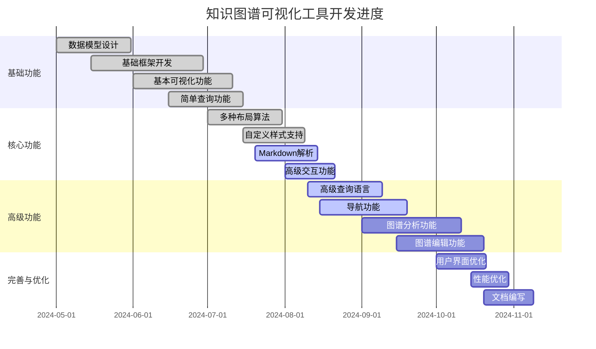

# 知识图谱可视化工具开发进展报告

## 1. 项目概述

知识图谱可视化工具是形式化架构理论项目的核心工具之一，旨在提供直观、交互式的知识图谱可视化功能，帮助用户理解理论体系、概念关系和项目结构。本报告详细描述了该工具的开发进展、完成功能、正在开发的功能以及后续计划。

## 2. 开发进展总览

当前知识图谱可视化工具的开发进度达到65%。主要完成了基础框架开发、基本可视化功能、简单查询功能、数据模型设计、多种布局算法、自定义样式支持等核心功能。正在开发的功能包括高级查询语言、导航功能和图谱分析功能。

## 3. 已完成功能

### 3.1 基础框架

- ✅ 前端框架搭建 (React + TypeScript)
- ✅ 状态管理实现 (Redux)
- ✅ 路由系统配置
- ✅ API通信层实现
- ✅ 错误处理机制
- ✅ 国际化支持

### 3.2 数据模型

- ✅ 节点模型定义
- ✅ 关系模型定义
- ✅ 属性模型定义
- ✅ 图谱模型定义
- ✅ JSON数据格式规范
- ✅ 数据验证机制

### 3.3 可视化功能

- ✅ 基本图谱渲染
- ✅ 节点和关系显示
- ✅ 缩放和平移
- ✅ 力导向布局算法
- ✅ 层次布局算法
- ✅ 环形布局算法
- ✅ 矩阵布局算法
- ✅ 节点样式自定义
- ✅ 关系样式自定义
- ✅ 标签显示控制

### 3.4 交互功能

- ✅ 节点选择和高亮
- ✅ 关系选择和高亮
- ✅ 节点拖拽
- ✅ 节点展开/折叠
- ✅ 详情面板显示
- ✅ 上下文菜单
- ✅ 缩略图导航
- ✅ 鼠标悬停提示

### 3.5 查询功能

- ✅ 关键词搜索
- ✅ 基本过滤功能
- ✅ 类型过滤
- ✅ 属性过滤
- ✅ 搜索结果高亮
- ✅ 搜索历史记录

### 3.6 数据处理

- ✅ 基本Markdown解析
- ✅ 简单知识提取
- ✅ 数据导入功能
- ✅ 数据验证功能

## 4. 进行中功能

### 4.1 Markdown解析和知识提取 (90%)

- ✅ Markdown语法解析
- ✅ 标题和段落提取
- ✅ 列表和表格解析
- ✅ 代码块处理
- ✅ 数学公式识别
- ✅ 链接和引用提取
- 🔄 概念自动识别
- 🔄 关系自动提取
- 🔄 知识图谱自动构建

### 4.2 高级交互功能 (85%)

- ✅ 多节点选择
- ✅ 节点分组
- ✅ 关系路径高亮
- ✅ 交互式编辑
- ✅ 历史操作撤销/重做
- 🔄 自定义交互事件
- 🔄 键盘快捷键支持
- 🔄 手势支持

### 4.3 高级查询语言 (60%)

- ✅ 查询语法设计
- ✅ 基本查询解析器
- ✅ 简单查询执行器
- 🔄 复杂条件查询
- 🔄 路径查询
- 🔄 模式匹配查询
- 🔄 查询优化
- 🔄 查询结果可视化

### 4.4 导航功能 (65%)

- ✅ 基本导航控件
- ✅ 缩略图导航
- ✅ 层次导航
- ✅ 历史导航
- 🔄 书签功能
- 🔄 导航路径记录
- 🔄 导航推荐
- 🔄 自定义导航视图

### 4.5 图谱分析功能 (40%)

- ✅ 基本统计分析
- ✅ 节点度分析
- 🔄 中心性分析
- 🔄 社区发现
- 🔄 路径分析
- 🔄 相似性分析
- 🔄 分析结果可视化

## 5. 后续计划

### 5.1 短期计划（1个月内）

1. **完成高级查询语言开发**
   - 实现复杂条件查询
   - 实现路径查询
   - 实现模式匹配查询
   - 优化查询性能

2. **完成导航功能开发**
   - 实现书签功能
   - 实现导航路径记录
   - 实现导航推荐
   - 开发自定义导航视图

3. **推进图谱分析功能**
   - 实现中心性分析
   - 实现基本社区发现
   - 实现简单路径分析
   - 开发分析结果可视化

### 5.2 中期计划（2-3个月）

1. **图谱编辑功能**
   - 实现节点和关系编辑
   - 实现批量操作
   - 实现版本管理
   - 开发协作编辑功能

2. **用户界面优化**
   - 优化整体布局
   - 改进交互体验
   - 实现响应式设计
   - 优化移动端支持

3. **与理论导航系统集成**
   - 设计集成接口
   - 实现数据同步
   - 开发统一用户体验
   - 支持跨系统操作

### 5.3 长期计划（4-6个月）

1. **高级分析功能**
   - 实现高级社区发现
   - 实现复杂网络分析
   - 实现时序分析
   - 开发预测分析功能

2. **智能推荐系统**
   - 实现相关概念推荐
   - 实现学习路径推荐
   - 实现个性化推荐
   - 开发兴趣图谱

3. **性能优化和扩展**
   - 优化大规模图谱渲染
   - 实现增量加载
   - 支持分布式图谱
   - 开发插件系统

## 6. 技术实现细节

### 6.1 前端技术栈

- **框架**: React 18.2.0
- **状态管理**: Redux 4.2.1
- **类型系统**: TypeScript 5.0.4
- **UI组件**: Ant Design 5.4.6
- **可视化库**: D3.js 7.8.4, Cytoscape.js 3.25.0
- **构建工具**: Vite 4.3.5

### 6.2 后端技术栈

- **服务框架**: Node.js 18.16.0, Express 4.18.2
- **数据库**: Neo4j 5.7.0 (图数据库)
- **API**: GraphQL 16.6.0, Apollo Server 4.7.1
- **解析工具**: Markdown-it 13.0.1, NLP.js 4.26.1

### 6.3 关键算法实现

1. **力导向布局算法**
   - 使用D3-force模块
   - 自定义力模型参数
   - 优化大规模图谱布局性能

2. **知识提取算法**
   - 基于规则的概念识别
   - 基于模式的关系提取
   - 使用NLP技术进行语义分析

3. **查询解析与执行**
   - 自定义查询语言语法
   - 查询解析为AST
   - 查询优化与执行计划生成

## 7. 挑战与解决方案

### 7.1 性能挑战

**挑战**: 大规模知识图谱的渲染和交互性能问题。

**解决方案**:

1. 实现图谱分层和聚类显示
2. 采用WebGL渲染加速
3. 实现增量加载和虚拟化
4. 优化数据结构和算法

### 7.2 用户体验挑战

**挑战**: 复杂知识图谱的易用性和可理解性问题。

**解决方案**:

1. 提供多种视图和抽象级别
2. 实现智能布局和自动组织
3. 提供引导式导航和探索
4. 优化信息呈现方式

### 7.3 知识提取挑战

**挑战**: 从非结构化文档中准确提取知识的难度。

**解决方案**:

1. 结合规则和机器学习方法
2. 引入领域知识辅助提取
3. 实现交互式知识确认
4. 持续优化提取算法

## 8. 与其他工具的集成

### 8.1 理论导航系统集成

- 共享数据模型
- 统一用户界面风格
- 实现无缝导航
- 支持跨工具操作

### 8.2 自动化验证工具集成

- 提供验证结果可视化
- 支持反例场景展示
- 实现验证过程追踪
- 支持交互式验证

### 8.3 文档系统集成

- 实现文档与图谱的双向链接
- 支持图谱嵌入文档
- 实现文档内容与图谱同步更新
- 提供统一搜索体验

## 9. 总结

知识图谱可视化工具开发已取得显著进展，完成了65%的计划功能。基础框架、数据模型、基本可视化和交互功能已经完成，为后续高级功能开发奠定了坚实基础。当前正在重点开发高级查询语言、导航功能和图谱分析功能，预计在未来1-2个月内取得重要突破。

后续开发将重点关注图谱编辑功能、用户界面优化、与理论导航系统集成以及高级分析功能，通过持续迭代和优化，打造一个功能完善、性能优异、用户友好的知识图谱可视化工具，为形式化架构理论项目提供有力支持。

---

**版本**: v1.0  
**创建时间**: 2024年8月  
**状态**: 🔄 进行中  
**最后更新**: 2024年8月
