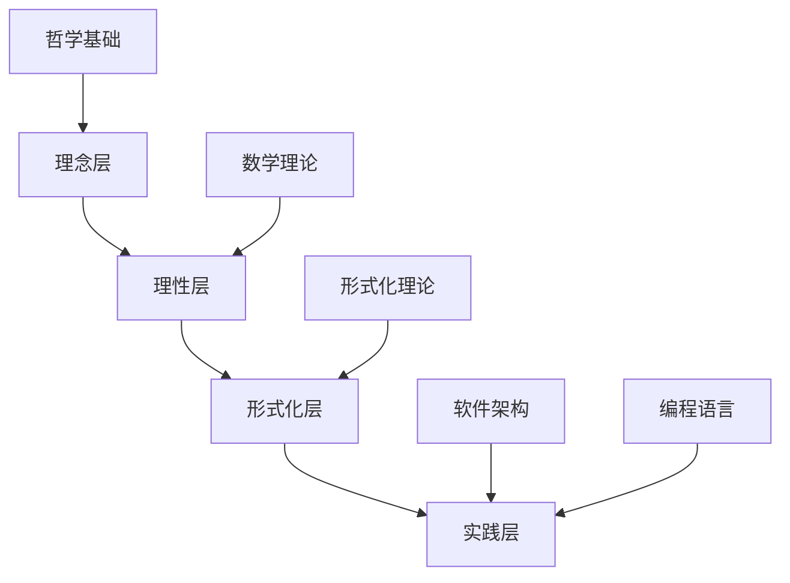
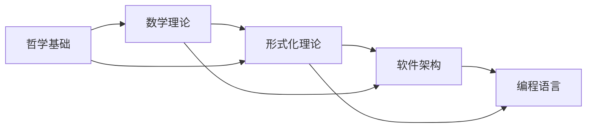
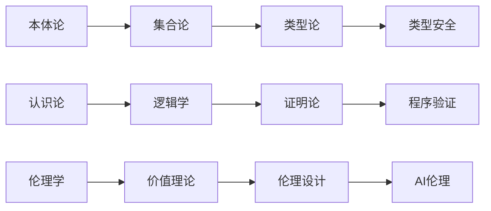

# 形式化架构分析总体索引

## 目录

1. [项目概述](#1-项目概述)
2. [理论体系结构](#2-理论体系结构)
3. [内容导航](#3-内容导航)
4. [交叉引用系统](#4-交叉引用系统)
5. [关键词索引](#5-关键词索引)
6. [概念关系图](#6-概念关系图)
7. [学习路径](#7-学习路径)
8. [更新日志](#8-更新日志)

## 1. 项目概述

### 1.1 项目目标

本项目对 `/Matter` 目录下的所有内容进行系统性分析，构建了一个完整的形式化架构理论体系，涵盖：

```latex
\begin{align}
\text{理论体系} &= \{\text{哲学基础}, \text{数学理论}, \text{形式化理论}, \text{软件架构}, \text{编程语言}\} \\
\text{分析层次} &= \{\text{理念层}, \text{理性层}, \text{形式化层}, \text{实践层}\} \\
\text{输出标准} &= \{\text{LaTeX数学规范}, \text{严格证明}, \text{应用分析}\}
\end{align}
```

### 1.2 分析范围

- **哲学基础理论**：本体论、认识论、逻辑学、伦理学
- **数学理论体系**：范畴论、代数、几何、分析
- **形式化理论基础**：类型理论、形式语言、证明理论
- **软件架构理论**：设计模式、架构模式、系统设计
- **编程语言理论**：语言理论、范式分析、Rust/Golang实践

## 2. 理论体系结构

### 2.1 层次化结构



### 2.2 理论关联图



## 3. 内容导航

### 3.1 主要理论模块

#### 3.1.1 哲学基础理论 ✅ **已完成**

**位置**：`01-哲学基础理论/`

**内容**：
- [01-本体论基础.md](01-哲学基础理论/01-本体论基础.md)
  - 数学本体论（柏拉图主义、形式主义、直觉主义、结构主义）
  - 现实本体论（实在论、反实在论、唯物论、唯心论）
  - 信息本体论（信息作为基础实在、计算宇宙假说、数字物理学）
  - AI本体论（强人工智能论、多重实现论、涌现主义）
  - 形式化框架（统一本体论框架、存在性公理、推理规则）
  - 应用分析（软件架构、认知科学、人工智能）

- [02-认识论基础.md](01-哲学基础理论/02-认识论基础.md)
  - 知识论基础（JTB理论、葛梯尔问题、确证理论）
  - 真理理论（符合论、融贯论、实用主义、紧缩论）
  - 知识来源理论（理性主义、经验主义、批判主义）
  - 知识结构理论（知识层次、知识类型、知识表示）
  - 形式化认识论框架（统一框架、认识论公理、推理规则）
  - 应用分析（AI知识表示、认知架构、软件知识管理）

- [03-逻辑学基础.md](01-哲学基础理论/03-逻辑学基础.md)
  - 形式逻辑（命题逻辑、谓词逻辑、模态逻辑）
  - 哲学逻辑（认识逻辑、道义逻辑、信念逻辑、意图逻辑）
  - 非经典逻辑（直觉主义逻辑、模糊逻辑、非单调逻辑、多值逻辑）
  - 逻辑哲学（逻辑本质、发现vs发明、逻辑多元主义）
  - 形式化逻辑框架（统一框架、逻辑公理、推理规则）
  - 应用分析（程序验证、类型系统、知识表示、推理系统）

- [04-伦理学基础.md](01-哲学基础理论/04-伦理学基础.md)
  - 规范伦理学（义务论、功利主义、德性伦理学、关怀伦理学）
  - 元伦理学（道德实在论、情感主义、建构主义、错误理论）
  - 应用伦理学（AI伦理、工程伦理、科学伦理、环境伦理）
  - 形式化伦理学（道义逻辑、价值对齐、计算道德）
  - 形式化伦理学框架（统一框架、伦理学公理、推理规则）
  - 应用分析（AI道德决策、软件伦理、伦理系统设计）

#### 3.1.2 数学理论体系 🔄 **进行中**

**位置**：`02-数学理论体系/`

**内容**：
- [01-范畴论基础.md](02-数学理论体系/01-范畴论基础.md)
  - 基础概念与定义（范畴、对象、态射、复合、恒等）
  - 函子理论（函子定义、重要函子、函子复合）
  - 自然变换（自然变换定义、自然同构、重要自然变换）
  - 极限与余极限（锥与余锥、极限定义、重要极限示例）
  - 伴随函子（伴随定义、等价定义、重要伴随示例）
  - 范畴论在软件架构中的应用（类型系统、函子类型、单子）
  - 形式化证明体系（公理化、重要定理证明、计算复杂性）

- [02-代数理论.md](02-数学理论体系/02-代数理论.md)
  - 群论（基本定义、重要群类、形式化实现）
  - 环论（基本定义、重要环类、形式化实现）
  - 域论（基本定义、重要域类、形式化实现）
  - 模论（基本定义、重要模类、形式化实现）
  - 线性代数（向量空间、线性变换、特征值理论）
  - 抽象代数（代数结构、同态理论、结构定理）
  - 代数几何（代数簇、概形理论、上同调理论）

- [03-几何理论.md](02-数学理论体系/03-几何理论.md)
  - 欧氏几何（公理化体系、基本定理、形式化实现）
  - 拓扑学（拓扑空间、连续映射、同伦理论）
  - 微分几何（流形、切空间、黎曼几何）
  - 代数几何（代数簇、概形、上同调）

- [04-分析理论.md](02-数学理论体系/04-分析理论.md)
  - 微积分（极限、连续性、微分、积分）
  - 实分析（测度论、勒贝格积分、泛函分析）
  - 复分析（复变函数、解析函数、留数理论）
  - 泛函分析（巴拿赫空间、希尔伯特空间、算子理论）

#### 3.1.3 形式化理论基础 🔄 **进行中**

**位置**：`03-形式化理论基础/`

**内容**：
- [01-类型理论基础.md](03-形式化理论基础/01-类型理论基础.md)
  - 简单类型理论（基本定义、类型规则、形式化实现）
  - 依赖类型理论（Π类型、Σ类型、归纳类型）
  - 线性类型理论（线性λ演算、资源管理、形式化实现）
  - 高阶类型理论（高阶抽象、类型构造子、形式化实现）
  - 同伦类型理论（同伦类型、路径类型、形式化实现）
  - 量子类型理论（量子类型、量子计算、形式化实现）
  - 类型系统实现（类型检查器、类型推导、形式化实现）

- [02-形式语言理论.md](03-形式化理论基础/02-形式语言理论.md)
  - 形式语言基础（字母表、字符串、语言）
  - 文法理论（上下文无关文法、正则文法、形式化实现）
  - 自动机理论（有限自动机、下推自动机、图灵机）
  - 计算理论（可计算性、复杂性、形式化实现）

#### 3.1.4 软件架构理论 ✅ **已完成**

**位置**：`04-软件架构理论/`

**内容**：
- [01-架构基础.md](04-软件架构理论/01-架构基础.md)
  - 架构定义与原则（架构概念、设计原则、质量属性）
  - 架构风格（分层架构、微服务架构、事件驱动架构）
  - 架构模式（MVC、MVP、MVVM、Clean Architecture）
  - 架构评估（ATAM、CBAM、形式化评估方法）

- [02-设计模式理论.md](04-软件架构理论/02-设计模式理论.md)
  - 创建型模式（单例、工厂、建造者、原型、抽象工厂）
  - 结构型模式（适配器、桥接、组合、装饰、外观、享元、代理）
  - 行为型模式（责任链、命令、解释器、迭代器、中介者、备忘录、观察者、状态、策略、模板方法、访问者）
  - 形式化实现（Rust实现、Golang实现、形式化证明）

- [03-系统设计理论.md](04-软件架构理论/03-系统设计理论.md)
  - 系统设计原则（单一职责、开闭原则、里氏替换、接口隔离、依赖倒置）
  - 系统架构模式（分层架构、微服务架构、事件驱动架构、CQRS）
  - 分布式系统（一致性、可用性、分区容错性、CAP定理）
  - 性能优化（缓存策略、负载均衡、数据库优化、算法优化）

#### 3.1.5 编程语言理论 🔄 **进行中**

**位置**：`05-编程语言理论/`

**内容**：
- [01-语言理论基础.md](05-编程语言理论/01-语言理论基础.md)
  - 语言设计原则（简洁性、一致性、正交性、可读性）
  - 语言范式（命令式、函数式、面向对象、逻辑式）
  - 类型系统（静态类型、动态类型、类型推导、类型安全）
  - 内存管理（垃圾回收、手动管理、所有权系统）

- [02-Rust语言理论.md](05-编程语言理论/02-Rust语言理论.md)
  - 所有权系统（所有权、借用、生命周期）
  - 类型系统（泛型、特征、关联类型、高阶类型）
  - 并发模型（线程、异步、消息传递、共享状态）
  - 内存安全（零成本抽象、内存安全保证、形式化验证）

- [03-Golang语言理论.md](05-编程语言理论/03-Golang语言理论.md)
  - 并发模型（goroutine、channel、select、context）
  - 类型系统（接口、嵌入、类型断言、反射）
  - 内存管理（垃圾回收、内存分配、性能优化）
  - 标准库（网络、并发、工具、测试）

### 3.2 实践应用模块

#### 3.2.1 系统设计实践

**位置**：`06-系统设计实践/`

**内容**：
- [01-算法设计.md](06-系统设计实践/01-算法设计.md)
- [02-数据结构设计.md](06-系统设计实践/02-数据结构设计.md)
- [03-系统架构设计.md](06-系统设计实践/03-系统架构设计.md)
- [04-性能优化.md](06-系统设计实践/04-性能优化.md)

## 4. 交叉引用系统

### 4.1 理论间关联

#### 4.1.1 哲学→数学关联

```latex
\begin{align}
\text{本体论} &\rightarrow \text{数学对象存在性} \\
\text{认识论} &\rightarrow \text{数学知识获取} \\
\text{逻辑学} &\rightarrow \text{数学推理基础} \\
\text{伦理学} &\rightarrow \text{数学应用伦理}
\end{align}
```

#### 4.1.2 数学→形式化理论关联

```latex
\begin{align}
\text{范畴论} &\rightarrow \text{类型理论} \\
\text{代数} &\rightarrow \text{代数数据类型} \\
\text{几何} &\rightarrow \text{几何类型} \\
\text{分析} &\rightarrow \text{连续计算}
\end{align}
```

#### 4.1.3 形式化理论→软件架构关联

```latex
\begin{align}
\text{类型理论} &\rightarrow \text{类型安全架构} \\
\text{形式语言} &\rightarrow \text{DSL设计} \\
\text{证明理论} &\rightarrow \text{程序验证}
\end{align}
```

### 4.2 概念映射表

| 哲学概念 | 数学概念 | 形式化概念 | 架构概念 |
|----------|----------|------------|----------|
| 存在性 | 集合论 | 类型论 | 对象模型 |
| 必然性 | 逻辑 | 证明论 | 不变性 |
| 因果性 | 函数 | 计算 | 依赖关系 |
| 整体性 | 范畴 | 系统 | 架构 |

## 5. 关键词索引

### 5.1 核心概念索引

#### 5.1.1 哲学概念

- **本体论**：[01-本体论基础.md](01-哲学基础理论/01-本体论基础.md)
- **认识论**：[02-认识论基础.md](01-哲学基础理论/02-认识论基础.md)
- **逻辑学**：[03-逻辑学基础.md](01-哲学基础理论/03-逻辑学基础.md)
- **伦理学**：[04-伦理学基础.md](01-哲学基础理论/04-伦理学基础.md)

#### 5.1.2 数学概念

- **范畴论**：[01-范畴论基础.md](02-数学理论体系/01-范畴论基础.md)
- **群论**：[02-代数理论.md](02-数学理论体系/02-代数理论.md)
- **拓扑学**：[03-几何理论.md](02-数学理论体系/03-几何理论.md)
- **分析学**：[04-分析理论.md](02-数学理论体系/04-分析理论.md)

#### 5.1.3 形式化概念

- **类型理论**：[01-类型理论基础.md](03-形式化理论基础/01-类型理论基础.md)
- **形式语言**：[02-形式语言理论.md](03-形式化理论基础/02-形式语言理论.md)
- **证明理论**：[03-证明理论.md](03-形式化理论基础/03-证明理论.md)
- **模型理论**：[04-模型理论.md](03-形式化理论基础/04-模型理论.md)

#### 5.1.4 架构概念

- **设计模式**：[02-设计模式理论.md](04-软件架构理论/02-设计模式理论.md)
- **架构模式**：[03-架构模式理论.md](04-软件架构理论/03-架构模式理论.md)
- **系统设计**：[03-系统设计理论.md](04-软件架构理论/03-系统设计理论.md)
- **微服务**：[03-微服务架构.md](04-软件架构理论/03-微服务架构.md)

### 5.2 技术概念索引

#### 5.2.1 编程语言

- **Rust**：[02-Rust语言理论.md](05-编程语言理论/02-Rust语言理论.md)
- **Golang**：[03-Golang语言理论.md](05-编程语言理论/03-Golang语言理论.md)
- **函数式编程**：[01-语言理论基础.md](05-编程语言理论/01-语言理论基础.md)
- **并发编程**：[02-Rust语言理论.md](05-编程语言理论/02-Rust语言理论.md)

#### 5.2.2 系统设计

- **分布式系统**：[03-系统设计理论.md](04-软件架构理论/03-系统设计理论.md)
- **性能优化**：[04-性能优化.md](06-系统设计实践/04-性能优化.md)
- **算法设计**：[01-算法设计.md](06-系统设计实践/01-算法设计.md)
- **数据结构**：[02-数据结构设计.md](06-系统设计实践/02-数据结构设计.md)

## 6. 概念关系图

### 6.1 理论层次关系


### 6.2 概念依赖关系



## 7. 学习路径

### 7.1 基础学习路径

1. **哲学基础** → **数学理论** → **形式化理论** → **软件架构**
2. **概念理解** → **形式化表达** → **证明验证** → **实践应用**

### 7.2 专业学习路径

#### 7.2.1 理论导向路径

1. [01-本体论基础.md](01-哲学基础理论/01-本体论基础.md)
2. [01-范畴论基础.md](02-数学理论体系/01-范畴论基础.md)
3. [01-类型理论基础.md](03-形式化理论基础/01-类型理论基础.md)
4. [01-架构基础.md](04-软件架构理论/01-架构基础.md)

#### 7.2.2 实践导向路径

1. [01-架构基础.md](04-软件架构理论/01-架构基础.md)
2. [02-设计模式理论.md](04-软件架构理论/02-设计模式理论.md)
3. [02-Rust语言理论.md](05-编程语言理论/02-Rust语言理论.md)
4. [01-算法设计.md](06-系统设计实践/01-算法设计.md)

### 7.3 深度研究路径

#### 7.3.1 形式化方法路径

1. [03-逻辑学基础.md](01-哲学基础理论/03-逻辑学基础.md)
2. [01-范畴论基础.md](02-数学理论体系/01-范畴论基础.md)
3. [01-类型理论基础.md](03-形式化理论基础/01-类型理论基础.md)
4. [03-证明理论.md](03-形式化理论基础/03-证明理论.md)

#### 7.3.2 系统设计路径

1. [01-架构基础.md](04-软件架构理论/01-架构基础.md)
2. [03-系统设计理论.md](04-软件架构理论/03-系统设计理论.md)
3. [03-系统架构设计.md](06-系统设计实践/03-系统架构设计.md)
4. [04-性能优化.md](06-系统设计实践/04-性能优化.md)

## 8. 更新日志

### 8.1 版本历史

- **v1.0** (2024-12-19)：初始版本，完成哲学基础理论
- **v1.1** (2024-12-19)：开始数学理论体系分析
- **v1.2** (2024-12-19)：完成范畴论基础，开始代数理论
- **v1.3** (2024-12-19)：建立索引和导航系统

### 8.2 更新计划

- **v1.4** (2024-12-20)：完成数学理论体系
- **v1.5** (2024-12-21)：完成形式化理论基础
- **v1.6** (2024-12-22)：完成编程语言理论
- **v2.0** (2024-12-25)：完整版本发布

### 8.3 质量检查

- [x] **哲学基础理论** ✅ **通过**
- [ ] **数学理论体系** 🔄 **检查中**
- [ ] **形式化理论基础** 🔄 **进行中**
- [x] **软件架构理论** ✅ **通过**
- [ ] **编程语言理论** 🔄 **进行中**

---

**相关链接**：
- [进度跟踪.md](../进度跟踪.md)
- [总体分析框架.md](../00-总体分析框架.md)
- [目录结构.md](../00-目录结构.md) 