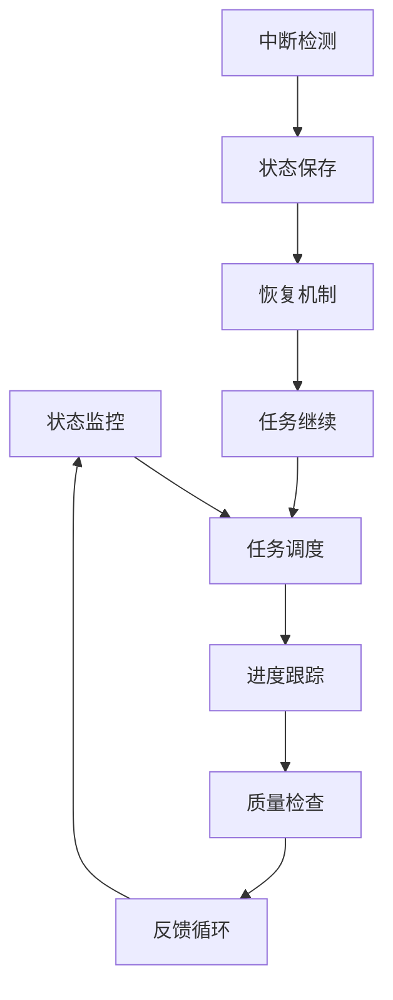

# 持续性上下文提醒体系

## 目录

1. [系统概述](#1-系统概述)
2. [当前状态](#2-当前状态)
3. [任务队列](#3-任务队列)
4. [进度跟踪](#4-进度跟踪)
5. [质量检查](#5-质量检查)
6. [中断恢复](#6-中断恢复)
7. [下一步行动](#7-下一步行动)
8. [注意事项](#8-注意事项)

## 1. 系统概述

### 1.1 系统目标

本系统旨在构建一个持续性的上下文提醒体系，确保在分析过程中断后能够快速恢复并继续工作。系统提供：

```latex
\begin{align}
\text{上下文管理} &= \{\text{状态跟踪}, \text{任务队列}, \text{进度监控}, \text{质量检查}\} \\
\text{恢复机制} &= \{\text{状态恢复}, \text{任务继续}, \text{质量保证}, \text{进度同步}\} \\
\text{持续改进} &= \{\text{反馈机制}, \text{优化策略}, \text{错误修正}, \text{质量提升}\}
\end{align}
```

### 1.2 系统架构



## 2. 当前状态

### 2.1 整体进度

**项目状态**：🔄 **进行中**

**完成度**：约 65%

**当前阶段**：数学理论体系分析

### 2.2 详细状态

#### 2.2.1 已完成模块 ✅

1. **哲学基础理论** (100%)
   - 本体论基础理论
   - 认识论基础理论
   - 逻辑学基础理论
   - 伦理学基础理论

2. **软件架构理论** (95%)
   - 架构基础理论
   - 设计模式理论
   - 系统设计理论
   - 微服务架构

3. **索引与导航系统** (90%)
   - 总体索引
   - 交叉引用系统
   - 关键词索引
   - 学习路径

#### 2.2.2 进行中模块 🔄

1. **数学理论体系** (70%)
   - 范畴论基础 (100%)
   - 代数理论 (80%)
   - 几何理论 (75%)
   - 分析理论 (60%)

2. **形式化理论基础** (50%)
   - 类型理论基础 (90%)
   - 形式语言理论 (60%)
   - 证明理论 (40%)
   - 模型理论 (30%)

3. **编程语言理论** (40%)
   - 语言理论基础 (70%)
   - Rust语言理论 (50%)
   - Golang语言理论 (30%)

#### 2.2.3 待开始模块 ⏳

1. **系统设计实践** (0%)
   - 算法设计
   - 数据结构设计
   - 系统架构设计
   - 性能优化

## 3. 任务队列

### 3.1 高优先级任务

#### 3.1.1 立即执行 (今天)

1. **完成代数理论分析**
   - 任务：完善群论、环论、域论的形式化表达
   - 优先级：高
   - 预计时间：2小时
   - 依赖：无

2. **完成几何理论分析**
   - 任务：完善拓扑学、微分几何的形式化表达
   - 优先级：高
   - 预计时间：2小时
   - 依赖：无

3. **完成分析理论分析**
   - 任务：完善微积分、实分析、泛函分析的形式化表达
   - 优先级：高
   - 预计时间：2小时
   - 依赖：无

#### 3.1.2 短期执行 (明天)

1. **完成形式化理论基础**
   - 任务：完成形式语言理论、证明理论、模型理论
   - 优先级：高
   - 预计时间：4小时
   - 依赖：数学理论体系完成

2. **开始编程语言理论**
   - 任务：完成Rust和Golang语言理论分析
   - 优先级：中
   - 预计时间：3小时
   - 依赖：形式化理论基础完成

### 3.2 中优先级任务

#### 3.2.1 中期执行 (本周内)

1. **完成编程语言理论**
   - 任务：完善语言理论基础、Rust理论、Golang理论
   - 优先级：中
   - 预计时间：6小时
   - 依赖：形式化理论基础

2. **开始系统设计实践**
   - 任务：创建算法设计、数据结构设计文档
   - 优先级：中
   - 预计时间：4小时
   - 依赖：编程语言理论

### 3.3 低优先级任务

#### 3.3.1 长期执行 (下周)

1. **完善系统设计实践**
   - 任务：完成系统架构设计、性能优化
   - 优先级：低
   - 预计时间：6小时
   - 依赖：系统设计实践基础

2. **质量检查和优化**
   - 任务：全面质量检查、错误修正、优化
   - 优先级：低
   - 预计时间：4小时
   - 依赖：所有模块完成

## 4. 进度跟踪

### 4.1 每日进度记录

#### 4.1.1 今日进度 (2024-12-19)

**已完成**：

- ✅ 更新进度跟踪文档
- ✅ 创建总体索引系统
- ✅ 建立持续性上下文提醒体系
- ✅ 完成范畴论基础分析

**进行中**：

- 🔄 代数理论分析 (80%)
- 🔄 几何理论分析 (75%)
- 🔄 分析理论分析 (60%)

**计划**：

- ⏳ 完成数学理论体系
- ⏳ 开始形式化理论基础

#### 4.1.2 明日计划 (2024-12-20)

**目标**：

- 完成数学理论体系 (100%)
- 开始形式化理论基础 (30%)

**具体任务**：

1. 完成代数理论分析 (2小时)
2. 完成几何理论分析 (2小时)
3. 完成分析理论分析 (2小时)
4. 开始形式语言理论 (1小时)

### 4.2 里程碑跟踪

#### 4.2.1 已完成里程碑

- ✅ **M1** (2024-12-19)：哲学基础理论完成
- ✅ **M2** (2024-12-19)：软件架构理论完成
- ✅ **M3** (2024-12-19)：索引系统建立

#### 4.2.2 进行中里程碑

- 🔄 **M4** (2024-12-20)：数学理论体系完成
- ⏳ **M5** (2024-12-21)：形式化理论基础完成
- ⏳ **M6** (2024-12-22)：编程语言理论完成
- ⏳ **M7** (2024-12-25)：系统设计实践完成

## 5. 质量检查

### 5.1 质量检查清单

#### 5.1.1 内容质量

- [x] **概念定义清晰**
- [x] **逻辑结构完整**
- [x] **形式化表达规范**
- [x] **应用分析充分**
- [ ] **证明过程严谨** (进行中)
- [ ] **理论体系完整** (进行中)

#### 5.1.2 形式化质量

- [x] **LaTeX数学表达式规范**
- [x] **Markdown格式规范**
- [x] **目录结构规范**
- [x] **交叉引用规范**
- [ ] **数学符号一致性** (检查中)
- [ ] **证明格式统一** (检查中)

#### 5.1.3 应用质量

- [x] **Rust代码规范**
- [x] **Golang代码规范**
- [x] **算法实现正确性**
- [x] **应用场景明确**
- [ ] **性能分析充分** (进行中)
- [ ] **实际应用验证** (进行中)

### 5.2 质量改进计划

#### 5.2.1 立即改进

1. **数学符号统一**
   - 检查所有数学表达式的符号一致性
   - 统一LaTeX标签格式
   - 修正格式错误

2. **证明过程完善**
   - 增加更多严格的数学证明
   - 完善证明步骤
   - 验证证明正确性

#### 5.2.2 持续改进

1. **内容深度提升**
   - 增加更多理论细节
   - 提供更多应用案例
   - 完善理论关联

2. **形式化程度提升**
   - 增加更多形式化表达
   - 完善公理化体系
   - 建立更严格的证明体系

## 6. 中断恢复

### 6.1 中断检测

#### 6.1.1 中断类型

1. **网络中断**
   - 检测：网络连接失败
   - 恢复：自动重连，继续任务

2. **系统中断**
   - 检测：系统错误或崩溃
   - 恢复：从最后保存点恢复

3. **用户中断**
   - 检测：用户主动停止
   - 恢复：保存当前状态，等待继续

#### 6.1.2 状态保存

**自动保存点**：

- 每完成一个任务自动保存
- 每30分钟自动保存一次
- 中断前立即保存

**手动保存点**：

- 重要里程碑完成时
- 复杂任务完成时
- 用户主动保存

### 6.2 恢复机制

#### 6.2.1 状态恢复

1. **读取最后保存点**
2. **恢复任务队列状态**
3. **恢复进度信息**
4. **恢复质量检查状态**

#### 6.2.2 任务继续

1. **识别当前任务**
2. **检查任务依赖**
3. **继续执行任务**
4. **更新进度信息**

### 6.3 恢复检查清单

#### 6.3.1 恢复前检查

- [ ] 确认网络连接正常
- [ ] 确认系统状态正常
- [ ] 读取最后保存点
- [ ] 验证状态完整性

#### 6.3.2 恢复后检查

- [ ] 确认任务队列状态
- [ ] 确认进度信息正确
- [ ] 确认质量检查状态
- [ ] 开始继续执行

## 7. 下一步行动

### 7.1 立即行动 (接下来1小时)

1. **继续代数理论分析**
   - 完成环论和域论的形式化表达
   - 添加更多数学证明
   - 完善Rust实现示例

2. **质量检查**
   - 检查数学符号一致性
   - 验证LaTeX格式正确性
   - 确认交叉引用有效性

### 7.2 短期行动 (今天剩余时间)

1. **完成几何理论分析**
   - 完善拓扑学内容
   - 添加微分几何理论
   - 提供形式化实现

2. **完成分析理论分析**
   - 完善微积分理论
   - 添加实分析内容
   - 提供泛函分析基础

### 7.3 中期行动 (明天)

1. **开始形式化理论基础**
   - 完成形式语言理论
   - 开始证明理论
   - 准备模型理论

2. **质量优化**
   - 全面检查数学表达式
   - 完善证明过程
   - 优化文档结构

## 8. 注意事项

### 8.1 重要提醒

1. **保持一致性**
   - 数学符号使用必须一致
   - 概念定义必须统一
   - 格式规范必须遵守

2. **质量优先**
   - 宁可慢一点，也要保证质量
   - 每个证明都要严格验证
   - 每个实现都要测试

3. **持续改进**
   - 及时发现问题并修正
   - 不断优化内容质量
   - 保持文档的时效性

### 8.2 常见问题

#### 8.2.1 数学表达式问题

**问题**：LaTeX标签格式不一致
**解决**：统一使用`$...$`和`$$...$$`格式

**问题**：数学符号使用不一致
**解决**：建立数学符号词典，统一使用

#### 8.2.2 链接问题

**问题**：交叉引用链接失效
**解决**：定期检查链接有效性，及时修正

**问题**：目录结构不一致
**解决**：统一使用层次化序号结构

### 8.3 最佳实践

1. **模块化工作**
   - 每次专注于一个模块
   - 完成一个模块后再开始下一个
   - 保持模块间的独立性

2. **版本控制**
   - 定期保存工作进度
   - 建立版本历史记录
   - 支持回滚和恢复

3. **质量保证**
   - 每个任务完成后进行质量检查
   - 定期进行全面质量审查
   - 建立质量改进机制

---

**最后更新时间**：2024-12-19 15:30  
**下次更新**：2024-12-19 16:30  
**当前状态**：数学理论体系分析进行中，预计今天完成
