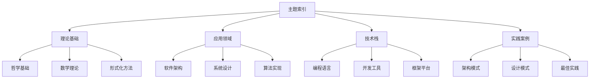

# 形式化架构分析项目主题索引

## 1. 概述

本索引为形式化架构分析项目提供了完整的主题导航，按照学科领域、理论层次和应用方向进行分类组织。

### 1.1 索引结构

## 2. 理论基础索引

### 2.1 哲学基础

#### 2.1.1 本体论

- **数学本体论**：数学对象的存在方式和性质
- **现实本体论**：现实世界的本体论问题
- **信息本体论**：信息作为基础实在的理论
- **AI本体论**：人工智能的本体论问题

#### 2.1.2 认识论

- **知识论与真理理论**：知识的定义和真理理论
- **知识来源分析**：理性主义vs经验主义
- **认知科学视角**：认知科学对认识论的贡献

#### 2.1.3 逻辑学

- **形式逻辑分析**：传统形式逻辑系统
- **哲学逻辑分析**：哲学问题相关的逻辑
- **非经典逻辑分析**：非标准逻辑系统

### 2.2 数学理论

#### 2.2.1 基础数学

- **集合论基础**：集合、关系、函数的基本概念
- **数系与代数结构**：数系和基本代数结构
- **逻辑与证明理论**：逻辑系统和证明方法

#### 2.2.2 范畴论

- **范畴论基础概念**：范畴、态射、函子的基本定义
- **函子与自然变换**：函子理论和自然变换
- **极限与余极限**：极限理论和通用构造
- **Yoneda引理与伴随函子**：重要定理和应用

#### 2.2.3 代数理论

- **群论**：群的基本理论和应用
- **环论与域论**：环和域的理论
- **线性代数**：向量空间和线性变换

#### 2.2.4 几何理论

- **拓扑学**：拓扑空间和连续映射
- **微分几何**：流形和微分结构
- **代数几何**：代数簇和概形理论

### 2.3 形式化方法

#### 2.3.1 基础理论

- **形式化方法基础**：形式化方法的核心概念
- **逻辑系统与证明理论**：逻辑系统和证明方法
- **公理化系统与元理论**：公理系统和元理论

#### 2.3.2 验证方法

- **形式化验证方法**：系统验证的技术方法
- **形式化建模技术**：系统建模的技术方法

## 3. 应用领域索引

### 3.1 软件架构

#### 3.1.1 架构基础

- **软件架构定义与原则**：架构的基本定义和核心原则
- **架构模式与风格**：常见的架构模式和风格
- **架构质量属性**：架构的质量属性和评估

#### 3.1.2 微服务架构

- **微服务基础理论**：微服务的基本概念和理论
- **服务拆分策略**：微服务的拆分方法和策略
- **服务通信模式**：微服务间的通信模式

#### 3.1.3 分布式系统

- **分布式系统基础**：分布式系统的基本概念
- **一致性理论**：分布式一致性的理论
- **容错机制**：分布式系统的容错机制

### 3.2 编程语言

#### 3.2.1 语言理论

- **编程语言基础**：编程语言的基本概念
- **语言设计原则**：语言设计的基本原则

#### 3.2.2 编程范式

- **命令式编程**：命令式编程范式
- **函数式编程**：函数式编程范式
- **面向对象编程**：面向对象编程范式

#### 3.2.3 Rust语言

- **Rust基础理论**：Rust语言的基本理论
- **所有权系统**：Rust的所有权管理
- **类型系统**：Rust的类型系统

#### 3.2.4 Go语言

- **Go基础理论**：Go语言的基本理论
- **并发模型**：Go的并发编程模型
- **接口系统**：Go的接口设计

### 3.3 控制论与系统论

#### 3.3.1 控制论基础

- **控制论基本概念**：控制论的基本概念
- **反馈控制理论**：反馈控制的理论

#### 3.3.2 时态逻辑控制

- **时态逻辑基础**：时态逻辑的基本概念
- **线性时态逻辑**：线性时态逻辑理论
- **分支时态逻辑**：分支时态逻辑理论

### 3.4 类型论与形式语言

#### 3.4.1 类型论基础

- **类型论基本概念**：类型论的基本概念
- **简单类型论**：简单类型论系统
- **依赖类型论**：依赖类型论系统
- **同伦类型论**：同伦类型论理论

#### 3.4.2 线性类型论

- **线性类型论基础**：线性类型论的基本概念
- **仿射类型论**：仿射类型论系统
- **线性逻辑**：线性逻辑理论

### 3.5 分布式系统理论

#### 3.5.1 分布式基础

- **分布式系统基础**：分布式系统的基本概念
- **分布式算法**：分布式算法的设计

#### 3.5.2 一致性理论

- **一致性基础**：分布式一致性的基础
- **CAP定理**：CAP定理的理论
- **一致性算法**：一致性算法的设计

### 3.6 量子计算理论

#### 3.6.1 量子基础

- **量子力学基础**：量子力学的基本概念
- **量子信息理论**：量子信息理论
- **量子比特**：量子比特的概念

#### 3.6.2 量子算法

- **量子算法基础**：量子算法的基本概念
- **Shor算法**：Shor量子算法
- **Grover算法**：Grover量子算法

## 4. 技术栈索引

### 4.1 开发工具

#### 4.1.1 形式化工具

- **Coq证明助手**：基于构造性类型论的证明助手
- **Isabelle/HOL**：高阶逻辑证明助手
- **PVS验证系统**：原型验证系统

#### 4.1.2 模型检测工具

- **SPIN**：用于并发系统验证
- **NuSMV**：符号模型检测器
- **UPPAAL**：实时系统验证工具

### 4.2 编程框架

#### 4.2.1 Rust生态系统

- **Cargo包管理器**：Rust的包管理工具
- **Tokio异步运行时**：Rust的异步运行时
- **Serde序列化框架**：Rust的序列化框架

#### 4.2.2 Go生态系统

- **Go Modules**：Go的模块系统
- **Goroutines**：Go的并发原语
- **Channels**：Go的通信机制

### 4.3 架构框架

#### 4.3.1 微服务框架

- **Spring Cloud**：Java微服务框架
- **Kubernetes**：容器编排平台
- **Docker**：容器化技术

#### 4.3.2 分布式框架

- **Apache Kafka**：分布式流处理平台
- **Apache ZooKeeper**：分布式协调服务
- **Redis**：分布式缓存系统

## 5. 实践案例索引

### 5.1 架构实现

#### 5.1.1 微服务实现

- **微服务实现**：微服务架构的实现案例
- **分布式系统实现**：分布式系统的实现案例
- **工作流系统实现**：工作流系统的实现案例

#### 5.1.2 算法实现

- **控制算法实现**：控制算法的实现案例
- **分布式算法实现**：分布式算法的实现案例
- **量子算法实现**：量子算法的实现案例

### 5.2 语言实现

#### 5.2.1 Rust实现案例

- **Rust实现案例**：Rust语言的实现案例
- **Go实现案例**：Go语言的实现案例
- **函数式编程实现**：函数式编程的实现案例

### 5.3 系统集成

#### 5.3.1 集成理论

- **系统集成理论**：系统集成的理论基础
- **集成模式**：系统集成的模式
- **集成技术**：系统集成的技术方法

## 6. 前沿发展索引

### 6.1 理论前沿

#### 6.1.1 形式化理论前沿

- **形式化理论前沿**：形式化理论的最新发展
- **数学理论前沿**：数学理论的最新发展
- **计算机科学前沿**：计算机科学的最新发展

#### 6.1.2 技术前沿

- **软件架构前沿**：软件架构的最新发展
- **编程语言前沿**：编程语言的最新发展
- **分布式系统前沿**：分布式系统的最新发展

### 6.2 应用前沿

#### 6.2.1 AI应用前沿

- **AI应用前沿**：人工智能应用的最新发展
- **云计算前沿**：云计算技术的最新发展
- **边缘计算前沿**：边缘计算的最新发展

#### 6.2.2 未来展望

- **技术发展趋势**：技术发展的趋势分析
- **理论发展方向**：理论发展的方向预测
- **应用发展前景**：应用发展的前景展望

## 7. 学习路径索引

### 7.1 初学者路径

#### 7.1.1 基础理论

1. **形式化方法基础**：了解形式化方法的基本概念
2. **软件架构定义与原则**：理解软件架构的基本定义
3. **编程语言基础**：掌握编程语言的基本概念

#### 7.1.2 实践入门

1. **Rust基础理论**：学习Rust语言的基本理论
2. **Go基础理论**：学习Go语言的基本理论
3. **微服务基础理论**：了解微服务的基本概念

### 7.2 进阶者路径

#### 7.2.1 理论深化

1. **范畴论基础概念**：深入学习范畴论
2. **类型论基本概念**：学习类型论理论
3. **分布式系统基础**：理解分布式系统理论

#### 7.2.2 应用实践

1. **微服务实现**：实践微服务架构
2. **分布式算法实现**：实现分布式算法
3. **系统集成理论**：学习系统集成方法

### 7.3 专家路径

#### 7.3.1 前沿理论

1. **同伦类型论**：学习同伦类型论
2. **量子计算理论**：理解量子计算理论
3. **形式化理论前沿**：关注理论前沿发展

#### 7.3.2 创新应用

1. **量子算法实现**：实现量子算法
2. **AI应用前沿**：探索AI应用前沿
3. **技术发展趋势**：分析技术发展趋势

## 8. 快速查找索引

### 8.1 按关键词查找

#### 8.1.1 理论关键词

- **范畴论** → 数学理论体系/范畴论
- **类型论** → 类型论与形式语言/类型论基础
- **形式化方法** → 形式化理论基础
- **软件架构** → 软件架构理论

#### 8.1.2 技术关键词

- **Rust** → 编程语言理论/Rust语言
- **Go** → 编程语言理论/Go语言
- **微服务** → 软件架构理论/微服务架构
- **分布式** → 分布式系统理论

#### 8.1.3 应用关键词

- **实现案例** → 综合应用与实现
- **前沿发展** → 前沿发展与展望
- **最佳实践** → 综合应用与实现/系统集成

### 8.2 按问题查找

#### 8.2.1 理论问题

- **如何理解范畴论？** → 数学理论体系/范畴论/范畴论基础概念
- **什么是形式化方法？** → 形式化理论基础/形式化方法基础
- **软件架构的原则是什么？** → 软件架构理论/架构基础理论/软件架构定义与原则

#### 8.2.2 实践问题

- **如何设计微服务？** → 软件架构理论/微服务架构/微服务基础理论
- **Rust的所有权系统是什么？** → 编程语言理论/Rust语言/所有权系统
- **如何实现分布式一致性？** → 分布式系统理论/一致性理论/一致性基础

## 9. 总结

本主题索引为形式化架构分析项目提供了完整的导航体系，包括：

1. **理论基础索引**：涵盖哲学、数学、形式化方法等基础理论
2. **应用领域索引**：涵盖软件架构、编程语言、系统理论等应用领域
3. **技术栈索引**：涵盖开发工具、编程框架、架构框架等技术栈
4. **实践案例索引**：涵盖架构实现、算法实现、系统集成等实践案例
5. **前沿发展索引**：涵盖理论前沿、技术前沿、应用前沿等发展方向
6. **学习路径索引**：提供初学者、进阶者、专家的学习路径
7. **快速查找索引**：提供按关键词和问题的快速查找

通过这个索引体系，读者可以：

- **快速定位**：根据兴趣和需求快速找到相关内容
- **系统学习**：按照学习路径系统性地学习知识
- **深入探索**：从基础理论到前沿应用进行深入探索
- **实践应用**：通过实践案例学习实际应用方法

---

*本主题索引为形式化架构分析项目提供了完整的导航体系，帮助读者高效地学习和应用相关知识。*
