# 形式化架构理论统一计划-v68

## 1. 项目概述

形式化架构理论项目v68版本在v67版本基础上更新了各项工作的最新进展，并对后续工作计划进行了优化和调整。本项目继续深化理论整合，完善工具开发，并探索更广泛的应用领域，为形式化架构理论研究和实践提供坚实基础。

### 1.1 主要目标

1. 完成状态机与Petri网理论的合并，形成完整的统一状态转换系统理论
2. 推进组件理论与接口理论的合并，完善统一模块化系统理论
3. 深化知识图谱可视化工具和理论导航系统的开发
4. 提高自动化验证工具的功能完整性和实用性
5. 拓展智能化模块研究和跨领域应用研究
6. 完善合并后的文档体系和用户指南

### 1.2 项目历程

本项目从v62版本开始，已经完成了组件与接口统一理论初步构建、统一状态转换系统理论框架设计、知识图谱可视化工具原型开发等工作。v63-v67版本进一步深化了理论合并与整合工作，推进了工具开发和应用研究。v68版本重点关注完成状态机与Petri网理论合并，深化组件理论与接口理论合并，提升工具成熟度，并扩展应用领域。

### 1.3 知识图谱总览

以下是形式化架构理论的整体知识图谱，展示了主要理论体系和它们之间的关系：

```mermaid
graph TD
    %% 顶层理论体系
    FA[形式化架构理论] --> PHI[哲学基础理论]
    FA --> MT[数学理论体系]
    FA --> FLT[形式语言理论体系]
    FA --> SAT[软件架构理论体系]
    FA --> PLT[编程语言理论体系]
    FA --> FMT[形式模型理论体系]
    
    %% 统一理论
    FA --> UT[统一理论]
    UT --> USTS[统一状态转换系统]
    UT --> UMS[统一模块化系统]
    UT --> UFPF[统一形式化证明框架]
    UT --> CVTF[跨领域验证技术]
    
    %% 统一状态转换系统
    USTS --> S1[状态元素集合]
    USTS --> E1[事件集合]
    USTS --> R1[关系集合]
    USTS --> M1[标记函数]
    USTS --> I1[初始状态集合]
    USTS --> F1[终止状态集合]
    USTS --> L1[关系权重函数]
    
    %% 统一模块化系统
    UMS --> S2[模块状态空间]
    UMS --> B2[模块行为模型]
    UMS --> P2[提供功能集合]
    UMS --> R2[依赖功能集合]
    UMS --> I2[模块实现细节]
    UMS --> C2[模块交互契约]
    UMS --> V2[模块版本信息]
    
    %% 哲学基础理论
    PHI --> LOG[逻辑学]
    PHI --> CS[认知科学]
    PHI --> SP[科学哲学]
    
    %% 数学理论体系
    MT --> ST[集合论]
    MT --> CT[范畴论]
    MT --> GT[图论]
    MT --> ALG[代数学]
    
    %% 形式语言理论体系
    FLT --> FG[形式语法]
    FLT --> FS[形式语义]
    FLT --> AT[自动机理论]
    
    %% 软件架构理论体系
    SAT --> LA[分层架构]
    SAT --> MS[微服务架构]
    SAT --> CN[云原生架构]
    SAT --> WA[WebAssembly架构]
    SAT --> CT2[组件理论]
    SAT --> IT[接口理论]
    
    %% 编程语言理论体系
    PLT --> SYN[语法理论]
    PLT --> SEM[语义理论]
    PLT --> TT[类型理论]
    PLT --> CPT[编译理论]
    
    %% 形式模型理论体系
    FMT --> SM[状态机理论]
    FMT --> PN[Petri网理论]
    FMT --> PA[进程代数]
    FMT --> TL[时序逻辑]
    
    %% 工具开发
    FA --> TOOLS[工具开发]
    TOOLS --> KGV[知识图谱可视化工具]
    TOOLS --> TNS[理论导航系统]
    TOOLS --> AVT[自动化验证工具]
    
    %% 应用拓展
    FA --> APP[应用拓展]
    APP --> IAM[智能化模块研究]
    APP --> EMT[新兴模块类型研究]
    APP --> CDA[跨领域应用研究]
    
    style FA fill:#f9f,stroke:#333,stroke-width:2px
    style UT fill:#bbf,stroke:#333,stroke-width:2px
    style TOOLS fill:#bfb,stroke:#333,stroke-width:2px
    style APP fill:#fbb,stroke:#333,stroke-width:2px
```

## 2. 当前工作状态

### 2.1 已完成工作（v62-v67）

- ✅ 组件与接口统一理论构建
- ✅ 统一状态转换系统理论构建
- ✅ 知识图谱可视化工具原型开发
- ✅ 递归合并系统：完成8个合并任务
- ✅ 自动机理论相关文件合并
- ✅ 分层架构与云原生架构理论合并
- ✅ 微服务架构与WebAssembly架构理论合并
- ✅ 架构评估与工作流架构理论合并
- ✅ 语法理论与语言设计理论合并
- ✅ 语义理论与语法理论合并
- ✅ 类型理论与类型系统合并
- ✅ 编译理论与编译器理论合并
- ✅ 概念定义统一、术语使用统一、形式化表示统一
- ✅ 知识图谱生成：理论体系关系图、核心概念关系图等
- ✅ 交叉引用更新
- ✅ 索引与导航更新
- ✅ 语义一致性检查
- ✅ 概念图谱构建
- ✅ 合并执行状态跟踪
- ✅ 递归合并与语义整合最终报告

### 2.2 进行中工作（v68）

- 🔄 **理论深化研究**
  - 🔄 统一形式化证明框架研究 (45%)
  - 🔄 跨领域验证技术研究 (45%)
  - 🔄 理论扩展规划 (40%)

- 🔄 **工具开发**
  - 🔄 知识图谱可视化工具完善 (60%)
  - 🔄 理论导航系统开发 (45%)
  - 🔄 自动化验证工具开发 (35%)

- 🔄 **新一轮理论合并**
  - 🔄 状态机与Petri网理论合并 (75%)
  - 🔄 组件理论与接口理论合并 (55%)
  - 🔄 运行时理论与并发理论合并 (25%)
  - 🔄 理论映射关系与统一符号体系合并 (15%)

- 🔄 **文档完善**
  - 🔄 合并后文档完善 (50%)
  - 🔄 用户文档编写 (40%)
  - 🔄 教程和示例编写 (35%)

## 3. 重点工作计划与进度

### 3.1 状态机与Petri网理论合并 (优先级：高)

#### 3.1.1 当前进展

状态机与Petri网理论合并工作已取得显著进展，目前完成度达到75%。主要完成了以下工作：

- ✅ 完成统一状态转换系统七元组形式化定义设计
- ✅ 完成所有概念映射表和映射关系定义
- ✅ 完成文档结构设计和内容整合框架
- ✅ 完成执行语义、并发语义的映射关系说明
- ✅ 完成统一图形表示方法设计
- ✅ 设计典型案例示例
- 🔄 正在整合状态机和Petri网的分析方法 (65%)
- 🔄 正在实现验证案例 (50%)
- 🔄 正在完善可达性分析和不变量分析方法统一 (55%)

#### 3.1.2 后续任务（计划8月15日前完成）

1. **验证案例实现**：完成3个关键验证案例的实现
2. **分析方法整合**：完成状态机和Petri网分析方法的整合
3. **正式文档撰写**：完成《统一状态转换系统理论》文档
4. **交叉引用更新**：更新所有引用状态机和Petri网的文档
5. **检查与验证**：进行完整性和一致性检查

### 3.2 组件理论与接口理论合并 (优先级：中)

#### 3.2.1 当前进展

组件理论与接口理论合并工作进度达到55%。主要完成了以下工作：

- ✅ 完成概念映射表和映射关系定义
- ✅ 完成统一模块单元七元组形式化定义
- ✅ 完善交互语义和契约语义的映射关系
- ✅ 设计组件到UMS和接口到UMS的转换规则
- 🔄 正在进行案例映射示例实现 (60%)
- 🔄 正在进行文档结构设计和统一图形表示方法 (65%)
- 🔄 正在开发模块组合验证方法 (40%)

#### 3.2.2 后续任务（计划10月15日前完成）

1. **案例映射完成**：完成所有案例映射示例实现
2. **模块验证方法**：完成模块组合和替换验证方法开发
3. **文档整合**：整合组件理论和接口理论文档
4. **实现技术映射**：完善各种编程语言和框架的实现技术映射
5. **应用指南编写**：编写统一模块化系统应用指南

### 3.3 知识图谱可视化工具完善 (优先级：高)

#### 3.3.1 当前进展

知识图谱可视化工具完善工作进度达到60%。主要完成了以下工作：

- ✅ 完成基础框架开发
- ✅ 实现基本可视化功能
- ✅ 实现简单查询功能
- ✅ 设计数据模型
- ✅ 实现多种布局算法
- ✅ 支持自定义样式
- 🔄 正在实现Markdown解析和知识提取功能 (75%)
- 🔄 正在实现高级交互功能 (70%)
- 🔄 正在开发高级查询语言 (45%)
- 🔄 正在实现导航功能 (50%)

#### 3.3.2 后续任务（计划9月30日前完成）

1. **知识提取功能**：完成Markdown解析和知识提取功能
2. **高级查询系统**：完成高级查询语言和复杂过滤功能
3. **导航功能**：完成导航历史、书签和推荐功能
4. **图谱分析功能**：实现中心性分析、社区发现和路径分析
5. **用户界面优化**：优化用户界面和交互体验

### 3.4 理论导航系统开发 (优先级：中)

#### 3.4.1 当前进展

理论导航系统开发工作进度达到45%。主要完成了以下工作：

- ✅ 完成导航系统架构设计
- ✅ 设计导航数据模型
- ✅ 设计导航接口
- ✅ 实现层次导航功能
- 🔄 正在实现关系导航功能 (65%)
- 🔄 正在开发关键词搜索功能 (60%)
- 🔄 正在设计用户界面 (50%)

#### 3.4.2 后续任务（计划10月31日前完成）

1. **搜索功能**：完成关键词搜索、语义搜索和高级搜索功能
2. **推荐功能**：实现相关理论推荐和学习路径推荐
3. **用户界面实现**：完成直观的用户界面和响应式设计
4. **集成功能**：与知识图谱可视化工具集成
5. **用户测试**：进行用户测试并优化系统

### 3.5 智能化模块研究 (优先级：中)

#### 3.5.1 当前进展

智能化模块研究工作进度取得了新进展。主要完成了以下工作：

- ✅ 初步完成自适应模块形式化定义
- ✅ 设计AI增强模块基本架构
- 🔄 正在研究自适应模块理论基础 (45%)
- 🔄 正在开发AI增强模块原型 (35%)
- 🔄 正在研究智能决策模块理论基础 (30%)

#### 3.5.2 后续任务（计划11月30日前完成）

1. **自适应模块**：完成自适应模块理论基础研究和原型开发
2. **AI增强模块**：完成AI增强模块形式化定义和原型开发
3. **智能决策模块**：完成智能决策模块理论基础研究
4. **案例研究**：选择典型案例进行智能化模块的应用验证
5. **理论整合**：将智能化模块研究与统一理论框架整合

## 4. 跨项目工作协调

### 4.1 工具协同发展计划

为提高工具开发效率，实现工具间协同工作，计划在以下方面进行协调：

1. **统一数据模型**：设计共享数据模型，确保知识图谱可视化工具、理论导航系统和自动化验证工具之间的数据一致性
2. **统一用户界面**：设计统一界面风格，提供一致的用户体验
3. **工具间通信**：实现工具间通信机制，支持跨工具操作和数据同步
4. **集成认证**：实现统一认证和权限管理，简化用户访问

### 4.2 理论与应用协同计划

为促进理论研究与应用研究的协同发展，计划在以下方面进行协调：

1. **理论应用案例**：选择重要理论成果，开发应用案例，验证理论价值
2. **应用反馈机制**：建立应用实践对理论的反馈机制，促进理论改进
3. **跨领域合作**：促进理论研究团队与应用研究团队的合作
4. **共同发展路线图**：制定理论与应用协同发展的路线图

## 5. 时间规划

### 5.1 短期规划（1-3个月）

| 时间 | 工作重点 |
|------|---------|
| 2024年8月 | 完成状态机与Petri网理论合并，发布统一状态转换系统理论文档；完善知识图谱可视化工具的知识提取功能 |
| 2024年9月 | 深化理论导航系统开发，实现搜索功能；推进组件理论与接口理论合并；完成知识图谱可视化工具高级查询功能 |
| 2024年10月 | 继续组件理论与接口理论合并工作；完成理论导航系统核心功能；深化自适应模块研究 |

### 5.2 中期规划（4-6个月）

| 时间 | 工作重点 |
|------|---------|
| 2024年11月 | 完成组件理论与接口理论合并，发布统一模块化系统理论文档；推进自动化验证工具开发；深化AI增强模块研究 |
| 2024年12月 | 完成工具协同发展第一阶段，实现基础集成；推进运行时理论与并发理论合并；完善用户文档 |
| 2025年1月 | 开展理论映射关系与统一符号体系合并工作；深化跨领域应用研究；完成智能决策模块研究 |

### 5.3 长期规划（7-12个月）

| 时间 | 工作重点 |
|------|---------|
| 2025年2-4月 | 完成运行时理论与并发理论合并；深化理论映射关系与统一符号体系合并；完成自动化验证工具开发 |
| 2025年5-7月 | 完成理论映射关系与统一符号体系合并；完善工具生态系统；深化新兴模块类型研究 |
| 2025年8-10月 | 开展统一形式化证明框架与跨领域验证技术的实际应用；完成工具协同发展；总结项目成果 |

## 6. 资源分配

### 6.1 人力资源分配

| 工作方向 | 所需人力 | 配置建议 |
|---------|---------|---------|
| 状态机与Petri网理论合并 | 2人 | 形式方法专家1人，状态转换系统专家1人 |
| 组件理论与接口理论合并 | 2人 | 软件架构专家1人，模块化系统专家1人 |
| 知识图谱可视化工具 | 2人 | 前端开发工程师1人，数据可视化专家1人 |
| 理论导航系统 | 2人 | 全栈开发工程师1人，用户体验设计师1人 |
| 智能化模块研究 | 2人 | AI研究员1人，形式化架构专家1人 |
| 文档完善 | 1人 | 技术文档专家1人 |
| 项目协调 | 1人 | 项目经理1人 |

### 6.2 技术资源分配

| 工作方向 | 所需技术资源 | 配置建议 |
|---------|------------|---------|
| 知识图谱可视化工具 | 前端框架、可视化库、数据处理库 | React, D3.js, TypeScript |
| 理论导航系统 | 前后端框架、数据库、搜索引擎 | React, Node.js, MongoDB, Elasticsearch |
| 自动化验证工具 | 验证框架、形式化工具 | Z3, TLA+, NuSMV |
| 通用开发环境 | 开发工具、版本控制、CI/CD | VS Code, Git, GitHub Actions |

## 7. 风险管理

### 7.1 主要风险与应对策略

| 风险 | 可能性 | 影响度 | 应对策略 |
|------|-------|--------|---------|
| 理论合并复杂度超出预期 | 中 | 高 | 采用增量式合并策略，先合并核心概念，再逐步扩展；增加专家评审环节 |
| 工具开发进度延迟 | 高 | 中 | 优先实现核心功能，采用敏捷开发方法；适时调整人力资源配置 |
| 理论与应用脱节 | 中 | 高 | 增强理论与应用的协同机制；开展更多应用案例研究 |
| 文档质量不满足需求 | 中 | 中 | 制定详细的文档标准；增加文档审查环节；收集用户反馈 |
| 团队协作不畅 | 低 | 高 | 建立有效的沟通机制；明确责任分工；定期项目进展会议 |

### 7.2 风险跟踪机制

1. **风险评估**：每两周进行一次风险评估，更新风险状态
2. **预警机制**：建立风险预警指标，及时发现潜在问题
3. **应急计划**：为高影响风险制定应急计划
4. **定期复审**：每月复审风险管理策略，根据项目进展调整

## 8. 成果预期

### 8.1 理论成果

1. **统一状态转换系统理论**：完整的状态机与Petri网统一理论文档
2. **统一模块化系统理论**：完整的组件理论与接口理论统一文档
3. **智能化模块理论**：自适应模块、AI增强模块和智能决策模块的理论框架
4. **跨领域应用理论**：形式化架构理论在企业应用、云计算、物联网等领域的应用理论

### 8.2 工具成果

1. **知识图谱可视化工具v1.0**：具备高级可视化、知识提取、高级查询和导航功能
2. **理论导航系统v1.0**：支持层次导航、关系导航、搜索和推荐功能
3. **自动化验证工具原型**：支持基本验证功能的原型系统
4. **工具集成框架**：支持工具间协同工作的集成框架

### 8.3 文档成果

1. **合并后的理论文档**：完整的统一理论文档体系
2. **用户指南**：面向不同用户群体的使用指南
3. **教程和示例**：形式化架构理论应用教程和示例集
4. **API文档**：工具API完整文档

## 9. 总结

形式化架构理论项目v68版本在v67基础上，更新了各项工作的最新进展，并优化了后续工作计划。
当前重点工作包括完成状态机与Petri网理论合并，推进组件理论与接口理论合并，深化知识图谱可视化工具和理论导航系统开发，以及拓展智能化模块研究和跨领域应用研究。
通过合理的资源分配和风险管理，项目将在短期内取得多项关键成果，为形式化架构理论的发展奠定坚实基础。

---

**版本**: v68  
**创建时间**: 2024年8月  
**状态**: 🔄 进行中  
**最后更新**: 2024年8月
