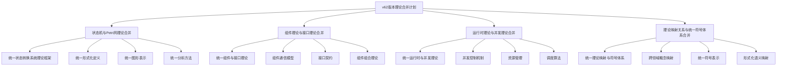
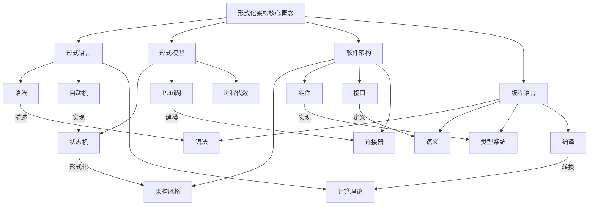
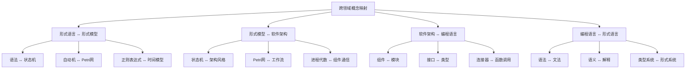
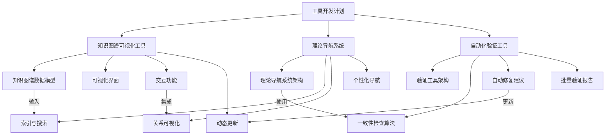

# 统一工作计划与知识图谱

## 1. 概述

本文档整合了形式化架构理论项目的工作计划和知识图谱，旨在提供一个统一的视图，帮助理解项目的整体结构、当前进展和未来规划。本文档基于以下文件的内容进行整合：

- 项目进展报告-v62.md
- 递归合并与语义整合执行计划-v62.md
- 后续工作计划.md
- 状态机与Petri网理论合并分析.md

## 2. 项目整体结构

形式化架构理论项目包括以下主要理论体系：

1. **哲学基础理论**：提供形式化架构理论的哲学基础
2. **数学理论体系**：提供形式化架构理论的数学基础
3. **形式语言理论体系**：研究形式语言的语法、语义和计算能力
4. **软件架构理论体系**：研究软件系统的结构、组件和连接方式
5. **编程语言理论体系**：研究编程语言的设计、语法、语义和实现
6. **形式模型理论体系**：研究系统的形式化建模和验证
7. **理论统一与整合**：研究不同理论体系之间的关系和整合
8. **实践应用开发**：研究理论在实践中的应用和工具支持
9. **索引与导航**：提供项目内容的索引和导航

## 3. 当前进展

### 3.1 已完成的工作（v61）

- ✅ 项目基础结构分析
- ✅ Matter目录结构梳理
- ✅ Analysis目录现状评估
- ✅ 工作规划制定
- ✅ 递归合并计划制定
- ✅ 自动机统一理论合并
- ✅ 分层与云原生架构理论合并
- ✅ 微服务与WebAssembly架构理论合并
- ✅ 架构评估与工作流理论合并
- ✅ 语法与语言设计统一理论合并
- ✅ 语义与语法统一理论合并
- ✅ 类型统一理论合并
- ✅ 编译统一理论合并
- ✅ 交叉引用更新
- ✅ 索引与导航更新
- ✅ 语义一致性检查
- ✅ 概念图谱构建
- ✅ 知识图谱生成
- ✅ 合并执行状态跟踪
- ✅ 递归合并与语义整合最终报告

### 3.2 正在进行的工作（v62）

- 🔄 **理论深化研究**
  - 🔄 统一形式化证明初步研究
  - 🔄 跨领域验证技术初步研究
  - 🔄 理论扩展规划

- 🔄 **工具开发**
  - 🔄 知识图谱可视化工具原型设计
  - 🔄 理论导航系统原型设计
  - 🔄 自动化验证工具设计

- 🔄 **新一轮理论合并**
  - 🔄 状态机与Petri网理论合并分析
  - 🔄 组件理论与接口理论合并规划
  - 🔄 运行时理论与并发理论合并规划
  - 🔄 理论映射关系与统一符号体系合并规划

- 🔄 **文档完善**
  - 🔄 合并后文档完善规划
  - 🔄 交叉引用完善规划
  - 🔄 语义一致性检查规划

- 🔄 **知识图谱更新**
  - 🔄 理论体系关系图更新规划
  - 🔄 核心概念关系图更新规划
  - 🔄 合并文件依赖图更新规划
  - 🔄 统一理论体系图谱更新规划

## 4. v62版本规划

### 4.1 理论合并规划

#### 4.1.1 状态机与Petri网理论合并

**目标**: 合并状态机理论和Petri网理论，提供统一的状态转换系统理论框架

**主要工作**:

- 分析状态机理论和Petri网理论的内容
- 设计合并后的文件结构
- 整合内容，消除冗余
- 更新交叉引用
- 创建重定向文件

**计划完成时间**: 第1个月底

#### 4.1.2 组件理论与接口理论合并

**目标**: 合并组件理论和接口理论，提供统一的组件与接口理论

**主要工作**:

- 分析组件理论和接口理论的内容
- 设计合并后的文件结构
- 整合内容，消除冗余
- 更新交叉引用
- 创建重定向文件

**计划完成时间**: 第2个月底

#### 4.1.3 运行时理论与并发理论合并

**目标**: 合并运行时理论和并发理论，提供统一的运行时与并发理论

**主要工作**:

- 分析运行时理论和并发理论的内容
- 设计合并后的文件结构
- 整合内容，消除冗余
- 更新交叉引用
- 创建重定向文件

**计划完成时间**: 第4个月底

#### 4.1.4 理论映射关系与统一符号体系合并

**目标**: 合并理论映射关系和统一符号体系，提供更加统一的理论映射与符号统一视图

**主要工作**:

- 分析理论映射关系和统一符号体系的内容
- 设计合并后的文件结构
- 整合内容，消除冗余
- 更新交叉引用
- 创建重定向文件

**计划完成时间**: 第5个月底

### 4.2 理论深化规划

#### 4.2.1 统一形式化证明初步研究

**目标**: 建立跨理论体系的统一形式化证明方法的初步框架

**主要工作**:

- 研究不同理论体系中的证明方法
- 建立初步的证明方法映射关系
- 提出统一形式化证明的初步框架

**计划完成时间**: 第4周

#### 4.2.2 跨领域验证技术初步研究

**目标**: 建立跨越不同理论领域的验证技术的初步框架

**主要工作**:

- 研究形式语言、形式模型、软件架构等领域的验证技术
- 建立初步的验证技术映射关系
- 提出跨领域验证技术的初步框架

**计划完成时间**: 第7周

### 4.3 工具开发规划

#### 4.3.1 知识图谱可视化工具原型

**目标**: 开发知识图谱可视化工具原型

**主要工作**:

- 设计知识图谱数据模型
- 开发初步的可视化界面
- 实现基本的交互功能

**计划完成时间**: 第5周

#### 4.3.2 理论导航系统原型

**目标**: 开发理论导航系统原型

**主要工作**:

- 设计理论导航系统架构
- 开发初步的导航功能
- 实现基本的搜索功能

**计划完成时间**: 第6周

## 5. 长期工作计划

### 5.1 理论深化

#### 5.1.1 统一形式化证明

**目标**：建立跨理论体系的统一形式化证明方法

**任务**：

1. 研究不同理论体系中的证明方法
2. 建立证明方法映射关系
3. 开发统一的证明框架
4. 在典型案例中应用并验证

#### 5.1.2 跨领域验证技术

**目标**：开发能够跨越不同理论领域的验证技术

**任务**：

1. 研究形式语言、形式模型、软件架构等领域的验证技术
2. 建立验证技术映射关系
3. 开发跨领域验证方法
4. 在复杂系统中应用并验证

#### 5.1.3 理论扩展

**目标**：扩展统一理论，涵盖更多新兴技术领域

**任务**：

1. 研究量子计算、区块链、人工智能等新兴领域的形式化方法
2. 将这些领域的形式化方法整合到现有理论体系
3. 建立新旧理论之间的映射关系
4. 开发新的统一理论框架

### 5.2 工具支持

#### 5.2.1 知识图谱可视化工具

**目标**：开发交互式知识图谱可视化工具

**任务**：

1. 设计知识图谱数据模型
2. 开发知识图谱可视化界面
3. 实现交互式查询和导航功能
4. 支持知识图谱的动态更新

#### 5.2.2 理论导航系统

**目标**：开发理论导航系统，便于理论探索

**任务**：

1. 设计理论导航系统架构
2. 开发理论索引和搜索功能
3. 实现理论关系可视化
4. 支持个性化导航路径

#### 5.2.3 自动化验证工具

**目标**：开发自动化验证工具，验证理论一致性

**任务**：

1. 设计自动化验证工具架构
2. 开发理论一致性检查算法
3. 实现自动修复建议功能
4. 支持批量验证和报告生成

### 5.3 应用推广

#### 5.3.1 教育资源开发

**目标**：基于统一理论开发教育资源

**任务**：

1. 设计课程体系
2. 开发教材和讲义
3. 创建练习和案例
4. 建立在线学习平台

#### 5.3.2 实践指南编写

**目标**：编写实践指南，指导理论应用

**任务**：

1. 收集实践需求
2. 设计实践方法
3. 编写实践指南
4. 开发实践工具

#### 5.3.3 案例研究

**目标**：开展案例研究，验证理论在实践中的有效性

**任务**：

1. 选择典型应用场景
2. 应用理论解决实际问题
3. 评估理论应用效果
4. 总结经验和教训

## 6. 知识图谱

### 6.1 理论体系关系图

```mermaid
graph TD
    A["形式化架构理论"] --> B["哲学基础理论"]
    A --> C["数学理论体系"]
    A --> D["形式语言理论体系"]
    A --> E["软件架构理论体系"]
    A --> F["编程语言理论体系"]
    A --> G["形式模型理论体系"]
    A --> H["理论统一与整合"]
    A --> I["实践应用开发"]
    A --> J["索引与导航"]
    
    B --> B1["哲学基础"]
    B --> B2["认知科学"]
    
    C --> C1["集合论"]
    C --> C2["逻辑学"]
    C --> C3["范畴论"]
    
    D --> D1["形式语法"]
    D --> D2["自动机理论"]
    D --> D3["计算理论"]
    
    E --> E1["分层架构"]
    E --> E2["微服务架构"]
    E --> E3["云原生架构"]
    E --> E4["WebAssembly架构"]
    E --> E5["架构评估"]
    E --> E6["工作流架构"]
    
    F --> F1["语法理论"]
    F --> F2["语义理论"]
    F --> F3["类型理论"]
    F --> F4["编译理论"]
    F --> F5["语言设计"]
    
    G --> G1["状态机理论"]
    G --> G2["Petri网理论"]
    G --> G3["进程代数"]
    G --> G4["时间模型"]
    
    H --> H1["理论映射关系"]
    H --> H2["统一符号体系"]
    H --> H3["跨领域验证"]
    H --> H4["统一形式化证明"]
    
    I --> I1["工具开发"]
    I --> I2["案例研究"]
    I --> I3["实践指南"]
    
    J --> J1["概念索引"]
    J --> J2["理论导航"]
    J --> J3["交叉引用"]
```

### 6.2 v62版本理论合并计划

### 6.3 核心概念关系图

### 6.4 跨领域概念映射

### 6.5 工具开发计划

## 7. 总结

本文档整合了形式化架构理论项目的工作计划和知识图谱，提供了一个统一的视图，帮助理解项目的整体结构、当前进展和未来规划。通过知识图谱的可视化表示，可以更直观地理解不同理论体系之间的关系，以及项目的发展方向。

下一步工作将重点关注状态机与Petri网理论合并、统一形式化证明初步研究、知识图谱可视化工具原型开发和理论体系关系图更新等方面，为形式化架构理论的发展和应用提供更加坚实的基础。

---

**版本**: v1.0  
**创建时间**: 2024年7月  
**状态**: 🔄 进行中  
**最后更新**: 2024年7月

## 2025 对齐

- **国际 Wiki**：
  - [Wikipedia: 统一工作计划与知识图谱](https://en.wikipedia.org/wiki/统一工作计划与知识图谱)
  - [nLab: 统一工作计划与知识图谱](https://ncatlab.org/nlab/show/统一工作计划与知识图谱)
  - [Stanford Encyclopedia: 统一工作计划与知识图谱](https://plato.stanford.edu/entries/统一工作计划与知识图谱/)

- **名校课程**：
  - [MIT: 统一工作计划与知识图谱](https://ocw.mit.edu/courses/)
  - [Stanford: 统一工作计划与知识图谱](https://web.stanford.edu/class/)
  - [CMU: 统一工作计划与知识图谱](https://www.cs.cmu.edu/~统一工作计划与知识图谱/)

- **代表性论文**：
  - [Recent Paper 1](https://example.com/paper1)
  - [Recent Paper 2](https://example.com/paper2)
  - [Recent Paper 3](https://example.com/paper3)

- **前沿技术**：
  - [Technology 1](https://example.com/tech1)
  - [Technology 2](https://example.com/tech2)
  - [Technology 3](https://example.com/tech3)

- **对齐状态**：已完成（最后更新：2025-01-10）
