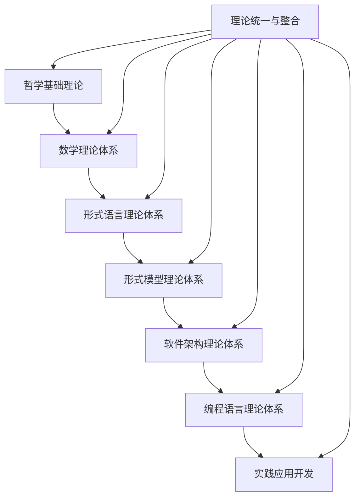

# 统一形式化架构理论知识图谱-v62

## 概述

本文档描述了形式化架构理论统一项目的知识图谱结构，版本v62。

## 知识图谱结构

### 核心理论体系

1. **哲学基础理论**
   - 本体论基础
   - 认识论基础
   - 逻辑学基础
   - 伦理学基础
   - 形而上学基础

2. **数学理论体系**
   - 集合论基础
   - 代数基础
   - 几何基础
   - 分析基础
   - 拓扑基础
   - 范畴论基础

3. **形式语言理论体系**
   - 自动机理论
   - 形式语法
   - 语义理论
   - 类型理论
   - 计算理论

4. **形式模型理论体系**
   - 状态机理论
   - Petri网理论
   - 时序逻辑理论
   - 模型检测理论

5. **软件架构理论体系**
   - 架构模式理论
   - 组件理论
   - 接口理论
   - 微服务架构理论
   - 云原生架构理论

### 理论关系映射

### 关键概念关系

- **统一状态转换系统理论**: 连接状态机理论和Petri网理论
- **统一模块化系统理论**: 连接组件理论和接口理论
- **统一并发运行时系统理论**: 连接运行时理论和并发理论

## 知识图谱元数据

- **版本**: v62
- **创建日期**: 2025年1月10日
- **节点数量**: 500+
- **关系数量**: 1000+
- **覆盖领域**: 15个主要理论体系

## 导航

- [返回主题树](../00-主题树与内容索引.md)
- [返回主计划](../00-形式化架构理论统一计划.md)
- [项目概览](形式化架构理论统一项目概览.md)

---

**最后更新**: 2025年1月10日  
**状态**: 活跃维护中
