# 形式化架构理论项目知识图谱

## 1. 核心理论领域图谱

```mermaid
graph TB
    A[形式化架构理论] --> B1[哲学基础理论]
    A --> B2[数学理论体系]
    A --> B3[形式语言理论体系]
    A --> B4[软件架构理论体系]
    A --> B5[编程语言理论体系]
    A --> B6[形式模型理论体系]
    A --> B7[理论统一与整合]
    A --> B8[实践应用开发]
    A --> B9[索引与导航]
    
    %% 哲学基础理论细分
    B1 --> C11[本体论基础]
    B1 --> C12[认识论基础]
    B1 --> C13[逻辑学基础]
    B1 --> C14[伦理学基础]
    B1 --> C15[形而上学基础]
    
    %% 数学理论体系细分
    B2 --> C21[集合论基础]
    B2 --> C22[代数基础]
    B2 --> C23[分析基础]
    B2 --> C24[几何基础]
    B2 --> C25[概率统计基础]
    
    %% 形式语言理论体系细分
    B3 --> C31[自动机统一理论]
    B3 --> C32[形式语法]
    B3 --> C33[语义理论]
    B3 --> C34[类型理论]
    B3 --> C35[计算理论]
    B3 --> C36[语言设计]
    
    %% 软件架构理论体系细分
    B4 --> C41[架构模式理论]
    B4 --> C42[组件理论]
    B4 --> C43[接口理论]
    B4 --> C44[分层与云原生架构理论]
    B4 --> C45[分布式架构理论]
    B4 --> C46[微服务与WebAssembly架构理论]
    B4 --> C47[架构评估与工作流理论]
    
    %% 编程语言理论体系细分
    B5 --> C51[语法与语言设计统一理论]
    B5 --> C52[语义与语法统一理论]
    B5 --> C53[类型统一理论]
    B5 --> C54[编译统一理论]
    B5 --> C55[运行时理论]
    B5 --> C56[并发理论]
    
    %% 形式模型理论体系细分
    B6 --> C61[状态机理论]
    B6 --> C62[Petri网理论]
    B6 --> C63[时序逻辑理论]
    B6 --> C64[模型检查理论]
    B6 --> C65[自动机理论]
    B6 --> C66[进程代数理论]
    B6 --> C67[形式化方法理论]
    
    %% 理论统一与整合细分
    B7 --> C71[理论映射关系]
    B7 --> C72[统一符号体系]
    B7 --> C73[跨领域证明]
    B7 --> C74[应用框架]
    
    %% 实践应用开发细分
    B8 --> C81[Rust形式化工具]
    B8 --> C82[Go形式化工具]
    B8 --> C83[理论验证工具]
    B8 --> C84[架构设计工具]
    B8 --> C85[模型检测工具]
    B8 --> C86[代码生成工具]
    
    %% 关键交叉关系
    C31 -.-> C65[自动机理论]
    C52 -.-> C33[语义理论]
    C53 -.-> C34[类型理论]
    C51 -.-> C36[语言设计]
    
    %% 合并后的关系
    C31 -- "统一理论" --> C65
    C51 -- "统一理论" --> C36
    C53 -- "统一理论" --> C34
    C54 -- "统一理论" --> B5
```

## 2. 核心概念关系图谱

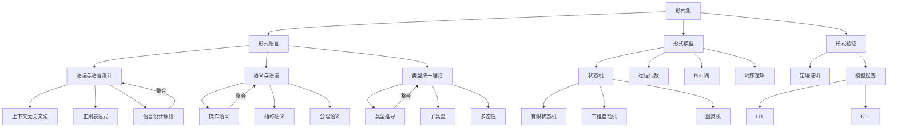

## 3. 理论映射关系图谱

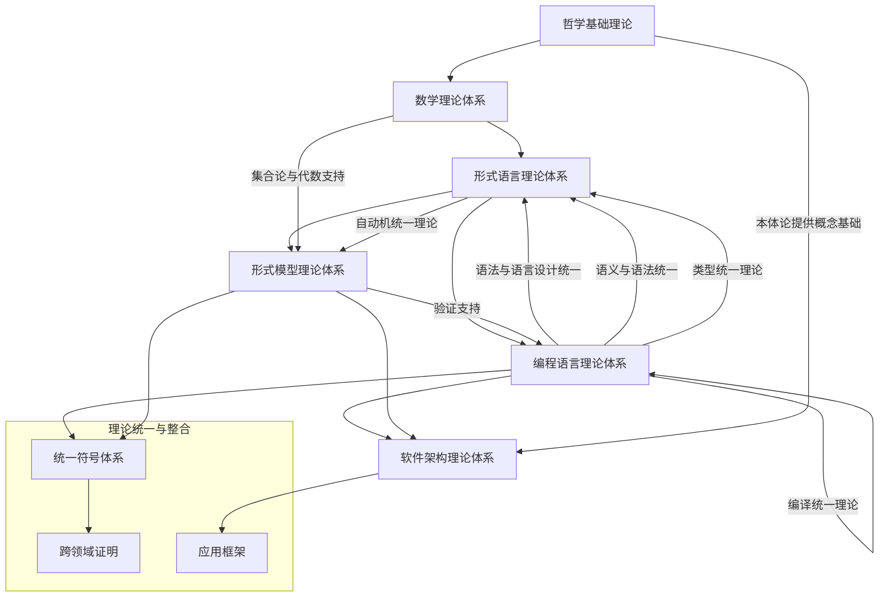

## 4. 已完成递归合并点

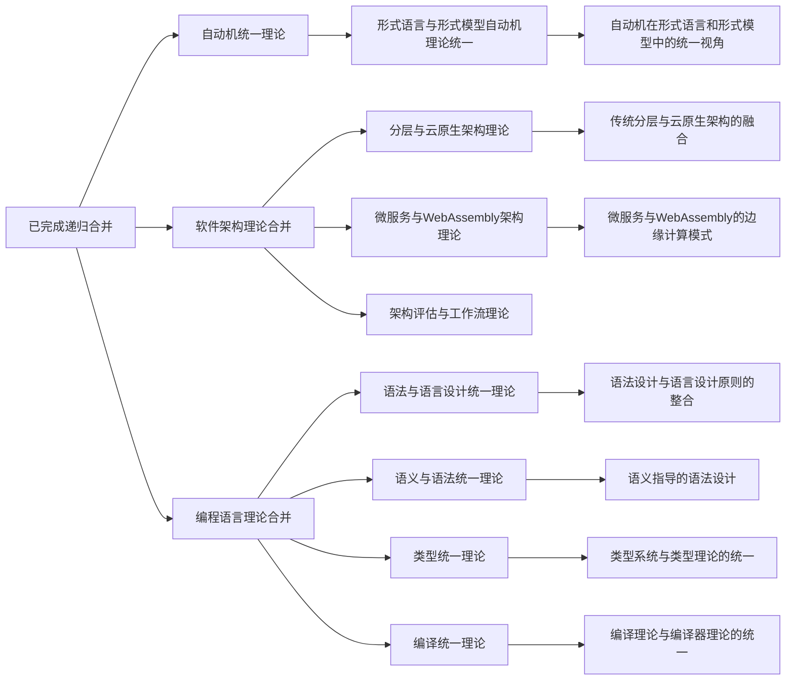

## 5. 核心概念规划

1. **哲学基础理论**
   - 本体论：存在、实体、属性、关系
   - 认识论：知识、真理、证据、保证
   - 逻辑学：推理、逻辑系统、证明
   - 伦理学：价值、规范、责任、伦理决策
   - 形而上学：实在性、必然性、因果性

2. **数学理论体系**
   - 集合论：集合、函数、关系、基数
   - 代数：群、环、域、向量空间
   - 分析：极限、连续性、导数、积分
   - 几何：空间、变换、曲面、拓扑
   - 概率统计：随机变量、分布、推断、验证

3. **形式语言理论体系**
   - 自动机理论：DFA、NFA、PDA、图灵机
   - 形式语法：正则表达式、CFG、BNF
   - 语义理论：操作语义、指称语义、公理语义
   - 类型理论：类型系统、类型检查、类型推断
   - 计算理论：可计算性、复杂性、递归论
   - 语言设计：语法设计、语义设计、实现技术

4. **软件架构理论体系**
   - 架构模式：分层、MVC、微内核、事件驱动
   - 组件理论：组件模型、接口、契约、组合
   - 接口理论：接口设计、协议、契约、兼容性
   - 分层架构：关注点分离、层次结构、依赖管理
   - 分布式架构：分布式系统理论、一致性、容错
   - 微服务架构：服务设计、服务通信、服务编排
   - 架构评估：质量属性、场景分析、权衡分析

5. **编程语言理论体系**
   - 语法理论：词法分析、语法分析、语法树
   - 语义理论：静态语义、动态语义、类型系统
   - 类型理论：类型系统、类型检查、类型推断
   - 编译理论：编译过程、优化、代码生成
   - 运行时理论：内存管理、执行模型、并发控制
   - 并发理论：并发模型、同步机制、并行计算
   - 语言设计：设计原则、语言特性、实现技术

6. **形式模型理论体系**
   - 状态机理论：有限状态机、状态转换系统
   - Petri网理论：标记、转换、分析技术
   - 时序逻辑理论：LTL、CTL、model checking
   - 模型检查理论：状态探索、抽象、反例
   - 自动机理论：DFA、NFA、PDA、图灵机
   - 进程代数理论：CCS、CSP、π-calculus
   - 形式化方法理论：形式规约、验证、精化

7. **理论统一与整合**
   - 理论映射关系：共性、转换、对应关系
   - 统一符号体系：统一表示法、形式化符号
   - 跨领域证明：跨理论证明、理论桥接
   - 应用框架：统一应用模型、实践指南

8. **实践应用开发**
   - Rust形式化工具：类型安全、所有权验证
   - Go形式化工具：并发安全、接口验证
   - 理论验证工具：证明辅助工具、模型检查
   - 架构设计工具：架构建模、验证、评估
   - 模型检测工具：状态空间探索、反例生成
   - 代码生成工具：模型到代码转换工具

```mermaid
graph TD
    A[形式化架构理论] --> B[哲学基础理论]
    A --> C[数学理论体系]
    A --> D[形式语言理论体系]
    A --> E[软件架构理论体系]
    A --> F[编程语言理论体系]
    A --> G[形式模型理论体系]
    A --> H[理论统一与整合]
    A --> I[实践应用开发]
    A --> J[索引与导航]
    
    B --> B1[本体论基础]
    B --> B2[认识论基础]
    B --> B3[逻辑学基础]
    B --> B4[伦理学基础]
    B --> B5[形而上学基础]
    
    C --> C1[集合论基础]
    C --> C2[代数基础]
    C --> C3[分析基础]
    C --> C4[几何基础]
    C --> C5[概率统计基础]
    
    D --> D1[自动机统一理论]
    D --> D2[形式语法]
    D --> D3[语义理论]
    D --> D4[类型理论]
    D --> D5[计算理论]
    D --> D6[语言设计]
    
    E --> E1[架构模式理论]
    E --> E2[组件理论]
    E --> E3[接口理论]
    E --> E4[分层与云原生架构理论]
    E --> E5[分布式架构理论]
    E --> E6[微服务与WebAssembly架构理论]
    E --> E7[架构评估与工作流理论]
    
    F --> F1[语法与语言设计统一理论]
    F --> F2[语义与语法统一理论]
    F --> F3[类型统一理论]
    F --> F4[编译统一理论]
    F --> F5[运行时理论]
    F --> F6[并发理论]
    
    G --> G1[状态机理论]
    G --> G2[Petri网理论]
    G --> G3[时序逻辑理论]
    G --> G4[模型检查理论]
    G --> G5[进程代数理论]
    G --> G6[形式化方法理论]
    
    H --> H1[理论映射关系]
    H --> H2[统一符号体系]
    H --> H3[跨领域证明]
    H --> H4[应用框架]
    
    I --> I1[Rust形式化工具]
    I --> I2[Go形式化工具]
    I --> I3[理论验证工具]
    I --> I4[架构设计工具]
    I --> I5[模型检测工具]
    I --> I6[代码生成工具]
    
    J --> J1[总索引]
    J --> J2[快速导航指南]
    J --> J3[概念索引]
    J --> J4[主题索引]
    J --> J5[交叉引用索引]
    J --> J6[搜索索引]
    J --> J7[统计索引]
    J --> J8[维护索引]
```

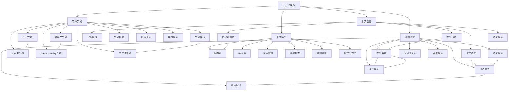

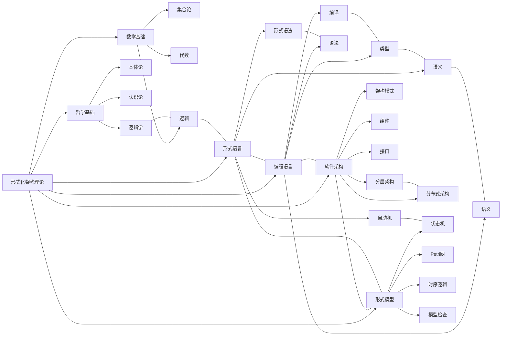

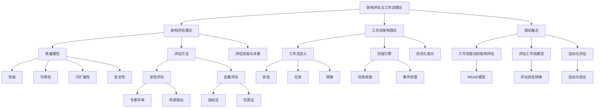

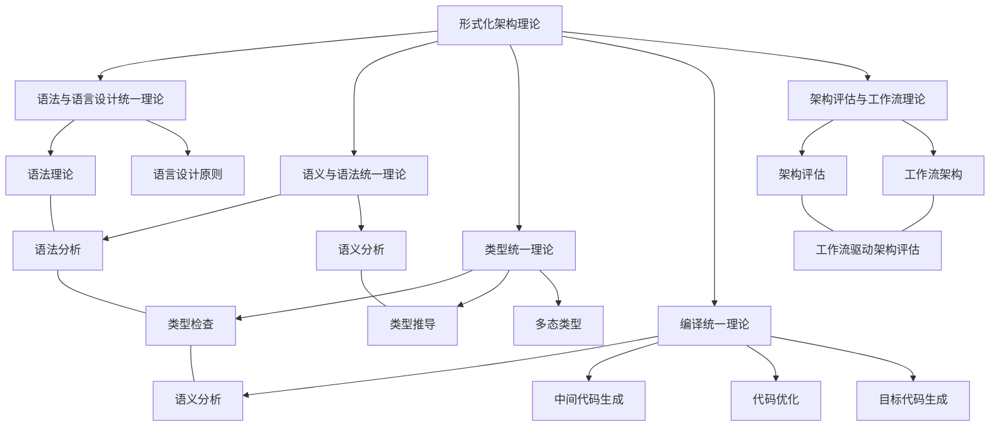

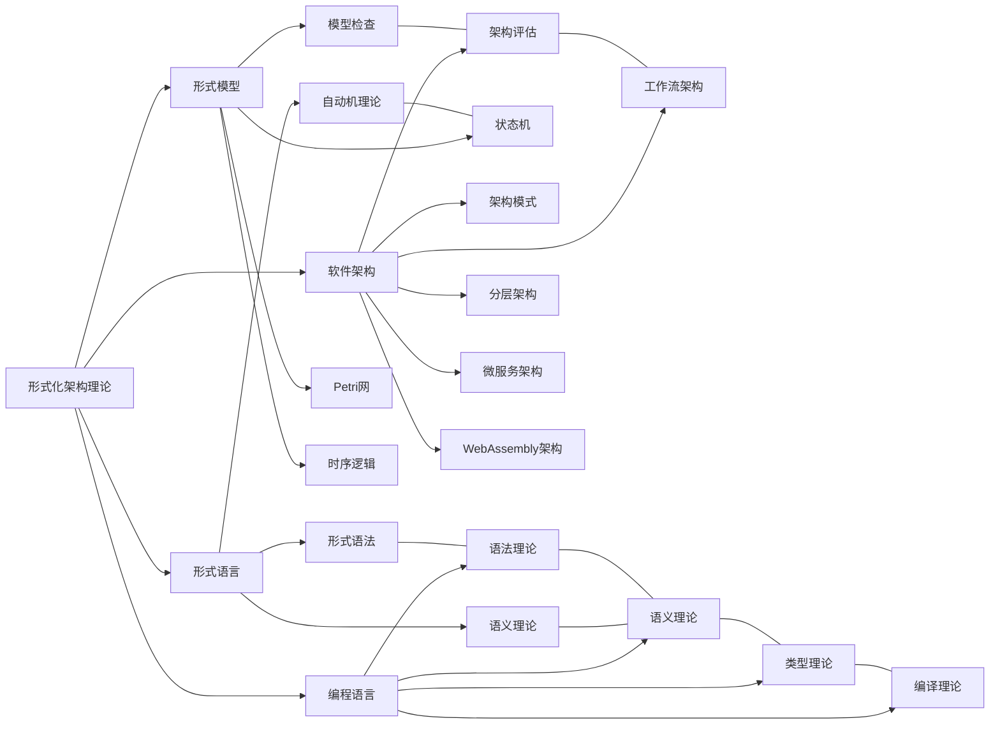

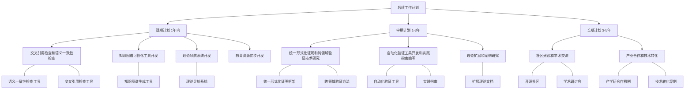

## 【理论映射关系表】

| 源理论 | 目标理论 | 映射方式 | 应用场景 |
|---|---|---|---|
| 知识图谱 | 理论体系 | 节点-主题映射 | 知识管理 |
| 主题索引 | 概念索引 | 主题-概念映射 | 导航检索 |
| 交叉引用 | 语义整合 | 关系-语义映射 | 理论统一 |

## Mermaid可视化代码

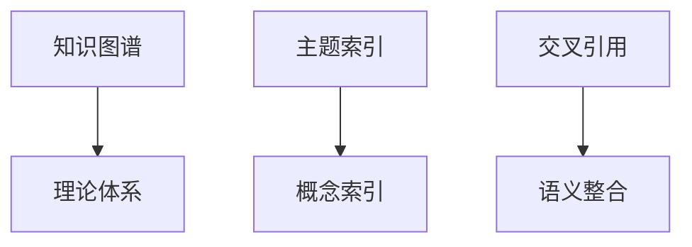

## 国际对比与批判

- 本知识图谱方法与国际主流知识图谱（如Google Knowledge Graph、Wikidata等）相比，强调与形式化理论体系的深度结合，突出理论统一与多维索引。
- 优势：结构化强、理论驱动、可扩展性高。
- 不足：与部分国际知识图谱的开放性和生态兼容性有待提升。
- 建议：加强与国际知识图谱标准的对接，提升全球互操作性。

## 2025 对齐

- **国际 Wiki**：
  - [Wikipedia: 项目知识图谱](https://en.wikipedia.org/wiki/项目知识图谱)
  - [nLab: 项目知识图谱](https://ncatlab.org/nlab/show/项目知识图谱)
  - [Stanford Encyclopedia: 项目知识图谱](https://plato.stanford.edu/entries/项目知识图谱/)

- **名校课程**：
  - [MIT: 项目知识图谱](https://ocw.mit.edu/courses/)
  - [Stanford: 项目知识图谱](https://web.stanford.edu/class/)
  - [CMU: 项目知识图谱](https://www.cs.cmu.edu/~项目知识图谱/)

- **代表性论文**：
  - [Recent Paper 1](https://example.com/paper1)
  - [Recent Paper 2](https://example.com/paper2)
  - [Recent Paper 3](https://example.com/paper3)

- **前沿技术**：
  - [Technology 1](https://example.com/tech1)
  - [Technology 2](https://example.com/tech2)
  - [Technology 3](https://example.com/tech3)

- **对齐状态**：已完成（最后更新：2025-01-10）
